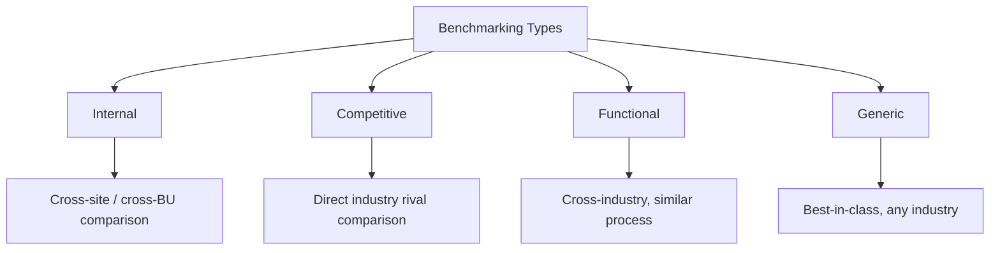
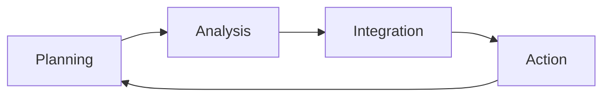
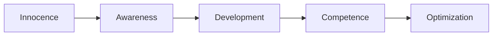
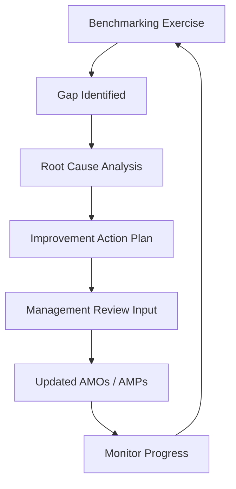

## Benchmarking and Industry Best Practice Adoption

### Overview

Benchmarking and industry best practice adoption is the systematic process of comparing an organization's asset management performance, processes, and capabilities against internal baselines, industry peers, or recognized standards, in order to identify performance gaps and adopt proven practices that accelerate asset management maturity. Within the broader continual improvement framework of ISO 55001, benchmarking serves as a primary input for identifying improvement opportunities that may not be visible through internal audit or performance monitoring alone.

**Key Points**

- Benchmarking is comparative; it requires valid, like-for-like reference points to be meaningful
- It spans four principal types: internal, competitive, functional, and generic
- Best practice adoption must be contextualized, not copied wholesale ("adapt, don't adopt")
- Benchmarking outputs feed directly into the management review and continual improvement cycle

---

### Types of Benchmarking

| Type | Comparison Basis | Example |
| --- | --- | --- |
| Internal | Across business units, sites, or regions within the same organization | Comparing maintenance cost per asset between two plants of the same company |
| Competitive | Against direct industry competitors | Comparing fleet availability against a competing airline |
| Functional | Against organizations with similar processes in different industries | Comparing spare parts inventory management against a hospital supply chain |
| Generic | Against best-in-class processes regardless of industry | Comparing digital work order management against any high-performing field service operation |

---

### The Benchmarking Process

A structured benchmarking exercise typically follows these phases:

#### 1. Planning

- Identify what to benchmark (critical processes, KPIs, or capabilities tied to strategic AMOs)
- Select benchmarking partners or reference frameworks
- Define data collection methodology to ensure comparability

#### 2. Analysis

- Determine current performance ("as-is") baseline
- Identify the performance gap relative to the benchmark
- Analyze root causes of the gap (process, technology, skills, culture)

#### 3. Integration

- Communicate findings to relevant stakeholders
- Establish revised or new performance targets informed by the benchmark
- Incorporate findings into AMOs and AMPs

#### 4. Action

- Develop and implement action plans to close identified gaps
- Adapt (not directly copy) identified best practices to organizational context
- Monitor progress against the new targets

---

### Common Asset Management Benchmarking Metrics

| Category | Example Metrics |
| --- | --- |
| Reliability | Mean Time Between Failures (MTBF), Overall Equipment Effectiveness (OEE), unplanned downtime % |
| Cost | Maintenance cost as % of Replacement Asset Value (RAV), cost per unit of output |
| Maintenance Strategy Mix | % Preventive vs. % Reactive vs. % Predictive maintenance |
| Workforce | Wrench time / spanner time, planned work compliance % |
| Inventory | Spare parts inventory turnover, stockout rate |
| Safety | Lost Time Injury Frequency Rate (LTIFR) |

A commonly cited industry benchmark relationship:

$$\text{Maintenance Cost Ratio} = \frac{\text{Total Maintenance Cost (Annual)}}{\text{Replacement Asset Value (RAV)}}$$

[Inference] Widely referenced industry rules of thumb (e.g., a maintenance cost ratio below roughly 2–3% of RAV being considered "world class" in some heavy-industry benchmarking studies) vary significantly by asset type, industry sector, and asset age profile, and should not be applied uncritically without sector-specific validation.

---

### Sources of Industry Best Practice and Benchmarking Frameworks

- **ISO 55000 series**: Establishes the vocabulary and requirements baseline against which many organizations benchmark AMS maturity
- **Institute of Asset Management (IAM)**: Publishes the Asset Management Landscape, competency frameworks, and the IAM Maturity Scale
- **Global Forum on Maintenance and Asset Management (GFMAM)**: Publishes the Asset Management Landscape (39 subjects) used widely for capability benchmarking
- **Uptime Elements / Reliabilityweb**: Reliability and maintenance-focused best practice frameworks
- **SMRP (Society for Maintenance & Reliability Professionals)**: Metrics and body of knowledge widely used for benchmarking in North America
- **Sector-specific bodies**: e.g., water/utility regulators publishing comparative performance data across licensed operators (common in regulated industries subject to periodic price/performance reviews)

---

### Asset Management Maturity Models as a Benchmarking Reference

Maturity models provide a structured, staged reference against which an organization can self-assess and identify targeted improvement priorities.

| Maturity Level | Characteristic Behavior |
| --- | --- |
| Innocence | Asset management is largely undefined; reactive, ad hoc practices |
| Awareness | Organization recognizes gaps; initial policies and plans drafted |
| Development | Formal processes established; SAMP and AMPs in place but inconsistently applied |
| Competence | Processes consistently applied, measured, and audited; ISO 55001 conformance achievable |
| Optimization | Continual, proactive improvement embedded in culture; benchmarking is routine and data-driven |

[Inference] The specific level names and number of stages vary across maturity model publishers (IAM, various national asset management associations, and consulting firms use differing scales), though the underlying progression from reactive to optimized is broadly consistent across frameworks.

---

### Illustration: Benchmarking Gap Analysis (svg_diagram)

<svg xmlns="http://www.w3.org/2000/svg" viewBox="0 0 700 380">
\<style\>
.axis { stroke: #2c3e50; stroke-width: 2; }
.bar-current { fill: #7f9cb5; }
.bar-target { fill: #2c3e50; }
.label { font-family: Arial, sans-serif; font-size: 12px; fill: #1a1a1a; text-anchor: middle; }
.title { font-family: Arial, sans-serif; font-size: 15px; fill: #ffffff; text-anchor: middle; font-weight: bold; }
.top { fill: #2c3e50; }
.legend { font-family: Arial, sans-serif; font-size: 12px; fill: #1a1a1a; }
\</style\>
<rect x="10" y="10" width="680" height="30" class="top" rx="4" />
<text x="350" y="30" class="title">Benchmarking Gap Analysis (svg_diagram)</text>
<line x1="80" y1="320" x2="650" y2="320" class="axis" />
<line x1="80" y1="60" x2="80" y2="320" class="axis" />
<rect x="130" y="200" width="40" height="120" class="bar-current" />
<rect x="180" y="140" width="40" height="180" class="bar-target" />
<text x="175" y="340" class="label">OEE</text>
<rect x="280" y="230" width="40" height="90" class="bar-current" />
<rect x="330" y="180" width="40" height="140" class="bar-target" />
<text x="325" y="340" class="label">PM Compliance</text>
<rect x="430" y="150" width="40" height="170" class="bar-current" />
<rect x="480" y="100" width="40" height="220" class="bar-target" />
<text x="475" y="340" class="label">Availability</text>
<rect x="560" y="90" width="15" height="15" class="bar-current" />
<text x="620" y="102" class="legend">Current</text>
<rect x="560" y="115" width="15" height="15" class="bar-target" />
<text x="615" y="127" class="legend">Benchmark</text>
</svg>

---

### Practical Example

**Scenario**: A regional water utility undertakes an SMRP-referenced benchmarking exercise comparing its pump station reliability performance against three peer utilities of similar size and asset age profile.

**Findings**:

- The organization's ratio of reactive-to-preventive maintenance work orders is 45:55, compared to a peer median of 20:80
- Average pump MTBF is 30% lower than the top-quartile peer
- Peer organizations with superior MTBF have implemented vibration-based condition monitoring on all critical pumps; the subject utility has none deployed

**Best Practice Adoption Actions**:

1. Pilot vibration monitoring on the 10 highest-criticality pump stations (adapted scope, not a full fleet rollout, given budget constraints — an example of contextualized adoption rather than direct replication)
2. Revise the maintenance strategy to shift planned work ratio toward the peer benchmark over a 3-year phased plan
3. Update the relevant AMP and associated AMOs to reflect the new reliability targets informed by the benchmark
4. Establish a recurring (e.g., biennial) benchmarking cycle with the same peer group to track progress longitudinally

---

### Common Pitfalls

- **False equivalence**: Comparing metrics between organizations without normalizing for asset age, duty cycle, climate, or regulatory context, producing misleading conclusions
- **Best practice as a checklist**: Copying a practice's outward form (e.g., adopting a peer's CMMS) without addressing underlying process or cultural prerequisites for success
- **One-off benchmarking**: Treating benchmarking as a single project rather than embedding it as a recurring input to management review
- **Metric gaming**: Optimizing narrowly for the benchmarked metric at the expense of broader asset management value (e.g., inflating PM compliance rates by reducing PM task rigor)
- **Ignoring qualitative context**: Focusing purely on quantitative KPI comparison while neglecting organizational, cultural, and governance factors that enabled a peer's superior performance

---

### Integration with the Continual Improvement Cycle

Benchmarking findings should be formally channeled into the organization's existing improvement governance rather than treated as a standalone initiative:

**Next Steps**

- Study Asset Management Maturity Models and Gap Assessment methodologies in depth
- Explore the GFMAM Asset Management Landscape and its 39 subject areas
- Examine KPI Design and Performance Monitoring frameworks for asset management
- Review Management Review and Continual Improvement Cycles (ISO 55001 Clause 9.3/10)
- Study Reliability-Centered Maintenance (RCM) and Predictive Maintenance strategy adoption
- Explore Change Management approaches for embedding adopted best practices into organizational culture