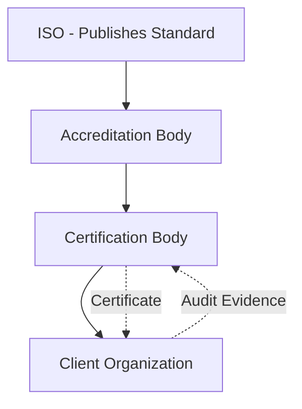
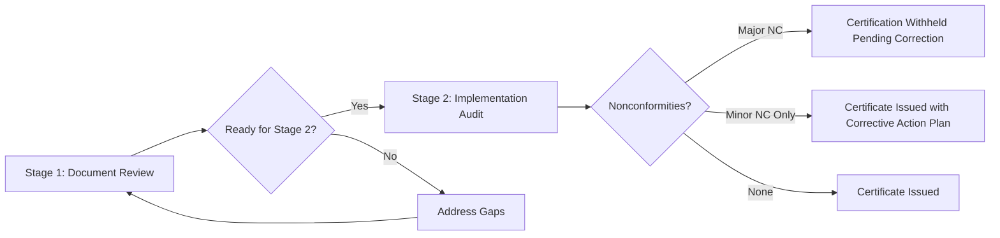

## Preparing for Certification and External Audit

### Overview

Preparing for certification and external audit is the structured process by which an organization readies its asset management system (AMS) for independent, third-party assessment against the ISO 55001 standard, culminating in formal certification by an accredited certification body. This process extends beyond internal readiness activities to encompass the specific mechanics of the certification audit itself — audit staging, evidence management, auditor engagement, and nonconformity resolution — and represents the point at which an organization's asset management maturity is externally validated.

**Key Points**

- Certification audits follow a defined two-stage process (Stage 1 documentation review, Stage 2 implementation audit)
- Certification is granted by accredited third-party certification bodies, not by ISO itself
- Ongoing certification requires periodic surveillance audits and full recertification audits (typically on a three-year cycle)
- Preparation should demonstrate a functioning, evidence-based AMS — not a paper exercise assembled solely for audit purposes

---

### The Certification Body Landscape

| Entity | Role |
| --- | --- |
| ISO | Publishes the ISO 55001 standard; does not perform audits or issue certificates |
| Accreditation Body | National body (e.g., UKAS, ANAB, JAS-ANZ) that accredits certification bodies to ensure audit competence and impartiality |
| Certification Body (CB) | Accredited third-party organization (e.g., BSI, Lloyd's Register, DNV, SGS, Bureau Veritas) that conducts audits and issues ISO 55001 certificates |
| Client Organization | The organization seeking certification |

---

### The Certification Audit Process

#### Stage 1 Audit: Documentation Review and Readiness Assessment

- Auditor reviews the AMS documentation set: SAMP, asset management policy, AMOs, AMPs, risk register, procedures
- Confirms the scope of certification is clearly and appropriately defined
- Assesses whether the organization is sufficiently prepared to proceed to Stage 2
- Identifies areas of concern to be examined in greater depth during Stage 2
- Often conducted partly or fully off-site or via document submission

#### Stage 2 Audit: Implementation and Effectiveness Audit

- Conducted on-site (or via structured remote audit methods where permitted)
- Auditor gathers objective evidence that the AMS is effectively implemented and operating as documented
- Includes interviews with personnel across levels (executive, asset managers, operational/field staff)
- Includes review of records: work orders, maintenance history, incident investigations, management review minutes, internal audit reports, training records
- Site/asset walkdowns to verify documented processes match field practice
- Concludes with an audit report identifying any nonconformities

#### Ongoing Certification Maintenance

- **Surveillance audits**: Conducted annually (typically), sampling portions of the AMS rather than a full re-audit
- **Recertification audit**: Full audit conducted before the three-year certificate expiry, assessing the complete AMS

---

### Nonconformity Classification

| Classification | Definition | Typical Consequence |
| --- | --- | --- |
| Major Nonconformity | A significant failure to meet a standard requirement, or an absence of a required process, or multiple minor nonconformities in the same clause indicating systemic failure | Certification withheld or suspended until resolved and verified |
| Minor Nonconformity | An isolated lapse or weakness that does not indicate systemic failure | Certificate may be issued/maintained with a documented corrective action plan and follow-up verification |
| Observation / Opportunity for Improvement (OFI) | Not a nonconformity, but a noted area where improvement is recommended | No formal corrective action required; informs future improvement planning |

---

### Preparation Workstreams

#### 1. Documentation Readiness

Ensure the mandatory documented information required by ISO 55001 is complete, current, and internally consistent:

- Asset management policy
- Scope of the AMS and SAMP
- Asset management objectives (AMOs) and evidence of their consistency with the SAMP
- Risk assessment methodology and risk register
- Asset Management Plans (AMPs)
- Competency and training records
- Internal audit program and reports
- Management review records
- Nonconformity, corrective action, and improvement records

#### 2. Internal Audit as Pre-Certification Rehearsal

A robust internal audit program (ISO 55001 Clause 9.2) conducted prior to external certification serves as the primary readiness mechanism:

- Internal auditors should be independent of the area being audited
- Internal audits should sample across the full clause structure of ISO 55001, not only convenient or mature areas
- Findings should be genuinely corrected (with verified effectiveness) prior to the certification audit, not merely documented

#### 3. Gap Assessment Against ISO 55001

A structured, clause-by-clause gap assessment identifies areas of non-conformance or weak evidence prior to engaging a certification body:

$$\text{Readiness Score} = \frac{\text{Clauses with Adequate Evidence}}{\text{Total Applicable Clauses}} \times 100$$

[Inference] There is no universally mandated minimum "readiness score" threshold before pursuing certification; organizations and consultants typically use such internal scoring informally to guide prioritization of remediation effort rather than as a pass/fail gate defined by the standard itself.

#### 4. Evidence and Records Management

Auditors require objective evidence, not assertions. Preparation should ensure:

- Traceability between AMOs, AMPs, and actual work execution records
- Consistent version control across policy and planning documents
- Accessible records demonstrating the PDCA cycle is genuinely operating (not just documented as a concept)
- A designated audit coordinator to manage document requests and auditor logistics during the audit

#### 5. People Readiness

- Personnel at all levels should be able to articulate their role in the AMS and its relevance to organizational objectives (a common interview focus for auditors assessing Clause 5, Leadership, and Clause 7.3, Awareness)
- Front-line staff should be familiar with relevant procedures and be able to demonstrate — not merely describe — their application
- Leadership should be prepared to demonstrate active involvement (Clause 5.1) beyond policy sign-off, e.g., through management review participation and resource allocation decisions

---

### Illustration: Certification Readiness Timeline (svg_diagram)

<svg xmlns="http://www.w3.org/2000/svg" viewBox="0 0 720 260">
\<style\>
.top { fill: #2c3e50; }
.title { font-family: Arial, sans-serif; font-size: 15px; fill: #ffffff; text-anchor: middle; font-weight: bold; }
.phase { fill: #eef2f5; stroke: #2c3e50; stroke-width: 1.5; }
.label { font-family: Arial, sans-serif; font-size: 12px; fill: #1a1a1a; text-anchor: middle; }
.axis { stroke: #2c3e50; stroke-width: 2; }
\</style\>
<rect x="10" y="10" width="700" height="30" class="top" rx="4" />
<text x="360" y="30" class="title">Certification Readiness Timeline (svg_diagram)</text>
<line x1="40" y1="150" x2="680" y2="150" class="axis" />
<rect x="40" y="110" width="120" height="80" class="phase" />
<text x="100" y="205" class="label">Gap Assessment</text>
<rect x="175" y="110" width="120" height="80" class="phase" />
<text x="235" y="205" class="label">Remediation &amp;</text>
<text x="235" y="220" class="label">Documentation</text>
<rect x="310" y="110" width="120" height="80" class="phase" />
<text x="370" y="205" class="label">Internal Audit</text>
<rect x="445" y="110" width="115" height="80" class="phase" />
<text x="502" y="205" class="label">Stage 1 Audit</text>
<rect x="575" y="110" width="115" height="80" class="phase" />
<text x="632" y="205" class="label">Stage 2 Audit</text>

<text x="100" y="140" class="label">Month 1-2</text>

<text x="235" y="140" class="label">Month 2-5</text>

<text x="370" y="140" class="label">Month 5-6</text>

<text x="502" y="140" class="label">Month 6</text>

<text x="632" y="140" class="label">Month 7-8</text>

</svg>

---

### Practical Example

**Scenario**: A rail infrastructure operator is preparing for its first ISO 55001 certification audit, targeting Stage 2 within eight months.

**Preparation sequence**:

1. **Gap assessment** (Months 1–2): External consultant or internal team conducts a clause-by-clause review; identifies weak evidence in Clause 8.1 (Operational Planning and Control) and incomplete competency records under Clause 7.2
2. **Remediation** (Months 2–5): Operational control procedures for track maintenance are formalized and issued; a competency matrix is built and training gaps closed with documented evidence
3. **Internal audit** (Month 5–6): Internal auditors, trained and independent of the audited functions, conduct a full-scope audit; two minor nonconformities are raised regarding inconsistent risk register updates, which are corrected and verified
4. **Management review** (Month 6): Formal review incorporates internal audit results and confirms readiness to proceed
5. **Stage 1 audit** (Month 6): Certification body reviews documentation; confirms scope statement adequacy; flags one area (SAMP alignment with newly changed organizational strategy) for closer Stage 2 examination
6. **Stage 2 audit** (Months 7–8): On-site audit including depot and track-side walkdowns, staff interviews, and records review; one minor nonconformity raised on evidence of leading-indicator use in performance monitoring; corrective action plan submitted and accepted; certificate issued

---

### Common Pitfalls

- **Documentation-only preparation**: Producing polished documents without corresponding operational evidence, easily identified by experienced auditors through interviews and record cross-checks
- **"Audit theatre"**: Preparing staff with rehearsed answers rather than genuine process familiarity, which typically becomes apparent under auditor probing
- **Underestimating Stage 1 findings**: Treating Stage 1 as a formality rather than genuinely using its findings to refine Stage 2 preparation
- **Weak internal audit rigor**: Conducting internal audits superficially, leaving systemic issues to surface for the first time during external audit
- **Scope misalignment**: Defining a certification scope that does not adequately reflect the organization's actual asset base or excludes materially significant assets without justification
- **Neglecting sustained conformance**: Treating certification as an end point rather than establishing the ongoing internal audit and management review cadence needed to maintain conformance through surveillance audits

---

### Post-Certification Considerations

- Maintain the internal audit and management review cadence established during preparation; these should not be scaled back once certified
- Continue tracking corrective actions raised during certification through to verified closure
- Prepare for annual surveillance audits with the same evidentiary rigor as the initial certification, as certification bodies sample different clauses/areas each cycle
- Use certification as a milestone within the broader maturity journey, not its conclusion, feeding continued benchmarking and improvement activity

**Next Steps**

- Study Internal Audit Programs and Audit Planning for Asset Management Systems (ISO 55001 Clause 9.2)
- Explore Management Review and Continual Improvement Cycles in depth
- Examine Documented Information Requirements across ISO 55001 clauses
- Review Competency and Training Frameworks for Asset Management personnel (Clause 7.2)
- Study Risk Assessment Methodologies used within the AMS
- Explore Surveillance Audit and Recertification Planning practices