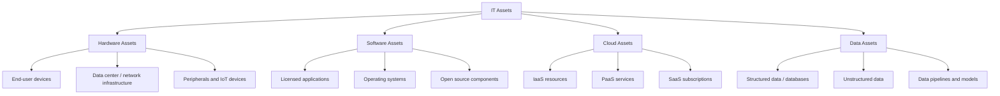
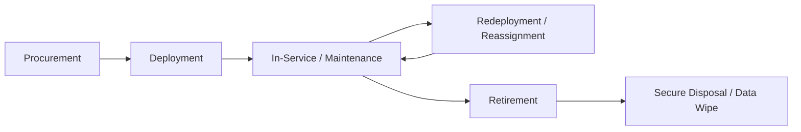
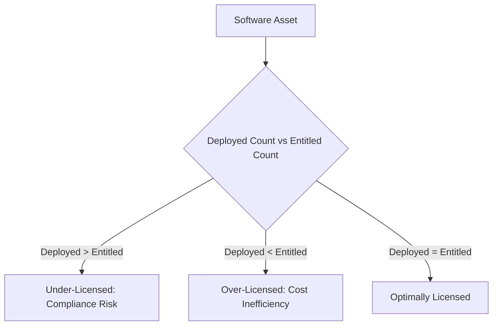
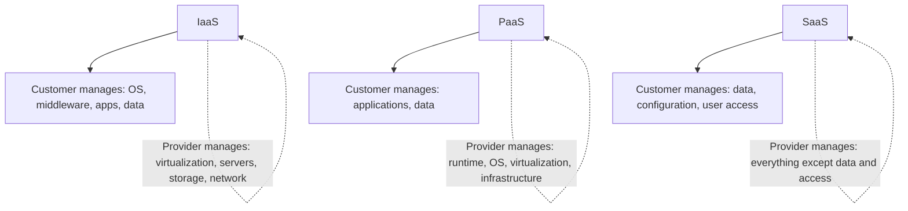
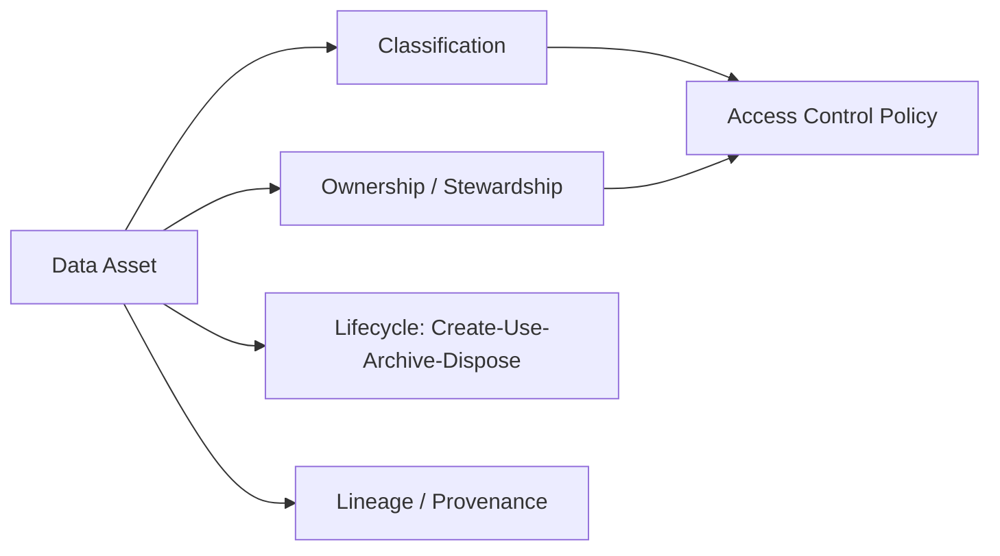

## Defining IT Assets across Hardware, Software, Cloud, and Data

### Overview

Defining IT assets is the foundational step of any IT Asset Management (ITAM) program: establishing a clear, comprehensive taxonomy of what constitutes an "asset" across the fundamentally different domains of hardware, software, cloud, and data. Unlike physical asset management, where an asset is typically a discrete, tangible item, IT assets span tangible equipment, intangible licensed rights, ephemeral consumption-based services, and information itself — each with distinct lifecycle characteristics, valuation approaches, and management disciplines. A precise, shared definition across these domains is a prerequisite for accurate inventory, cost control, risk management, and compliance.

**Key Points**

- ITAM has historically been split into Hardware Asset Management (HAM) and Software Asset Management (SAM), but modern practice extends this to Cloud Asset Management and, increasingly, Data Asset Management
- Each asset domain has a distinct unit of management: physical device (hardware), license entitlement (software), consumption/resource instance (cloud), and information asset (data)
- ISO/IEC 19770 (the SAM/ITAM standard family) and ITIL both provide frameworks for defining and classifying these asset types
- Boundary-blurring technologies (virtualization, containers, SaaS, IoT) increasingly challenge clean separation between these categories

---

### The Four Domains

---

### Hardware Assets

#### Definition

Hardware assets are physical, tangible IT equipment with a defined useful life, typically tracked from procurement through disposal.

#### Categories

| Category | Examples |
| --- | --- |
| End-user computing | Laptops, desktops, tablets, mobile phones, monitors |
| Data center infrastructure | Servers, storage arrays, blade enclosures, rack/power/cooling equipment |
| Network equipment | Switches, routers, firewalls, load balancers, wireless access points |
| Peripherals | Printers, scanners, docking stations, external storage |
| Specialized/IoT devices | Point-of-sale terminals, sensors, badge readers, industrial control devices |

#### Key Attributes Tracked

- Asset tag / serial number
- Manufacturer, model, specifications
- Purchase date, cost, depreciation schedule
- Assigned user/location
- Warranty and maintenance contract status
- Lifecycle state (in stock, deployed, in repair, retired)

#### Lifecycle Stages

---

### Software Assets

#### Definition

Software assets are the licenses, entitlements, and installed instances of applications and operating systems that an organization has the right to use, governed by vendor licensing terms rather than physical ownership.

#### Categories

| Category | Examples |
| --- | --- |
| Operating systems | Windows Server, Linux distributions, macOS |
| Commercial applications | ERP, CRM, productivity suites, design tools |
| Middleware | Database engines, application servers, integration platforms |
| Open source software (OSS) | Libraries, frameworks, OS distributions under OSS licenses |
| Development tools | IDEs, compilers, CI/CD tooling |

#### Key Attributes Tracked

- License type (perpetual, subscription, concurrent, named-user, OEM)
- Entitlement quantity (number of licenses/seats purchased)
- Deployment quantity (number of installations/activations)
- License terms and restrictions (e.g., virtualization rights, downgrade rights)
- Maintenance/support contract and renewal dates
- Compliance position: entitlement vs. deployment

#### Software Asset Compliance Relationship

$$\text{License Compliance Position} = \text{Entitlements Owned} - \text{Effective Deployments}$$

A negative result indicates **under-licensing** (compliance risk); a significantly positive result indicates **over-licensing** (cost inefficiency).

---

### Cloud Assets

#### Definition

Cloud assets are consumption-based or provisioned computing resources and services delivered by third-party providers, characterized by elasticity, metered billing, and the absence of direct physical ownership. Cloud assets sit across the shared responsibility spectrum defined by the service model.

#### Service Models and Asset Boundaries

#### Categories

| Category | Examples |
| --- | --- |
| IaaS | Virtual machines, block/object storage, virtual networks |
| PaaS | Managed databases, container orchestration platforms, serverless compute |
| SaaS | Email/collaboration suites, CRM platforms, HR systems |
| Cloud-native services | API gateways, managed AI/ML services, message queues |

#### Key Attributes Tracked

- Provider and account/subscription identifier
- Resource type, region, and configuration (instance size, storage tier)
- Cost allocation tags (cost center, project, environment)
- Consumption metrics (compute hours, storage volume, API calls) — the basis of metered billing
- Contract/commitment type (pay-as-you-go, reserved instances, committed use discounts)
- Data residency and jurisdiction

[Inference] Because cloud resources can be provisioned and deprovisioned programmatically within minutes, many organizations find that traditional periodic asset discovery cycles (adequate for hardware) are insufficient for cloud assets, and instead rely on continuous, API-driven inventory synchronization — though the specific tooling and cadence needed varies by cloud maturity and governance requirements.

---

### Data Assets

#### Definition

Data assets are information resources of business value that an organization owns, controls, or is responsible for governing — an increasingly formalized category under data governance and, in some ITAM frameworks, treated as a distinct asset class due to its cost of generation, storage, and its role as a source of organizational value and risk.

#### Categories

| Category | Examples |
| --- | --- |
| Structured data | Relational databases, data warehouses |
| Unstructured data | Documents, emails, media files |
| Semi-structured data | Logs, JSON/XML data feeds |
| Derived/analytical assets | Data pipelines, trained ML models, reports/dashboards |
| Master/reference data | Customer records, product catalogs, organizational hierarchies |

#### Key Attributes Tracked

- Data classification (public, internal, confidential, restricted)
- Data owner and steward
- Storage location and residency
- Retention and disposition schedule
- Regulatory scope (e.g., personal data subject to privacy regulation)
- Lineage (source systems, transformation history)
- Quality metrics (completeness, accuracy, timeliness)

#### Data Asset Governance Relationship

---

### Cross-Domain Comparison

| Dimension | Hardware | Software | Cloud | Data |
| --- | --- | --- | --- | --- |
| Ownership model | Owned or leased | Licensed (rarely owned outright) | Consumed/rented (no ownership) | Owned/controlled/processed |
| Primary risk | Physical loss, obsolescence, disposal/security | License non-compliance, audit exposure | Cost overrun (sprawl), misconfiguration | Breach, non-compliance, poor quality |
| Valuation basis | Depreciated book value / replacement cost | License cost / entitlement value | Ongoing consumption cost | Business value / risk exposure (often not on balance sheet) |
| Discovery method | Physical audit, agent-based scanning | Software inventory tools, license servers | Cloud provider APIs, CMDB integration | Data catalogs, classification scanning |
| Governing standard reference | ISO/IEC 19770-5 (concepts), ITAM frameworks | ISO/IEC 19770-1 (SAM processes) | Emerging practice; cloud provider frameworks + FinOps | Data governance frameworks (e.g., DAMA-DMBOK) |

---

### Illustration: IT Asset Taxonomy (svg_diagram)

<svg xmlns="http://www.w3.org/2000/svg" viewBox="0 0 720 340">
\<style\>
.top { fill: #2c3e50; }
.title { font-family: Arial, sans-serif; font-size: 15px; fill: #ffffff; text-anchor: middle; font-weight: bold; }
.domain { stroke: #2c3e50; stroke-width: 1.5; }
.label { font-family: Arial, sans-serif; font-size: 12px; fill: #ffffff; text-anchor: middle; font-weight: bold; }
.sub { font-family: Arial, sans-serif; font-size: 10.5px; fill: #1a1a1a; text-anchor: middle; }
.subbox { fill: #eef2f5; stroke: #2c3e50; stroke-width: 1; }
\</style\>
<rect x="10" y="10" width="700" height="30" class="top" rx="4" />
<text x="360" y="30" class="title">IT Asset Taxonomy (svg_diagram)</text>
<rect x="20" y="55" width="160" height="35" fill="#5b7a99" class="domain" rx="4" />
<text x="100" y="78" class="label">HARDWARE</text>
<rect x="20" y="100" width="160" height="30" class="subbox" />
<text x="100" y="119" class="sub">End-user devices</text>
<rect x="20" y="135" width="160" height="30" class="subbox" />
<text x="100" y="154" class="sub">Data center infra</text>
<rect x="20" y="170" width="160" height="30" class="subbox" />
<text x="100" y="189" class="sub">Network equipment</text>
<rect x="195" y="55" width="160" height="35" fill="#5b7a99" class="domain" rx="4" />
<text x="275" y="78" class="label">SOFTWARE</text>
<rect x="195" y="100" width="160" height="30" class="subbox" />
<text x="275" y="119" class="sub">OS &amp; middleware</text>
<rect x="195" y="135" width="160" height="30" class="subbox" />
<text x="275" y="154" class="sub">Applications</text>
<rect x="195" y="170" width="160" height="30" class="subbox" />
<text x="275" y="189" class="sub">Open source components</text>
<rect x="370" y="55" width="160" height="35" fill="#5b7a99" class="domain" rx="4" />
<text x="450" y="78" class="label">CLOUD</text>
<rect x="370" y="100" width="160" height="30" class="subbox" />
<text x="450" y="119" class="sub">IaaS resources</text>
<rect x="370" y="135" width="160" height="30" class="subbox" />
<text x="450" y="154" class="sub">PaaS services</text>
<rect x="370" y="170" width="160" height="30" class="subbox" />
<text x="450" y="189" class="sub">SaaS subscriptions</text>
<rect x="545" y="55" width="160" height="35" fill="#5b7a99" class="domain" rx="4" />
<text x="625" y="78" class="label">DATA</text>
<rect x="545" y="100" width="160" height="30" class="subbox" />
<text x="625" y="119" class="sub">Structured / databases</text>
<rect x="545" y="135" width="160" height="30" class="subbox" />
<text x="625" y="154" class="sub">Unstructured data</text>
<rect x="545" y="170" width="160" height="30" class="subbox" />
<text x="625" y="189" class="sub">Analytical / ML assets</text>
<rect x="20" y="225" width="685" height="90" fill="#f4f6f8" stroke="#2c3e50" stroke-width="1" />
<text x="360" y="250" class="sub" font-size="12">Boundary-Blurring Technologies</text>
<text x="360" y="272" class="sub">Virtualization &amp; containers (hardware/software blur) · SaaS embedding data storage (cloud/data blur)</text>
<text x="360" y="292" class="sub">IoT devices generating and transmitting data (hardware/data blur) · Serverless functions (cloud/software blur)</text>
</svg>

---

### Practical Example

**Scenario**: A mid-sized financial services firm is establishing its unified ITAM inventory and must classify a set of newly acquired resources.

| Item | Domain | Classification Rationale |
| --- | --- | --- |
| 200 employee laptops | Hardware (end-user computing) | Physical, tagged, depreciable asset with assigned custodian |
| Microsoft 365 E5 subscription (500 seats) | Software / SaaS (cloud) | Subscription-based; some organizations classify under Software, others under Cloud/SaaS — requires an internal taxonomy decision documented in ITAM policy |
| AWS EC2 reserved instances for core banking app | Cloud (IaaS) | Provisioned compute resource, metered and tagged to a cost center |
| Customer transaction database | Data | Classified as "Restricted" under data classification policy; subject to financial regulatory retention requirements |
| Open-source logging library (Apache License) embedded in an internal app | Software (OSS component) | Tracked for license obligation compliance (attribution) and vulnerability management, despite zero direct cost |
| Trained fraud-detection ML model | Data (derived/analytical asset) | Treated as a data asset with its own lineage, versioning, and access control requirements |

**Note on the Microsoft 365 example**: This illustrates a common real-world classification ambiguity — SaaS subscriptions often sit at the intersection of Software and Cloud domains. Organizations should establish and document a consistent internal convention (e.g., "any centrally licensed vendor application, regardless of delivery model, is tracked as a Software Asset; underlying infrastructure the organization provisions directly is tracked as a Cloud Asset") to avoid duplicate or inconsistent tracking.

---

### Common Pitfalls

- **Domain ambiguity without a documented convention**: Failing to define organizational rules for classifying boundary cases (SaaS, containerized workloads), leading to inconsistent or duplicated tracking
- **Treating cloud like hardware**: Applying periodic, manual audit cycles to highly elastic cloud resources, resulting in stale inventory and cost blind spots
- **Ignoring embedded/OSS software**: Failing to catalog open-source components embedded within applications, creating unmanaged license-obligation and vulnerability exposure
- **Excluding data as an asset class**: Managing data purely as a byproduct of systems rather than as a governed asset, undermining data quality, security, and regulatory compliance efforts
- **Siloed tooling per domain**: Running entirely separate, non-integrated tools for hardware, software, and cloud inventory, preventing a consolidated view needed for holistic risk and cost management

---

### Governance Foundations

A documented **IT Asset Management Policy** should explicitly define:

- The scope of what constitutes an IT asset in each domain for the organization
- Classification rules for boundary/ambiguous cases
- Ownership and accountability (asset owners, data stewards, license managers)
- The system(s) of record for each domain (CMDB, SAM tool, cloud management platform, data catalog) and how they reconcile

**Next Steps**

- Study Hardware Asset Management (HAM) Lifecycle Processes in depth
- Explore Software Asset Management (SAM) and License Compliance Management
- Examine Cloud Asset Management and FinOps practices for cost optimization
- Review Data Governance Frameworks (e.g., DAMA-DMBOK) and Data Classification schemes
- Study Configuration Management Database (CMDB) design and the relationship between ITAM and ITSM
- Explore ISO/IEC 19770 series standards for ITAM and SAM