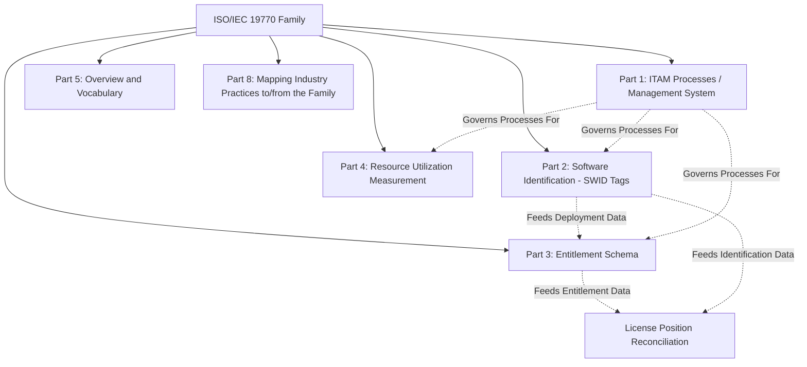
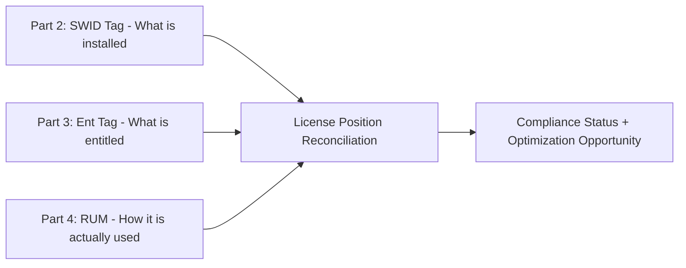

## The ISO/IEC 19770 Standard Family

### Overview

The ISO/IEC 19770 family is the set of international standards published jointly by ISO and IEC that address both the processes and the underlying data/technology structures for IT asset management (ITAM), with a historical center of gravity in software asset management (SAM). The standards address both the processes and technology for managing software assets and related IT assets, and broadly belong to the set of Software Asset Management (SAM) standards, integrated with other Management System Standards. The family is maintained by ISO/IEC JTC 1/SC 7 and provides the normative backbone referenced throughout modern ITAM and SAM tooling, certification schemes, and vendor licensing practice. [Wikipedia](https://en.wikipedia.org/wiki/ISO/IEC_19770)

**Key Points**

- The family combines a management-system standard (Part 1), data/schema standards (Parts 2, 3, 4), an overview/vocabulary standard (Part 5), and a practice-mapping guideline (Part 8)
- Part 1 conforms to the common ISO Management System Standards (MSS) format, making it structurally aligned with ISO 55001, ISO 9001, and ISO 27001
- Parts 2, 3, and 4 form an interoperable data trio: identification (SWID tags), entitlement, and usage measurement
- The family continues to evolve, with amendments and revisions issued periodically (e.g., a 2024 climate-action amendment to Part 1, and a Part 5 revision in review as of early 2025)

---

### Structure of the Family

---

### Part 1: IT Asset Management Systems — Requirements

#### Purpose and Scope

ISO/IEC 19770-1 is a framework of ITAM processes enabling an organization to prove it is performing software asset management that meets corporate governance standards. The most recent major version, ISO 19770-1:2017, published in December 2017, specifies requirements for the establishment, implementation, maintenance, and improvement of a management system for IT asset management (ITAM), referred to as an IT asset management system. [Wikipedia](https://en.wikipedia.org/wiki/ISO/IEC_19770)[Wikipedia](https://en.wikipedia.org/wiki/ISO/IEC_19770)

#### Structural Alignment with Other Management Systems

ISO 19770-1:2017 was a major update that rewrote the standard to conform to the ISO Management System Standards (MSS) format, moving the tiered structure from the 2012 edition into an appendix within the updated standard. This means Part 1 shares the same high-level clause structure (context of the organization, leadership, planning, support, operation, performance evaluation, improvement) as ISO 55001 and other MSS-family standards, enabling organizations to run integrated audits across asset management, quality, and information security management systems. [Wikipedia](https://en.wikipedia.org/wiki/ISO/IEC_19770)

#### Recent Amendment

An amendment, ISO/IEC 19770-1:2017/Amd 1:2024, titled "Climate action changes," was published in February 2024 and applies to ISO/IEC 19770-1:2017. This reflects a broader pattern across ISO management system standards of embedding climate-related considerations into the core requirements text (a common addition mandated across MSS-format standards during this period). [iso](https://www.iso.org/standard/88433.html)

#### Historical Tiered Model (Legacy Reference)

The earlier tiered structure organized SAM maturity into progressive tiers, commonly referenced in practitioner literature as: [licensedashboard](https://licensedashboard.com/iso-standards/)

| Tier | Focus |
| --- | --- |
| Tier 1 | Trustworthy data — establishing a reliable baseline inventory of installed software |
| Tier 2 | Practical management — taking operational control of the IT estate |
| Tier 3 | Operational integration — embedding SAM into broader IT and business processes |

[Inference] While the 2017 edition relocated this tiered model to an informative appendix rather than the normative requirements text, it remains widely referenced in practitioner and vendor literature as a maturity roadmap, since the underlying progression (data → control → integration) reflects observed practice.

---

### Part 2: Software Identification (SWID) Tags

#### Purpose

ISO/IEC 19770-2 provides an ITAM data standard for software identification (SWID) tags, which provide authoritative identifying information for installed software or other licensable items such as fonts or copyrighted papers. Providing accurate software identification data improves organizational security and lowers the cost while increasing the capability of many IT processes. [Wikipedia](https://en.wikipedia.org/wiki/ISO/IEC_19770)[Wikipedia](https://en.wikipedia.org/wiki/ISO/IEC_19770)

#### Function

A SWID tag is an XML file, typically installed alongside the software it describes, containing standardized metadata: publisher, product name, version, edition, and unique identifiers. SWID tags are designed to be machine-readable and consumed by SAM tools, vulnerability management systems, and configuration management databases to eliminate the ambiguity of free-text software naming across vendors.

---

### Part 3: Entitlement Schema

#### Purpose

ISO/IEC 19770-3:2016 establishes a set of terms and definitions for discussing software entitlements and provides specifications for a transport format enabling the digital encapsulation of software entitlements, including associated metrics and their management. The intended benefits include easier demonstration of proof of ownership, cost optimization of entitlement use, and easier license compliance management. [ansi](https://webstore.ansi.org/standards/iso/isoiec197702016)[ansi](https://webstore.ansi.org/standards/iso/isoiec197702016)

#### The "Ent" Structure

Records compliant with this standard are commonly referred to as "Ent Tags," providing a schema to encapsulate elements such as Vendor, Title, Edition, Metric, and Quantity for software license entitlements. The specific information provided by an entitlement schema may be used to help ensure compliance with license rights and limits, optimize license usage, and control costs. [1e](https://www.1e.com/?p=26819)[itamstandards](https://itamstandards.org/?p=791)

#### Explicit Boundaries

The standard deals only with software entitlements — defined as the subset of software licenses concerned with usage rights — and does not detail ITAM processes for discovery and management of software (covered by Part 1) or software identification tags (covered by Part 2). It also does not consider identifying mechanisms for product activation, and the original licensing documentation always takes legal precedence over the Ent encapsulation. [ansi](https://webstore.ansi.org/standards/iso/isoiec197702016)

---

### Part 4: Resource Utilization Measurement (RUM)

#### Purpose

ISO/IEC 19770-4:2017 establishes specifications for an information structure to contain Resource Utilization Measurement information to facilitate IT asset management. A RUM is a standardized structure containing usage information about the resources related to the use of an IT asset, often provided as an XML data file, though the same information may be accessible through other means depending on the platform and asset/product. [ansi](https://webstore.ansi.org/standards/iso/isoiec197702017-1663838)[itamstandards](https://itamstandards.org/?p=795)

#### Interoperability with Parts 2 and 3

This standard's information structures are designed to align with the identification information defined in Part 2 and the entitlement information defined in Part 3; when used together, these three types of information significantly enhance and automate ITAM processes. [itamstandards](https://itamstandards.org/?p=795)

This trio directly supports the license compliance calculation used in software asset management:

$$\text{License Position} = \text{Entitlement (Part 3)} - \text{Effective Utilization (Parts 2 + 4)}$$

---

### Part 5: Overview and Vocabulary

#### Purpose

ISO/IEC 19770-5:2015 provides an overview of the ISO/IEC 19770 family of standards, an introduction to IT asset management (ITAM) and software asset management (SAM), a brief description of the foundation principles and approaches on which SAM is based, and consistent terms and definitions for use throughout the family. It is applicable to all types of organization, including commercial enterprises, government agencies, and non-profit organizations. [iss](https://iss.rs/en/project/show/iso:proj:87660)[iss](https://iss.rs/en/project/show/iso:proj:87660)

Part 5 functions as the "Rosetta Stone" of the family — ensuring that terms like "asset," "entitlement," "deployment," and "license position" carry the same meaning across every other part of the standard.

#### Status of Revision

As of a status check dated January 16, 2025, a draft revision (ISO/IEC DIS 19770-5) was at the "close of voting" stage, indicating the vocabulary standard was under active review and update at that time. [Unverified] The current publication status of this revision beyond that draft-voting stage was not confirmed in available sources at the time of writing and should be checked against the current ISO catalogue for the latest edition status. [iss](https://iss.rs/en/project/show/iso:proj:87660)

---

### Part 8: Guidelines for Mapping Industry Practices

#### Purpose

This document defines requirements, guidelines, formats and approaches for use when producing a mapping document that defines how industry practices map to/from the ISO/IEC 19770 series. This edition focuses solely on mappings to/from both the second edition of Part 1 (published 2012) and the third edition of Part 1 (published 2017), though the title is deliberately general since future editions are expected to include mapping frameworks for other parts of the series. [gso](https://dgsm.gso.org.sa/store/standards/iso:pub:std:IS:72588/ISO-IEC%2019770-8:2020)[gso](https://dgsm.gso.org.sa/store/standards/iso:pub:std:IS:72588/ISO-IEC%2019770-8:2020)

#### Function

Part 8 exists because many organizations already operate ITAM/SAM frameworks derived from vendor methodologies, ITIL practices, or internal maturity models. Rather than requiring wholesale replacement of existing practice, Part 8 provides a structured method for documenting how those existing practices correspond to ISO/IEC 19770-1 requirements — useful for gap assessment and certification-readiness mapping exercises.

---

### Summary Table

| Part | Title | Focus | Type |
| --- | --- | --- | --- |
| Part 1 | IT asset management systems — Requirements | ITAM management system, processes, governance | Management system standard (auditable/certifiable) |
| Part 2 | Software identification tag | SWID tags — what software is installed | Data/schema standard |
| Part 3 | Entitlement schema | Ent tags — what is licensed/owned | Data/schema standard |
| Part 4 | Resource utilization measurement | RUM — how assets are actually used | Data/schema standard |
| Part 5 | Overview and vocabulary | Common terminology and family overview | Foundational/reference standard |
| Part 8 | Guidelines for mapping industry practices | Crosswalk between existing practice and Part 1 | Guidance document |

---

### Illustration: Data Flow Across Parts 2/3/4 into Part 1 Governance (svg_diagram)

<svg xmlns="http://www.w3.org/2000/svg" viewBox="0 0 720 320">
\<style\>
.top { fill: #2c3e50; }
.title { font-family: Arial, sans-serif; font-size: 15px; fill: #ffffff; text-anchor: middle; font-weight: bold; }
.box { fill: #eef2f5; stroke: #2c3e50; stroke-width: 1.5; }
.gov { fill: #5b7a99; stroke: #2c3e50; stroke-width: 1.5; }
.label { font-family: Arial, sans-serif; font-size: 12px; fill: #1a1a1a; text-anchor: middle; }
.glabel { font-family: Arial, sans-serif; font-size: 12px; fill: #ffffff; text-anchor: middle; font-weight: bold; }
.arrow { stroke: #2c3e50; stroke-width: 2; marker-end: url(#arr3); fill: none; }
\</style\>
<rect x="10" y="10" width="700" height="30" class="top" rx="4" />
<text x="360" y="30" class="title">19770 Data Flow into Governance (svg_diagram)</text>
<rect x="30" y="70" width="180" height="55" class="box" />
<text x="120" y="93" class="label">Part 2: SWID Tag</text>
<text x="120" y="110" class="label">(Identification)</text>
<rect x="270" y="70" width="180" height="55" class="box" />
<text x="360" y="93" class="label">Part 3: Ent Tag</text>
<text x="360" y="110" class="label">(Entitlement)</text>
<rect x="510" y="70" width="180" height="55" class="box" />
<text x="600" y="93" class="label">Part 4: RUM</text>
<text x="600" y="110" class="label">(Utilization)</text>
<line x1="120" y1="125" x2="300" y2="190" class="arrow" />
<line x1="360" y1="125" x2="360" y2="190" class="arrow" />
<line x1="600" y1="125" x2="420" y2="190" class="arrow" />
<rect x="230" y="195" width="260" height="55" class="gov" />
<text x="360" y="218" class="glabel">License Position &amp;</text>
<text x="360" y="235" class="glabel">Compliance Reconciliation</text>
<line x1="360" y1="250" x2="360" y2="280" class="arrow" />
<rect x="180" y="280" width="360" height="30" class="gov" />
<text x="360" y="300" class="glabel">Part 1: ITAM Management System (governs process)</text>
</svg>

---

### Practical Example

**Scenario**: A software publisher and its enterprise customer wish to fully leverage the 19770 family to automate license compliance reporting.

1. The publisher issues **SWID tags (Part 2)** embedded with every software installation package, so any compliant discovery tool can unambiguously identify the exact product, version, and edition installed on a device
2. At the point of sale, the publisher provides an **Ent tag (Part 3)** encapsulating the entitlement details: 500 named-user licenses of "Enterprise Suite Edition v4," with virtualization rights included
3. The customer's SAM tool collects **RUM data (Part 4)** from deployed instances, capturing actual usage metrics (e.g., active user counts, concurrent sessions) aligned to the same identification and entitlement structures
4. The SAM tool reconciles SWID-tag deployment counts against Ent-tag entitlement quantities, refined by RUM usage data, to calculate a real-time license position — reducing the customer's dependence on manual, spreadsheet-based reconciliation during a vendor audit
5. The customer's overarching ITAM governance processes — audit cadence, roles, corrective action for discovered under-licensing — are structured to conform to **Part 1**, and if the organization pursues certification, an internal mapping exercise per **Part 8** documents how its existing homegrown SAM procedures correspond to Part 1 clauses
6. Throughout, all parties rely on **Part 5** to ensure "entitlement," "deployment," and "license position" are used consistently across contracts, tooling, and audit reports

[Inference] Full practical interoperability across Parts 2, 3, and 4 depends on software publishers and SAM tool vendors actually implementing and emitting standards-compliant tags; adoption of the data-schema parts (2, 3, 4) has historically been less universal among commercial software vendors than adoption of Part 1 as a process framework, though the specific current adoption rate was not confirmed in available sources.

---

### Common Pitfalls

- **Treating Part 1 as the entire family**: Organizations often engage only with Part 1 (as a certifiable management system) while remaining unaware that Parts 2–4 exist to solve the underlying data-quality problem that makes Part 1 processes effective
- **Assuming universal vendor tag support**: Relying on SWID or Ent tag availability without verifying that specific software vendors actually publish standards-compliant tags for their products
- **Confusing entitlement with legal license terms**: Treating an Ent tag as legally definitive rather than as an encapsulation whose original license documentation always takes precedence
- **Ignoring the vocabulary standard**: Allowing inconsistent internal terminology (e.g., conflating "deployment" and "entitlement") that undermines cross-team and cross-tool communication, which Part 5 is specifically designed to prevent
- **Static, one-time mapping**: Producing a Part 8 mapping document once during initial certification and failing to update it as internal processes or the underlying Part 1 edition changes

---

### Relationship to Broader Asset Management Standards

The 19770 family is domain-specific to IT/software assets, whereas **ISO 55001** governs asset management broadly across all asset types (physical, infrastructure, IT, intangible). Organizations managing both physical and IT assets often align their IT Asset Management System (per ISO/IEC 19770-1) as a subordinate or parallel system feeding into an enterprise-wide Asset Management System (per ISO 55001), given both standards share the common MSS clause structure that facilitates integration.

**Next Steps**

- Study Software Asset Management (SAM) Processes and License Compliance Management in depth
- Explore SWID Tag implementation and tooling ecosystems
- Examine License Position Calculation methodologies and audit defense practices
- Review the ISO Management System Standards (MSS) common framework and its use across ISO 55001, 27001, and 19770-1
- Study ITAM Certification pathways and accredited certification bodies for ISO/IEC 19770-1
- Explore Configuration Management Database (CMDB) integration with SWID/Ent/RUM data structures