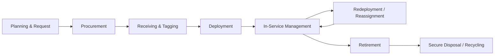
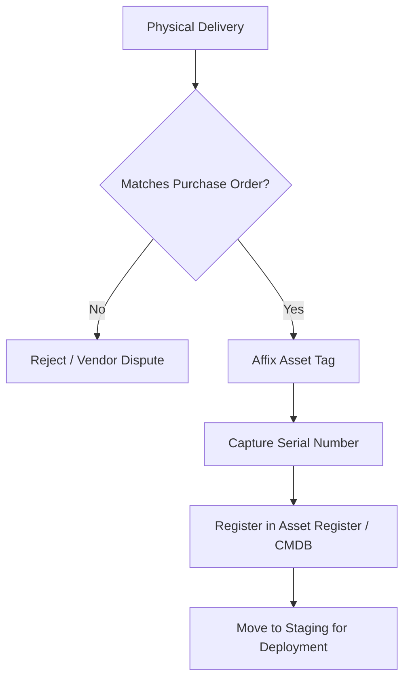
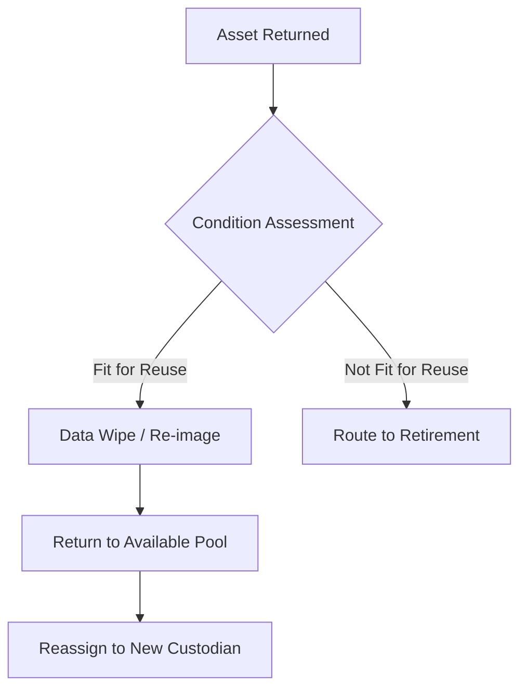
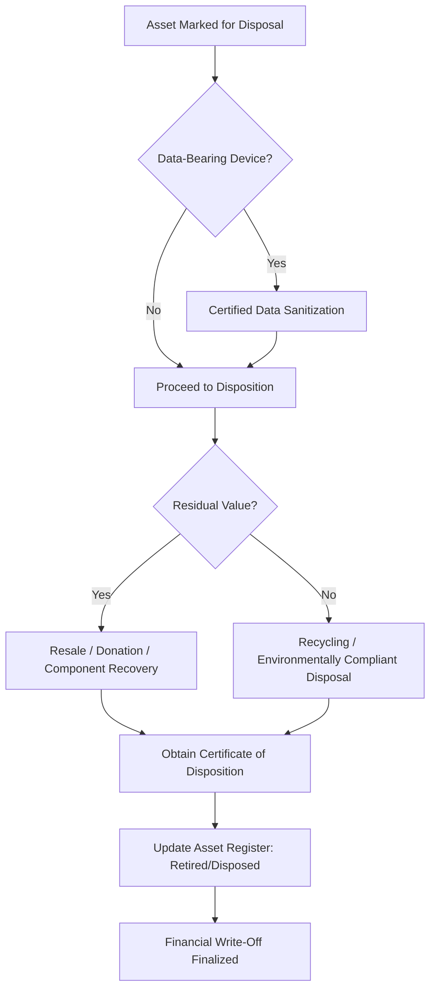

## The Hardware Asset Management Lifecycle

### Overview

The Hardware Asset Management (HAM) lifecycle describes the sequential stages through which a physical IT asset — a laptop, server, network device, or peripheral — passes from initial planning through to final disposal. HAM is the physical-asset discipline within the broader IT Asset Management (ITAM) practice, distinguished from Software Asset Management (SAM) by its focus on tangible items with a discrete unit cost, physical location, custodianship, and end-of-life disposition requirements including data security and environmental compliance.

**Key Points**

- The HAM lifecycle is typically modeled in six to eight stages, from procurement planning through secure disposal
- Each stage has distinct data capture requirements, ownership, and control objectives
- HAM overlaps with financial asset accounting (depreciation, capitalization) and with security/compliance functions (data sanitization, chain of custody)
- Accurate lifecycle tracking underpins cost optimization, security posture, audit readiness, and sustainability reporting

---

### The Lifecycle Stages

---

### Stage 1: Planning and Request

#### Activities

- Demand forecasting based on refresh cycles, headcount growth, or project requirements
- Standardization of approved hardware catalogs (reducing support complexity and enabling volume purchasing)
- Budget approval and capital/operating expenditure classification
- Alignment with organizational technology roadmap and end-of-support timelines for existing fleet

#### Key Outputs

- Approved hardware standard/catalog
- Procurement request with business justification
- Forecasted refresh schedule feeding the annual budget cycle

---

### Stage 2: Procurement

#### Activities

- Vendor selection and purchase order issuance, often through approved reseller or OEM channels
- Negotiation of volume pricing, warranty terms, and extended support agreements
- Configuration specification (build-to-order standard images, asset tagging requested pre-shipment in some enterprise agreements)

#### Key Data Captured

- Purchase order number, vendor, unit cost, quantity
- Expected delivery date and warranty start/end dates
- Cost center or project code for financial allocation

$$\text{Total Cost of Ownership (TCO)} = \text{Acquisition Cost} + \text{Support/Maintenance Cost} + \text{Operating Cost} - \text{Residual/Disposal Value}$$

---

### Stage 3: Receiving and Tagging

#### Activities

- Physical receipt verification against purchase order (quantity, model, condition)
- Asset tagging: affixing a unique identifier (barcode, RFID, or QR-coded asset tag) to each physical unit
- Initial registration in the asset register or CMDB (Configuration Management Database)
- Serial number capture and cross-reference to the asset tag

#### Key Data Captured

- Asset tag ID, manufacturer serial number
- Model, specifications (CPU, RAM, storage)
- Receipt date, condition on arrival
- Initial location (warehouse/staging)

---

### Stage 4: Deployment

#### Activities

- Imaging/configuration with standard operating environment (SOE) or organizational build
- Assignment to a named user, department, or functional role (e.g., "shared kiosk device")
- Update of asset register with custodian, location, and deployment date
- User acknowledgment (in many organizations, a signed or digital acceptance of custody and acceptable-use terms)

#### Key Data Captured

- Assigned user/custodian, department, cost center
- Deployment location (site, building, desk)
- Deployment date
- Linked software licenses (bridging HAM and SAM records)

---

### Stage 5: In-Service Management

#### Activities

- Ongoing maintenance: patching, firmware updates, hardware repairs
- Warranty and support contract tracking and renewal
- Periodic physical audits (cycle counts) to verify asset register accuracy against physical reality
- Incident tracking: loss, theft, damage reports
- Insurance and risk management for high-value or mobile assets

#### Key Metrics

| Metric | Purpose |
| --- | --- |
| Asset utilization rate | Identifies underused or idle hardware |
| Mean time between failures (MTBF) | Reliability tracking, informs refresh planning |
| Audit accuracy rate | % of physical assets matching register records |
| Warranty/support coverage % | Risk exposure for out-of-warranty equipment |

$$\text{Audit Accuracy Rate} = \frac{\text{Assets Physically Verified and Matching Records}}{\text{Total Assets in Register}} \times 100$$

[Inference] Industry practice commonly cites a target audit accuracy rate in the high-90s percentage range as indicative of a mature HAM program, though the specific acceptable threshold is organization- and risk-context-dependent rather than fixed by any single standard.

---

### Stage 6: Redeployment and Reassignment

#### Activities

- Reclaiming hardware from departing employees, completed projects, or downsizing initiatives
- Data wiping and re-imaging prior to reassignment (partial sanitization sufficient for internal reuse, distinct from full end-of-life sanitization)
- Condition assessment to determine suitability for redeployment vs. retirement
- Update of custodian and location records

---

### Stage 7: Retirement

#### Activities

- Formal decision to remove an asset from active service, triggered by age, obsolescence, end-of-support/end-of-life status, failure rate, or business change
- Update of asset status in the register to "pending disposal"
- Financial write-off processing in coordination with finance/accounting (aligning with depreciation schedules)

#### Common Retirement Triggers

| Trigger | Example |
| --- | --- |
| Age/depreciation threshold | Laptop reaches end of standard 4-year refresh cycle |
| End of vendor support | OS/firmware no longer receiving security patches |
| Repeated failure | Device exceeds acceptable repair frequency |
| Business change | Site closure, role elimination, technology migration |
| Capacity/performance inadequacy | Server can no longer meet workload requirements |

---

### Stage 8: Secure Disposal and Recycling

#### Activities

- **Data sanitization**: Certified data wiping (per standards such as NIST SP 800-88) or physical destruction (shredding, degaussing) of storage media, with priority determined by data classification
- **Chain of custody documentation**: Recording every handoff of the physical asset from retirement through final disposition, critical for audit and regulatory defense
- **Certificate of destruction/recycling**: Obtained from the disposal vendor (often an IT Asset Disposition, or ITAD, specialist) as evidence of compliant handling
- **Environmental compliance**: Adherence to e-waste regulations (e.g., WEEE in the EU, or regional equivalents) governing electronic waste handling
- **Value recovery**: Resale, donation, or component harvesting where residual value exists

---

### Full Lifecycle Illustration (svg_diagram)

<svg xmlns="http://www.w3.org/2000/svg" viewBox="0 0 740 280">
\<style\>
.top { fill: #2c3e50; }
.title { font-family: Arial, sans-serif; font-size: 15px; fill: #ffffff; text-anchor: middle; font-weight: bold; }
.stage { fill: #eef2f5; stroke: #2c3e50; stroke-width: 1.5; }
.label { font-family: Arial, sans-serif; font-size: 10.5px; fill: #1a1a1a; text-anchor: middle; }
.arrow { stroke: #2c3e50; stroke-width: 2; marker-end: url(#arr4); fill: none; }
.loop { stroke: #2c3e50; stroke-width: 1.5; stroke-dasharray: 4,3; marker-end: url(#arr4); fill: none; }
\</style\>
<rect x="10" y="10" width="720" height="30" class="top" rx="4" />
<text x="370" y="30" class="title">Hardware Asset Lifecycle (svg_diagram)</text>
<rect x="20" y="70" width="80" height="55" class="stage" rx="4" />
<text x="60" y="95" class="label">Plan &amp;</text>
<text x="60" y="108" class="label">Request</text>
<rect x="110" y="70" width="80" height="55" class="stage" rx="4" />
<text x="150" y="95" class="label">Procure-</text>
<text x="150" y="108" class="label">ment</text>
<rect x="200" y="70" width="80" height="55" class="stage" rx="4" />
<text x="240" y="95" class="label">Receive &amp;</text>
<text x="240" y="108" class="label">Tag</text>
<rect x="290" y="70" width="80" height="55" class="stage" rx="4" />
<text x="330" y="95" class="label">Deploy-</text>
<text x="330" y="108" class="label">ment</text>
<rect x="380" y="70" width="90" height="55" class="stage" rx="4" />
<text x="425" y="90" class="label">In-Service</text>
<text x="425" y="103" class="label">Manage-</text>
<text x="425" y="116" class="label">ment</text>
<rect x="480" y="70" width="90" height="55" class="stage" rx="4" />
<text x="525" y="90" class="label">Redeploy-</text>
<text x="525" y="103" class="label">ment /</text>
<text x="525" y="116" class="label">Reassign</text>
<rect x="580" y="70" width="70" height="55" class="stage" rx="4" />
<text x="615" y="95" class="label">Retire-</text>
<text x="615" y="108" class="label">ment</text>
<rect x="655" y="70" width="75" height="55" class="stage" rx="4" />
<text x="692" y="90" class="label">Secure</text>
<text x="692" y="103" class="label">Disposal /</text>
<text x="692" y="116" class="label">Recycle</text>
<line x1="100" y1="97" x2="108" y2="97" class="arrow" />
<line x1="190" y1="97" x2="198" y2="97" class="arrow" />
<line x1="280" y1="97" x2="288" y2="97" class="arrow" />
<line x1="370" y1="97" x2="378" y2="97" class="arrow" />
<line x1="470" y1="97" x2="478" y2="97" class="arrow" />
<line x1="570" y1="97" x2="578" y2="97" class="arrow" />
<line x1="650" y1="97" x2="653" y2="97" class="arrow" />
<path d="M 525 125 Q 525 175 425 175 Q 380 175 400 130" class="loop" fill="none" />
<text x="470" y="195" class="label">Reassigned asset returns to In-Service</text>
</svg>

---

### Practical Example

**Scenario**: A 3,000-employee professional services firm manages a laptop refresh program on a 4-year cycle.

1. **Planning**: IT forecasts 750 laptop replacements for the fiscal year based on the 4-year cycle applied to the existing fleet age distribution; budget approved as capital expenditure
2. **Procurement**: A master purchase agreement with an OEM secures volume pricing; laptops ordered with 4-year onsite warranty
3. **Receiving & Tagging**: Devices arrive at a central staging facility; each unit is asset-tagged with a barcode linked to its serial number and registered in the CMDB with status "In Stock"
4. **Deployment**: IT operations images each laptop with the standard corporate build, assigns it to a named employee, and updates the asset register with custodian, department, and deployment date; the employee digitally acknowledges custody
5. **In-Service Management**: Over the following years, the device receives patch management, is tracked through two help desk repair incidents, and is included in the annual physical audit cycle count, which confirms 97% register accuracy across the fleet
6. **Redeployment**: The original employee is promoted and receives a new higher-spec laptop; their existing (2-year-old) device is data-wiped, re-imaged, and reassigned to a new hire rather than retired, extending its useful service life
7. **Retirement**: At year 4, the reassigned laptop reaches end of standard support and is flagged for retirement; the asset register status changes to "Pending Disposal" and finance is notified for write-off processing
8. **Secure Disposal**: The device is collected by a certified ITAD vendor; the storage drive is sanitized per NIST 800-88 guidelines, a certificate of destruction is issued, and the chassis is recycled in compliance with e-waste regulations; the asset register is updated to "Disposed" with the certificate attached as supporting documentation

---

### Integration Points with Other Disciplines

| Discipline | Integration Point |
| --- | --- |
| Financial Asset Accounting | Depreciation schedules, capitalization thresholds, write-off processing |
| Software Asset Management | Linking installed software entitlements to the physical device record |
| Information Security | Data classification driving sanitization requirements at disposal; device encryption status tracking |
| Configuration Management (ITSM) | HAM records feeding the CMDB as configuration items (CIs) with relationship mapping to services |
| Sustainability/ESG Reporting | E-waste diversion rates, extended device lifespan through redeployment, carbon footprint of hardware refresh cycles |

---

### Common Pitfalls

- **Tagging gaps**: Failing to tag assets immediately on receipt, resulting in "ghost" devices that enter deployment without a register record
- **Custodian drift**: Not updating the asset register when devices change hands informally (e.g., peer-to-peer handoffs without IT involvement), eroding audit accuracy
- **Neglected physical audits**: Relying solely on network-based discovery, which misses powered-off, disconnected, or air-gapped assets
- **Inadequate sanitization evidence**: Disposing of data-bearing devices without retaining certificates of destruction, creating regulatory and breach-liability exposure
- **Siloed HAM and SAM data**: Managing hardware and the software installed on it in disconnected systems, preventing a complete asset cost and risk picture
- **No redeployment pathway**: Retiring functional hardware prematurely rather than assessing redeployment potential, increasing both cost and e-waste unnecessarily

---

### Governance and Documentation Requirements

A mature HAM program maintains documented evidence of:

- Asset register/CMDB with full lifecycle status history per asset
- Chain of custody records for high-value or sensitive-data-bearing assets
- Certificates of data sanitization and disposal/recycling
- Physical audit/cycle count results and reconciliation actions
- Warranty and support contract inventories with renewal tracking

**Next Steps**

- Study Configuration Management Database (CMDB) design and asset-to-CI relationship mapping
- Explore IT Asset Disposition (ITAD) vendor selection and data sanitization standards (NIST SP 800-88)
- Examine Software Asset Management (SAM) processes and their integration with HAM records
- Review Total Cost of Ownership (TCO) modeling for hardware refresh planning
- Study E-Waste Regulations and Sustainability Reporting in IT Asset Management
- Explore Physical Inventory Audit methodologies (RFID, barcode scanning, cycle counting)