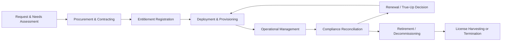
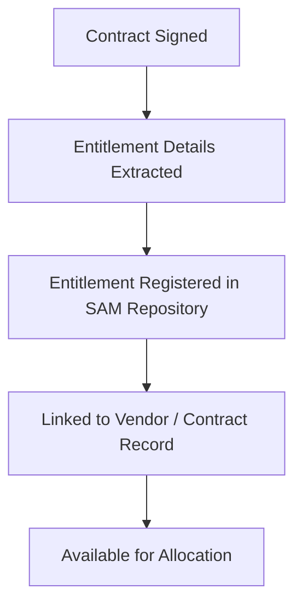
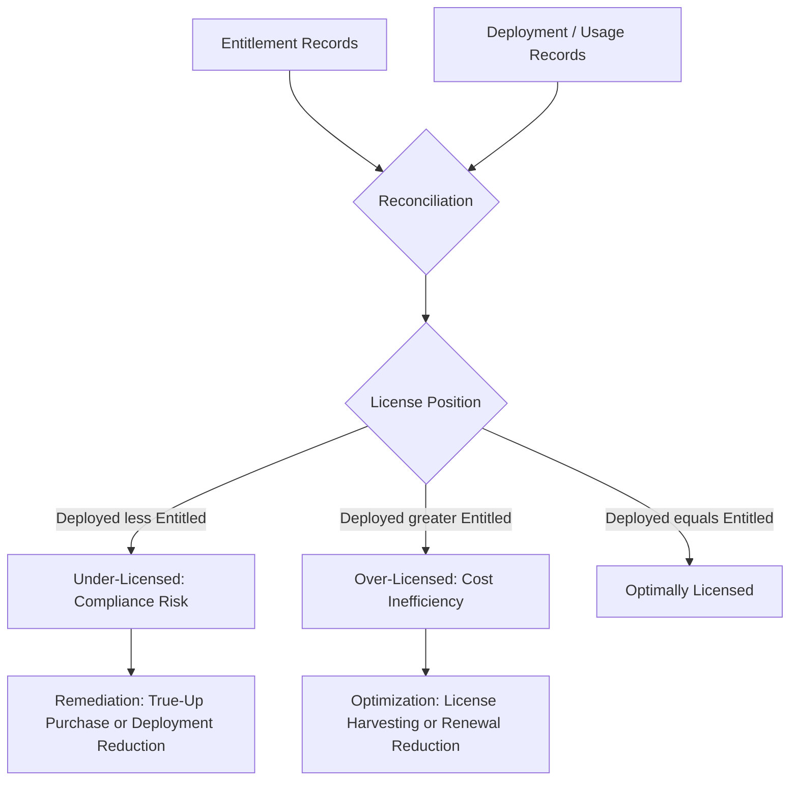
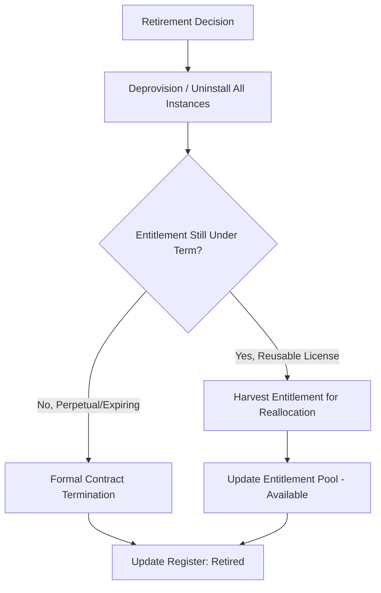

## The Software Asset Management Lifecycle

### Overview

The Software Asset Management (SAM) lifecycle describes the sequential stages through which a software asset — a licensed application, operating system, or entitlement — passes from initial request through to retirement, encompassing the acquisition of rights to use software, the tracking of deployments against those rights, and the eventual decommissioning of both the software and its associated entitlements. Unlike Hardware Asset Management, which tracks physical custody of tangible items, SAM tracks legal usage rights (entitlements) against actual consumption (deployments), making license compliance and cost optimization the central governance concerns throughout the lifecycle.

**Key Points**

- SAM manages the relationship between entitlement (what is licensed) and deployment (what is installed/used) at every stage
- The lifecycle spans request, procurement, deployment, operational management, compliance reconciliation, and retirement
- License metrics vary widely by vendor (per-seat, per-core, concurrent-user, subscription, consumption-based), directly affecting how each stage is executed
- SAM overlaps significantly with vendor contract management, IT security (vulnerability patching), and financial cost optimization (FinOps for SaaS/cloud-delivered software)

---

### The Lifecycle Stages

---

### Stage 1: Request and Needs Assessment

#### Activities

- Business unit or individual submits a software request, typically via a service catalog or IT self-service portal
- Assessment against existing entitlements: is there already unused/available capacity within current licenses before a new purchase is triggered?
- Evaluation of alternatives: existing approved software catalog, open-source alternatives, or SaaS options
- Security, architecture, and data-privacy review for new software introductions

#### Key Outputs

- Approved or denied software request
- Identification of whether request can be fulfilled from existing entitlement pool (avoiding unnecessary spend)

---

### Stage 2: Procurement and Contracting

#### Activities

- Vendor negotiation covering license metric, quantity, term, and support/maintenance terms
- Contract review for use rights, restrictions (e.g., virtualization rights, downgrade rights, geographic restrictions), and audit clauses
- Selection of license type appropriate to usage pattern

#### Common License Metrics

| Metric | Description | Typical Use Case |
| --- | --- | --- |
| Per-seat/named-user | One license per designated individual | Productivity software, design tools |
| Per-device | License tied to a specific device regardless of user | Shared workstations, kiosks |
| Concurrent-user | Limited pool of simultaneous users regardless of total assignees | Engineering/CAD software |
| Per-core/per-processor | Licensed by underlying compute capacity | Database and server software |
| Subscription (SaaS) | Recurring fee, often per-user per-month/year | Cloud collaboration and business applications |
| Consumption-based | Billed by actual usage volume (API calls, storage, compute-hours) | Cloud-native and PaaS services |

#### Key Data Captured

- Contract number, vendor, effective/expiry dates
- License metric and quantity (entitlement)
- Cost, payment terms, renewal notice period
- Use rights and restrictions (per the entitlement schema concepts formalized in ISO/IEC 19770-3)

---

### Stage 3: Entitlement Registration

#### Activities

- Recording the newly acquired entitlement in the SAM tool/license repository as the authoritative record of "what is owned"
- Linking entitlement records to the originating contract and vendor
- Where available, ingesting vendor-supplied proof-of-entitlement documentation (order confirmations, entitlement certificates)

---

### Stage 4: Deployment and Provisioning

#### Activities

- Installation or provisioning of software against an available entitlement
- Allocation tracking: which specific entitlement unit is consumed by which deployment
- Application packaging and standardized deployment via software distribution tools
- For SaaS: user account provisioning and license assignment within the vendor's admin console

#### Key Data Captured

- Deployment target (device or user)
- Installation date, version
- Entitlement consumed (linking deployment back to Stage 3 record)

---

### Stage 5: Operational Management

#### Activities

- Ongoing patch and version management, including tracking of vendor end-of-support and end-of-life dates
- Usage monitoring to identify underutilized licenses (e.g., SaaS seats with no login activity over a defined period)
- Vulnerability management coordination — SAM inventory data informs which systems require urgent patching for disclosed CVEs
- Periodic reconciliation between deployment and entitlement records (see Stage 6)

#### Key Metrics

| Metric | Purpose |
| --- | --- |
| Utilization rate | % of entitled licenses actively deployed and used |
| Version currency | % of installations on vendor-supported versions |
| Cost per active user | Basis for optimization and true-down decisions |
| Shelfware ratio | Proportion of paid entitlements with zero or negligible usage |

$$\text{Utilization Rate} = \frac{\text{Active Deployments (with usage evidence)}}{\text{Total Entitlements Owned}} \times 100$$

[Inference] Industry SAM practitioner literature commonly reports that a meaningful share of enterprise software spend goes toward underutilized ("shelfware") licenses, though the specific percentage cited varies considerably across studies, vendors, and software categories, and should not be treated as a fixed benchmark without organization-specific measurement.

---

### Stage 6: Compliance Reconciliation

#### Activities

- Comparing entitlement records (Stage 3) against actual deployment/usage records (Stages 4–5) to establish a **license position**
- Root-causing any discrepancies: unauthorized installs, forgotten decommissions, licensing metric misapplication
- Preparing for and responding to vendor audits or self-audits (True-Up processes common in enterprise agreements)

---

### Stage 7: Renewal and True-Up Decisions

#### Activities

- Ahead of contract renewal, reviewing utilization data to inform the renewal quantity (right-sizing) rather than automatically renewing at the prior term's volume
- Negotiating renewal terms informed by actual usage patterns and market alternatives
- For under-licensed positions, executing a "true-up" purchase to restore compliance before or at renewal
- For over-licensed positions, negotiating quantity reduction or reallocating unused entitlements to other business needs

---

### Stage 8: Retirement and Decommissioning

#### Activities

- Formal decision to retire a software application or version, driven by vendor end-of-life, business process change, or migration to a replacement system
- Uninstallation/deprovisioning across all deployed instances
- **License harvesting**: reclaiming entitlements from decommissioned instances for redeployment elsewhere (where license terms permit) rather than allowing them to lapse unused
- Contract termination or non-renewal processing
- Data migration/archival considerations for the retiring application's data, coordinated with data governance processes

---

### Full Lifecycle Illustration (svg_diagram)

<svg xmlns="http://www.w3.org/2000/svg" viewBox="0 0 740 300">
\<style\>
.top { fill: #2c3e50; }
.title { font-family: Arial, sans-serif; font-size: 15px; fill: #ffffff; text-anchor: middle; font-weight: bold; }
.stage { fill: #eef2f5; stroke: #2c3e50; stroke-width: 1.5; }
.label { font-family: Arial, sans-serif; font-size: 10px; fill: #1a1a1a; text-anchor: middle; }
.arrow { stroke: #2c3e50; stroke-width: 2; marker-end: url(#arr5); fill: none; }
.loop { stroke: #2c3e50; stroke-width: 1.5; stroke-dasharray: 4,3; marker-end: url(#arr5); fill: none; }
\</style\>
<rect x="10" y="10" width="720" height="30" class="top" rx="4" />
<text x="370" y="30" class="title">Software Asset Lifecycle (svg_diagram)</text>
<rect x="15" y="70" width="80" height="55" class="stage" rx="4" />
<text x="55" y="93" class="label">Request &amp;</text>
<text x="55" y="106" class="label">Assess</text>
<rect x="105" y="70" width="80" height="55" class="stage" rx="4" />
<text x="145" y="93" class="label">Procure &amp;</text>
<text x="145" y="106" class="label">Contract</text>
<rect x="195" y="70" width="90" height="55" class="stage" rx="4" />
<text x="240" y="93" class="label">Entitlement</text>
<text x="240" y="106" class="label">Registration</text>
<rect x="295" y="70" width="80" height="55" class="stage" rx="4" />
<text x="335" y="93" class="label">Deploy &amp;</text>
<text x="335" y="106" class="label">Provision</text>
<rect x="385" y="70" width="90" height="55" class="stage" rx="4" />
<text x="430" y="93" class="label">Operational</text>
<text x="430" y="106" class="label">Management</text>
<rect x="485" y="70" width="90" height="55" class="stage" rx="4" />
<text x="530" y="90" class="label">Compliance</text>
<text x="530" y="103" class="label">Reconcili-</text>
<text x="530" y="116" class="label">ation</text>
<rect x="585" y="70" width="70" height="55" class="stage" rx="4" />
<text x="620" y="93" class="label">Renewal /</text>
<text x="620" y="106" class="label">True-Up</text>
<rect x="665" y="70" width="70" height="55" class="stage" rx="4" />
<text x="700" y="93" class="label">Retire /</text>
<text x="700" y="106" class="label">Decommission</text>
<line x1="95" y1="97" x2="103" y2="97" class="arrow" />
<line x1="185" y1="97" x2="193" y2="97" class="arrow" />
<line x1="285" y1="97" x2="293" y2="97" class="arrow" />
<line x1="375" y1="97" x2="383" y2="97" class="arrow" />
<line x1="475" y1="97" x2="483" y2="97" class="arrow" />
<line x1="575" y1="97" x2="583" y2="97" class="arrow" />
<line x1="655" y1="97" x2="663" y2="97" class="arrow" />
<path d="M 620 125 Q 620 175 335 175 Q 300 175 320 130" class="loop" fill="none" />
<text x="470" y="195" class="label">Renewed / re-provisioned licenses return to Deployment</text>
</svg>

---

### Practical Example

**Scenario**: A 1,200-employee organization manages its enterprise design software (concurrent-user licensed, 150-license pool) and a SaaS collaboration suite (named-user subscription, 1,200 seats).

**Design software cycle**:

1. **Request**: Engineering manager requests 10 additional concurrent licenses for a new project team
2. **Assessment**: SAM analyst checks concurrent usage logs and finds peak usage of only 130 out of 150 existing licenses — the request is fulfilled from existing capacity, avoiding new spend
3. **Operational Management**: Usage monitoring continues; concurrent peak usage is tracked monthly to inform future capacity planning
4. **Renewal**: At the annual license server maintenance renewal, utilization data supports maintaining the current 150-license pool rather than the vendor's proposed increase

**SaaS collaboration suite cycle**:

1. **Procurement**: 1,200 named-user subscriptions purchased on an annual term
2. **Deployment**: Seats provisioned via the vendor's admin console as employees onboard
3. **Operational Management**: Login activity monitoring identifies 85 seats with zero logins in the past 90 days
4. **Compliance Reconciliation**: These are confirmed as departed employees whose accounts were not deprovisioned — a process gap identified and corrected via an automated offboarding trigger tied to the HR system
5. **Renewal/True-Up**: At renewal, the seat count is reduced from 1,200 to 1,150 based on validated active headcount, directly reducing subscription cost
6. **Retirement (partial)**: A legacy on-premises version of a related tool is fully decommissioned following migration to the SaaS suite; its perpetual licenses are formally retired and the maintenance contract is terminated, with entitlement records updated to reflect closure

---

### Integration Points with Other Disciplines

| Discipline | Integration Point |
| --- | --- |
| Hardware Asset Management | Linking software deployments to the physical/virtual device hosting them |
| Vendor/Contract Management | Renewal timelines, audit clause tracking, negotiated use rights |
| Information Security | Vulnerability patching prioritization using SAM inventory data; unauthorized software (shadow IT) detection |
| FinOps | Cost allocation and optimization for consumption-based and SaaS software spend |
| Configuration Management (ITSM) | Software instances registered as configuration items (CIs) linked to services |

---

### Common Pitfalls

- **Automatic renewal without utilization review**: Renewing at prior-term quantities by default, perpetuating shelfware cost
- **Offboarding gaps**: Failing to deprovision SaaS seats or licenses when employees depart, leaving paid-but-unused entitlements
- **Metric misapplication**: Applying the wrong license metric interpretation (e.g., miscounting virtualized instances against per-core terms), creating unrecognized compliance exposure
- **Shadow IT**: Departments procuring SaaS subscriptions outside the formal SAM process, creating untracked entitlements and duplicate spend
- **Reactive-only compliance posture**: Only reconciling entitlements against deployments when a vendor audit is announced, rather than maintaining continuous reconciliation
- **Siloed entitlement records**: Storing contracts, entitlement details, and deployment data in disconnected systems (legal contract repository, spreadsheet, discovery tool) preventing timely reconciliation

---

### Governance and Documentation Requirements

A mature SAM program maintains documented evidence of:

- Entitlement repository cross-referenced to contracts and proof-of-purchase
- Deployment/discovery records reconciled on a defined cadence
- License position reports and remediation action history
- Audit response history and evidence packages
- Software retirement and entitlement harvesting records

**Next Steps**

- Study License Compliance Auditing and Vendor Audit Response procedures
- Explore the ISO/IEC 19770 Standard Family (Parts 2, 3, 4) for entitlement and usage data structures
- Examine FinOps practices for SaaS and cloud-delivered software cost optimization
- Review Shadow IT Detection and Discovery Tooling
- Study Vendor Contract Management and Negotiation strategies for enterprise licensing agreements
- Explore the Hardware Asset Management Lifecycle for its integration points with SAM