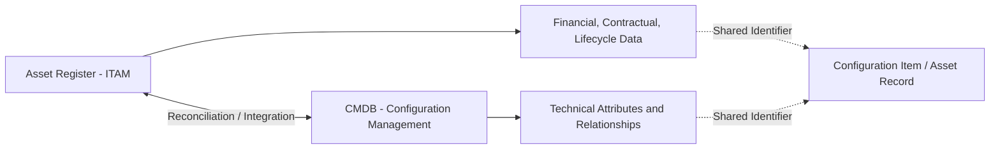
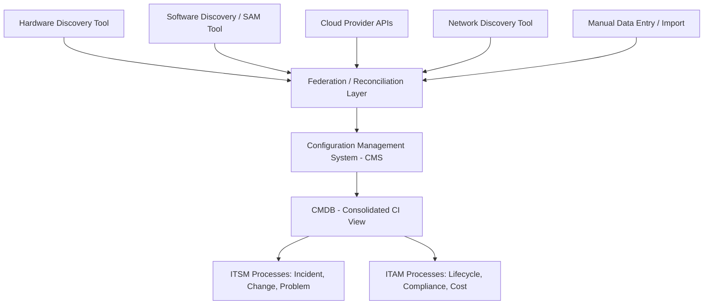
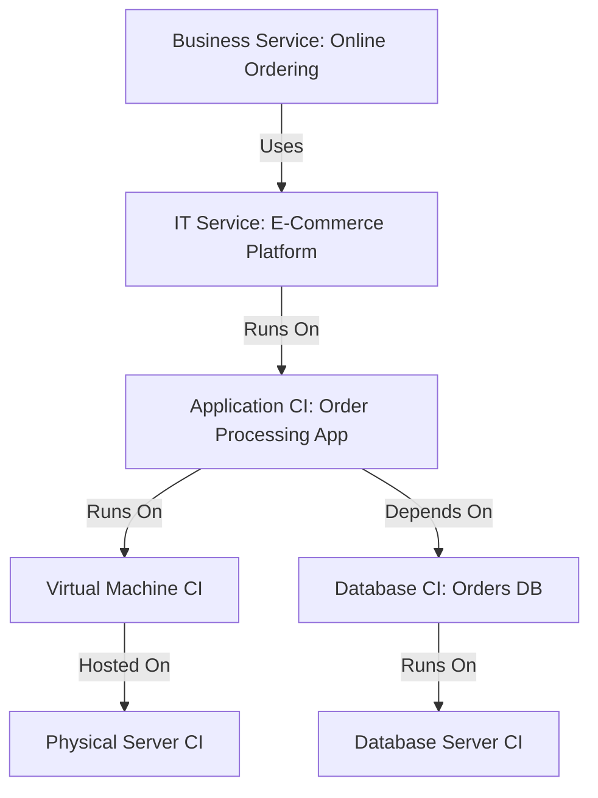
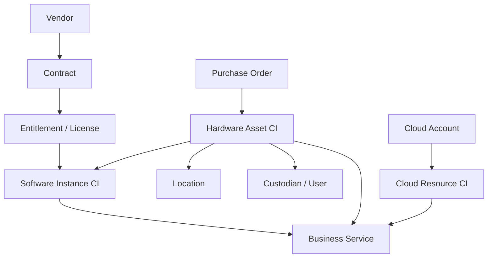
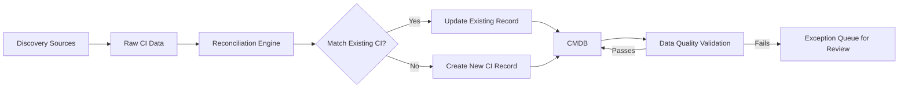

## Configuration Management Databases and IT Asset Data Models

### Overview

A Configuration Management Database (CMDB) is the authoritative repository that stores information about the configuration items (CIs) comprising an IT environment — their attributes, relationships, and dependencies — and serves as the structural backbone connecting IT Asset Management (ITAM) data to IT Service Management (ITSM) processes. While ITAM and configuration management are related but distinct disciplines (ITAM focuses on financial, contractual, and lifecycle ownership of assets; configuration management focuses on the technical relationships between components delivering IT services), the CMDB is frequently the shared data layer where both disciplines converge. The IT asset data model defines how asset attributes, hardware, software, cloud resources, and their relationships are structured to support both disciplines coherently.

**Key Points**

- A CMDB stores Configuration Items (CIs) and their relationships; a CMDB is not the same thing as an asset register, though the two are often integrated or reconciled
- ITIL positions the CMDB as part of a broader Configuration Management System (CMS), which may federate data from multiple underlying sources
- Effective CMDBs rely on defined CI types, attribute schemas, and relationship mapping (dependency, containment, connectivity)
- Data quality and currency are the most common practical failure points in CMDB implementations

---

### CMDB vs. Asset Register: A Critical Distinction

| Dimension | Asset Register (ITAM) | CMDB (Configuration Management) |
| --- | --- | --- |
| Primary purpose | Financial/contractual/lifecycle tracking | Technical relationship and dependency mapping |
| Key question answered | "What do we own, what did it cost, who owns it?" | "What depends on what, and what breaks if this fails?" |
| Typical owner | ITAM/procurement/finance function | IT operations/service management function |
| Core unit | Asset (hardware, software license, contract) | Configuration Item (CI) — may or may not be a financial asset |
| Update trigger | Procurement, deployment, retirement events | Any change to the technical environment |

[Inference] Not every CI is a financial asset (e.g., a logical network segment or a software instance with no discrete purchase cost), and not every asset is tracked as a CI (e.g., a spare peripheral in storage) — organizations vary in how tightly they integrate the two data sets, and the appropriate degree of integration depends on organizational maturity and tooling rather than a single prescribed standard.

---

### Configuration Management System (CMS) Architecture

ITIL describes a broader Configuration Management System that federates data from multiple sources rather than relying on a single monolithic database. This federated model reflects the practical reality that hardware inventory, software discovery, cloud resource data, and network topology are often best captured by specialized discovery tools and then consolidated logically rather than physically.

---

### Core CMDB Concepts

#### Configuration Item (CI)

A Configuration Item is any component that needs to be managed to deliver an IT service. CIs range from physical devices to logical constructs:

| CI Category | Examples |
| --- | --- |
| Hardware CI | Server, network switch, storage array |
| Software CI | Application instance, operating system, database instance |
| Cloud CI | Virtual machine, container, managed database service |
| Logical/Service CI | Business service, IT service, network segment |
| Documentation CI | SLA, contract, runbook (in some CMS implementations) |

#### CI Attributes

Attributes are the descriptive data fields captured for each CI, typically including:

- Unique identifier (CI ID)
- CI type/class
- Name, description
- Status (e.g., planned, active, retired)
- Owner and custodian
- Version/configuration details specific to the CI type

#### CI Relationships

Relationships are what distinguish a CMDB from a flat asset list — they capture how CIs depend on, contain, or connect to one another.

| Relationship Type | Example |
| --- | --- |
| "Runs on" | Application instance runs on a virtual machine |
| "Depends on" | Web service depends on a database CI |
| "Contains" | A server rack contains individual server CIs |
| "Connects to" | A network switch connects to a firewall |
| "Uses" | A business service uses an IT service |

---

### IT Asset Data Model Design

#### Purpose of a Data Model

The IT asset data model defines the schema — entity types, attributes, and relationships — that a CMDB or ITAM system uses to represent the IT environment consistently. A well-designed data model prevents duplicate or conflicting records, supports accurate reporting, and enables automation (e.g., automated license reconciliation, automated impact analysis for changes).

#### Common Entity Types in an Integrated ITAM/CMDB Data Model

#### Key Design Principles

- **Single source of truth per data domain**: Financial/contractual data owned by ITAM systems; technical relationship data owned by the CMDB, reconciled via a shared unique identifier
- **Normalization of naming**: Standardized identification (e.g., leveraging SWID tag data per ISO/IEC 19770-2) to prevent the same software product appearing under multiple inconsistent names
- **Federation over duplication**: Where possible, referencing data from its authoritative discovery source rather than manually re-entering it in multiple systems
- **Lifecycle state consistency**: Ensuring CI status (active, retired) and asset lifecycle status (deployed, disposed) remain synchronized between systems

---

### Data Population and Maintenance Methods

| Method | Description | Best Suited For |
| --- | --- | --- |
| Automated discovery (agent-based) | Software agent installed on endpoints reports configuration data | Managed devices with agent deployment capability |
| Automated discovery (agentless) | Network scanning, API queries (e.g., cloud provider APIs) without endpoint software | Cloud resources, network devices, unmanaged segments |
| Manual data entry | Human-entered records | Contracts, business relationships, non-discoverable attributes |
| Federation/import | Data pulled from an authoritative external system (HR system, procurement system) | Custodian assignment, cost center mapping |
| Reconciliation rules | Automated matching logic to merge/de-duplicate records from multiple sources | Combining hardware discovery with procurement records |

---

### CMDB Governance: Health and Data Quality

#### Common Data Quality Metrics

$$\text{CMDB Accuracy Rate} = \frac{\text{CIs Verified Correct via Audit}}{\text{Total CIs in CMDB}} \times 100$$

| Quality Dimension | Description |
| --- | --- |
| Completeness | % of required attributes populated per CI |
| Accuracy | % of CI data matching physical/technical reality upon verification |
| Currency | Time elapsed since last verified update |
| Consistency | Absence of conflicting data for the same CI across sources |
| Uniqueness | Absence of duplicate CI records for the same underlying item |

[Inference] Practitioner and vendor literature widely cites CMDB data quality/currency as the most common reason CMDB initiatives fail to deliver expected value, though the specific failure rates cited across various industry surveys differ and should be treated as indicative rather than definitive.

---

### Illustration: CMDB Layered Architecture (svg_diagram)

<svg xmlns="http://www.w3.org/2000/svg" viewBox="0 0 720 340">
\<style\>
.top { fill: #2c3e50; }
.title { font-family: Arial, sans-serif; font-size: 15px; fill: #ffffff; text-anchor: middle; font-weight: bold; }
.layer { fill: #eef2f5; stroke: #2c3e50; stroke-width: 1.5; }
.gov { fill: #5b7a99; stroke: #2c3e50; stroke-width: 1.5; }
.label { font-family: Arial, sans-serif; font-size: 12px; fill: #1a1a1a; text-anchor: middle; }
.glabel { font-family: Arial, sans-serif; font-size: 12px; fill: #ffffff; text-anchor: middle; font-weight: bold; }
\</style\>
<rect x="10" y="10" width="700" height="30" class="top" rx="4" />
<text x="360" y="30" class="title">CMDB Layered Architecture (svg_diagram)</text>
<rect x="30" y="60" width="660" height="50" class="layer" />
<text x="360" y="90" class="label">Consumption Layer: Incident, Change, Problem, ITAM Reporting, Impact Analysis</text>
<rect x="30" y="120" width="660" height="50" class="gov" />
<text x="360" y="150" class="glabel">CMDB: Consolidated CIs, Attributes, and Relationships</text>
<rect x="30" y="180" width="660" height="50" class="layer" />
<text x="360" y="210" class="label">Reconciliation and Federation Layer: Matching, De-duplication, Sync Rules</text>
<rect x="30" y="240" width="140" height="60" class="layer" />
<text x="100" y="265" class="label">Hardware</text>
<text x="100" y="280" class="label">Discovery</text>
<rect x="185" y="240" width="140" height="60" class="layer" />
<text x="255" y="265" class="label">Software</text>
<text x="255" y="280" class="label">Discovery</text>
<rect x="340" y="240" width="140" height="60" class="layer" />
<text x="410" y="265" class="label">Cloud Provider</text>
<text x="410" y="280" class="label">APIs</text>
<rect x="495" y="240" width="185" height="60" class="layer" />
<text x="587" y="265" class="label">Manual Entry /</text>
<text x="587" y="280" class="label">External Systems</text>
</svg>

---

### Practical Example

**Scenario**: An organization is designing its CMDB/ITAM data model to support both incident impact analysis and software license compliance reporting.

**Data model decisions**:

1. **CI hierarchy**: Business Service ("Customer Portal") → IT Service ("Web Application Stack") → Application CI ("Portal App v3.2") → Virtual Machine CI → Physical Host CI, with explicit "runs on" relationships at each level
2. **Software-to-hardware linkage**: Each Software Instance CI (e.g., a licensed database engine) carries a relationship to the Hardware/VM CI hosting it, and a separate relationship to the Entitlement record in the ITAM system — enabling both dependency mapping and license position calculation from the same underlying CI
3. **Unique identifier strategy**: A shared "Asset Tag ID" field is used to link the CMDB's Hardware CI record to the ITAM system's financial asset record, avoiding duplicate data entry while keeping the systems logically separate
4. **Reconciliation rule**: Hardware discovered via agent-based scanning is automatically matched to existing ITAM procurement records using serial number as the matching key; unmatched discoveries are routed to an exception queue for manual investigation (often surfacing unauthorized or unregistered hardware)

**Operational outcome**: When the "Portal App v3.2" experiences an incident, the relationship chain allows the service desk to immediately identify the underlying VM and physical host, while the same CI's link to the entitlement record allows the SAM team to separately confirm license compliance for that application instance during a concurrent audit — both drawing from the single reconciled CI rather than maintaining two disconnected records.

---

### Common Pitfalls

- **Conflating CMDB and asset register**: Attempting to force a single database to serve both financial/contractual reporting and technical dependency mapping without a clear data model distinguishing the two purposes
- **Over-scoping initial implementation**: Attempting to model every conceivable CI type and relationship from day one rather than starting with high-value services and expanding iteratively
- **Discovery without reconciliation**: Running multiple discovery tools that populate overlapping, unreconciled data, resulting in duplicate CI records
- **Stale relationship data**: Capturing CI attributes accurately but failing to maintain relationship data as the environment changes (e.g., after a migration), undermining impact analysis reliability
- **No data ownership model**: Failing to assign clear accountability for specific CI types or attributes, leading to no one being responsible for data quality
- **Manual-only maintenance**: Relying entirely on manual updates for a rapidly changing environment (especially cloud/container workloads), resulting in a perpetually stale CMDB

---

### Governance and Documentation Requirements

A well-governed CMDB/ITAM data model program maintains:

- A documented CI type schema and attribute dictionary
- Defined reconciliation and matching rules between discovery sources
- A documented data ownership/stewardship matrix by CI type
- Periodic data quality audits with tracked remediation
- Clear definition of the boundary and integration method between the CMDB and the ITAM asset register

**Next Steps**

- Study ITIL Configuration Management practice and the Configuration Management System (CMS) concept in depth
- Explore Discovery Tooling architectures (agent-based, agentless, API-driven) for hardware, software, and cloud
- Examine the ISO/IEC 19770 Standard Family for software identification data feeding CMDB normalization
- Review Change Management and Impact Analysis processes that consume CMDB relationship data
- Study Data Governance and Data Quality Management frameworks as applied to IT asset data
- Explore Cloud Asset Management and its distinct discovery/data model considerations