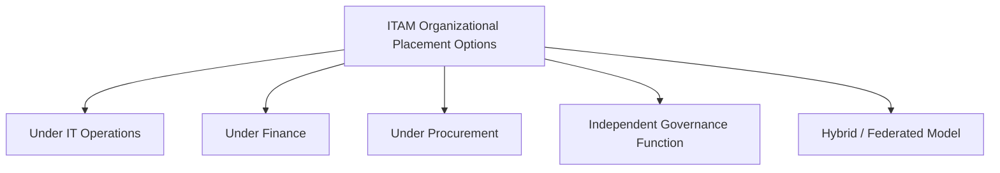
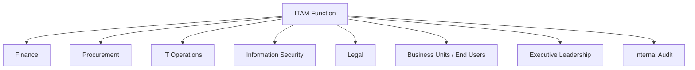
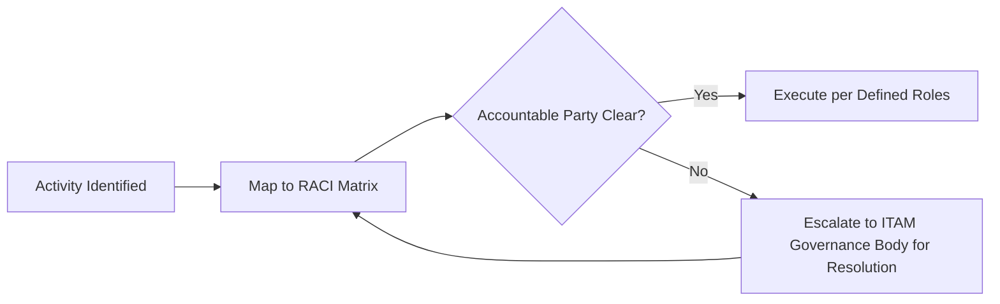
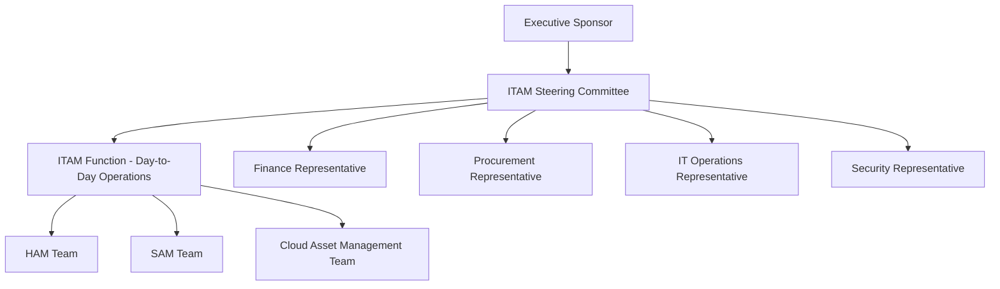

## ITAM Organizational Placement and Stakeholder Relationships

### Overview

ITAM organizational placement addresses where the IT Asset Management function should sit within the broader organizational structure, and how it should be governed to maximize effectiveness. Because ITAM touches finance (cost, depreciation), procurement (purchasing, vendor contracts), IT operations (deployment, discovery), security (risk, compliance), and legal (contracts, licensing terms), it is inherently cross-functional — a characteristic that makes organizational placement and stakeholder relationship design one of the most consequential and frequently under-addressed decisions in building a mature ITAM practice.

**Key Points**

- No single "correct" organizational home exists for ITAM; common models include placement under IT Operations, Finance, Procurement, or as an independent governance function
- ITAM's effectiveness depends less on its reporting line and more on the strength of its formalized relationships with adjacent functions
- A RACI (Responsible, Accountable, Consulted, Informed) model is the standard tool for clarifying cross-functional ITAM responsibilities
- Executive sponsorship and a cross-functional governance body materially improve ITAM program maturity regardless of specific reporting structure

---

### Common Organizational Placement Models

#### Placement Under IT Operations

- **Rationale**: Proximity to deployment, discovery, and technical lifecycle data; natural alignment with CMDB and configuration management
- **Strength**: Strong technical data quality; tight integration with ITSM processes (incident, change)
- **Weakness**: Financial and contractual discipline (cost optimization, audit defense) may receive less priority than operational uptime concerns

#### Placement Under Finance

- **Rationale**: Alignment with capitalization, depreciation, and cost center allocation; strong linkage to budget cycles
- **Strength**: Rigorous financial tracking and TCO analysis
- **Weakness**: May lack technical depth to validate deployment/discovery data quality, risking reliance on self-reported or stale technical information

#### Placement Under Procurement

- **Rationale**: Alignment with vendor negotiation, contract terms, and purchasing cycles
- **Strength**: Strong vendor relationship management and contract compliance tracking
- **Weakness**: Risk of ITAM being treated primarily as a pre-purchase function, with weaker post-deployment lifecycle and compliance monitoring

#### Independent Governance Function

- **Rationale**: Positions ITAM as a neutral, cross-functional coordinating body reporting directly to a CIO, CFO, or dedicated governance committee
- **Strength**: Avoids the bias of being subordinated to any single stakeholder function's priorities; well suited to organizations with high compliance/audit exposure
- **Weakness**: Requires stronger executive sponsorship to secure cooperation from functions it does not have direct authority over

#### Hybrid/Federated Model

- **Rationale**: Distributes ITAM responsibilities across existing functions (e.g., HAM embedded in IT Operations, SAM embedded in a dedicated license management team, cloud asset management embedded in a FinOps function) coordinated by a lightweight central governance layer
- **Strength**: Leverages existing functional expertise and reduces organizational disruption
- **Weakness**: Requires strong central coordination to prevent fragmentation and data silos (a common failure mode discussed in the CMDB/data model topic)

[Inference] Organizational placement is frequently observed in practice to correlate with which risk the organization is most acutely managing — compliance-driven organizations (heavily audited software estates) more often favor independent or procurement-adjacent placement, while cost-driven organizations more often favor finance-adjacent placement — though this is a general pattern rather than a universal rule, and the right choice depends on organization-specific risk priorities.

---

### Core Stakeholder Map

| Stakeholder | Primary Interest in ITAM | Key Data/Decisions Exchanged |
| --- | --- | --- |
| Finance | Cost accuracy, depreciation, capitalization | Asset cost, useful life, write-off approvals |
| Procurement | Vendor negotiation leverage, contract compliance | Entitlement quantities, renewal timing, spend data |
| IT Operations | Deployment accuracy, incident/change impact | CI relationship data, discovery feeds, CMDB integration |
| Information Security | Vulnerability exposure, unauthorized software/hardware | Asset inventory for patch prioritization, shadow IT detection |
| Legal | Contract terms, license compliance, audit defense | Entitlement documentation, audit response coordination |
| Business Units / End Users | Timely provisioning, minimal disruption | Service requests, usage patterns |
| Executive Leadership | Cost control, risk posture, strategic alignment | Summary KPIs, maturity assessments, budget justification |
| Internal Audit | Assurance over asset controls and compliance | Audit trail evidence, control effectiveness data |

---

### RACI Model for Cross-Functional ITAM Activities

A RACI matrix is the standard governance tool for resolving ambiguity about who does what across the many functions ITAM touches.

| Activity | ITAM | Finance | Procurement | IT Operations | Security |
| --- | --- | --- | --- | --- | --- |
| Software license purchase approval | C | A | R | I | C |
| Asset discovery/inventory accuracy | A | I | I | R | C |
| Vendor contract negotiation | C | I | R | I | I |
| Hardware disposal and data sanitization | A | I | I | R | C |
| Vulnerability patch prioritization | C | I | I | R | A |
| Depreciation schedule maintenance | C | A/R | I | I | I |
| License compliance audit response | A | I | C | C | I |

*(R = Responsible, A = Accountable, C = Consulted, I = Informed — illustrative allocation; actual assignment should be formally agreed and documented per organization)*

---

### ITAM Governance Structures

#### Governance Committee / Steering Group

Many mature ITAM programs establish a cross-functional governance body — often called an ITAM Steering Committee or Software Asset Management Board — that meets on a regular cadence (commonly monthly or quarterly) to:

- Review compliance position and cost optimization opportunities across the estate
- Approve policy changes (e.g., approved hardware standards, software catalog changes)
- Resolve cross-functional disputes (e.g., disagreement over decommission timing between IT Operations and a business unit)
- Escalate resourcing or budget needs to executive sponsors

#### Executive Sponsorship

Executive sponsorship (typically CIO, CFO, or COO level) is widely regarded in ITAM practitioner literature as a critical success factor, since ITAM frequently requires enforcing policy compliance (e.g., preventing unauthorized software installation, mandating asset tagging) across functions the ITAM team does not have direct line authority over. A sponsor provides the organizational authority to resolve cross-functional friction that a purely lateral ITAM function cannot resolve alone.

---

### Illustration: ITAM at the Center of Cross-Functional Data Flows (svg_diagram)

<svg xmlns="http://www.w3.org/2000/svg" viewBox="0 0 720 380">
\<style\>
.top { fill: #2c3e50; }
.title { font-family: Arial, sans-serif; font-size: 15px; fill: #ffffff; text-anchor: middle; font-weight: bold; }
.center { fill: #5b7a99; stroke: #2c3e50; stroke-width: 1.5; }
.stake { fill: #eef2f5; stroke: #2c3e50; stroke-width: 1.5; }
.label { font-family: Arial, sans-serif; font-size: 11.5px; fill: #1a1a1a; text-anchor: middle; }
.clabel { font-family: Arial, sans-serif; font-size: 13px; fill: #ffffff; text-anchor: middle; font-weight: bold; }
.line { stroke: #2c3e50; stroke-width: 1.5; }
\</style\>
<rect x="10" y="10" width="700" height="30" class="top" rx="4" />
<text x="360" y="30" class="title">ITAM Stakeholder Ecosystem (svg_diagram)</text>
<circle cx="360" cy="200" r="65" class="center" />
<text x="360" y="205" class="clabel">ITAM</text>
<rect x="60" y="65" width="140" height="45" class="stake" rx="4" />
<text x="130" y="92" class="label">Finance</text>
<line x1="200" y1="100" x2="320" y2="165" class="line" />
<rect x="290" y="55" width="140" height="45" class="stake" rx="4" />
<text x="360" y="82" class="label">Executive Leadership</text>
<line x1="360" y1="100" x2="360" y2="135" class="line" />
<rect x="520" y="65" width="140" height="45" class="stake" rx="4" />
<text x="590" y="92" class="label">Procurement</text>
<line x1="520" y1="100" x2="400" y2="165" class="line" />
<rect x="30" y="230" width="140" height="45" class="stake" rx="4" />
<text x="100" y="257" class="label">IT Operations</text>
<line x1="170" y1="245" x2="300" y2="215" class="line" />
<rect x="550" y="230" width="140" height="45" class="stake" rx="4" />
<text x="620" y="257" class="label">Information Security</text>
<line x1="550" y1="245" x2="420" y2="215" class="line" />
<rect x="150" y="310" width="140" height="45" class="stake" rx="4" />
<text x="220" y="337" class="label">Legal</text>
<line x1="230" y1="310" x2="330" y2="255" class="line" />
<rect x="430" y="310" width="140" height="45" class="stake" rx="4" />
<text x="500" y="337" class="label">Internal Audit</text>
<line x1="490" y1="310" x2="395" y2="255" class="line" />
</svg>

---

### Practical Example

**Scenario**: A mid-sized insurance company is restructuring its ITAM function after a failed vendor software audit revealed significant compliance exposure and cost overruns.

**Diagnosis**: The prior model had SAM responsibilities informally split between an IT Operations team member (tracking deployments) and a Procurement analyst (tracking contracts), with no formal coordination and no executive sponsor — resulting in the two data sets never being reconciled and the audit exposure going undetected.

**Restructuring actions**:

1. **Placement decision**: The organization establishes ITAM as an independent function reporting to the CIO, given the demonstrated cross-functional coordination failure under the prior distributed model
2. **RACI formalization**: A cross-functional workshop with Finance, Procurement, IT Operations, and Security produces a documented RACI matrix, explicitly assigning the ITAM function as Accountable for license compliance reconciliation (previously an accountability gap)
3. **Governance body established**: A quarterly ITAM Steering Committee is formed, chaired by the CIO, with standing representation from Finance, Procurement, and Security, to review compliance position and approve remediation budget
4. **Stakeholder relationship formalization**: A service-level agreement is established between ITAM and IT Operations defining discovery data feed frequency and quality expectations; a separate agreement with Procurement defines contract-renewal notice lead times required for ITAM to complete utilization-based renewal recommendations
5. **Outcome**: Within the following annual cycle, license reconciliation becomes a standing monthly process rather than an audit-triggered scramble, and the Steering Committee identifies and actions two additional over-licensed contracts for renewal-time reduction

---

### Common Pitfalls

- **No formal stakeholder agreements**: Relying on informal, personality-driven cooperation between functions rather than documented RACI or service-level agreements, which breaks down under staff turnover
- **Placement without sponsorship**: Establishing ITAM in any organizational location without securing executive sponsorship, leaving the function unable to enforce policy compliance across peer functions
- **Single-function bias**: Allowing ITAM's placement (e.g., under Procurement) to skew its priorities disproportionately toward that function's interests (e.g., pre-purchase negotiation) at the expense of full-lifecycle management
- **Governance body without authority**: Establishing a steering committee that meets regularly but has no actual decision-making authority or budget influence, reducing it to a reporting exercise
- **Fragmented federated model without coordination**: Distributing ITAM responsibilities across functions (hybrid model) without a genuine central coordination mechanism, recreating the siloed-data problem the structure was meant to solve

---

### Governance and Documentation Requirements

A well-governed ITAM organizational structure maintains:

- A documented RACI matrix for all major cross-functional ITAM activities, reviewed and re-confirmed periodically
- Terms of reference for the ITAM governance committee (membership, cadence, decision authority)
- Formalized service-level agreements or working agreements between ITAM and key stakeholder functions (IT Operations, Procurement)
- A named executive sponsor with documented escalation authority

**Next Steps**

- Study ITAM Policy Development and Organizational Standards
- Explore Configuration Management Databases and IT Asset Data Models (stakeholder data integration)
- Examine FinOps Organizational Models as a comparative case for cross-functional cloud cost governance
- Review Vendor Contract Management and Procurement Collaboration practices
- Study Change Management processes and their intersection with ITAM stakeholder coordination
- Explore Internal Audit Programs and their relationship to ITAM governance evidence