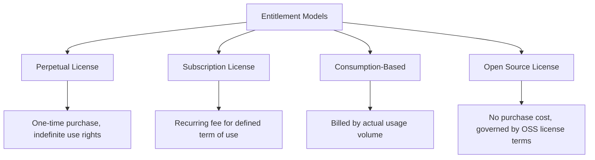
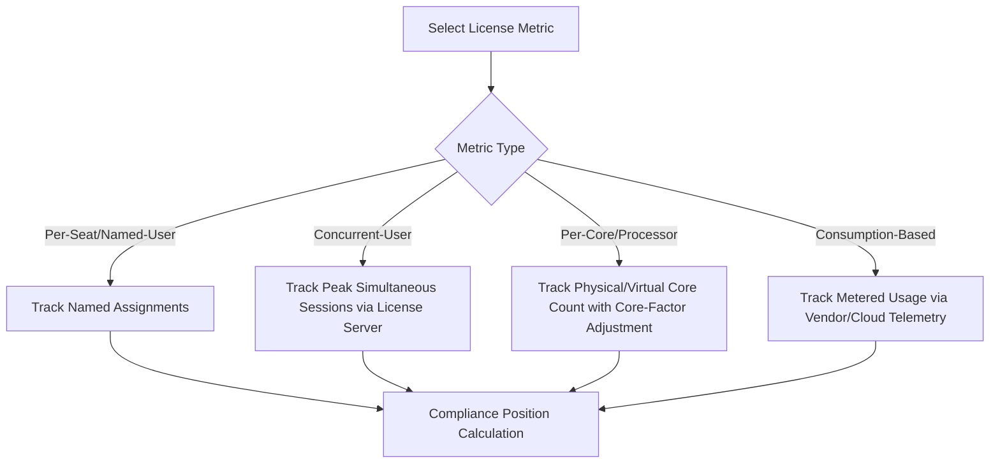
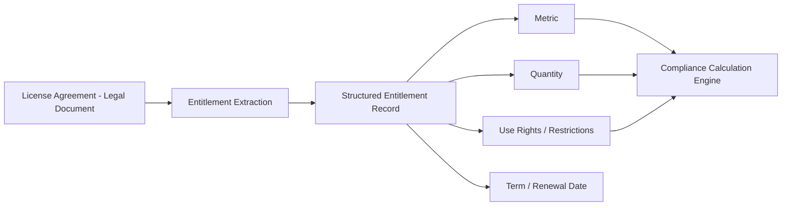

## Software Entitlement Models and License Types

### Overview

Software entitlement models and license types define the specific legal and contractual mechanisms by which a software vendor grants an organization the right to use its product, and the metrics by which that right is measured and constrained. Correctly identifying and tracking the applicable license type is the foundation of software compliance management: license position calculations, audit defense, and cost optimization are all only as accurate as the underlying understanding of what each entitlement actually permits.

**Key Points**

- License type determines both the compliance measurement method and the commercial/cost structure
- Entitlement models span perpetual, subscription, and consumption-based paradigms, each with distinct renewal and true-up mechanics
- License metrics (per-seat, per-core, concurrent-user, etc.) must be matched precisely to actual deployment measurement methods
- Use rights and restrictions (virtualization, downgrade, geographic, secondary-use rights) are as consequential as the headline metric and quantity

---

### Entitlement Model Categories

#### Perpetual License

- Grants indefinite right to use a specific version of software following a one-time (or amortized) purchase
- Often bundled with a separate, time-limited maintenance/support agreement that must be renewed annually to retain access to updates, patches, and vendor support
- Common in on-premises enterprise software, though declining in prevalence as vendors shift toward subscription models

#### Subscription License

- Grants right to use software for a defined, renewable term (monthly or annual) in exchange for recurring payment
- Access to the software typically terminates at the end of the term if not renewed (distinct from perpetual licenses, where only support/updates lapse)
- Dominant model for SaaS and increasingly common for traditionally on-premises software (vendors transitioning perpetual catalogs to subscription-only)

#### Consumption-Based Licensing

- Billed according to actual measured usage rather than a fixed seat or device count
- Common metrics: API calls, compute-hours, data processed/stored, transactions executed
- Typical of cloud-native and PaaS/serverless offerings

#### Open Source Licensing

- No purchase cost, but governed by license terms (e.g., permissive licenses such as MIT/Apache, or copyleft licenses such as GPL) that impose specific obligations (attribution, source disclosure, license propagation)
- Still requires ITAM tracking: obligation compliance, vulnerability management, and legal risk exposure (particularly for copyleft license contamination of proprietary code) are real management concerns despite the absence of a financial entitlement to reconcile

---

### License Metrics

The license metric defines the unit against which compliance is measured, and must be understood precisely — misapplying a metric is one of the most common sources of unrecognized compliance exposure.

| Metric | Definition | Compliance Measurement Challenge |
| --- | --- | --- |
| Per-seat / Named-user | One license assigned to one specific, identified individual | Must track named assignment, not just install count; a named user who never logs in is still consuming the license |
| Per-device | License tied to a device regardless of which user operates it | Multiple users sharing one licensed device is compliant; one user across multiple devices may not be |
| Concurrent-user | A pool of licenses shared across a larger user base, limited by simultaneous usage | Requires license-server or usage-log data capturing peak simultaneous sessions, not total assigned users |
| Per-core / Per-processor | Licensed according to the underlying physical or virtual CPU core/processor count | Virtualization and hyper-threading can materially complicate core-counting; vendor-specific core-factor tables often apply |
| Per-instance | One license per running instance of the software (e.g., per VM, per container) | Ephemeral/auto-scaling instances (common in cloud-native and container environments) can spike counts unpredictably |
| Subscription/User-based SaaS | Per-user, per-period fee (often per-month or per-year) | Requires provisioning/deprovisioning discipline; orphaned accounts consume paid seats invisibly |
| Consumption-based | Billed by measured usage unit | Requires reliable usage telemetry; cost forecasting is inherently more variable than fixed-seat models |

---

### Use Rights and Restrictions

Beyond the headline metric and quantity, the entitlement's specific use rights determine what deployment patterns are actually permitted. These are frequently the source of unrecognized non-compliance even when the raw quantity appears sufficient.

| Right/Restriction | Description | Compliance Implication |
| --- | --- | --- |
| Virtualization rights | Whether and how a license may be used within virtual machines | Some licenses restrict virtualization to specific hypervisors or require licensing the full physical host |
| Downgrade rights | Whether a customer may run an older version under a license purchased for a newer version | Relevant for organizations that delay upgrades but purchase current-version licenses |
| Secondary-use rights | Whether the same license permits limited use on a secondary device (e.g., a laptop for an employee's primary desktop license) | Often permitted for the same named user, rarely transferable to a different user |
| Geographic restrictions | Limitations on where the software may be deployed or accessed from | Relevant for multinational organizations and data residency requirements |
| Disaster recovery/passive use rights | Whether standby/failover instances require separate licensing | Vendor policies vary significantly on whether passive DR instances are chargeable |
| Development/test rights | Whether non-production environments require full licensing or are covered under reduced-cost terms | A common source of under-licensing when dev/test environments proliferate informally |

[Inference] Because these use rights vary substantially by vendor and even by specific product line within the same vendor, organizations cannot safely assume consistent treatment (e.g., of virtualization or DR rights) across their software estate without consulting the specific license agreement for each product — general industry patterns exist but are not a substitute for contract-level verification.

---

### Entitlement Documentation and the Role of ISO/IEC 19770-3

The entitlement schema formalized in ISO/IEC 19770-3 (see the ISO/IEC 19770 Standard Family topic) provides a structured way to encapsulate exactly these details — vendor, title, edition, metric, quantity, and associated use rights — in a machine-readable format, reducing ambiguity and easing both compliance calculation and audit defense when vendors support it.

---

### License Type Comparison Summary

| Dimension | Perpetual | Subscription | Consumption-Based |
| --- | --- | --- | --- |
| Payment structure | One-time (+ optional annual maintenance) | Recurring (monthly/annual) | Variable, usage-driven |
| Access on non-renewal | Software remains usable; only updates/support lapse | Access typically terminates | Access typically terminates or reverts to free tier |
| Cost predictability | High (fixed upfront) | High (fixed per term) | Lower (usage-dependent) |
| Compliance measurement | Deployment count vs. owned quantity | Active seat count vs. subscribed quantity | Usage volume vs. billing tier/commitment |
| Typical renewal lever | Maintenance renewal (separate from license itself) | Full license renewal | Ongoing, often no discrete renewal event |

---

### Illustration: License Type Decision Tree (svg_diagram)

<svg xmlns="http://www.w3.org/2000/svg" viewBox="0 0 720 340">
\<style\>
.top { fill: #2c3e50; }
.title { font-family: Arial, sans-serif; font-size: 15px; fill: #ffffff; text-anchor: middle; font-weight: bold; }
.box { fill: #eef2f5; stroke: #2c3e50; stroke-width: 1.5; }
.decision { fill: #5b7a99; stroke: #2c3e50; stroke-width: 1.5; }
.label { font-family: Arial, sans-serif; font-size: 11px; fill: #1a1a1a; text-anchor: middle; }
.dlabel { font-family: Arial, sans-serif; font-size: 11px; fill: #ffffff; text-anchor: middle; font-weight: bold; }
.arrow { stroke: #2c3e50; stroke-width: 1.5; marker-end: url(#arr6); fill: none; }
\</style\>
<rect x="10" y="10" width="700" height="30" class="top" rx="4" />
<text x="360" y="30" class="title">Identifying the Correct License Metric (svg_diagram)</text>
<rect x="290" y="55" width="140" height="45" class="decision" rx="4" />
<text x="360" y="82" class="dlabel">Review License Agreement</text>
<line x1="330" y1="100" x2="150" y2="140" class="arrow" />
<line x1="360" y1="100" x2="360" y2="140" class="arrow" />
<line x1="390" y1="100" x2="570" y2="140" class="arrow" />
<rect x="50" y="140" width="200" height="45" class="box" />
<text x="150" y="167" class="label">Fixed per-unit metric (seat, device, core)</text>
<rect x="280" y="140" width="160" height="45" class="box" />
<text x="360" y="167" class="label">Shared pool metric (concurrent)</text>
<rect x="470" y="140" width="200" height="45" class="box" />
<text x="570" y="167" class="label">Usage-based metric (consumption)</text>
<line x1="150" y1="185" x2="150" y2="220" class="arrow" />
<line x1="360" y1="185" x2="360" y2="220" class="arrow" />
<line x1="570" y1="185" x2="570" y2="220" class="arrow" />
<rect x="50" y="220" width="200" height="50" class="box" />
<text x="150" y="242" class="label">Track discrete assignments</text>
<text x="150" y="257" class="label">(named user/device/core count)</text>
<rect x="280" y="220" width="160" height="50" class="box" />
<text x="360" y="242" class="label">Track peak simultaneous</text>
<text x="360" y="257" class="label">usage via license server</text>
<rect x="470" y="220" width="200" height="50" class="box" />
<text x="570" y="242" class="label">Track metered volume</text>
<text x="570" y="257" class="label">via provider telemetry</text>
</svg>

---

### Practical Example

**Scenario**: An engineering firm licenses three different products, each under a different entitlement model, and must correctly track compliance for each.

1. **CAD software (perpetual + concurrent-user metric)**: 50 concurrent licenses purchased outright years ago; the firm still owns indefinite use rights to that version. A separate annual maintenance contract (for updates/support) must be renewed independently. Compliance is measured via license-server logs capturing peak simultaneous checkouts — currently averaging 47 of 50, indicating a tight but compliant position with limited headroom for growth.
2. **Project management SaaS (subscription, named-user metric)**: 200 named-user seats purchased annually. Compliance requires confirming that exactly 200 or fewer named users are actively assigned in the vendor's admin console — a straightforward count, but vulnerable to offboarding gaps if departed employees' accounts are not deprovisioned.
3. **Cloud-hosted analytics platform (consumption-based, per-API-call metric)**: No fixed seat count; the firm is billed monthly based on API call volume against a committed usage tier. "Compliance" in this context is less about a binary licensed/unlicensed position and more about cost management — monitoring usage against the committed tier to avoid overage charges, and periodically reassessing whether the committed tier still matches actual usage patterns.

**Cross-cutting governance decision**: The ITAM team documents, for each product, which specific entitlement model and metric applies, along with any relevant use-rights caveats (e.g., the CAD software's license agreement explicitly permits virtualized deployment only on the vendor's certified hypervisor list) — preventing future compliance analysts from assuming a uniform tracking methodology across the portfolio.

---

### Common Pitfalls

- **Assuming uniform metrics across a vendor's portfolio**: Treating all products from the same vendor as using the same license metric, when metrics frequently vary by product line
- **Conflating maintenance lapse with license loss**: Incorrectly assuming a perpetual license becomes unusable when maintenance lapses, when in fact only updates/support are typically affected
- **Undercounting virtualized/core-based deployments**: Failing to apply vendor-specific core-factor or virtualization counting rules, resulting in significant unrecognized under-licensing
- **Ignoring non-production environments**: Assuming development, test, and disaster recovery instances are automatically covered under production entitlements without verifying specific use rights
- **Treating open source as risk-free**: Overlooking copyleft license obligations when open-source components are embedded in proprietary software, creating legal and IP risk despite zero purchase cost
- **Static tracking of consumption-based licenses**: Applying a one-time "compliant/non-compliant" mental model to consumption-based licensing, when the relevant governance concern is ongoing cost management against a variable usage pattern rather than a fixed compliance threshold

---

### Governance and Documentation Requirements

Effective entitlement management requires documented records of, for each software product:

- The specific entitlement model and license metric in force
- Quantity owned/entitled and the measurement method used to track consumption against it
- Use rights and restrictions extracted from the governing license agreement
- Renewal, maintenance, and true-up dates and triggers
- For open source components, the specific license type and associated obligations

**Next Steps**

- Study License Compliance Auditing and License Position Calculation methodologies in depth
- Explore the ISO/IEC 19770 Standard Family, particularly Part 3 (Entitlement Schema) and Part 4 (Resource Utilization Measurement)
- Examine Open Source License Risk Management and copyleft obligation tracking
- Review Vendor Audit Response procedures and negotiation strategy
- Study Virtualization and Core-Based Licensing complexities in depth
- Explore Cloud Consumption Cost Management (FinOps) as it relates to usage-based licensing