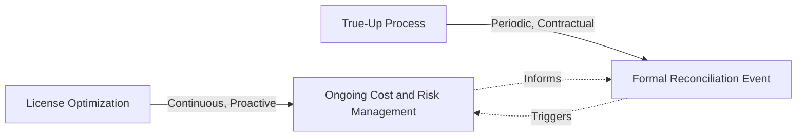
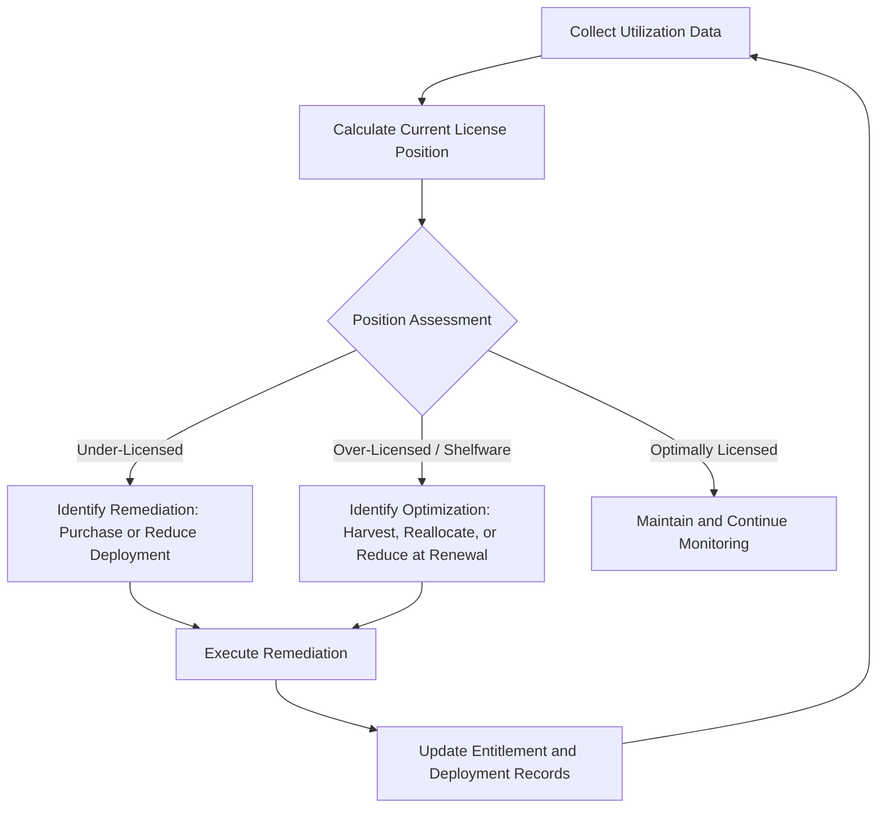
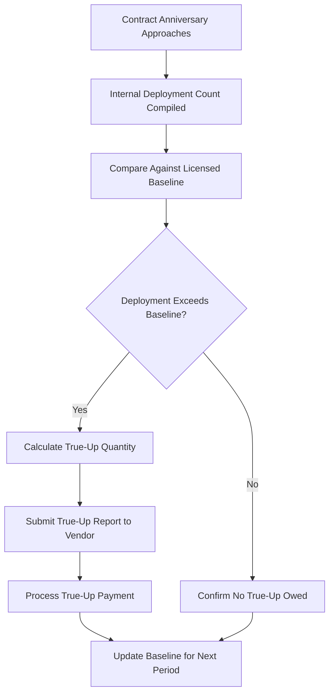
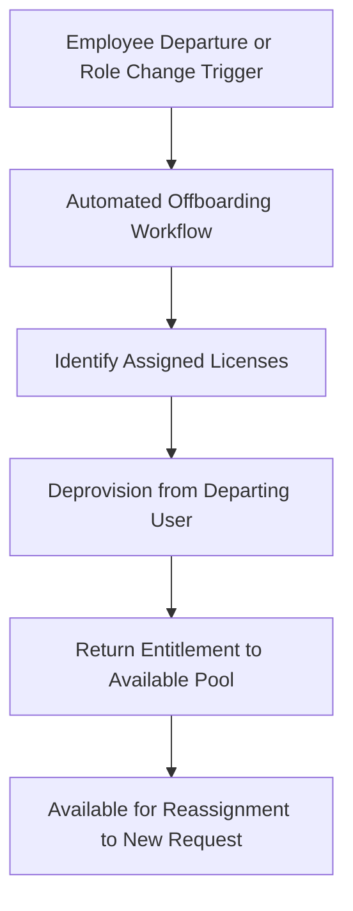

## License Optimization and True-Up Processes

### Overview

License optimization and true-up processes are the operational and analytical activities through which an organization actively manages its license position to minimize both compliance risk (under-licensing) and unnecessary spend (over-licensing/shelfware), and formally reconciles that position with vendors at defined contractual points. Where entitlement models and license types (covered separately) establish *what* is owned and how it is measured, optimization and true-up processes address the ongoing discipline of *actively managing* that position over time rather than passively accumulating entitlements and discovering discrepancies only at audit or renewal.

**Key Points**

- Optimization and true-up are complementary: optimization is continuous and proactive; true-up is periodic and contractually triggered
- A "true-up" corrects under-licensing by purchasing additional entitlements to match actual usage; a "true-down" (less universally supported by vendors) reduces entitlement quantity to match reduced usage
- Effective optimization depends on reliable usage/utilization data — without it, optimization decisions default to guesswork or worst-case assumption
- Enterprise Agreements (EAs) and similar vendor constructs often build true-up into the contract structure itself, with defined windows and penalty terms for late reporting

---

### Distinguishing Optimization from True-Up

| Dimension | License Optimization | True-Up Process |
| --- | --- | --- |
| Timing | Continuous / ongoing | Periodic (often annual, per contract terms) |
| Trigger | Utilization monitoring, cost review cycles | Contractual reporting obligation (e.g., EA anniversary) |
| Primary goal | Minimize shelfware, right-size entitlements | Formal compliance reconciliation with vendor |
| Typical outcome | Internal reallocation, harvesting, renewal adjustment | Purchase of additional entitlements, or negotiated adjustment |
| Owner | ITAM/SAM team, ongoing | ITAM/SAM team with Procurement and Finance involvement |

---

### The License Optimization Cycle

#### Step 1: Utilization Data Collection

Optimization is only as good as the underlying usage data. Sources include:

- Software discovery/inventory tools (installation presence)
- License server logs (for concurrent-user metrics, capturing peak simultaneous checkouts)
- SaaS admin console activity logs (login frequency, feature usage)
- Application usage monitoring/metering tools (active vs. installed-but-unused distinction)

#### Step 2: License Position Calculation

$$\text{Net License Position} = \text{Entitlements Owned} - \text{Effective Deployments/Usage}$$

A negative result indicates a compliance gap requiring remediation; a materially positive result indicates optimization opportunity.

#### Step 3: Optimization Actions

| Action | Description | Applicable Scenario |
| --- | --- | --- |
| License harvesting | Reclaiming unused/underused licenses from one user/device for reassignment to another | Named-user or per-device licenses with idle assignments |
| Reallocation | Moving entitlements between business units or cost centers based on shifting demand | Pooled or enterprise-wide entitlement arrangements |
| Downgrade/edition optimization | Moving users on a higher-cost edition to a lower-cost edition matching actual feature usage | Products with tiered editions (e.g., "Professional" vs. "Standard") |
| Consolidation | Reducing the number of distinct products serving overlapping functions | Redundant tools acquired through decentralized/shadow procurement |
| Renewal right-sizing | Adjusting quantity at contract renewal based on utilization trend rather than automatic renewal | All subscription and maintenance renewals |

---

### The True-Up Process

#### Purpose and Contractual Context

Many enterprise licensing constructs — particularly Enterprise Agreements (EAs), Enterprise License Agreements (ELAs), and similar volume licensing programs — explicitly anticipate that deployment will fluctuate during the contract term and build a formal **true-up** mechanism into the agreement: the customer self-reports actual deployment at defined intervals (commonly annually) and pays for any usage exceeding the originally licensed quantity.

#### True-Up vs. True-Down

- **True-up**: The standard, vendor-supported mechanism for reporting and paying for increased deployment
- **True-down**: A reduction of licensed quantity to match decreased usage; considerably less commonly supported mid-term by vendors, since it directly reduces vendor revenue — true-down opportunities are more typically exercised at renewal rather than mid-term

[Inference] The degree to which vendors support mid-term true-down (versus only allowing quantity reduction at renewal) varies significantly by vendor and specific program terms, and organizations should not assume true-down rights exist without confirming them in the specific governing agreement.

#### Preparing for a True-Up

- Maintain continuous, audit-ready deployment records rather than compiling data reactively at the reporting deadline
- Reconcile discovery/inventory data against the vendor's own definition of "deployment" for that specific program (definitions can vary — e.g., installed vs. actively used)
- Validate that deployment counts reflect current organizational reality (accounting for divestitures, acquisitions, or major infrastructure changes since the last true-up)
- Engage Procurement/Legal early if the true-up quantity is unexpectedly large, as this may be an opportunity to renegotiate broader contract terms rather than simply paying the incremental fee

---

### Optimization Techniques in Depth

#### Shelfware Identification

$$\text{Shelfware Ratio} = \frac{\text{Entitlements with No Usage Evidence over Defined Period}}{\text{Total Entitlements Owned}} \times 100$$

A defined "no usage" threshold (e.g., no login in 90 days) must be agreed with the business, since some legitimate use cases (seasonal roles, backup personnel) can appear as false positives without contextual review.

#### License Reharvesting Workflow

Integrating license reharvesting into HR-triggered offboarding workflows (rather than relying on manual IT follow-up) is a widely cited best practice for minimizing shelfware accumulation.

#### Edition/Tier Optimization

Many vendors offer tiered editions of the same product at different price points. Usage-pattern analysis (e.g., which advanced features a given user population actually invokes) can identify users licensed at a higher tier than their actual usage justifies, enabling cost reduction at the next renewal without functional impact.

---

### Illustration: Optimization and True-Up as Complementary Cycles (svg_diagram)

<svg xmlns="http://www.w3.org/2000/svg" viewBox="0 0 720 320">
\<style\>
.top { fill: #2c3e50; }
.title { font-family: Arial, sans-serif; font-size: 15px; fill: #ffffff; text-anchor: middle; font-weight: bold; }
.cont { fill: #eef2f5; stroke: #2c3e50; stroke-width: 1.5; }
.event { fill: #5b7a99; stroke: #2c3e50; stroke-width: 1.5; }
.label { font-family: Arial, sans-serif; font-size: 11.5px; fill: #1a1a1a; text-anchor: middle; }
.elabel { font-family: Arial, sans-serif; font-size: 11.5px; fill: #ffffff; text-anchor: middle; font-weight: bold; }
.arrow { stroke: #2c3e50; stroke-width: 1.5; marker-end: url(#arr7); fill: none; }
\</style\>
<rect x="10" y="10" width="700" height="30" class="top" rx="4" />
<text x="360" y="30" class="title">Continuous Optimization vs. Periodic True-Up (svg_diagram)</text>
<line x1="40" y1="180" x2="680" y2="180" stroke="#2c3e50" stroke-width="2" />
<text x="360" y="200" class="label">Timeline (12-Month Contract Period)</text>
<rect x="40" y="70" width="640" height="45" class="cont" />
<text x="360" y="97" class="label">Continuous Optimization: Monitoring, Harvesting, Reallocation</text>
<circle cx="660" cy="180" r="6" fill="#2c3e50" />
<rect x="560" y="220" width="140" height="55" class="event" />
<text x="630" y="243" class="elabel">Contract Anniversary:</text>
<text x="630" y="258" class="elabel">True-Up Event</text>
<line x1="660" y1="186" x2="630" y2="218" class="arrow" />
<circle cx="40" cy="180" r="6" fill="#2c3e50" />
<text x="40" y="160" class="label">Period Start</text>
</svg>

---

### Practical Example

**Scenario**: A software company holds a 3-year Enterprise Agreement for a productivity suite, originally licensed at 2,000 seats, with an annual true-up obligation.

**Year 1 — Continuous Optimization**:

- Monthly usage monitoring identifies 150 seats with no login activity over 90+ days
- Investigation reveals 80 belong to departed employees whose accounts were never deprovisioned (a process gap corrected via a new HR-triggered offboarding workflow), and 70 belong to seasonal contractors who are legitimately inactive outside their engagement period
- The 80 orphaned seats are harvested and returned to the available pool, avoiding the need to purchase new seats for 80 subsequent new hires

**Year 1 — True-Up Event**:

- At the contract anniversary, actual deployment is compiled: 2,150 active named users against the 2,000-seat baseline (growth driven by acquisition of a smaller company mid-year)
- A true-up report is submitted to the vendor; 150 additional seats are purchased at the contracted per-seat rate to bring the license position into compliance
- The new baseline of 2,150 seats carries forward as the reference point for Year 2

**Year 2 — Continuous Optimization Continues**:

- The improved offboarding workflow keeps shelfware substantially lower than Year 1's discovered backlog
- At the Year 2 true-up, deployment is found to be 2,120 — within the 2,150 baseline, so no additional purchase is required, and the utilization trend is flagged to Procurement as supporting evidence for potentially right-sizing the seat count downward at the Year 3 renewal negotiation

This illustrates the complementary relationship: continuous optimization reduces the magnitude of surprises at each formal true-up, while the true-up process provides the periodic, contractually anchored checkpoint that continuous monitoring alone does not substitute for.

---

### Common Pitfalls

- **Treating true-up as the only compliance checkpoint**: Relying solely on the periodic true-up rather than continuous monitoring, allowing compliance gaps to grow unnoticed between events and increasing both financial and negotiation risk
- **No offboarding integration**: Failing to link license reharvesting to HR/IT offboarding workflows, allowing shelfware to accumulate silently
- **False-positive shelfware flagging**: Applying inactivity thresholds without contextual review, incorrectly reclaiming licenses from legitimately intermittent users (e.g., seasonal staff)
- **Assuming true-down parity with true-up**: Expecting the same ease of reducing quantity mid-term as increasing it, when most vendor programs are structurally asymmetric
- **Late or reactive true-up reporting**: Compiling deployment data only at the reporting deadline rather than maintaining continuous records, increasing the risk of reporting errors and reducing negotiating leverage
- **Ignoring edition/tier mismatches**: Focusing optimization solely on quantity (seat count) while overlooking cost savings available through edition/tier right-sizing

---

### Governance and Documentation Requirements

Effective optimization and true-up governance requires:

- Documented utilization monitoring methodology and inactivity thresholds, reviewed periodically with business stakeholders
- A formal license harvesting/reharvesting procedure integrated with HR offboarding triggers
- True-up calculation records retained as audit evidence, cross-referenced to the governing contract
- A tracked history of true-up events and resulting baseline changes per contract
- Renewal decision documentation showing how utilization data informed quantity negotiation

**Next Steps**

- Study License Compliance Auditing and Vendor Audit Response procedures
- Explore Software Entitlement Models and License Types for the metric foundations underlying optimization calculations
- Examine Enterprise Agreement (EA) Negotiation Strategy and contract structuring
- Review Automated Offboarding Workflow design integrating HR, IT, and SAM systems
- Study Shadow IT Detection as a complementary discipline to entitlement optimization
- Explore FinOps practices for consumption-based licensing cost optimization