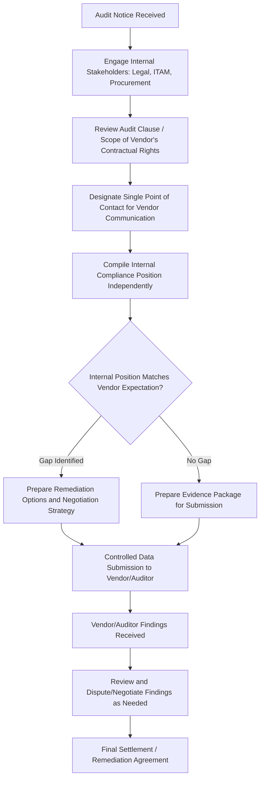
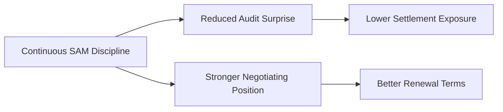
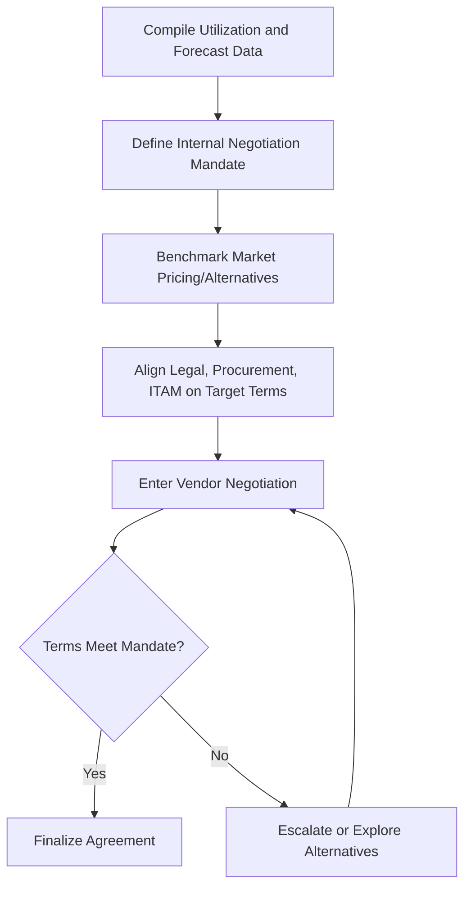

## Preparing for Software Audits and Vendor Negotiation

### Overview

Preparing for software audits and vendor negotiation is the discipline of readying an organization to respond effectively to vendor-initiated license compliance verification, and of leveraging accurate license position data as negotiating strength during contract renewals and new purchases. These two activities are closely linked: an organization with strong continuous compliance data is simultaneously well-defended against a punitive audit outcome and well-positioned to negotiate favorable terms, since both depend on the same underlying asset — accurate, defensible, real-time knowledge of the organization's true license position.

**Key Points**

- Software audits are typically initiated under contractual audit-clause rights held by the vendor or its representative
- Audit preparation should be continuous (built into standing SAM practice), not a reactive scramble triggered by an audit notice
- Vendor negotiation leverage comes primarily from accurate usage data, competitive alternatives, and clear internal alignment on requirements
- A formal, controlled audit response process protects the organization from both compliance exposure and process-related missteps that can worsen audit outcomes

---

### The Software Audit Landscape

#### Why Vendors Audit

- Contractual audit-clause enforcement (most enterprise software agreements include an audit rights clause)
- Revenue recovery, particularly as vendors transition from perpetual to subscription models and seek to capture previously unbilled usage
- Detection of unauthorized deployment growth following mergers, acquisitions, or organic expansion
- Industry-wide compliance sweeps targeting specific product categories or license metrics known to be commonly misapplied

#### Types of Audit-Related Engagement

| Type | Description |
| --- | --- |
| Formal contractual audit | Vendor exercises explicit audit-clause rights, often via a third-party audit firm |
| Software Asset Management (SAM) review / "soft audit" | Vendor-initiated engagement framed as advisory/collaborative rather than contractual, but with similar underlying compliance-verification purpose |
| Self-assessment / true-up | Contractually scheduled self-reporting (see License Optimization and True-Up Processes) rather than a vendor-initiated audit |
| Publisher compliance program | Ongoing vendor programs (sometimes tied to support renewal) requiring periodic compliance attestation |

[Inference] "Soft audits" are widely discussed in SAM practitioner literature as functioning similarly to formal audits in practice despite different framing and often narrower contractual grounding, though the specific negotiating posture and legal obligations attached to a soft audit versus a formal audit-clause audit can differ meaningfully and should be assessed with legal input on a case-by-case basis.

---

### The Audit Response Process

#### Step 1: Immediate Response to Audit Notice

- Do not respond substantively to the vendor before internal legal and ITAM review of the specific audit-clause language governing scope, notice period, and data-sharing obligations
- Designate a single point of contact to control all vendor communication, preventing inconsistent or premature statements from multiple internal parties
- Establish an internal cross-functional response team (ITAM, Legal, Procurement, IT Operations)

#### Step 2: Independent Compliance Position Compilation

- Compile the organization's own license position using internal SAM data **before** relying on vendor-supplied discovery tools or vendor-proposed methodologies
- Reconcile internal discovery/deployment data against internal entitlement records independently of the audit process
- Identify discrepancies and their root causes proactively, rather than being surprised by vendor findings

#### Step 3: Controlled Data Submission

- Provide only the specific data the audit clause contractually requires — not broader access than the agreement stipulates
- Where vendor-provided discovery/scanning tools are proposed, review their scope and methodology before deployment, since these tools may capture more than the audit's contractual scope
- Maintain a complete record of everything submitted, for internal consistency checking against later findings

#### Step 4: Findings Review and Negotiation

- Scrutinize vendor findings methodology — audits sometimes apply metric interpretations or core-factor calculations more aggressively than the license agreement supports
- Distinguish genuine compliance gaps from methodology disputes, and challenge the latter with documented contractual interpretation
- Negotiate settlement terms holistically — an audit finding is frequently an opportunity to renegotiate broader commercial terms (future purchase commitments, credits) rather than a simple penalty payment

---

### Building Continuous Audit Readiness

Rather than treating audit response as a standalone crisis process, mature organizations embed the same disciplines into standing SAM operations:

| Standing Practice | Audit Readiness Benefit |
| --- | --- |
| Continuous entitlement/deployment reconciliation | Compliance position is always known, not compiled reactively under time pressure |
| Documented use-rights interpretation per major vendor | Reduces vulnerability to aggressive vendor reinterpretation of ambiguous terms during audit |
| Retained proof-of-entitlement documentation | Prevents disputes over ownership defaulting in the vendor's favor due to missing records |
| Regular internal self-audits | Surfaces and corrects compliance gaps before a vendor-initiated audit does, often at lower cost |
| Change management integration | Ensures infrastructure changes (virtualization, core count changes, cloud migration) trigger license impact review |

---

### Vendor Negotiation Fundamentals

#### Sources of Negotiating Leverage

- **Accurate utilization data**: Demonstrable, well-documented usage patterns prevent the vendor from anchoring negotiations on inflated assumed usage
- **Competitive alternatives**: A credible, evaluated alternative product strengthens negotiating position even if the organization does not intend to switch
- **Consolidated timing**: Aligning multiple contract renewals or negotiating as part of a broader relationship review, rather than negotiating each product in isolation
- **Multi-year commitment flexibility**: Willingness to commit to longer terms in exchange for pricing or rights concessions, where genuinely aligned with technology roadmap
- **Clear internal requirements**: Entering negotiation with the business's actual (not vendor-assumed) future need clearly quantified, preventing over-purchase driven by vendor upsell framing

#### Negotiation Preparation Checklist

- Compile current utilization trends and forward demand forecast before entering negotiation
- Identify all relevant use rights sought (virtualization, DR, downgrade rights) as explicit negotiation items, not assumptions
- Benchmark pricing against market alternatives and, where available, peer organization data
- Define an internal negotiation mandate (target terms, walk-away position) agreed across ITAM, Procurement, and Finance before vendor engagement begins
- Time negotiations to avoid vendor fiscal quarter/year-end pressure tactics working against the organization (vendors are often more flexible near their own period-end)

---

### Illustration: Audit Response Governance Flow (svg_diagram)

<svg xmlns="http://www.w3.org/2000/svg" viewBox="0 0 720 300">
\<style\>
.top { fill: #2c3e50; }
.title { font-family: Arial, sans-serif; font-size: 15px; fill: #ffffff; text-anchor: middle; font-weight: bold; }
.box { fill: #eef2f5; stroke: #2c3e50; stroke-width: 1.5; }
.gate { fill: #5b7a99; stroke: #2c3e50; stroke-width: 1.5; }
.label { font-family: Arial, sans-serif; font-size: 11px; fill: #1a1a1a; text-anchor: middle; }
.glabel { font-family: Arial, sans-serif; font-size: 12px; fill: #ffffff; text-anchor: middle; font-weight: bold; }
.arrow { stroke: #2c3e50; stroke-width: 1.5; marker-end: url(#arr8); fill: none; }
\</style\>
<rect x="10" y="10" width="700" height="30" class="top" rx="4" />
<text x="360" y="30" class="title">Single Point of Contact Model (svg_diagram)</text>
<rect x="290" y="60" width="140" height="45" class="gate" rx="4" />
<text x="360" y="87" class="glabel">Vendor / Auditor</text>
<line x1="360" y1="105" x2="360" y2="140" class="arrow" />
<rect x="270" y="140" width="180" height="45" class="gate" rx="4" />
<text x="360" y="167" class="glabel">Single Point of Contact</text>
<line x1="290" y1="185" x2="130" y2="225" class="arrow" />
<line x1="360" y1="185" x2="360" y2="225" class="arrow" />
<line x1="430" y1="185" x2="590" y2="225" class="arrow" />
<rect x="30" y="225" width="200" height="45" class="box" />
<text x="130" y="252" class="label">Legal: Contract Interpretation</text>
<rect x="260" y="225" width="200" height="45" class="box" />
<text x="360" y="252" class="label">ITAM: Compliance Data</text>
<rect x="490" y="225" width="200" height="45" class="box" />
<text x="590" y="252" class="label">Procurement: Commercial Terms</text>
</svg>

---

### Practical Example

**Scenario**: A logistics company receives a formal audit notice from a database vendor citing contractual audit-clause rights, following a recent server virtualization initiative.

**Response**:

1. **Immediate action**: Legal reviews the audit clause and confirms a 30-day notice period and defined scope limited to the specific product family named; a single ITAM lead is designated as sole vendor contact
2. **Internal compilation**: ITAM independently reconciles deployment records against entitlement records before any vendor engagement, discovering that the recent virtualization project increased effective core-count exposure under the vendor's per-core metric beyond what the team had initially modeled, due to a core-factor table nuance for the specific hypervisor used
3. **Gap identification and strategy**: Legal and ITAM confirm the gap is genuine (not a methodology dispute) and quantify the true-up cost; Procurement is looped in to prepare a negotiation strategy treating the finding as an opportunity to renegotiate the broader database licensing agreement rather than simply paying a penalty rate
4. **Controlled submission**: Only the data the audit clause specifically requires is submitted, via the single point of contact, with an internal record retained of every item shared
5. **Findings and negotiation**: The vendor's initial findings apply a less favorable core-factor interpretation than the company's own reading of the contract; this specific point is disputed with documented contractual language, narrowing the disputed gap
6. **Settlement**: The final agreement combines a reduced true-up payment for the confirmed gap with a broader multi-year renewal that secures more favorable per-core pricing and explicit virtualization use-rights language for the specific hypervisor platform — directly informed by the compliance gap the audit surfaced

---

### Common Pitfalls

- **Unstructured, multi-party vendor communication**: Allowing multiple internal stakeholders to communicate independently with the vendor/auditor, creating inconsistent statements that can worsen the organization's position
- **Relying solely on vendor-supplied discovery tools**: Accepting vendor or auditor findings without independent internal verification, ceding the ability to challenge methodology
- **Treating audit response as purely defensive**: Missing the opportunity to use audit findings and demonstrated engagement as leverage for improved future commercial terms
- **Negotiating without utilization data**: Entering renewal negotiations without a clear, defensible picture of actual usage, ceding leverage to vendor-proposed assumptions
- **Ignoring contract audit-clause scope limits**: Providing broader data access than contractually required, expanding audit exposure unnecessarily
- **Reactive-only preparation**: Building audit readiness only after a notice arrives, rather than maintaining continuous compliance discipline that shortens and strengthens the eventual response

---

### Governance and Documentation Requirements

Robust audit and negotiation readiness requires documented:

- An audit response playbook defining roles, single point of contact designation, and escalation paths
- Retained proof-of-entitlement and contract interpretation records for major vendors
- Historical record of prior audit findings, disputes, and settlement terms per vendor
- A standing internal compliance self-assessment cadence with tracked remediation
- Negotiation mandate templates capturing target terms and walk-away positions for major renewals

**Next Steps**

- Study License Optimization and True-Up Processes as the continuous discipline underpinning audit readiness
- Explore Software Entitlement Models and License Types for the metric-level detail most commonly disputed in audits
- Examine Vendor Contract Management and Enterprise Agreement structuring
- Review ITAM Organizational Placement and Stakeholder Relationships for cross-functional audit response coordination
- Study Legal Considerations in Software Licensing Agreements
- Explore Internal Audit Programs as a complementary, organization-initiated compliance assurance mechanism