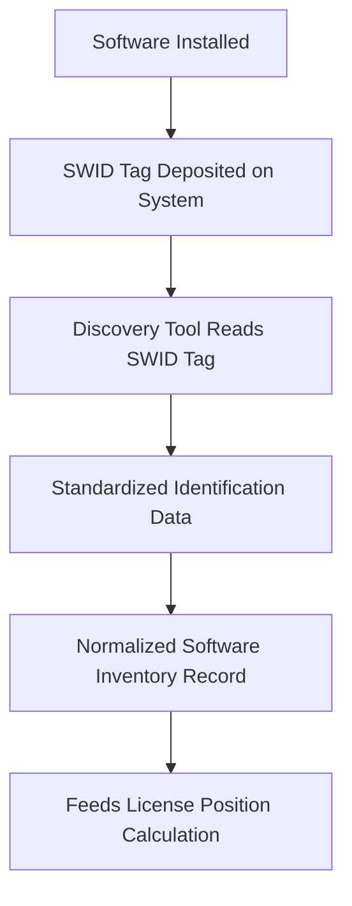
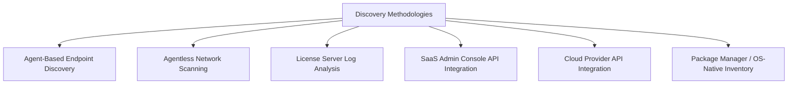
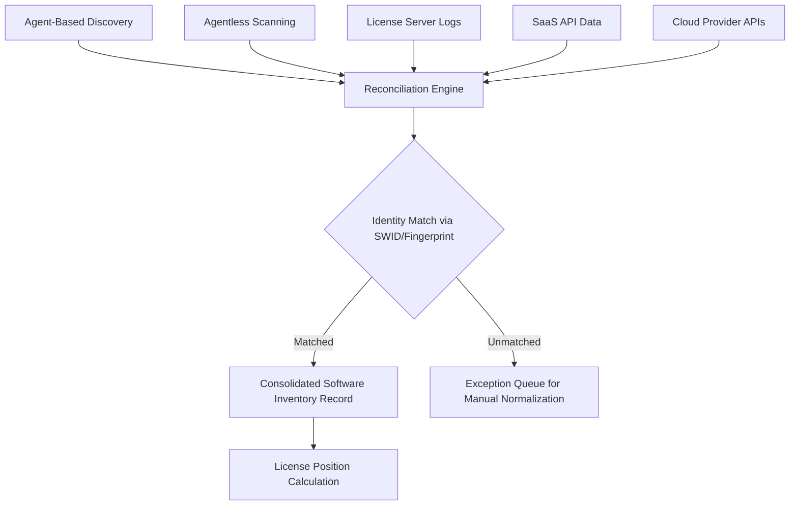

## Software Identification Tags and License Metering Tools

### Overview

Software identification tags and license metering tools are the technical instruments that make software asset management measurable and automatable. Where the ISO/IEC 19770 Standard Family establishes the normative data structures, and entitlement models define the legal rights being tracked, this topic addresses the practical machinery — the tags embedded in or alongside software installations, and the tools that discover, read, and reconcile that data — which together produce the deployment-side evidence needed to calculate an accurate license position.

**Key Points**

- Software identification (SWID) tags provide standardized, authoritative "what is this" metadata that reduces ambiguity from free-text naming
- License metering tools capture "how is it being used" data, ranging from simple installation presence to detailed feature-level usage telemetry
- Discovery methodologies vary by asset type (endpoint agents, agentless network scanning, license server logs, SaaS API integration) and no single method covers the full estate
- Tag- and metering-tool data quality directly determines the reliability of license position calculations and audit defense

---

### Software Identification (SWID) Tags

#### What a SWID Tag Is

A SWID tag, as formalized in ISO/IEC 19770-2, is a standardized XML metadata file, typically installed alongside the software it describes, containing structured identification information: publisher, product name, version, edition, and unique identifiers. SWID tags exist specifically to eliminate the ambiguity created when the same software product appears under inconsistent names across different discovery tools, operating systems, or vendor documentation.

#### SWID Tag Structure (Conceptual)

| Field | Purpose |
| --- | --- |
| Software Name | Standardized product name |
| Software Version | Specific version identifier |
| Software Creator/Publisher | Authoritative vendor identity |
| Tag ID | Globally unique identifier for this specific tag instance |
| Entity | Roles associated with the tag (publisher, distributor, licensor) |
| Payload/Evidence | Optional file-level details supporting installation verification |

#### Value Proposition

- **Normalization**: Prevents the same product from appearing as multiple distinct inventory entries due to naming inconsistency across discovery sources
- **Security benefit**: Accurate identification data improves vulnerability management by ensuring patch/CVE data is matched against confirmed product/version identity
- **Automation enabler**: Machine-readable, standardized data supports automated reconciliation rather than manual normalization effort

#### Practical Adoption Reality

[Inference] SWID tag adoption among software publishers has historically been inconsistent — some major vendors embed compliant tags by default, while many others (particularly smaller ISVs and legacy software) do not, meaning organizations typically cannot rely on SWID tag presence as a universal discovery mechanism and must supplement with other identification methods (file fingerprinting, installer metadata, package manager records) for products lacking tags.

---

### License Metering: Concepts and Methods

#### What License Metering Measures

Metering goes beyond simple installation presence (a binary "is it installed") to capture actual usage intensity, which is essential for license metrics that are usage-dependent (concurrent-user, consumption-based) rather than simple deployment-count metrics.

| Metering Level | What It Captures | Applicable License Metrics |
| --- | --- | --- |
| Installation presence | Software is installed on a device | Per-device, per-instance |
| Launch/session tracking | Software was opened/run, and for how long | Named-user activity validation |
| Concurrent session tracking | Number of simultaneous active sessions at any given time | Concurrent-user metrics |
| Feature-level usage | Specific features or modules invoked within an application | Tiered/edition licensing, module-based entitlements |
| Consumption/API telemetry | Volume of resource consumption (API calls, compute, storage) | Consumption-based licensing |

---

### Discovery and Metering Methodologies

#### Agent-Based Endpoint Discovery

- A software agent installed on the endpoint reports installed software, versions, and (where instrumented) usage activity
- Provides the most detailed data, including offline devices at their next check-in
- Requires agent deployment and maintenance across the managed fleet; typically ineffective for BYOD or unmanaged devices

#### Agentless Network Scanning

- Scans network-connected devices without requiring pre-installed software, using protocols such as WMI, SSH, or SNMP
- Lower deployment overhead but generally provides less granular usage data than agent-based methods, and may miss offline or disconnected devices at scan time

#### License Server Log Analysis

- For concurrent-user licensed products (particularly common in engineering, CAD, and scientific software), a license server governs checkout/check-in of license tokens
- Log analysis of the license server itself is often the only reliable source for peak concurrent usage data — this data cannot typically be derived from endpoint discovery alone

#### SaaS Admin Console API Integration

- For SaaS products, usage and seat-assignment data resides in the vendor's own administration platform, accessed via API integration rather than traditional endpoint discovery
- Captures login frequency, last-active timestamps, and often feature-usage analytics directly from the vendor's own telemetry

#### Cloud Provider API Integration

- Cloud resource inventory and consumption metering is obtained via the cloud provider's management/billing APIs (see also Defining IT Assets across Hardware, Software, Cloud, and Data)
- Essential for consumption-based licensing reconciliation, given the ephemeral and elastic nature of cloud resources

#### Package Manager / OS-Native Inventory

- Operating system package managers (e.g., Linux package managers) and OS-native inventory APIs provide installation data for open-source and OS-bundled components, important for both SAM and vulnerability management given OSS component tracking needs

---

### Reconciling Multi-Source Discovery Data

Because no single discovery method covers the full estate, license metering architectures typically federate multiple sources and reconcile them against a common identification standard (ideally SWID-tag-normalized data where available).

---

### Illustration: Metering Data Sources by License Metric (svg_diagram)

<svg xmlns="http://www.w3.org/2000/svg" viewBox="0 0 720 300">
\<style\>
.top { fill: #2c3e50; }
.title { font-family: Arial, sans-serif; font-size: 15px; fill: #ffffff; text-anchor: middle; font-weight: bold; }
.metric { fill: #5b7a99; stroke: #2c3e50; stroke-width: 1.5; }
.source { fill: #eef2f5; stroke: #2c3e50; stroke-width: 1.5; }
.mlabel { font-family: Arial, sans-serif; font-size: 11px; fill: #ffffff; text-anchor: middle; font-weight: bold; }
.slabel { font-family: Arial, sans-serif; font-size: 10.5px; fill: #1a1a1a; text-anchor: middle; }
.arrow { stroke: #2c3e50; stroke-width: 1.3; marker-end: url(#arr9); fill: none; }
\</style\>
<rect x="10" y="10" width="700" height="30" class="top" rx="4" />
<text x="360" y="30" class="title">Metric-to-Discovery-Source Mapping (svg_diagram)</text>
<rect x="30" y="60" width="150" height="40" class="metric" rx="4" />
<text x="105" y="84" class="mlabel">Per-Device / Per-Instance</text>
<line x1="105" y1="100" x2="105" y2="130" class="arrow" />
<rect x="30" y="130" width="150" height="40" class="source" />
<text x="105" y="154" class="slabel">Agent / Agentless Discovery</text>
<rect x="200" y="60" width="150" height="40" class="metric" rx="4" />
<text x="275" y="84" class="mlabel">Concurrent-User</text>
<line x1="275" y1="100" x2="275" y2="130" class="arrow" />
<rect x="200" y="130" width="150" height="40" class="source" />
<text x="275" y="154" class="slabel">License Server Logs</text>
<rect x="370" y="60" width="150" height="40" class="metric" rx="4" />
<text x="445" y="84" class="mlabel">SaaS Named-User</text>
<line x1="445" y1="100" x2="445" y2="130" class="arrow" />
<rect x="370" y="130" width="150" height="40" class="source" />
<text x="445" y="154" class="slabel">SaaS Admin API</text>
<rect x="540" y="60" width="150" height="40" class="metric" rx="4" />
<text x="615" y="84" class="mlabel">Consumption-Based</text>
<line x1="615" y1="100" x2="615" y2="130" class="arrow" />
<rect x="540" y="130" width="150" height="40" class="source" />
<text x="615" y="154" class="slabel">Cloud Provider API</text>
<rect x="30" y="200" width="660" height="50" class="source" />
<text x="360" y="220" class="slabel">All sources normalized against SWID-tag identification data where available,</text>
<text x="360" y="235" class="slabel">or supplementary fingerprinting methods where tags are absent</text>
</svg>

---

### Practical Example

**Scenario**: An organization is implementing a discovery and metering architecture to support license position calculation across a mixed estate of on-premises engineering software, SaaS productivity tools, and cloud infrastructure.

**Architecture decisions**:

1. **Engineering CAD software (concurrent-user metric)**: License server log analysis is configured as the authoritative usage source, since endpoint discovery alone cannot capture peak simultaneous checkout data; the license server logs are ingested into the SAM tool on a daily schedule
2. **Productivity SaaS suite (named-user metric)**: API integration with the vendor's admin console pulls login activity and seat assignment data nightly, feeding the shelfware/utilization analysis described in License Optimization and True-Up Processes
3. **On-premises legacy application (no SWID tag support)**: Since the vendor does not ship SWID tags, the discovery tool applies file-fingerprinting (executable hash and version resource matching) as a supplementary identification method, with manual verification of a sample set to confirm fingerprint accuracy
4. **Cloud infrastructure database service (consumption-based)**: Cloud provider billing API integration captures compute-hour and storage consumption, feeding cost management and license-adjacent consumption tracking
5. **Reconciliation**: All four sources feed a central reconciliation engine; the CAD software and productivity suite data merge cleanly using product identifiers, while the fingerprinted legacy application requires ongoing manual review of unmatched records in the exception queue

**Outcome**: The resulting consolidated inventory supports differentiated license position calculations appropriate to each product's actual metric, rather than applying a uniform "installed count" assumption that would misrepresent compliance for the concurrent-user and consumption-based products.

---

### Common Pitfalls

- **Assuming installation count equals license consumption**: Applying simple installation-presence discovery to products licensed under concurrent-user or consumption-based metrics, producing materially inaccurate compliance calculations
- **Over-reliance on a single discovery method**: Deploying only agent-based or only agentless discovery, leaving blind spots (BYOD devices, disconnected systems, SaaS/cloud resources) that the chosen method structurally cannot see
- **Ignoring SWID tag absence**: Assuming all software carries standardized identification tags and failing to establish a fallback normalization method for the (often substantial) portion of the estate that does not
- **Unvalidated fingerprinting**: Deploying custom identification heuristics (file hashing, registry key matching) without periodic validation against known-good samples, allowing silent drift in accuracy over time
- **Stale license server log retention**: Failing to retain sufficient historical license server log data to demonstrate compliant peak-usage patterns over an audit-relevant lookback period
- **Data silos between metering sources**: Operating discovery, license server, SaaS API, and cloud API data feeds as disconnected systems rather than reconciling them centrally, preventing a unified license position view

---

### Governance and Documentation Requirements

Effective identification and metering governance requires documented:

- The discovery/metering methodology applied per product category, matched explicitly to its license metric
- Data retention policy for license server logs and usage telemetry sufficient to support audit lookback periods
- Validation records for any supplementary/fingerprinting identification methods used in place of SWID tags
- Reconciliation exception-queue handling procedures and resolution tracking

**Next Steps**

- Study the ISO/IEC 19770 Standard Family in depth, particularly Parts 2 and 4
- Explore Configuration Management Databases and IT Asset Data Models for the reconciliation architecture underpinning discovery data consolidation
- Examine Software Entitlement Models and License Types for the metric definitions that determine appropriate metering methodology
- Review License Optimization and True-Up Processes for how metering data feeds ongoing compliance management
- Study Cloud Asset Management and FinOps practices for consumption-based metering architectures
- Explore Vulnerability Management integration with software identification data