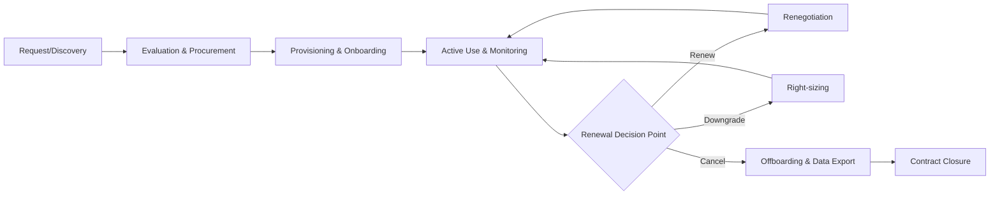
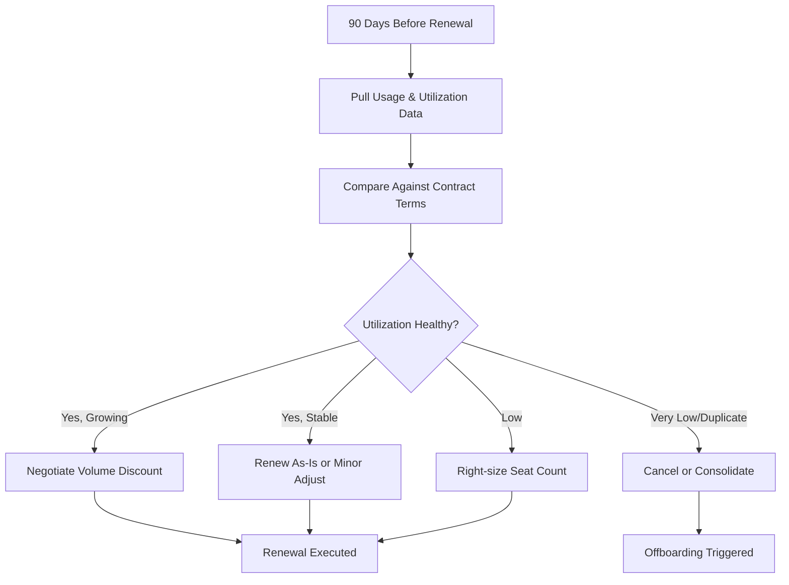
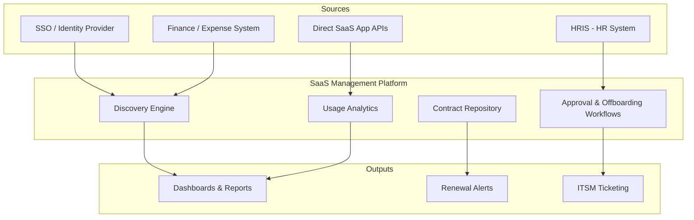

## SaaS and Subscription Management

### Overview

SaaS and Subscription Management is the discipline of governing cloud-delivered software throughout its subscription lifecycle — from discovery and procurement through renewal, optimization, and offboarding. Unlike perpetual on-premises licenses, SaaS assets are consumption-based, decentralized in procurement (often bought by individual departments via credit card), and continuously billed, which introduces distinct risks: shadow IT, license sprawl, auto-renewal traps, and underutilized seats.

### Core Concepts

#### SaaS Management Platform (SMP)

A SaaS Management Platform is a dedicated tool category that discovers, tracks, and optimizes SaaS applications across an organization. Core capabilities include:

- **Discovery**: Identifying all SaaS applications in use, including unsanctioned (shadow IT) tools
- **Usage analytics**: Tracking login frequency, feature adoption, and seat utilization
- **Spend management**: Aggregating subscription costs across departments and cost centers
- **Contract and renewal tracking**: Centralizing terms, auto-renewal dates, and notice periods
- **Access governance**: Managing who has licenses and enforcing least-privilege access
- **Offboarding automation**: Revoking access when employees leave or change roles

#### Discovery Methods

| Method | Mechanism | Strengths | Limitations |
| --- | --- | --- | --- |
| SSO/IdP log analysis | Reads login events from Okta, Azure AD, Google Workspace | High-fidelity, low-friction | Misses apps not behind SSO |
| Expense/finance integration | Parses credit card and AP transactions | Captures non-SSO purchases | Noisy, requires vendor-name normalization |
| Browser extension | Monitors web app usage on endpoints | Captures real-time shadow IT | Requires deployment, privacy concerns |
| Direct API integration | Connects to app admin APIs (e.g., Slack, Salesforce) | Deep usage/seat-level data | Limited to supported apps |
| Network/CASB logs | Inspects traffic via proxy or Cloud Access Security Broker | Comprehensive, security-grade | Complex to deploy, encrypted traffic limits |

### The SaaS Subscription Lifecycle

#### Stage Details

**Request/Discovery**: A need is identified, either through formal intake (ITSM request) or organic adoption by an end user or team, later surfaced through discovery tooling.

**Evaluation & Procurement**: Security review (SOC 2, data residency), legal review of Terms of Service/DPA, and budget approval. Increasingly governed by a formal **SaaS intake workflow** to prevent shadow IT at the source.

**Provisioning & Onboarding**: License assignment, SSO/SCIM integration, and role-based access configuration.

**Active Use & Monitoring**: Continuous tracking of license utilization against entitlements — this is where most cost leakage is caught or missed.

**Renewal Decision Point**: Triggered ahead of contract end date or auto-renewal notice deadline, using usage data to inform renew/renegotiate/cancel decisions.

**Offboarding**: License reclamation, data export/retention per compliance requirements, and formal contract termination.

### License and Pricing Models

SaaS subscriptions commonly follow one or a hybrid of these models:

- **Per-seat/per-user**: Fixed cost per named or active user (e.g., most productivity suites)
- **Tiered**: Feature bundles at increasing price points (Basic/Pro/Enterprise)
- **Usage-based/consumption**: Billed by API calls, storage, compute, or transactions
- **Freemium with paid upgrade**: Free tier with usage caps, paid unlock of features/limits
- **Flat-rate/site license**: Fixed fee regardless of user count, common in enterprise agreements

**Key Points**

- Named-user licenses are billed whether or not the person logs in — the primary source of waste
- Active-user (or "monthly active user") licensing reduces waste risk but complicates budgeting since costs fluctuate
- Multi-year contracts often lock in discounts (10-30%) but reduce flexibility to right-size

### License Utilization Metrics

Effective subscription management depends on quantifying usage against spend.

$$\text{Utilization Rate} = \frac{\text{Active Licenses}}{\text{Total Purchased Licenses}} \times 100$$

$$\text{Cost per Active User} = \frac{\text{Total Annual Subscription Cost}}{\text{Number of Active Users}}$$

An "active" user is typically defined by a login or feature-use event within a rolling window (commonly 30, 60, or 90 days). This threshold should be documented per application, since inactivity thresholds vary by tool cadence (a design tool used monthly may still be "active" even without daily logins).

**Example**

A company holds 500 named-user licenses for a project management SaaS tool at $15/user/month.

- Login logs show 340 users active in the last 60 days
- Utilization Rate = (340 / 500) × 100 = 68%
- Wasted spend = 160 unused licenses × $15 = $2,400/month = $28,800/year

This is the type of finding that drives a right-sizing action at renewal.

### Shadow IT and Discovery Risk

Shadow IT refers to SaaS applications procured and used without IT/procurement visibility or approval.

**Key Points**

- Estimates across industry reports commonly suggest a substantial share of SaaS spend is shadow IT [Unverified — figures vary significantly by source, industry, and measurement methodology and should be validated against current benchmark studies before being cited as fact]
- Risks include: unvetted data processing agreements, duplicate tool spend, inconsistent security posture, and lack of offboarding when the procuring employee departs
- Discovery via expense reports and SSO logs is the most common first step in surfacing shadow IT

### Renewal Management

Renewal management is often the highest-leverage activity in SaaS management because it is the recurring checkpoint where cost, utilization, and vendor relationship converge.

#### Renewal Workflow

**Key Points**

- Auto-renewal clauses typically require cancellation notice 30-90 days before term end; missing this window is a common source of unplanned spend
- Tracking a centralized renewal calendar with notice-period alerts is a core SMP function
- Benchmarking against comparable vendors strengthens negotiating position at renewal

### Access Governance and Offboarding

**Key Points**

- SCIM (System for Cross-domain Identity Management) provisioning automates account creation/deprovisioning tied to HR system events (joiner/mover/leaver)
- Without automated deprovisioning, departed-employee licenses persist as both a cost leak and a security risk (orphaned accounts with standing access)
- Role changes ("movers") require license re-evaluation, not just joiners/leavers — often overlooked in manual processes

### Integration Architecture

A typical SaaS Management Platform integrates with several system categories:

### Compliance and Data Considerations

- **Data Processing Agreements (DPA)**: Required when SaaS vendors process personal data, particularly under GDPR and similar regulations
- **Data residency**: Some regulated industries require data to remain within specific jurisdictions; SaaS vendors must be vetted for hosting location
- **Right to audit**: Enterprise contracts may include audit clauses allowing verification of the vendor's security controls (SOC 2 Type II reports are the common substitute for direct audits)
- **Offboarding data retention**: Contracts should specify data export format and retention/deletion timelines post-cancellation

[Inference] Regulatory obligations around SaaS data handling vary meaningfully by jurisdiction and industry vertical, so specific compliance requirements should be validated against current legal guidance rather than treated as universal.

### Common Pitfalls

- **License hoarding**: Departments over-provisioning "just in case," inflating utilization denominators
- **Duplicate tools**: Multiple teams independently subscribing to functionally overlapping SaaS products
- **Silent auto-renewals**: Missed cancellation windows locking in another contract term
- **Orphaned licenses**: Accounts for departed employees left active due to manual, inconsistent offboarding
- **Tier mismatch**: Paying for enterprise-tier features that are never used, when a lower tier would suffice

### Metrics Dashboard Example (Conceptual)

| Metric | Formula | Purpose |
| --- | --- | --- |
| Utilization Rate | Active / Purchased × 100 | Identify seat waste |
| Cost per Active User | Total Cost / Active Users | True effective cost |
| Renewal Risk Score | Days to renewal × (1 − utilization) | Prioritize review queue |
| Shadow IT Ratio | Unsanctioned Spend / Total SaaS Spend | Governance maturity indicator |
| Duplicate App Count | Count of apps per category with >1 vendor | Consolidation opportunity |

**Next Steps**

- License Reharvesting and Automated Deprovisioning Workflows
- SaaS Spend Benchmarking and Vendor Negotiation Tactics
- SCIM and SSO-Based Provisioning Architecture
- Software Asset Management (SAM) Tool Selection Criteria
- IT Asset Management (ITAM) vs. SaaS Management Platform Overlap
- Contract Lifecycle Management (CLM) Integration
- FinOps Practices for Cloud and SaaS Cost Optimization
- Vendor Risk Management and Third-Party Security Assessments