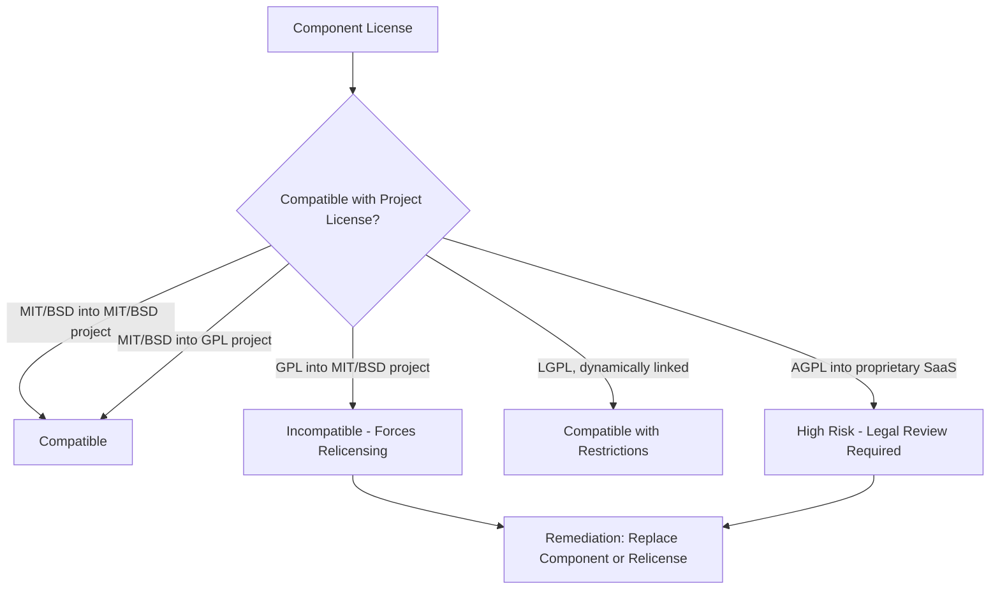
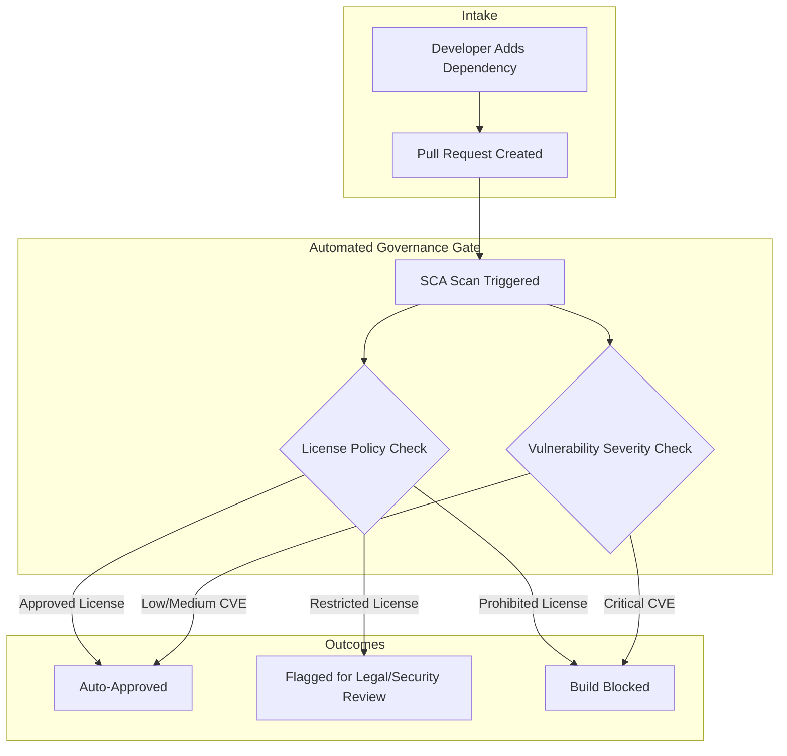

## Open Source Software Governance and License Risk


### Overview

Open Source Software (OSS) Governance is the set of policies, processes, and tooling an organization uses to track, vet, and manage open source components embedded in its software supply chain. Because modern applications commonly derive a large proportion of their codebase from open source dependencies (direct and transitive), OSS governance sits at the intersection of legal compliance (license obligations), security (vulnerability exposure), and asset management (inventory of what is actually running in production).

### Why OSS Governance Matters

- **License compliance risk**: Using OSS incorrectly (e.g., embedding GPL code in proprietary distributed software) can create obligations to release source code or expose the organization to litigation
- **Security risk**: Unpatched or unmonitored OSS components are a primary vector for supply chain attacks
- **Operational risk**: Unmaintained or abandoned OSS projects ("dead" dependencies) create long-term maintenance liability
- **Attribution risk**: Many licenses require preserving copyright notices and license text in distributed products; failure is a compliance breach even without malicious intent

### Core License Categories

Open source licenses fall into broad families based on the obligations they impose, primarily around derivative works and redistribution.

| Category | Examples | Core Obligation | Redistribution Risk |
| --- | --- | --- | --- |
| Permissive | MIT, Apache 2.0, BSD | Preserve copyright/license notice | Low — can combine with proprietary code freely |
| Weak Copyleft | LGPL, MPL 2.0 | Modifications to the library itself must be shared | Moderate — depends on linking/modification method |
| Strong Copyleft | GPL v2/v3 | Derivative works must be released under the same license | High — can force open-sourcing of proprietary code |
| Network Copyleft | AGPL v3 | Same as GPL, extended to network-accessed (SaaS) use | High — triggered even without distributing binaries |
| Public Domain / Unlicense | CC0, Unlicense | No restrictions | Minimal |
| Proprietary/Source-Available | BSL, SSPL, Elastic License | Usage restrictions (e.g., no competing SaaS offering) | Case-specific — not OSI-approved "open source" |

**Key Points**

- The distinction between "open source" (OSI-approved) and "source-available" (e.g., SSPL, BSL) matters legally — source-available licenses often restrict commercial use in ways OSS licenses do not
- Copyleft "triggering" depends on how code is linked (static linking, dynamic linking, or mere aggregation), and this determination is fact-specific
- AGPL's network-use clause is particularly relevant for SaaS companies, since it can apply even when no software is physically distributed to users

[Inference] The precise legal boundary of when a copyleft obligation is triggered (e.g., dynamic linking vs. static linking under LGPL) is an area of ongoing legal interpretation and varies by jurisdiction and specific license version, so definitive compliance determinations should involve legal counsel rather than automated tooling alone.

### License Compatibility

Combining components under different licenses in a single distributed product requires checking compatibility — not all licenses can be legally combined.



**Example**

A company builds a proprietary SaaS product and considers using an AGPL-licensed library for PDF generation.

- Because the product is accessed over a network (SaaS), AGPL's network-use clause may require the company to release the *complete corresponding source code* of the service to users, not just the library
- Remediation options: (1) find a permissively-licensed alternative, (2) purchase a commercial license from the AGPL project (many dual-license this way), or (3) isolate the AGPL component behind a network boundary and treat it as a separate service — subject to legal review of whether this satisfies the license

### Software Composition Analysis (SCA)

SCA tools automate the discovery and analysis of OSS components across a codebase.

#### Core SCA Capabilities

- **Dependency scanning**: Parses manifest files (package.json, pom.xml, requirements.txt, go.mod) and lockfiles to build a dependency tree, including transitive dependencies
- **License identification**: Matches detected license text/SPDX identifiers against a known license database
- **Vulnerability matching**: Cross-references components against vulnerability databases (NVD, OSV, GitHub Advisory Database)
- **Policy enforcement**: Blocks builds or flags PRs when a component violates a defined license policy (e.g., "no GPL in distributed products")
- **SBOM generation**: Produces a Software Bill of Materials in standard formats (SPDX, CycloneDX)

#### Common SCA Tooling Landscape

| Tool Category | Examples | Integration Point |
| --- | --- | --- |
| Commercial SCA platforms | Black Duck, Snyk, FOSSA, WhiteSource/Mend | CI/CD pipeline, IDE plugins |
| Native ecosystem tools | `npm audit`, `pip-audit`, `cargo audit` | Package manager CLI |
| Open source scanners | OWASP Dependency-Check, ScanCode Toolkit, Trivy | CI/CD, container scanning |
| SBOM generators | Syft, CycloneDX CLI, SPDX tools | Build pipeline, release process |

### Software Bill of Materials (SBOM)

An SBOM is a formal, machine-readable inventory of all components (and their versions and licenses) in a software product — increasingly a regulatory and contractual requirement.

**Key Points**

- Two dominant standard formats: **SPDX** (ISO/IEC 5962 standard, broad industry adoption) and **CycloneDX** (OWASP-led, security-focused)
- U.S. Executive Order 14028 accelerated SBOM adoption requirements for software sold to federal agencies [Unverified — specific regulatory scope and enforcement timelines should be confirmed against current government guidance, as procurement requirements evolve]
- An SBOM typically includes: component name, version, supplier, license, and a unique identifier (e.g., PURL — Package URL)

#### Simplified SBOM Structure (SPDX-like, conceptual)



```
Component: lodash
Version: 4.17.21
License: MIT
PURL: pkg:npm/lodash@4.17.21
Relationship: DEPENDS_ON (direct)

Component: minimist
Version: 1.2.8
License: MIT
PURL: pkg:npm/minimist@1.2.8
Relationship: DEPENDS_ON (transitive, via lodash)
```

### OSS Governance Program Architecture



### Establishing a License Policy

A written OSS license policy typically classifies licenses into an approval tiering system:

| Tier | Typical Licenses | Action |
| --- | --- | --- |
| Allowed | MIT, BSD, Apache 2.0, ISC | Auto-approved, no review needed |
| Review Required | LGPL, MPL, EPL | Legal/architecture review before use |
| Restricted | GPL, AGPL | Requires exception approval, isolation strategy |
| Prohibited | Licenses with field-of-use restrictions incompatible with product | Blocked in CI |

**Key Points**

- Policies should be enforced as code (via SCA gates in CI/CD) rather than relying solely on developer awareness
- Exception workflows should be documented — outright blocking without an appeals path drives developers to bypass governance

### OSS Component Risk Scoring

Beyond license, mature programs score components on health and sustainability:

$$\text{Risk Score} = w_1 \cdot \text{License Risk} + w_2 \cdot \text{Vulnerability Exposure} + w_3 \cdot \text{Maintenance Activity} + w_4 \cdot \text{Popularity/Community Size}$$

**Key Points**

- Maintenance activity (commit frequency, issue response time, last release date) is a proxy for long-term supply chain risk from abandoned projects
- Frameworks like the **OpenSSF Scorecard** provide standardized automated scoring of OSS project security practices (branch protection, code review requirements, dependency pinning) [Note: specific scoring criteria and weights are maintained by OpenSSF and should be checked against current documentation, as scorecards evolve]

### Attribution and Notice Compliance

Most permissive licenses (MIT, BSD, Apache) require preserving copyright and license notices in distributed products. Non-compliance, though often unintentional, is a common audit finding.

**Example**

A mobile app ships with 200+ open source dependencies. Standard remediation is generating a consolidated "Open Source Notices" or "Third-Party Licenses" screen/file, auto-generated from the SBOM during the build process, listing each component's name, license, and copyright notice.

### Common Pitfalls

- **Transitive dependency blindness**: Direct dependencies are often reviewed; the hundreds of transitive dependencies pulled in indirectly frequently are not
- **License drift**: A dependency's license can change between versions (e.g., a project relicensing from open source to source-available, as has occurred in several notable ecosystem cases); pinned-version audits alone don't catch this on upgrade
- **Fork/copy-paste code**: Code copied directly into a codebase (rather than imported as a package) bypasses SCA tooling that scans manifest files
- **Container base image opacity**: OSS components baked into container base images are often missed by application-level SCA scans and require image-layer scanning
- **Treating SBOM generation as a one-time exercise**: Component inventories go stale quickly without continuous scanning integrated into CI/CD

### Vulnerability Management Integration

OSS governance overlaps heavily with vulnerability management, since most SCA tools perform both license and CVE detection simultaneously.

**Key Points**

- CVSS (Common Vulnerability Scoring System) severity is commonly used to gate builds, but context-aware exploitability (is the vulnerable code path actually reachable/called?) is increasingly used to reduce false-positive noise — a practice sometimes termed "reachability analysis"
- The OSV (Open Source Vulnerabilities) database provides a standardized, ecosystem-agnostic format for OSS vulnerability data, complementing the NVD

### Related Governance Frameworks

- **OpenChain (ISO/IEC 5230)**: An international standard for OSS license compliance programs, defining process requirements an organization's OSS management program should meet
- **OSPO (Open Source Program Office)**: A dedicated organizational function, common in larger enterprises, responsible for both consuming OSS responsibly and managing the organization's own outbound OSS contributions/releases

**Next Steps**

- Software Composition Analysis (SCA) Tool Implementation and CI/CD Integration
- SBOM Generation, Formats (SPDX vs. CycloneDX), and Regulatory Requirements
- License Compatibility Matrices and Legal Review Workflows
- Establishing an Open Source Program Office (OSPO)
- Container and Base Image Vulnerability Scanning
- Vulnerability Management and Patch Prioritization (CVSS, Reachability Analysis)
- OpenChain (ISO/IEC 5230) Compliance Program Design
- Dependency Update Automation (Dependabot, Renovate) and Policy-as-Code Gates