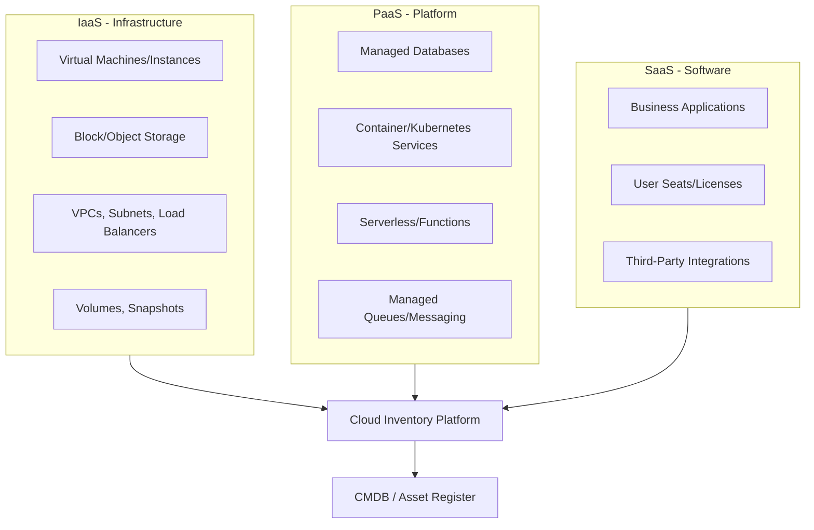
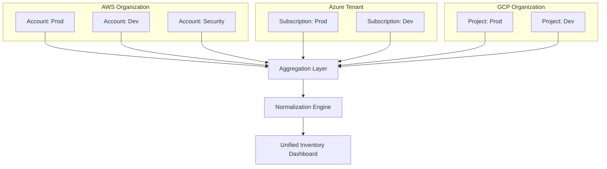
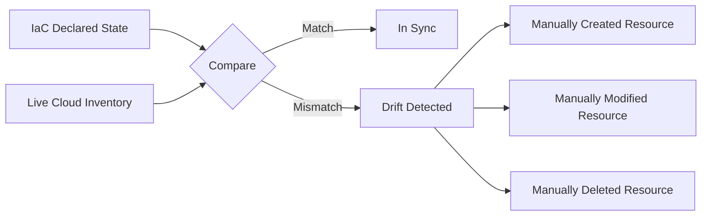

## Cloud Asset Inventory across IaaS, PaaS, and SaaS


### Overview

Cloud Asset Inventory is the practice of discovering, cataloging, and continuously tracking every resource an organization provisions or consumes across Infrastructure-as-a-Service, Platform-as-a-Service, and Software-as-a-Service layers. Unlike traditional on-premises IT asset management, cloud resources are ephemeral, elastic, and API-driven — instances spin up and down in minutes, autoscale, or are provisioned by infrastructure-as-code — which means static, periodic inventory methods fail. Effective cloud asset inventory requires continuous, API-based discovery integrated with tagging, ownership mapping, and cost/security context.

### The Three Service Layers and Their Asset Types



#### IaaS Asset Categories

| Asset Type | Examples | Discovery Source |
| --- | --- | --- |
| Compute | EC2 instances, Azure VMs, GCE instances | Cloud provider APIs |
| Storage | S3 buckets, Azure Blob, EBS volumes | Storage service APIs |
| Networking | VPCs, subnets, security groups, load balancers | Network config APIs |
| Identity | IAM roles, service accounts, policies | IAM APIs |

#### PaaS Asset Categories

| Asset Type | Examples | Discovery Source |
| --- | --- | --- |
| Managed databases | RDS, Azure SQL, Cloud SQL | Database service APIs |
| Container orchestration | EKS, AKS, GKE clusters and workloads | Kubernetes API, cloud APIs |
| Serverless compute | Lambda, Azure Functions, Cloud Functions | Function service APIs |
| Managed middleware | Managed Kafka, API Gateways, CDNs | Provider-specific APIs |

#### SaaS Asset Categories

| Asset Type | Examples | Discovery Source |
| --- | --- | --- |
| Business applications | Salesforce, Workday, Slack | SSO logs, direct app APIs |
| Licensed seats | Per-user subscriptions | Admin console APIs |
| Embedded integrations | OAuth-connected apps, API tokens | App marketplace/admin APIs |

### Discovery Methods

**Key Points**

- **Native cloud inventory APIs**: Every major provider exposes a resource inventory API — AWS Config/Resource Groups Tagging API, Azure Resource Graph, GCP Cloud Asset Inventory — these are the primary source of truth for IaaS/PaaS
- **Infrastructure-as-Code (IaC) state**: Terraform state files, CloudFormation stacks, and Pulumi state provide a declared-intent inventory, useful for drift detection against actual deployed resources
- **Agent-based discovery**: Agents installed on VMs/containers report OS-level and application-level detail not visible from the control-plane API alone
- **Agentless/API-based CSPM tools**: Cloud Security Posture Management tools poll provider APIs continuously without requiring in-instance agents
- **CMDB federation**: Syncing discovered cloud assets into a central Configuration Management Database alongside on-prem and SaaS assets for a unified view

### Native Cloud Provider Inventory Services

| Provider | Native Inventory Service | Key Capability |

<br>

| AWS | AWS Config, Resource Groups & Tagging API, AWS Systems Manager Inventory | Configuration history, compliance rules, tag-based grouping |

| Azure | Azure Resource Graph | KQL-queryable graph of all resources across subscriptions |

| GCP | Cloud Asset Inventory | Point-in-time snapshots and 5-week history of resource metadata |

**Example**

A basic Azure Resource Graph query to inventory all virtual machines across subscriptions:



```
Resources
| where type == "microsoft.compute/virtualmachines"
| project name, resourceGroup, location, subscriptionId, tags
```

This returns a governed, queryable inventory rather than requiring manual console review per subscription.

### Tagging and Metadata Strategy

Tagging is the backbone of usable cloud inventory — without it, resources are discoverable but not attributable to owners, cost centers, or environments.

#### Recommended Minimum Tag Schema

| Tag Key | Purpose | Example Value |
| --- | --- | --- |
| `owner` | Accountable individual/team | `platform-team` |
| `cost-center` | Financial attribution | `CC-4471` |
| `environment` | Lifecycle stage | `production`, `staging`, `dev` |
| `application` | Logical application grouping | `checkout-service` |
| `data-classification` | Sensitivity level | `confidential`, `public` |
| `created-date` / `expiry` | Lifecycle tracking | ISO 8601 date |

**Key Points**

- Tag enforcement should be applied at provisioning time via policy-as-code (AWS Service Control Policies, Azure Policy, GCP Organization Policy) rather than relying on after-the-fact remediation
- Untagged or mistagged resources are the leading cause of both cost allocation failure and security blind spots in cloud environments
- Tagging strategy should be standardized organization-wide before scaling multi-account/multi-subscription environments, since retrofitting tags across thousands of resources is costly

### Multi-Cloud and Multi-Account Architecture

Most enterprises operate across multiple cloud accounts/subscriptions/projects (for isolation and billing separation) and increasingly across multiple providers.



**Key Points**

- Cross-account discovery requires a centralized read-only IAM role (cross-account assume-role in AWS, Lighthouse in Azure, or a central service account with viewer permissions in GCP) deployed to every account/subscription/project
- Multi-cloud inventory tools must normalize disparate resource schemas into a common data model (e.g., mapping AWS EC2, Azure VM, and GCE instance into a unified "compute instance" object) since each provider's API returns differently structured metadata

### Cloud Asset Data Model (Conceptual)

A normalized inventory record typically captures:



```
{
  "asset_id": "i-0abc123def456",
  "asset_type": "compute_instance",
  "provider": "aws",
  "account_id": "123456789012",
  "region": "ap-southeast-1",
  "status": "running",
  "created_at": "2026-03-14T09:00:00Z",
  "tags": {
    "owner": "platform-team",
    "environment": "production",
    "cost-center": "CC-4471"
  },
  "cost_last_30d": 214.53,
  "compliance_findings": ["public-ip-exposed"],
  "last_scanned": "2026-09-15T02:00:00Z"
}
```

### Drift Detection: Declared vs. Actual State

**Key Points**

- IaC state (Terraform/CloudFormation) represents *declared* infrastructure; actual cloud inventory represents *deployed* infrastructure — these diverge when manual changes ("ClickOps") are made outside the IaC pipeline
- Drift detection tools (e.g., `terraform plan`, driftctl-style scanning) compare the two and flag unmanaged or manually modified resources
- Unmanaged resources ("orphans") are a common source of both cost leakage and shadow infrastructure risk, since they exist outside version-controlled governance



### Integrating SaaS into the Same Inventory Model

**Key Points**

- SaaS inventory data (from SSO logs, expense feeds, or app admin APIs, as covered under SaaS Management) should feed the same central asset repository as IaaS/PaaS data for a single pane of glass
- Ownership mapping matters differently by layer: IaaS/PaaS ownership is typically team/service-based (tagged at provisioning), while SaaS ownership is typically user/license-based (tied to individual accounts)
- A unified CMDB or asset inventory reduces the common failure mode where security, finance, and IT each maintain separate, inconsistent partial inventories

### Cost and Security Context Layered onto Inventory

Cloud inventory becomes actionable when cross-referenced with cost and security data rather than existing as a bare resource list.

$$\text{Idle Resource Cost} = \sum_{i=1}^{n} \text{Cost}_i \times \mathbb{1}[\text{Utilization}_i < \text{Threshold}]$$

**Example**

An inventory scan identifies 40 unattached EBS volumes (storage volumes no longer connected to any running instance) totaling 2 TB, at an average $0.08/GB-month, costing approximately $160/month in pure waste. This class of finding — orphaned resources with no compute attachment — is one of the most common and easily remediated cost/inventory findings in IaaS environments.

### Common Pitfalls

- **Point-in-time snapshots treated as continuous truth**: Cloud resources change constantly; inventory scans run weekly or monthly miss short-lived resources (a common pattern in cost-driven "spin up, use, terminate" workloads and in security incidents involving temporary attacker-created resources)
- **Ignoring PaaS/serverless assets**: Organizations often inventory VMs thoroughly but miss managed databases, serverless functions, and managed queues, which still carry cost, data, and security implications
- **Region blindness**: Scans configured for only a subset of regions miss resources deployed (intentionally or accidentally) in unscanned regions
- **Tag inconsistency across teams**: Divergent tagging conventions (e.g., `Owner` vs. `owner` vs. `team`) fragment reporting and break automated ownership attribution
- **Treating multi-cloud inventory as "add another tool per cloud"**: Without a normalization layer, teams end up with three separate inventories rather than one unified view

### Governance Integration

Cloud asset inventory functions as the foundational data layer for several downstream governance programs:

- **Cost management/FinOps**: Requires accurate, tagged inventory to attribute spend
- **Security posture management (CSPM)**: Requires complete inventory to assess misconfiguration and exposure
- **Compliance auditing**: Requires point-in-time and historical inventory to demonstrate control effectiveness
- **License compliance (for BYOL/PaaS licensed software)**: Requires inventory of managed database engines and OS instances to reconcile against licensing entitlements

**Next Steps**

- FinOps and Cloud Cost Optimization Practices
- Cloud Security Posture Management (CSPM) Implementation
- Infrastructure-as-Code Drift Detection and Remediation
- Multi-Cloud Tagging Governance and Policy-as-Code Enforcement
- CMDB Federation Across On-Premises, Cloud, and SaaS Assets
- Bring-Your-Own-License (BYOL) Compliance in Managed Cloud Services
- Cloud Resource Lifecycle Automation (Auto-Termination, TTL Policies)
- Container and Kubernetes Workload Inventory