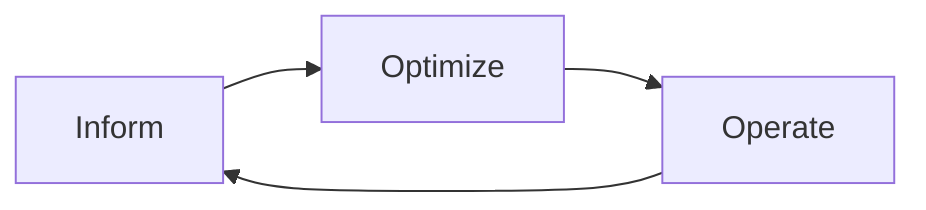
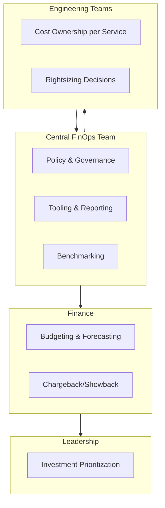
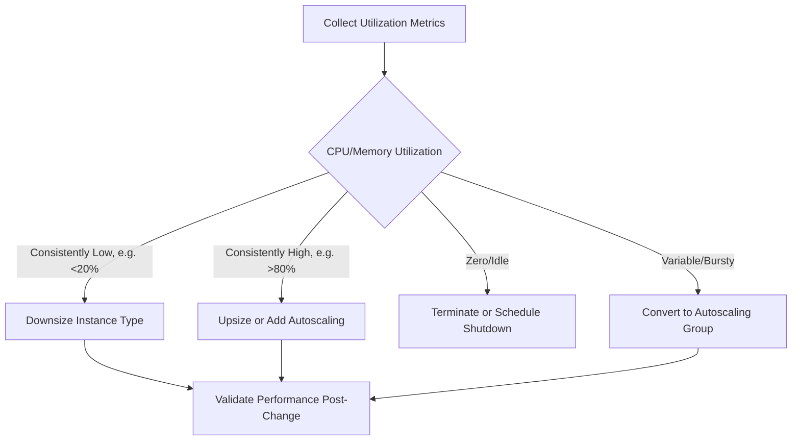

## FinOps and Cloud Cost Optimization

### Overview

FinOps (Financial Operations) is an operating model and cultural practice that brings engineering, finance, and business teams together to manage cloud spend collaboratively, enabling organizations to maximize business value from variable, consumption-based cloud costs. It reframes cloud cost from a static IT budget line item into a continuously optimized, cross-functional discipline — treating cost as a first-class engineering metric alongside performance and reliability.

### The FinOps Foundation Framework

FinOps as a discipline is formalized by the FinOps Foundation (part of the Linux Foundation) around a core lifecycle of three iterative phases.

#### Phase Details

**Inform**: Establishing visibility — allocating cost accurately, benchmarking, forecasting, and budgeting so stakeholders understand where spend is going and why.

**Optimize**: Identifying and acting on efficiency opportunities — rightsizing, commitment-based discounts, workload scheduling, and architectural optimization.

**Operate**: Operationalizing continuous improvement — governance policies, automation, anomaly detection, and embedding cost accountability into engineering workflows.

**Key Points**

- This is explicitly a continuous loop, not a linear project with an end date — cloud environments change constantly, so cost optimization must be ongoing
- The FinOps Foundation's framework also defines maturity levels per capability: **Crawl, Walk, Run** — organizations assess and mature capability-by-capability rather than uniformly

### The FinOps Six Principles (FinOps Foundation)

1. Teams need to collaborate
2. Decisions are driven by business value of cloud
3. Everyone takes ownership for their cloud usage
4. FinOps data should be accessible and timely
5. A centralized team drives FinOps
6. Take advantage of the variable cost model of the cloud

### Organizational Model

**Key Points**

- FinOps deliberately avoids being purely a finance function or purely an engineering function — it is a cross-functional practice with a small central enabling team supporting distributed, accountable engineering teams
- The central team's role is providing shared tooling, negotiated rates, and policy — not making every cost decision itself

### Cost Allocation Mechanisms

#### Tagging-Based Allocation

The foundational method: resources are tagged (see Cloud Asset Inventory) with cost-center, team, or application identifiers, and billing data is grouped accordingly.

#### Chargeback vs. Showback

| Model | Mechanism | Effect |
| --- | --- | --- |
| Showback | Reports cost attribution to teams without actual billing transfer | Raises awareness, no direct financial consequence |
| Chargeback | Actual cost is billed/transferred to the consuming team's budget | Creates direct financial accountability, drives behavior change |

**Key Points**

- Chargeback is more effective at driving optimization behavior but requires mature, accurate allocation — inaccurate chargeback erodes trust in the entire program
- Many organizations start with showback and mature toward chargeback as tagging discipline and allocation accuracy improve

#### Shared Cost Allocation

Costs that can't be directly attributed to one team (shared networking, central logging, support contracts) require an allocation methodology:

$$\text{Allocated Shared Cost}_i = \text{Total Shared Cost} \times \frac{\text{Usage}_i}{\sum_{j=1}^{n} \text{Usage}_j}$$

Common proxies for the usage weight include proportional compute spend, data volume processed, or headcount, depending on the nature of the shared resource.

### Pricing Models and Commitment Discounts

| Model | Mechanism | Typical Discount Range | Flexibility |
| --- | --- | --- | --- |
| On-Demand | Pay per use, no commitment | 0% (baseline) | Full flexibility |
| Reserved Instances (RI) | Commit to specific instance type/region for 1-3 years | Substantial, tiered by term length and payment option | Low — tied to instance family/region |
| Savings Plans (AWS) / Committed Use Discounts (GCP) | Commit to a spend level ($/hour) rather than specific instance | Similar discount tier to RIs | Higher — applies across instance families |
| Spot/Preemptible Instances | Use spare capacity, subject to reclamation | Substantial discount vs. on-demand | Low — can be interrupted with short notice |
| Enterprise Discount Agreements | Negotiated volume discounts | Custom, negotiated | Contract-dependent |

[Unverified — specific discount percentages vary by provider, region, instance family, term length, and are subject to change; current published pricing should be checked directly with the provider before being used for financial planning.]

**Key Points**

- Commitment-based discounts trade flexibility for savings — over-committing to reserved capacity that goes unused erases the savings and creates its own waste category
- Spot/preemptible instances are best suited to fault-tolerant, interruptible workloads (batch processing, stateless web tiers with graceful failover) rather than stateful or latency-sensitive production services
- A blended commitment strategy (baseline reserved + variable on-demand + interruptible spot for elastic burst) is a common target architecture for balancing cost and risk

### Rightsizing

Rightsizing is the practice of matching provisioned resource capacity to actual workload demand.

**Example**

A workload runs on a compute instance with 16 vCPUs and 64 GB RAM, but monitoring shows sustained CPU utilization averaging 12% and memory utilization averaging 30% over a 30-day window.

- Right-sizing to an 8 vCPU / 16 GB instance type may still leave comfortable headroom
- If the smaller instance type costs roughly half as much, the change halves compute cost for that resource with no expected performance degradation, pending validation under peak load

**Key Points**

- Rightsizing decisions should be based on sustained utilization patterns (e.g., p95/p99 over weeks), not point-in-time snapshots, to avoid downsizing away needed burst capacity
- Autoscaling (horizontal scaling in/out based on demand) is often a more durable optimization than static vertical rightsizing for variable workloads, since it adapts continuously rather than requiring repeated manual review

### Waste Elimination

Common categories of pure waste — spend with no corresponding business value — identified through inventory-cost cross-referencing:

| Waste Category | Description | Typical Remediation |
| --- | --- | --- |
| Idle resources | Running instances with no/negligible utilization | Terminate or schedule shutdown |
| Orphaned storage | Unattached volumes, old snapshots | Automated cleanup policies |
| Unused reservations | Purchased RIs/Savings Plans not matched to running workloads | Reservation exchange/modification |
| Zombie assets | Resources for decommissioned projects, still running | Lifecycle/TTL enforcement |
| Over-provisioned databases | Managed DB instances sized beyond query load | Rightsizing, read-replica consolidation |
| Non-production always-on | Dev/test environments running 24/7 unnecessarily | Scheduled start/stop automation |

### Anomaly Detection and Budget Alerting

**Key Points**

- Cost anomaly detection tools apply statistical or ML-based baselining to spend patterns, alerting when actual spend deviates significantly from expected trend (e.g., a runaway process causing unexpected API call volume, or a misconfigured autoscaling policy)
- Budget alerts (threshold-based, e.g., "alert at 80% of monthly budget") are a simpler complementary control, providing an early warning even without anomaly-detection sophistication
- Native tools include AWS Cost Anomaly Detection, Azure Cost Management anomaly alerts, and GCP Cost Anomaly Detection; third-party FinOps platforms (CloudHealth, Cloudability, Apptio, Vantage) often provide cross-cloud anomaly detection

### Unit Economics

Mature FinOps practice ties cost not just to infrastructure but to business output, enabling cost-efficiency tracking independent of growth.

$$\text{Unit Cost} = \frac{\text{Total Infrastructure Cost}}{\text{Business Metric}} \quad \text{(e.g., cost per transaction, cost per active user, cost per API call)}$$

**Example**

A SaaS company's infrastructure cost grows from $50,000/month to $70,000/month quarter-over-quarter — a 40% increase that looks alarming in isolation. However, active users grew from 100,000 to 155,000 in the same period.

- Previous unit cost: $50,000 / 100,000 = $0.50/user
- New unit cost: $70,000 / 155,000 ≈ $0.45/user

Despite higher absolute spend, unit economics improved — the infrastructure is becoming more efficient per unit of business value, which is the metric FinOps prioritizes over raw spend totals.

### FinOps Tooling Landscape

| Category | Examples | Function |
| --- | --- | --- |
| Native cloud cost tools | AWS Cost Explorer, Azure Cost Management, GCP Billing Reports | First-party cost visibility and budgets |
| Multi-cloud FinOps platforms | CloudHealth, Cloudability, Apptio, Vantage, Finout | Cross-cloud allocation, anomaly detection, recommendations |
| Kubernetes cost tools | Kubecost, OpenCost | Namespace/pod-level cost allocation in shared clusters |
| FOCUS (FinOps Open Cost and Usage Specification) | Open standard, FinOps Foundation | Normalizes billing data format across providers |

**Key Points**

- Kubernetes cost visibility is a distinct sub-discipline, since shared clusters obscure per-team/per-application cost without specialized tooling that allocates cluster cost down to namespace or pod level
- FOCUS is an open specification intended to standardize how cloud providers structure billing/usage data, reducing the normalization burden of multi-cloud cost reporting [Note: FOCUS is an evolving standard under active development by the FinOps Foundation; current provider adoption and schema version should be verified against current documentation]

### Architectural Optimization

Beyond operational rightsizing, deeper cost efficiency often requires architectural decisions:

- **Storage tiering**: Moving infrequently accessed data to lower-cost storage classes (e.g., S3 Infrequent Access, Glacier) based on access pattern analysis
- **Data transfer optimization**: Minimizing cross-region and cross-AZ data transfer charges, which are often underestimated cost drivers
- **Serverless adoption for variable workloads**: Shifting bursty, infrequent workloads to serverless/functions to eliminate idle compute cost
- **Caching layers**: Reducing repeated compute/database load (and associated cost) through appropriate caching strategy

### Common Pitfalls

- **Optimization as a one-time project**: Treating cost optimization as a quarterly cleanup exercise rather than continuous practice allows waste to re-accumulate
- **Engineering teams with no cost visibility**: Without exposing cost data to the teams making architectural decisions, cost accountability principle #3 (everyone owns their usage) cannot function
- **Over-indexing on discount purchasing over efficiency**: Buying more reserved capacity without first eliminating waste locks in savings on top of an inefficient baseline
- **Ignoring unit economics**: Focusing solely on absolute spend reduction can penalize legitimate growth-driven cost increases and miss genuinely inefficient low-growth spend
- **Siloed multi-cloud reporting**: Treating each cloud provider's cost data separately prevents unified prioritization of optimization effort across the full estate

**Next Steps**

- Cloud Asset Inventory across IaaS, PaaS, and SaaS
- Kubernetes Cost Allocation and Kubecost/OpenCost Implementation
- Cloud Commitment Portfolio Management (RI/Savings Plan Optimization)
- Cost Anomaly Detection and Automated Alerting Architecture
- FOCUS Specification and Multi-Cloud Billing Normalization
- Showback-to-Chargeback Maturity Roadmap
- Sustainability and Cloud Carbon Footprint Reporting (GreenOps)
- Autoscaling and Workload Scheduling Automation