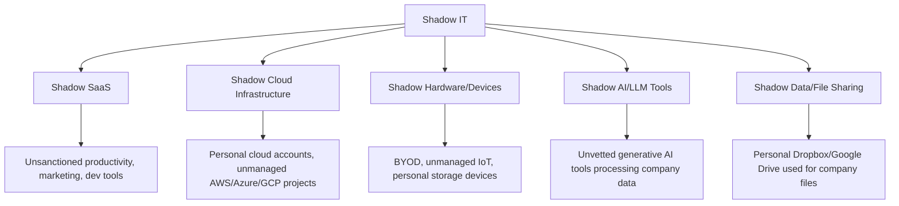
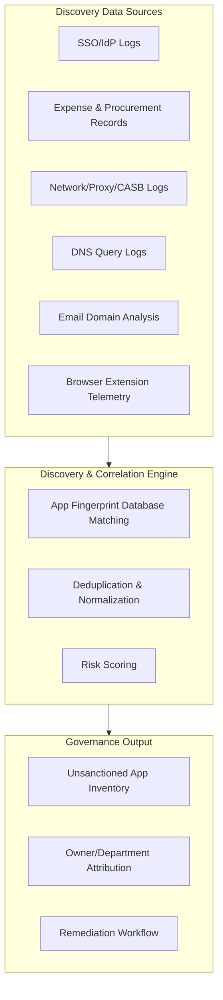
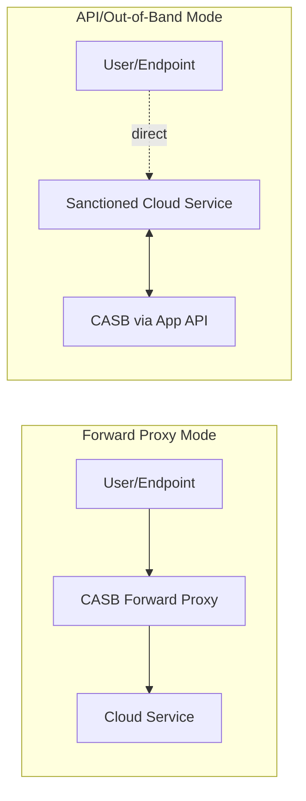
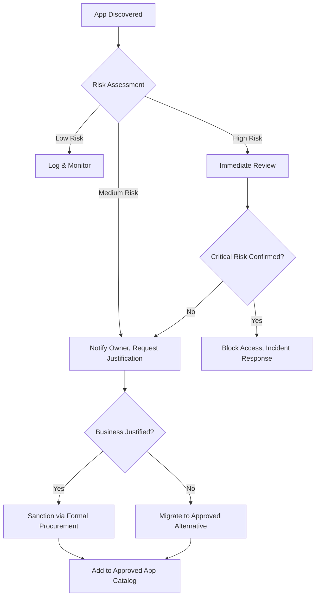
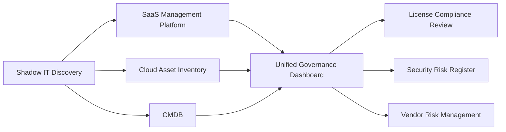

## Shadow IT Discovery and Governance

### Overview

Shadow IT refers to hardware, software, cloud services, and SaaS applications provisioned and used within an organization without explicit approval, visibility, or oversight from IT and security teams. It arises naturally as cloud services and SaaS lower the barrier to procurement — an employee with a credit card can provision infrastructure or subscribe to a tool in minutes, entirely outside traditional procurement gates. Shadow IT Discovery and Governance is the practice of surfacing this unsanctioned technology footprint and bringing it under managed control without simply banning the underlying behavior.

### Why Shadow IT Emerges

**Key Points**

- Friction in official procurement/IT request processes drives employees toward self-service alternatives that solve their immediate need faster
- Cloud and SaaS consumption models (self-serve signup, free tiers, per-seat credit card billing) removed the traditional procurement chokepoints that once made unsanctioned IT harder to acquire
- Remote and hybrid work expanded the attack surface, since employees provision tools outside the visibility of on-premises network monitoring
- Shadow IT is rarely malicious in intent — it is typically a rational response to unmet tooling needs, which is why punitive-only governance approaches tend to fail and simply push usage further underground

### Categories of Shadow IT

**Key Points**

- Shadow AI has emerged as a distinct, fast-growing subcategory — employees pasting proprietary or customer data into public generative AI tools without data handling review is a governance concern the traditional shadow IT playbook is now being extended to cover
- Shadow cloud infrastructure (an engineer spinning up a personal cloud account for "just this project") is often the highest-risk category, since it can involve production data with none of the organization's security controls

### Discovery Methodology

#### Discovery Source Comparison

| Source | What It Reveals | Strengths | Blind Spots |
| --- | --- | --- | --- |
| SSO/IdP logs (Okta, Azure AD, Google Workspace) | Apps accessed via "Sign in with Google/Microsoft" | High fidelity, easy to deploy | Misses apps with standalone credentials |
| Expense/procurement systems | Paid subscriptions via corporate card | Captures financial footprint | Misses free-tier tools, personal card reimbursements |
| CASB (Cloud Access Security Broker) | Real-time cloud service traffic inspection | Deep visibility, policy enforcement capability | Requires traffic routing through the CASB, encrypted traffic limits |
| DNS query logs | Domains resolved from corporate network/endpoints | Broad passive visibility | Doesn't capture off-network (remote/mobile) usage without endpoint agent |
| Email domain analysis | Sign-up/notification emails from SaaS platforms | Catches tools even without SSO | Requires access to email gateway/mailbox scanning |
| Browser extension | Real-time web app usage on managed endpoints | High-fidelity, endpoint-level | Requires deployment/adoption, coverage limited to managed devices |
| Cloud provider access review | Personal/unmanaged cloud accounts accessing corporate resources | Surfaces shadow cloud infra | Requires IAM/access log correlation |

### CASB Architecture

A Cloud Access Security Broker sits as a policy enforcement point between users and cloud services, in one of two primary deployment modes.

**Key Points**

- **Forward proxy/inline mode**: Routes all traffic through the CASB in real time, enabling active blocking of unsanctioned services, but requires endpoint agent or network-level traffic redirection and can introduce latency
- **API mode**: Connects directly to sanctioned SaaS platforms via their admin APIs for visibility and policy enforcement after the fact — doesn't intercept unsanctioned traffic in real time, but has no latency impact and easier deployment for covered apps
- Most enterprise CASB deployments use a hybrid of both modes depending on the use case (inline for real-time blocking of known-risky categories, API mode for deep visibility into sanctioned apps)

### Risk Scoring Framework

Discovered shadow IT applications should be triaged by risk rather than treated uniformly, since a blanket "block everything unsanctioned" policy is rarely operationally viable.

$$\text{Risk Score} = w_1 \cdot \text{Data Sensitivity} + w_2 \cdot \text{User Count} + w_3 \cdot \text{Vendor Security Posture} + w_4 \cdot \text{Data Residency Risk}$$

| Factor | Low Risk Indicator | High Risk Indicator |
| --- | --- | --- |
| Data sensitivity | No company data uploaded (e.g., a scheduling tool) | Customer PII or proprietary code processed |
| User count | Single individual, trial use | Department-wide adoption |
| Vendor posture | SOC 2 Type II certified, published security docs | No available security documentation |
| Data residency | Data hosted in approved jurisdictions | Unknown or high-risk hosting location |

**Example**

Discovery surfaces two unsanctioned tools:

- Tool A: A single designer using a free online color-palette generator — no company data involved, single user → Low risk, likely no action needed beyond awareness
- Tool B: A 45-person sales team using an unsanctioned AI-powered call-transcription tool that ingests customer conversations → High risk (customer data, broad adoption, unknown data handling) → Immediate security/legal review and likely remediation to a sanctioned alternative

### Governance Response Models

**Key Points**

- Effective governance distinguishes between "sanction" (bring the discovered tool into approved status through retroactive review) and "replace" (migrate users to an already-approved equivalent) — outright blocking without an alternative path tends to drive re-emergence through new unsanctioned channels
- A tiered response (log/monitor → notify → block) proportional to risk avoids alienating the workforce while still controlling genuine exposure

### Reducing Shadow IT at the Source

Discovery is reactive; the more durable governance strategy reduces the *incentive* to go around official channels.

- **Self-service app catalog**: A curated, pre-approved marketplace of sanctioned tools that employees can request/provision quickly, reducing the friction gap that drives shadow adoption
- **Fast-track intake workflow**: A lightweight SaaS/tool request process (target: same-day or next-day turnaround for low-risk requests) rather than a multi-week procurement cycle
- **Clear, published policy**: Documented criteria for what requires review versus what's automatically permitted (e.g., free tools with no data upload may be pre-approved by category)
- **Regular amnesty/discovery cycles**: Periodic, blame-free discovery sweeps that invite disclosure of existing shadow tools without punitive consequence, improving voluntary reporting over time

### Shadow Cloud Infrastructure Discovery

Distinct from shadow SaaS, shadow cloud infrastructure (unmanaged AWS/Azure/GCP accounts/projects) requires different discovery techniques:

**Key Points**

- Corporate billing/expense correlation against known provider names (AWS, Azure, GCP, DigitalOcean, etc.) surfaces payment-based signals
- DNS and certificate transparency log monitoring can reveal infrastructure provisioned under company-adjacent domain names
- Cloud provider organization-level enrollment policies (e.g., requiring all company AWS accounts to join a central AWS Organization) provide a structural control, making truly independent shadow accounts harder to establish for new infrastructure, though this doesn't retroactively surface existing shadow accounts

### Integration with Broader Asset Management

**Key Points**

- Shadow IT discovery is not a standalone function — its output should feed directly into SaaS Management Platforms, Cloud Asset Inventory, and the central CMDB so discovered assets don't remain a separate, disconnected list
- Discovered shadow tools frequently surface downstream license compliance issues (unauthorized use of paid software under a free-tier account) and vendor risk gaps (no signed DPA), making cross-functional handoff to legal/procurement essential after discovery

### Common Pitfalls

- **Discovery without a remediation workflow**: Building visibility dashboards that generate findings nobody actions creates a false sense of governance maturity
- **Zero-tolerance blocking policy**: Aggressive blanket blocking without providing sanctioned alternatives drives usage to less visible channels (personal devices, personal accounts) rather than eliminating the underlying need
- **One-time discovery sweep**: Treating shadow IT discovery as an annual audit rather than continuous monitoring means new shadow tools accumulate undetected between cycles
- **Ignoring the "why"**: Failing to investigate the underlying business need behind adopted shadow tools means even successful remediation of one tool often results in a different unsanctioned tool filling the same gap
- **Underestimating Shadow AI**: Treating generative AI tool usage as a standard SaaS discovery problem misses the distinct data-handling risk (prompt content itself can constitute a data leak) that warrants dedicated policy attention

**Next Steps**

- SaaS and Subscription Management
- CASB (Cloud Access Security Broker) Deployment Architecture
- Vendor Risk Management and Third-Party Security Assessments
- Shadow AI Governance and Generative AI Usage Policy
- SaaS Intake Workflow and Self-Service App Catalog Design
- Cloud Asset Inventory across IaaS, PaaS, and SaaS
- Data Loss Prevention (DLP) Integration with SaaS Discovery
- Security Incident Response for Unsanctioned Tool Data Exposure