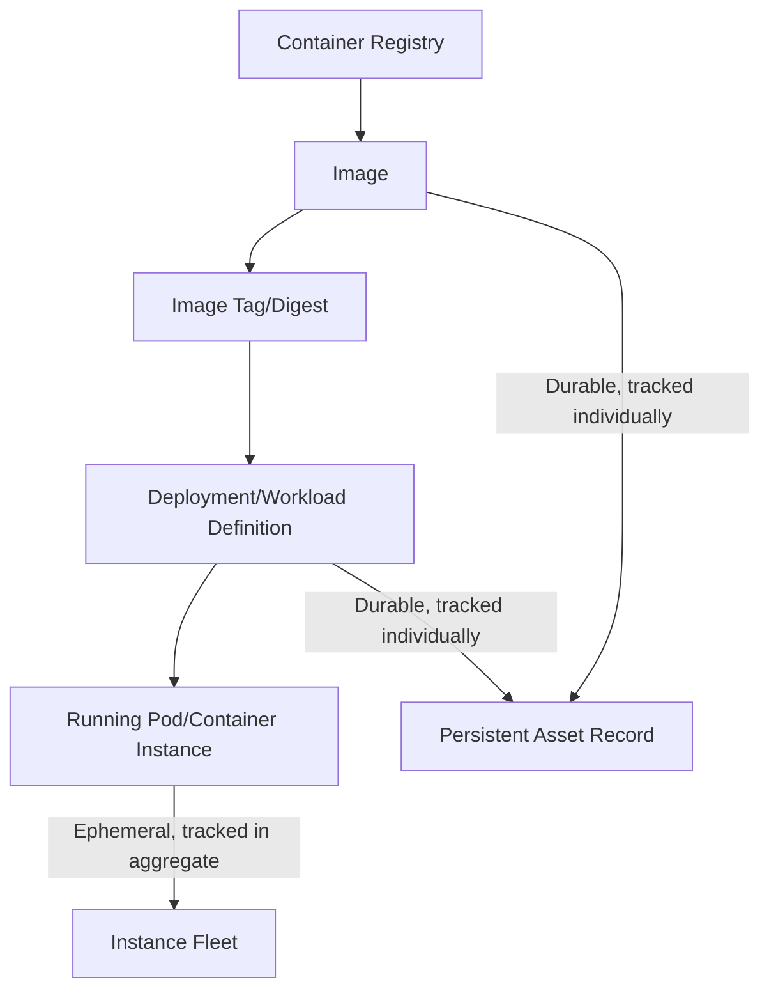
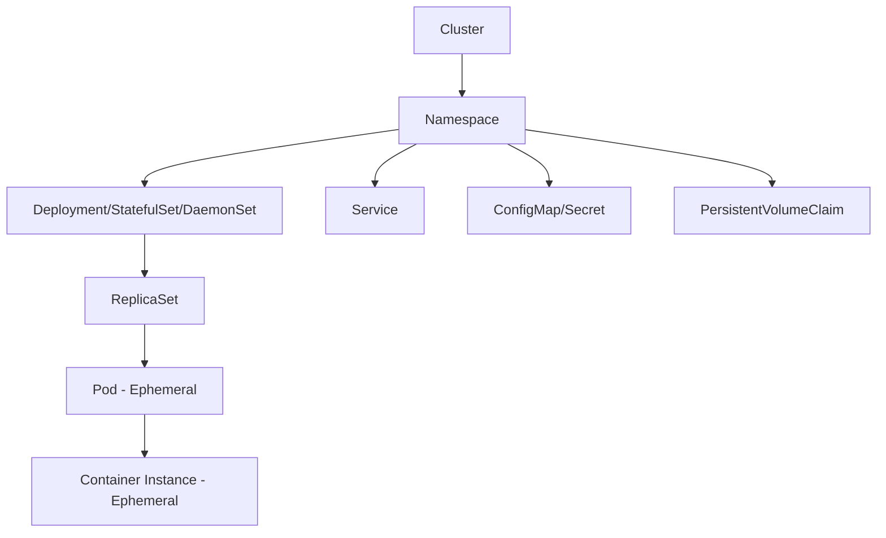
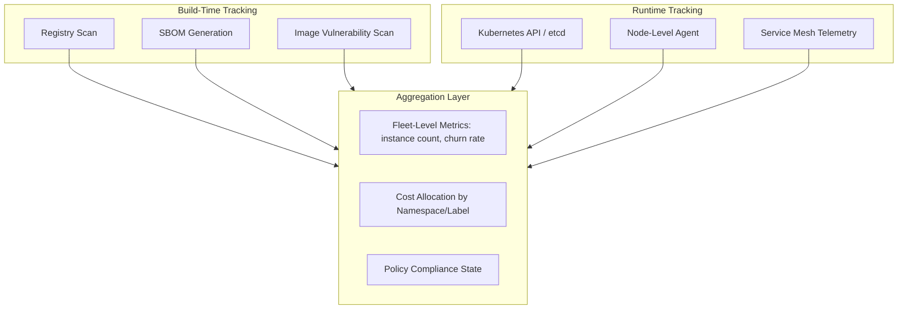
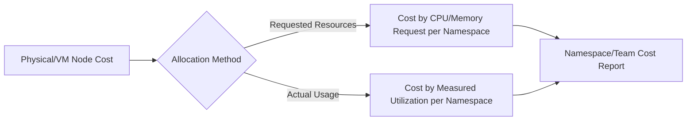

## Container and Ephemeral Asset Tracking

### Overview

Container and Ephemeral Asset Tracking addresses the fundamental mismatch between traditional IT asset management — designed for long-lived, individually identifiable assets — and modern containerized/serverless workloads, where individual assets may exist for seconds to minutes and are created and destroyed by automated orchestration rather than by human provisioning. Effective tracking in this environment shifts focus from tracking individual instances to tracking the *definitions*, *images*, and *aggregate behavior* that produce those instances, since the instances themselves are too transient to serve as the unit of inventory.

### Why Traditional Asset Management Fails Here

**Key Points**

- A container may live for seconds (a CI/CD job runner) or indefinitely (a long-running service pod) — a fixed asset ID assigned at "purchase" time has no equivalent
- Autoscaling means the *count* of running instances of a given workload fluctuates continuously based on load, not procurement events
- Immutable infrastructure patterns mean instances are never "patched" in place — they are replaced wholesale with new instances from an updated image, so tracking an individual container's patch history is largely meaningless
- The relevant unit of durable inventory shifts from "this specific running container" to "this container image," "this deployment," and "this cluster/namespace"

### The Layered Asset Model for Containers

| Layer | Lifespan | Tracking Approach |
| --- | --- | --- |
| Container registry | Persistent | Standard inventory (image count, storage, access policy) |
| Image (built artifact) | Persistent until pruned | Individually tracked — vulnerability scan history, license/SBOM per image |
| Image tag/digest | Persistent, immutable per digest | Version-pinned reference, critical for reproducibility and audit |
| Deployment/workload definition | Persistent (declared in IaC/manifests) | Individually tracked — the "asset" that matters for governance |
| Running pod/container instance | Seconds to days | Tracked in aggregate/fleet terms, not individually over time |

### Kubernetes Asset Hierarchy

For Kubernetes specifically, the orchestration layer introduces its own object hierarchy that maps to asset tracking granularity.

**Key Points**

- **Cluster** and **namespace** are the durable organizational units most suited to cost allocation, ownership attribution, and policy enforcement
- **Deployment** objects (the declared desired state) are the meaningful unit of "what is running," not individual pods, since the Deployment persists and self-heals even as underlying pods are replaced
- **PersistentVolumeClaims** are a notable exception — they represent genuinely durable, stateful storage assets that require the same lifecycle rigor as traditional storage assets (backup, capacity tracking, decommission process)

### Container Image Inventory and SBOM

Given that images are the durable, trackable unit, image-level inventory is the foundation of container asset governance.

**Key Points**

- Every image should have an associated SBOM (Software Bill of Materials) generated at build time, capturing OS packages and application dependencies baked into the image layers
- Image digests (SHA-256 content hashes) provide immutable identity — unlike tags (e.g., `:latest`, `:v1.2`), which can be reassigned to point to different content, digests guarantee the exact same image content every time
- Base image provenance tracking (which upstream base image, e.g., `node:20-alpine`, and which version) is essential for vulnerability inheritance tracking, since base image CVEs propagate to every image built on top

**Example**

A vulnerability scanner flags CVE-2026-XXXXX in a widely-used base image. Rather than manually checking every deployed application, image-inventory tooling with recorded base-image lineage can immediately answer: "This base image is used as the foundation for 47 application images across 12 microservices" — enabling coordinated, prioritized remediation instead of ad hoc firefighting per service.

### Discovery and Tracking Architecture

#### Discovery Sources by Layer

| Source | Captures | Common Tools |
| --- | --- | --- |
| Container registry API | Image inventory, tags, push/pull history | Harbor, ECR, GCR, Docker Hub, ACR |
| Kubernetes API server | Live cluster state (pods, deployments, namespaces) | `kubectl`, Kubernetes API directly |
| CI/CD pipeline metadata | Build provenance, source commit, build time SBOM | GitHub Actions, GitLab CI, Jenkins |
| Node-level agents | Per-node running container detail, resource consumption | Falco, node exporters |
| Service mesh | Inter-service traffic, dependency mapping | Istio, Linkerd telemetry |

### Labels and Metadata (Kubernetes Equivalent of Tags)

Kubernetes labels and annotations serve the same governance function that cloud resource tags serve for IaaS.

#### Recommended Label Schema

| Label Key | Purpose | Example Value |
| --- | --- | --- |
| `app.kubernetes.io/name` | Application identity | `checkout-service` |
| `app.kubernetes.io/version` | Deployed version | `2.4.1` |
| `team` / `owner` | Accountable team | `payments-team` |
| `cost-center` | Financial attribution | `CC-4471` |
| `environment` | Lifecycle stage | `production` |

**Key Points**

- Kubernetes has an official recommended label set (`app.kubernetes.io/*`) that provides ecosystem-wide consistency, but organization-specific labels (cost-center, owner) still need to be independently standardized and enforced
- Label enforcement via admission controllers (e.g., OPA/Gatekeeper, Kyverno policies) prevents workloads from being deployed without required governance metadata — analogous to tag-enforcement policies in cloud IaaS

### Fleet-Level Metrics for Ephemeral Instances

Since individual container instances aren't meaningfully trackable over their lifecycle, the relevant metrics shift to aggregate, fleet-level measures.

$$\text{Churn Rate} = \frac{\text{Instances Created} + \text{Instances Terminated}}{\text{Time Window}}$$

$$\text{Average Instance Lifespan} = \frac{\sum \text{(Termination Time}_i - \text{Creation Time}_i)}{\text{Number of Instances}}$$

**Key Points**

- High churn rate combined with short average lifespan is expected and healthy for autoscaling, CI/CD runner, and batch-processing workloads — it becomes a governance signal only when unexpected (e.g., a crash-looping deployment inflating churn)
- These fleet metrics are more useful for capacity planning and anomaly detection than for traditional "asset count" reporting

### Ephemeral Asset Cost Allocation

Cost allocation for ephemeral container workloads requires attribution at a finer granularity than the underlying node, since many containers typically share the same physical/virtual host.

**Key Points**

- Kubernetes cost tools (Kubecost, OpenCost) allocate shared node cost down to namespace, deployment, or even pod level using either resource *requests* (what was reserved) or actual measured *usage* — the two methods can produce materially different attribution when requests are over-provisioned relative to actual consumption
- This finer-grained allocation is what enables meaningful FinOps chargeback/showback in multi-tenant cluster environments, where a single node invoice line item would otherwise obscure per-team cost

### Security and Compliance Implications

**Key Points**

- Ephemeral instances complicate traditional vulnerability management workflows built around "patch this specific host" — remediation instead targets the image and redeployment, since patching a running container in place is generally not the standard pattern
- Runtime security tooling (e.g., behavioral anomaly detection at the node/container level) must operate without relying on persistent per-instance history, since the instance itself won't exist long enough for traditional baseline-building approaches
- Compliance evidence collection (demonstrating a control was in place at a point in time) requires capturing point-in-time cluster state snapshots or continuous audit logging, since the ephemeral instances that existed during an audit period may no longer exist when the audit occurs

### Serverless/Function-as-a-Service Considerations

Serverless functions represent an even more extreme case of ephemerality than containers, often existing only for the duration of a single invocation.

**Key Points**

- The trackable asset shifts even further up the stack — to the function *definition*, its deployed version, and its configured triggers/permissions — rather than any notion of a running instance
- Function-level SBOM and dependency tracking (for the deployed function package/layer) remains essential, following the same principle that ephemeral compute still carries persistent software supply chain risk
- Cost and invocation metrics are tracked as aggregate counters (invocation count, duration, cold-start rate) rather than per-instance records

### Common Pitfalls

- **Attempting to maintain a CMDB record per container instance**: This generates enormous data volume with little lasting value, since most records become stale within minutes; the durable CMDB record should be the deployment/workload definition, not the instance
- **Ignoring build-time SBOM in favor of runtime scanning only**: Runtime-only scanning misses the opportunity to block vulnerable images before deployment and complicates remediation prioritization
- **Tag/label inconsistency between cloud resource tags and Kubernetes labels**: When the two schemas diverge, cost and ownership reporting fragments between the infrastructure layer and the orchestration layer
- **Treating `:latest` tags as a stable reference point**: Because tags are mutable, tracking deployed versions by tag alone can misrepresent what's actually running; digest-based tracking is required for accurate inventory
- **Underestimating persistent volumes as "just another ephemeral resource"**: Stateful storage attached to ephemeral compute still requires traditional durable-asset governance (backup, retention, decommission)

**Next Steps**

- Cloud Asset Inventory across IaaS, PaaS, and SaaS
- Kubernetes Cost Allocation and Kubecost/OpenCost Implementation
- Container Image Vulnerability Scanning and Base Image Governance
- Software Bill of Materials (SBOM) Generation in CI/CD Pipelines
- Admission Controller Policy Enforcement (OPA/Gatekeeper, Kyverno)
- Serverless/FaaS Asset Governance and Cost Tracking
- Immutable Infrastructure Patterns and Patch Management Strategy
- Service Mesh Observability and Dependency Mapping