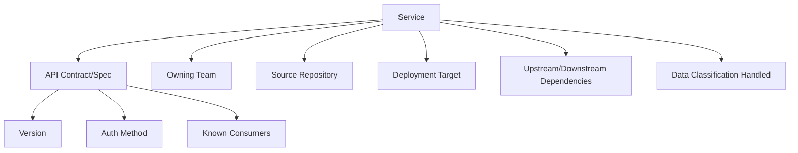
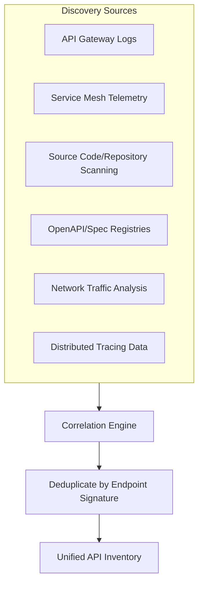
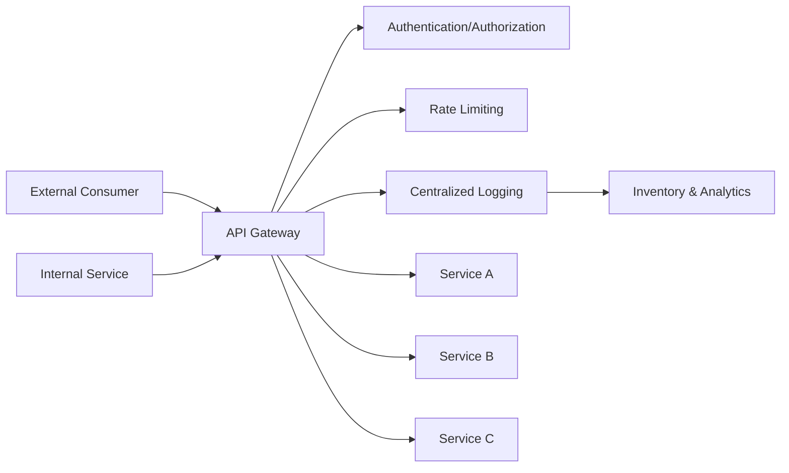
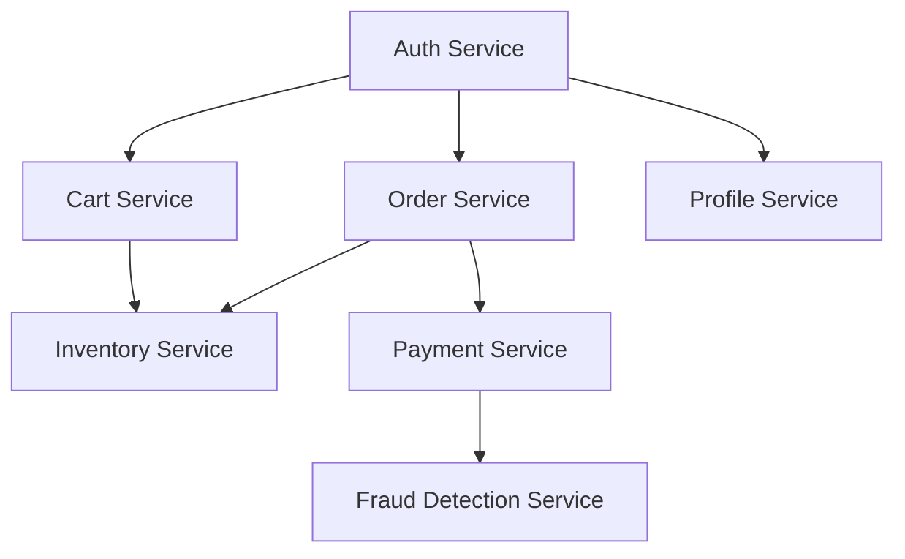

## API and Microservice Asset Inventories


### Overview

API and Microservice Asset Inventories address the challenge of tracking a class of asset that has no physical or even instance-based footprint — an API or microservice is a logical contract and a deployed capability, often distributed across dozens or hundreds of independently deployable services. As architectures decompose from monoliths into microservices, the number of discrete trackable units multiplies dramatically, and the relationships between them (which service calls which API, which API exposes which data) become as important to inventory as the services themselves.

### What Constitutes the "Asset" in an API/Microservice Context

**Key Points**

- The trackable asset is not a server or container instance (covered under ephemeral asset tracking) but the **service definition**, its **API contract**, and its **ownership and dependency metadata**
- A single microservice may have multiple API versions live simultaneously (e.g., `/v1/orders` and `/v2/orders`), each representing a distinct contract with its own consumers, deprecation timeline, and risk profile
- Internal APIs (service-to-service, never exposed externally) carry different governance weight than external/partner-facing APIs, but both require inventory for security and dependency-mapping purposes

### The Microservice Asset Data Model



A minimal API inventory record typically captures:



```
{
  "service_name": "order-service",
  "api_version": "v2",
  "spec_format": "OpenAPI 3.1",
  "owner_team": "commerce-platform",
  "repository": "github.com/org/order-service",
  "auth_method": "OAuth2 client_credentials",
  "exposure": "internal",
  "status": "active",
  "deprecation_date": null,
  "data_classification": "PII",
  "known_consumers": ["checkout-service", "fulfillment-service"],
  "last_scanned": "2026-09-15T04:00:00Z"
}
```

### API Discovery Methods

Unlike infrastructure inventory, where cloud provider APIs offer a near-complete source of truth, API/service discovery typically requires triangulating multiple signals, since no single source captures every internal API.



#### Discovery Source Comparison

| Source | What It Reveals | Strengths | Limitations |
| --- | --- | --- | --- |
| API Gateway logs | All traffic routed through the gateway | Ground truth for gateway-managed APIs | Misses direct service-to-service calls that bypass the gateway |
| Service mesh telemetry (Istio, Linkerd) | Actual inter-service call graph | Captures real traffic patterns, not just declared intent | Requires mesh adoption across the fleet; misses non-mesh traffic |
| Source code/repository scanning | Declared routes/endpoints in code | Finds APIs even before deployment or with no traffic | False positives from dead code; requires language-specific parsers |
| OpenAPI/spec registries | Explicitly documented contracts | High-quality, structured metadata when maintained | Only as complete as developer discipline in publishing specs |
| Distributed tracing (Jaeger, Zipkin, OpenTelemetry) | Actual runtime call chains with latency/error data | Reveals undocumented dependencies | Sampling may miss low-traffic paths |
| Network traffic analysis (eBPF-based) | Raw network flows regardless of documentation | Catches genuinely undocumented "shadow APIs" | Requires correlation with service identity to be meaningful |

**Key Points**

- No single discovery method is complete on its own; mature programs correlate gateway logs, mesh telemetry, and code scanning to build a composite inventory and flag discrepancies (e.g., traffic observed to an endpoint with no corresponding spec — a "shadow API")
- eBPF-based network observability has become a common approach for catching undocumented APIs, since it operates below the application layer and doesn't depend on services opting into instrumentation

### API Gateway as a Central Control Point



**Key Points**

- Routing all external and, ideally, internal traffic through a managed API gateway (e.g., Kong, Apigee, AWS API Gateway, or a service mesh ingress) creates a natural, centralized discovery and enforcement point
- Gateways that require formal API registration before routing traffic (rather than open pass-through) structurally reduce shadow API proliferation, similar to how mandatory cloud account enrollment reduces shadow infrastructure
- Not all traffic flows through the gateway in practice — direct pod-to-pod or service-to-service calls within a cluster commonly bypass it unless a service mesh enforces routing at a lower layer

### API Specification Standards

| Standard | Scope | Common Use |
| --- | --- | --- |
| OpenAPI (formerly Swagger) | REST API contract description | Most widely adopted REST documentation standard |
| AsyncAPI | Event-driven/message-based API description | Kafka, message queues, WebSocket-based APIs |
| gRPC/Protocol Buffers (.proto files) | RPC service contract | High-performance internal service-to-service APIs |
| GraphQL Schema Definition Language (SDL) | GraphQL API schema | Query-based APIs with client-specified data shape |

**Key Points**

- Maintaining machine-readable specs (rather than only human-written documentation) is what enables automated inventory tooling, contract testing, and drift detection between documented and actual behavior
- Centralized spec registries (internal developer portals, or tools like Backstage's API catalog plugin) provide a browsable, governed source of truth when teams are disciplined about publishing

### API Lifecycle and Versioning Governance


| Lifecycle Stage | Inventory Implication |
| --- | --- |
| Design/Draft | Tracked for future-planning visibility, not yet governed for consumer risk |
| Active/Published | Full governance: known consumers, SLAs, auth requirements tracked |
| Deprecated | Flagged with sunset date; consumer migration tracking becomes critical |
| Sunset/Retired | Removed from active inventory, retained in historical record for audit |

**Key Points**

- The highest-risk gap in most organizations is deprecated APIs that remain technically live long past their announced sunset date because consumer migration was never verified — inventory tooling should track actual traffic to deprecated endpoints, not just their declared status
- Breaking changes should generate a new version (v1 → v2) rather than mutating an existing contract in place, preserving the old version's inventory record and known-consumer list until migration is confirmed complete

**Example**

An inventory audit reveals `/v1/customer-lookup` was marked "deprecated" eighteen months ago with an announced 6-month sunset window, but gateway logs still show 200,000 calls per day from a legacy internal reporting tool that was never migrated.

- Without traffic-based verification, the API would have been assumed safely retired and removed, breaking the reporting tool in production
- This is the specific failure mode that traffic-correlated inventory (rather than documentation-only inventory) is designed to catch

### Dependency Mapping and Blast Radius Analysis

**Key Points**

- A service dependency graph — built from mesh telemetry or distributed tracing — allows answering "if this service goes down or this API is deprecated, what breaks?" before it happens rather than discovering it during an incident
- This is often visualized as a directed graph where nodes are services and edges are API calls, weighted by call volume or criticality
- Highly-connected "hub" services (many downstream dependents) warrant elevated change-management rigor, since their blast radius on failure or breaking change is proportionally larger



In this example, Auth Service is a hub with three direct dependents; an outage or breaking API change there has a wider blast radius than a change to Fraud Detection Service, which has a single upstream dependent.

### Security Implications of Incomplete API Inventory

**Key Points**

- "Shadow APIs" (undocumented, unmonitored endpoints discovered via traffic but absent from any registry) are a recognized category of API security risk, since they exist outside vulnerability scanning, rate limiting, and access review processes by default
- "Zombie APIs" (old versions still live and reachable despite being superseded) often retain weaker authentication or outdated validation logic compared to current versions, making them a preferred target if discovered by an attacker
- API security posture tools increasingly combine discovery (building the inventory) with posture assessment (checking auth method, data exposure, rate limiting) as a single integrated function, since an API can't be secured if it isn't known to exist

### Ownership and Ecosystem Metadata

**Key Points**

- Every inventoried API/service should map to an accountable owning team — orphaned services (original team disbanded or reorganized, no current owner) are a common and hard-to-remediate finding in mature microservice estates
- Developer portal / internal catalog tools (e.g., Backstage, or commercial equivalents) are commonly used to centralize this ownership metadata alongside the technical inventory, making "who do I contact about this API" answerable without tribal knowledge
- Data classification tagging at the API level (does this endpoint return PII, financial data, etc.) connects the technical inventory to compliance and data governance obligations

### Common Pitfalls

- **Relying solely on documentation-based inventory**: Specs go stale quickly without enforcement; an inventory built only from voluntarily-maintained OpenAPI files will systematically undercount actual live APIs
- **No traffic verification for "deprecated" status**: As shown in the sunset example above, assuming deprecated means unused without checking actual traffic is a recurring cause of breaking production incidents
- **Treating internal APIs as out of scope for governance**: Internal-only APIs still carry security risk (lateral movement in a breach) and dependency risk (blast radius), and are frequently under-inventoried relative to external/partner APIs
- **No ownership mapping for legacy services**: Services surviving multiple reorgs without clear ownership become high-risk "nobody's job" assets that don't get patched, monitored, or properly decommissioned
- **Ignoring version proliferation**: Allowing v1, v2, and v3 of an API to all remain simultaneously active indefinitely multiplies the governed surface area without a corresponding increase in oversight capacity

**Next Steps**

- Container and Ephemeral Asset Tracking
- Service Mesh Observability and Dependency Mapping
- API Security Posture Management and Shadow API Detection
- Distributed Tracing and OpenTelemetry Implementation
- Internal Developer Portal and Service Catalog Design (Backstage)
- API Deprecation and Version Sunset Governance
- Software Bill of Materials (SBOM) Generation in CI/CD Pipelines
- Data Classification and Governance for API-Exposed Data