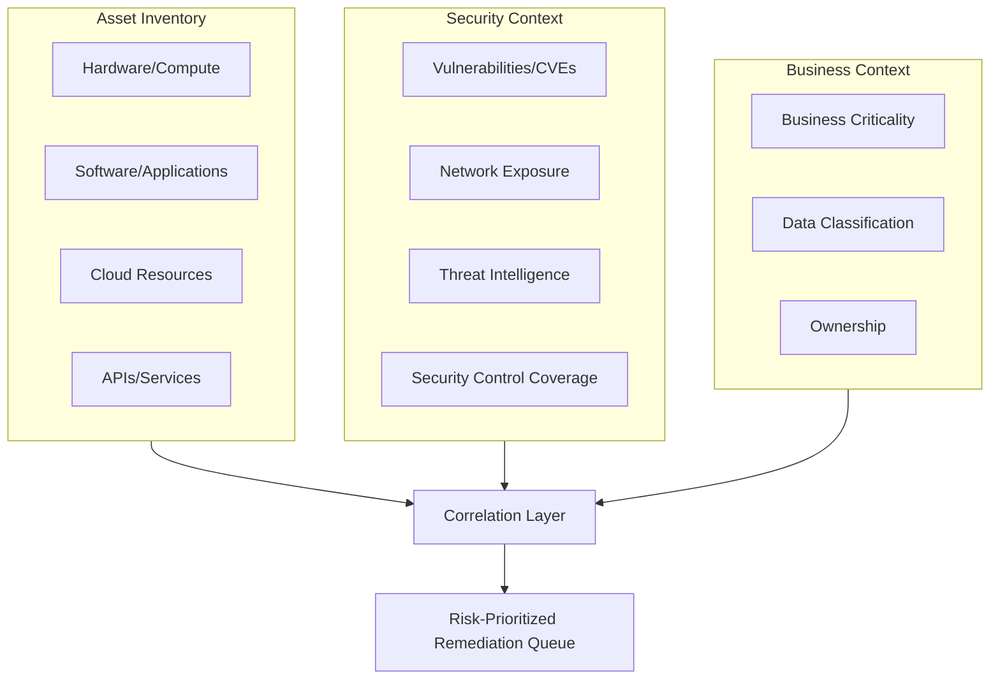
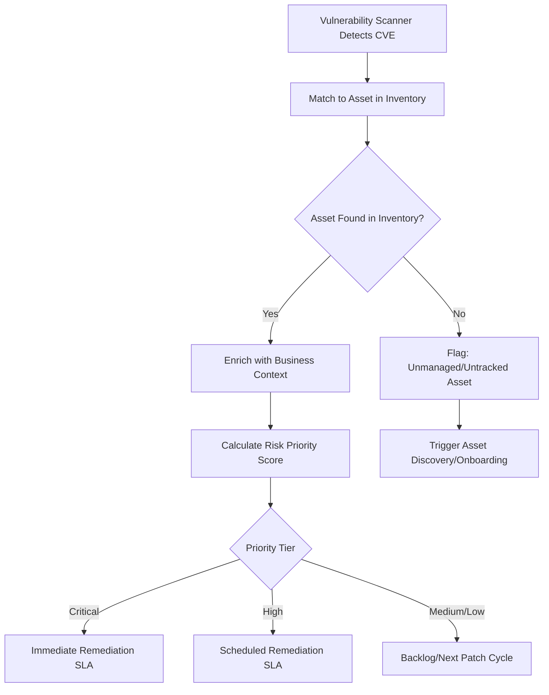
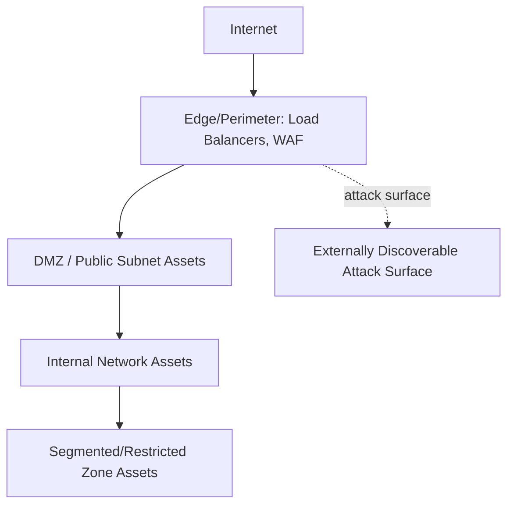

## Security Asset Management and Vulnerability Correlation


### Overview

Security Asset Management and Vulnerability Correlation is the practice of unifying an organization's asset inventory with security context — vulnerabilities, exposure, exploitability, and control coverage — so that "what do we own" and "what's wrong with it" are answered together rather than as separate, disconnected exercises. Traditional IT asset management answers "what exists"; security asset management extends this to "what exists, is it vulnerable, is it exposed, and is it protected," which is the foundation of modern vulnerability management and attack surface reduction programs.

### Why Asset Inventory and Vulnerability Data Must Be Correlated

**Key Points**

- A vulnerability scanner can report thousands of CVEs; without correlation to asset criticality, ownership, and exposure, security teams cannot prioritize which to remediate first — this is the core problem "vulnerability fatigue" describes
- Assets not in the inventory cannot be scanned or protected — this makes asset inventory completeness a prerequisite for vulnerability management effectiveness, not a separate parallel workstream
- The same underlying CVE poses very different actual risk depending on asset context: a critical vulnerability on an internet-facing production server carries materially different urgency than the same CVE on an isolated internal test system

### Core Data Domains Requiring Correlation



### Cyber Asset Attack Surface Management (CAASM)

CAASM is the tooling category specifically built around this correlation problem — aggregating asset data from multiple existing sources (rather than performing its own primary discovery) to build a unified, queryable asset-and-risk graph.

**Key Points**

- CAASM tools typically integrate via API with existing sources — EDR/endpoint agents, cloud provider APIs, vulnerability scanners, CMDB, identity providers — rather than deploying new discovery agents, making them an aggregation and correlation layer rather than a primary discovery mechanism
- The core value proposition is answering cross-domain queries that no single source system can answer alone, such as "show me all internet-facing assets with a critical CVE and no EDR agent installed"
- This category emerged specifically because organizations found that no single existing tool (CMDB, vulnerability scanner, cloud inventory) had both complete asset coverage and complete security context simultaneously

### Vulnerability Correlation Data Model

A correlated asset-vulnerability record typically combines fields from multiple source systems:



```
{
  "asset_id": "srv-prod-4471",
  "asset_type": "compute_instance",
  "hostname": "checkout-api-03",
  "owner_team": "commerce-platform",
  "business_criticality": "high",
  "data_classification": "PII, payment_data",
  "network_exposure": "internet-facing",
  "vulnerabilities": [
    {
      "cve_id": "CVE-2026-31337",
      "cvss_base_score": 9.8,
      "exploit_available": true,
      "exploited_in_wild": true,
      "patch_available": true,
      "affected_component": "openssl 3.0.1"
    }
  ],
  "security_controls": {
    "edr_installed": true,
    "waf_protected": true,
    "last_patched": "2026-07-02"
  },
  "risk_score": 94
}
```

### Risk-Based Prioritization Framework

Raw CVSS severity alone is widely recognized as insufficient for prioritization at scale, since it doesn't account for exploitability-in-practice or asset context. Modern prioritization frameworks layer additional signal on top.

$$\text{Risk Priority Score} = f(\text{CVSS Severity}, \text{Exploit Maturity}, \text{Asset Exposure}, \text{Asset Criticality}, \text{Compensating Controls})$$

| Factor | Description | Why It Matters |
| --- | --- | --- |
| CVSS Base Score | Standardized severity rating (0-10) | Baseline severity, but context-independent |
| Exploit Maturity | Is a working exploit publicly available or observed in the wild? | Dramatically changes real-world urgency versus theoretical risk |
| Network Exposure | Internet-facing vs. internal-only vs. air-gapped | Determines actual attacker reachability |
| Asset Criticality | Business impact if the asset is compromised | Aligns remediation effort with business risk, not just technical severity |
| Compensating Controls | WAF, network segmentation, EDR presence | Can reduce effective risk even without patching |
| Data Sensitivity | PII, payment data, IP on the asset | Determines breach impact/regulatory exposure |

**Key Points**

- Frameworks like EPSS (Exploit Prediction Scoring System) supplement CVSS by estimating the probability a vulnerability will be exploited in the wild within a given timeframe, based on observed exploitation data — shifting prioritization from "how bad could this be" to "how likely is this to actually be used against us" [Note: EPSS scoring methodology and data sources are maintained by FIRST.org and updated periodically; current model version should be checked against current documentation]
- CISA's Known Exploited Vulnerabilities (KEV) catalog — a list of CVEs confirmed to have been actively exploited — is commonly used as a hard prioritization trigger, since confirmed in-the-wild exploitation is a stronger signal than either CVSS or EPSS alone [Unverified — catalog inclusion criteria and update cadence should be verified against current CISA guidance, as the catalog is actively maintained]

### Vulnerability Correlation Workflow



**Key Points**

- The "asset not found in inventory" branch is a critical control point — a vulnerability detected on an untracked asset indicates both a security gap (unmanaged, unpatched system) and an asset management gap (incomplete inventory), and should trigger investigation of both
- Remediation SLAs (e.g., "critical vulnerabilities remediated within 15 days, high within 30 days") are commonly tiered by the calculated priority score rather than raw CVSS alone, reflecting risk-based rather than severity-only management

### Asset Exposure Mapping

Understanding what's reachable from the internet — the attack surface — is foundational to correlation, since exposure dramatically changes risk for an otherwise-identical vulnerability.



**Key Points**

- External Attack Surface Management (EASM) tools specifically map internet-facing exposure — often via active internet scanning, DNS enumeration, and certificate transparency logs — to discover assets exposed to the internet that may not have been deliberately provisioned that way (a common finding: a test environment or forgotten subdomain left publicly accessible)
- Combining EASM (external, outside-in view) with internal asset inventory (inside-out view) closes a common blind spot, since internally-tracked inventory doesn't always accurately reflect actual internet reachability due to misconfiguration

### Endpoint and Agent Coverage Gaps

**Key Points**

- A common and high-value correlation query is identifying assets present in one inventory source (e.g., cloud provider inventory or network discovery) but absent from a security control's coverage (e.g., no EDR agent, no vulnerability scan in the last 30 days) — these coverage gaps represent assets that are effectively unmonitored
- This gap frequently occurs with ephemeral or fast-provisioned assets (see Container and Ephemeral Asset Tracking) where security agent deployment isn't yet baked into the provisioning pipeline, and with shadow IT/shadow cloud assets that were never onboarded to security tooling in the first place

**Example**

A CAASM correlation query cross-references the cloud provider's compute inventory (340 running instances) against EDR agent check-in records (312 instances reporting).

- The 28-instance gap represents unmonitored compute — potentially newly provisioned instances where agent installation hasn't completed, decommissioned instances with stale EDR records, or genuinely unmanaged/shadow infrastructure
- Investigating and closing this specific gap (rather than only reviewing already-monitored assets) often surfaces more actionable risk than continuing to deepen analysis on already-covered assets

### Software Vulnerability Correlation (Application Layer)

Correlation extends beyond infrastructure to the software composition layer, connecting directly to Software Composition Analysis and SBOM practices.

**Key Points**

- SBOM data (component name, version) combined with vulnerability databases (NVD, OSV, GitHub Advisory Database) enables mapping "which of my deployed applications contain this vulnerable library version" — the same correlation principle applied at the software dependency level rather than the infrastructure level
- Reachability analysis (is the vulnerable code path actually invoked by the application, not just present in a dependency tree) is an increasingly used refinement that reduces false-positive-driven alert fatigue, since many included vulnerable functions in a dependency are never actually called by the consuming application

### Identity as an Asset Correlation Dimension

**Key Points**

- Modern security asset management increasingly treats identities (user accounts, service accounts, API keys, IAM roles) as a first-class asset category requiring the same inventory and risk correlation as infrastructure — over-privileged or orphaned identities are a leading initial-access vector in breaches
- Correlating identity permissions against asset sensitivity (e.g., "which identities have write access to systems processing payment data") extends the same risk-prioritization logic from vulnerabilities to access rights

### Common Pitfalls

- **Treating vulnerability management and asset management as separate programs**: Running vulnerability scans without a reliable, complete asset inventory to correlate against means scan results can't be reliably attributed to owners or prioritized by business context
- **Prioritizing by CVSS score alone**: Ignoring exploit maturity, exposure, and asset criticality leads to remediation effort misallocated toward high-CVSS-but-low-real-risk findings while lower-CVSS-but-actively-exploited issues on critical exposed assets go unaddressed
- **No process for the "asset not in inventory" finding**: When vulnerability scans or security tools discover assets that aren't in the core inventory, failing to feed that discovery back into asset management perpetuates the same inventory gap indefinitely
- **Siloed tool ownership blocking correlation**: When vulnerability scanning, cloud inventory, and CMDB are owned by different teams with no shared data layer or integration, manual, infrequent correlation efforts can't keep pace with the rate of change in modern environments
- **Ignoring compensating controls in risk scoring**: Treating every unpatched critical CVE identically regardless of surrounding controls (segmentation, WAF, EDR) can misallocate urgent remediation effort away from genuinely higher-risk unprotected assets

**Next Steps**

- Cloud Asset Inventory across IaaS, PaaS, and SaaS
- Cyber Asset Attack Surface Management (CAASM) Tool Selection
- External Attack Surface Management (EASM) Implementation
- Risk-Based Vulnerability Management and EPSS/KEV Integration
- Software Composition Analysis (SCA) and SBOM Correlation
- Identity and Access Governance as an Asset Discipline
- Security Control Coverage Gap Analysis
- Container and Ephemeral Asset Tracking