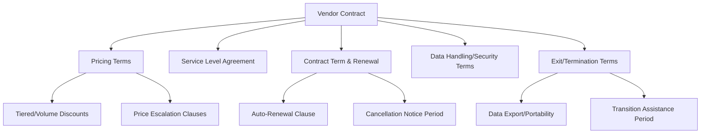
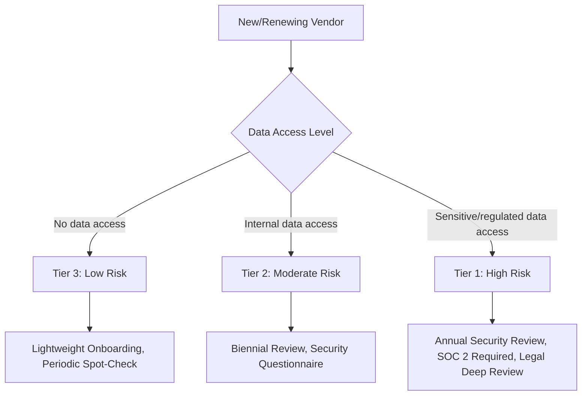
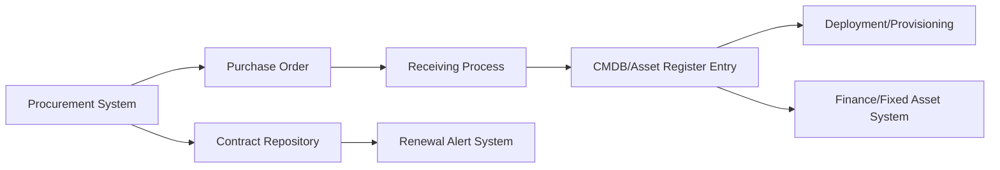

## Procurement and Vendor Management for IT Assets

### Overview

Procurement and Vendor Management for IT Assets is the discipline governing how an organization sources, purchases, contracts, and manages relationships with the suppliers of hardware, software, and services throughout the asset lifecycle. It sits at the front end of the asset lifecycle — decisions made here (contract terms, vendor selection, negotiated pricing, support agreements) create downstream consequences for cost, compliance, and operational risk that persist for the entire life of the asset.

### The Procurement Lifecycle

```mermaid
flowchart LR
    A[Demand Identification] --> B[Requirements Definition]
    B --> C[Vendor Sourcing/RFx]
    C --> D[Evaluation & Selection]
    D --> E[Negotiation]
    E --> F[Contract Execution]
    F --> G[Purchase Order & Fulfillment]
    G --> H[Receiving & Asset Onboarding]
    H --> I[Ongoing Vendor Management]
    I --> J[Renewal/Renegotiation or Offboarding]
```

#### Stage Details

**Demand Identification**: A business need is identified — new hardware for a growing team, a software tool to fill a capability gap, or a service contract renewal decision point.

**Requirements Definition**: Technical, security, and business requirements are documented, ideally including total cost of ownership considerations, not just sticker price.

**Vendor Sourcing (RFx)**: Formal solicitation processes — Request for Information (RFI), Request for Proposal (RFP), or Request for Quote (RFQ) — depending on complexity and spend threshold.

**Evaluation & Selection**: Vendors are scored against defined criteria (see scoring framework below), including security posture review for anything handling data.

**Negotiation**: Pricing, terms, SLAs, and contractual protections are negotiated before signature.

**Contract Execution**: Legal review and formal signature, establishing the binding terms.

**Purchase Order & Fulfillment**: Formal PO issuance and vendor fulfillment against agreed terms.

**Receiving & Asset Onboarding**: Physical or digital receipt, verification against PO, and entry into the asset inventory/CMDB (linking procurement to the broader asset lifecycle).

**Ongoing Vendor Management**: Performance monitoring, relationship management, and support ticket escalation for the life of the contract.

**Renewal/Offboarding**: Data-driven renewal decision or formal offboarding, feeding back into demand identification for replacement needs.

### RFx Process Selection

| Type | Purpose | When to Use |
| --- | --- | --- |
| RFI (Request for Information) | Gather general vendor/market information | Early-stage exploration, unclear requirements |
| RFP (Request for Proposal) | Solicit detailed solutions against defined requirements | Complex purchases, significant spend, differentiated vendor offerings |
| RFQ (Request for Quote) | Solicit pricing for well-defined, standardized items | Commodity purchases, requirements already fixed |

**Key Points**

- Skipping straight to RFQ for a poorly-defined requirement is a common cause of vendor mismatches — RFI/RFP stages exist specifically to surface requirements the buying organization didn't initially know to specify
- RFx thresholds (spend levels that trigger formal competitive processes) should be defined in procurement policy to prevent inconsistent application

### Vendor Evaluation Framework

Vendor selection should weigh multiple dimensions beyond price, since the lowest-cost option often carries hidden total-cost-of-ownership or risk exposure.

$$\text{Vendor Score} = w_1 \cdot \text{Price/TCO} + w_2 \cdot \text{Security Posture} + w_3 \cdot \text{Support/SLA Quality} + w_4 \cdot \text{Financial Stability} + w_5 \cdot \text{Strategic Fit}$$

| Dimension | Evaluation Criteria |
| --- | --- |
| Price/TCO | Upfront cost, ongoing fees, hidden costs (implementation, training, integration) |
| Security posture | SOC 2/ISO 27001 certification, penetration test history, data handling practices |
| Support/SLA quality | Response time commitments, escalation paths, published uptime history |
| Financial stability | Vendor viability risk — will they exist to honor multi-year commitments |
| Strategic fit | Roadmap alignment, integration compatibility, existing vendor relationship consolidation |

**Key Points**

- Security posture review should occur *before* contract signature, not after — retrofitting security requirements into an already-signed contract has far weaker negotiating leverage
- Vendor financial stability assessment matters disproportionately for smaller/newer vendors on multi-year contracts, since vendor failure mid-contract creates both operational disruption and data continuity risk

### Total Cost of Ownership (TCO) Analysis

$$\text{TCO} = \text{Purchase Price} + \text{Implementation Cost} + \sum_{t=1}^{n} \frac{\text{Annual Support/Maintenance}_t + \text{Operating Cost}_t}{(1+r)^t} + \text{Decommission Cost} - \text{Residual Value}$$

Where $r$ is the discount rate applied for multi-year cost comparison and $n$ is the asset's expected useful life in years.

**Example**

Two vendor proposals for a hardware refresh of 200 laptops:

- Vendor A: $1,200/unit upfront, 3-year warranty included, estimated 4-year useful life
- Vendor B: $950/unit upfront, warranty is year 1 only, extended warranty available at $150/year, same 4-year useful life

Vendor A TCO per unit: $1,200 (no additional warranty cost needed across the 4-year period, assuming warranty covers years 1-3, with year 4 unprotected in both scenarios for comparability)

Vendor B TCO per unit: $950 + ($150 × 3 years of extended warranty for years 2-4) = $950 + $450 = $1,400

Despite Vendor B's lower sticker price, Vendor A represents lower total cost of ownership once warranty coverage is normalized — a comparison that a price-only evaluation would have missed.

### Contract Structures and Key Terms

#### Critical Contract Terms to Negotiate

| Term | Why It Matters |
| --- | --- |
| Auto-renewal and notice period | Missing cancellation windows locks in unwanted renewal terms |
| Price escalation caps | Prevents uncontrolled year-over-year price increases on renewal |
| SLA remedies/penalties | Defines what recourse exists when vendor fails to meet committed service levels |
| Data ownership and portability | Ensures the organization retains rights to its own data and can export it |
| Termination for convenience vs. cause | Determines flexibility to exit if the relationship isn't working |
| Liability caps and indemnification | Allocates financial risk in the event of vendor-caused harm/breach |
| Audit rights | Allows verification of vendor security/compliance claims |
| Most-favored-customer/benchmarking clauses | Protects against paying above-market rates over time |

**Key Points**

- Auto-renewal clauses without a negotiated cap on price escalation are a common source of budget surprise at renewal — this is the contractual root cause of many of the renewal-management challenges covered under SaaS and Subscription Management
- "Termination for convenience" clauses (ability to exit without cause, typically with notice) provide materially more flexibility than contracts only allowing "termination for cause" (requiring proof of vendor breach)

### Vendor Risk Tiering

Not all vendors warrant the same level of ongoing scrutiny — risk-based tiering focuses limited vendor management resources where they matter most.

**Key Points**

- Risk tiering criteria typically combine data sensitivity accessed, criticality of the service to business operations, and financial spend level
- Tier 1 (high-risk) vendors typically warrant continuous or annual reassessment rather than a one-time onboarding review, since a vendor's security posture and financial stability can change materially over a multi-year contract

### Ongoing Vendor Performance Management

**Key Points**

- SLA compliance tracking (uptime commitments, response time commitments) should be monitored continuously against actual vendor performance, not only reviewed reactively when problems occur
- Quarterly or periodic Vendor Business Reviews (VBRs) for strategic/high-spend vendors provide a structured forum for addressing performance issues, roadmap alignment, and relationship health before they become contract disputes
- Vendor scorecards — tracking metrics like SLA adherence, support ticket resolution time, and invoice accuracy over time — create an objective performance record that strengthens negotiating position at renewal

### Integration with Asset Lifecycle Systems

**Key Points**

- Procurement data should flow directly into the asset inventory/CMDB at receiving time, establishing the asset record with accurate cost, vendor, and warranty data from the point of origin rather than requiring manual re-entry later
- Contract repository integration with a renewal alert system (tracking notice periods and expiration dates centrally) is the structural fix for the missed-cancellation-window problem common across both hardware maintenance contracts and SaaS subscriptions

### Common Pitfalls

- **Evaluating on price alone**: Ignoring TCO, security posture, and vendor stability in favor of lowest upfront cost frequently produces higher long-term cost or risk
- **Decentralized, ungoverned purchasing**: Allowing purchases below a certain threshold to bypass procurement entirely is a major contributor to shadow IT and vendor sprawl (see Shadow IT Discovery and Governance)
- **Missing auto-renewal notice windows**: Without centralized contract tracking, notice deadlines are easy to miss, resulting in unwanted renewal at potentially escalated pricing
- **No formal vendor offboarding process**: Failing to formally terminate contracts, revoke vendor access, and confirm data deletion/return when a relationship ends leaves both cost and security exposure
- **Security review as a formality after selection**: Conducting security review only after a vendor has effectively already been chosen removes real negotiating leverage to require remediation of findings
- **Siloed procurement and asset management systems**: When procurement and CMDB/ITAM systems don't integrate, asset records are created with incomplete or manually re-entered (and therefore error-prone) origin data

**Next Steps**

- SaaS and Subscription Management
- Vendor Risk Management and Third-Party Security Assessments
- Contract Lifecycle Management (CLM) System Implementation
- Hardware Asset Receiving and Onboarding Workflows
- Total Cost of Ownership Modeling for IT Assets
- Vendor Offboarding and Contract Termination Procedures
- IT Procurement Policy and Purchasing Threshold Governance
- Software Asset Management and License Compliance