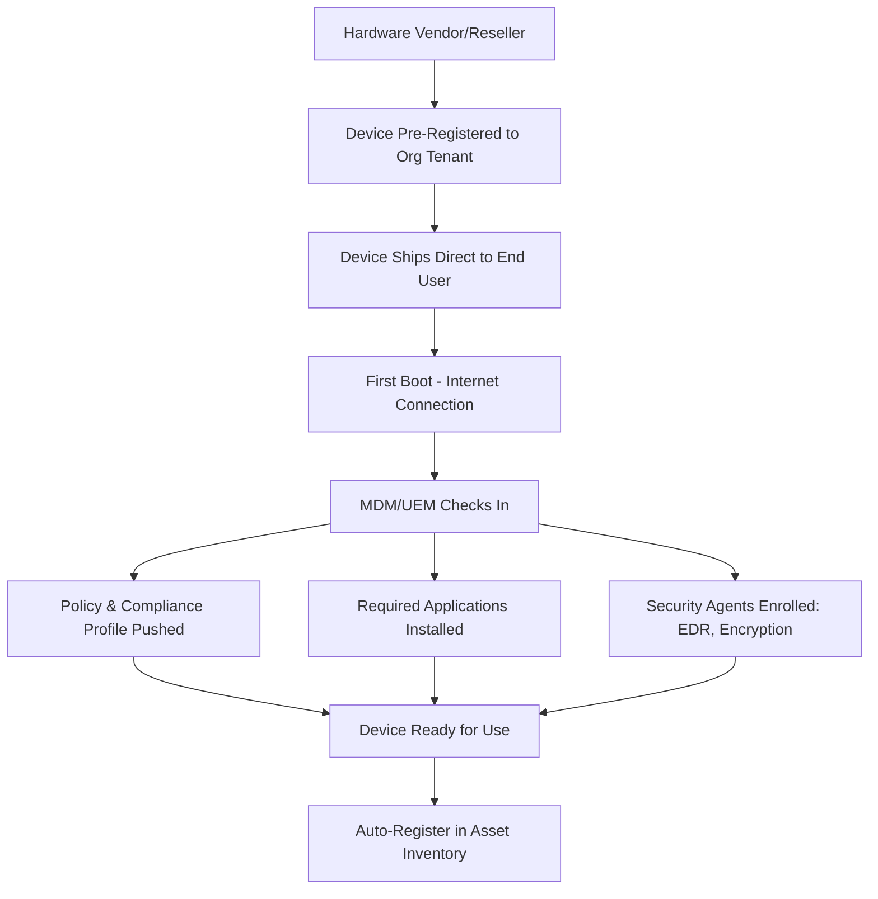
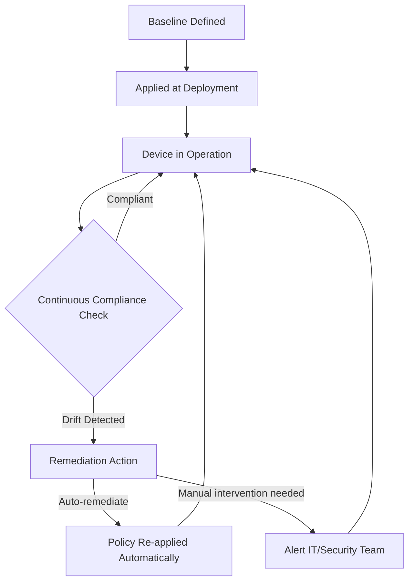
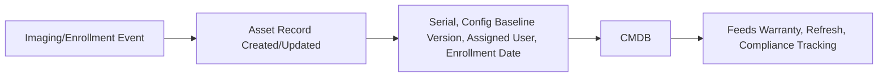

## Deployment, Imaging, and Configuration Standards

### Overview

Deployment, Imaging, and Configuration Standards govern how IT assets — primarily endpoint devices (laptops, desktops, mobile devices) and servers — are prepared, configured, and delivered into a working, secured, and compliant state before reaching an end user or production environment. This stage of the asset lifecycle transforms a newly received, generic device from procurement into a standardized, organization-ready asset, and establishes the configuration baseline that all subsequent patching, monitoring, and compliance activity is measured against.

### Why Standardization Matters

**Key Points**

- Unstandardized, ad hoc device configuration multiplies support burden — every inconsistently configured device becomes a unique troubleshooting case rather than a known, reproducible baseline
- Security baselines (encryption, endpoint protection, patch level) must be consistently applied at deployment time, since gaps introduced at provisioning tend to persist for the device's entire operational life if not caught early
- Standardized configuration is a prerequisite for reliable asset inventory and compliance reporting — accurately reporting "what software/settings exist on this fleet" is far harder when every device was configured independently

### The Deployment Lifecycle

### Imaging Approaches

| Approach | Mechanism | Strengths | Limitations |
| --- | --- | --- | --- |
| Traditional imaging | A pre-built, complete OS image (with software/settings baked in) is captured and deployed to new hardware | Fast deployment, fully controlled state | Image maintenance burden grows over time, hardware-driver compatibility issues across models |
| Zero-touch provisioning | Device auto-enrolls and configures itself on first boot via cloud-based MDM, pulling policy/apps over the network | Minimal IT hands-on-device time, supports remote/distributed deployment | Requires reliable internet connectivity at first boot, dependent on vendor enrollment programs |
| Configuration-as-code (declarative) | Desired-state configuration is defined in code/policy and continuously enforced/reconciled | Auditable, version-controlled, self-healing against drift | Requires more upfront tooling investment and policy authoring discipline |

**Key Points**

- Traditional monolithic imaging has substantially declined in favor of zero-touch provisioning, particularly for laptops, since it eliminates the need for physical device handling before shipping directly to end users — especially relevant for distributed/remote workforces
- Vendor zero-touch enrollment programs (e.g., Apple Business Manager/Automated Device Enrollment, Windows Autopilot, Android Enterprise zero-touch) allow devices to be pre-associated with an organization's MDM at the point of purchase, so a device ships directly from the vendor to the end user and self-configures on first power-on

### Zero-Touch Provisioning Architecture

**Key Points**

- This architecture shifts the "configuration moment" from a physical IT staging process to an automated, policy-driven enrollment event, which also means the device's inventory record can be created automatically at enrollment rather than requiring manual entry
- MDM/UEM (Unified Endpoint Management) platforms — Microsoft Intune, Jamf, Google Workspace endpoint management, VMware Workspace ONE — serve as the policy enforcement and orchestration layer for this process

### Configuration Baseline Standards

A configuration baseline defines the required settings, software, and security controls that every device of a given type/role must have.

#### Common Baseline Components

| Component | Examples |
| --- | --- |
| OS hardening settings | Disabled unnecessary services, password/screen-lock policy, firewall rules |
| Disk encryption | BitLocker (Windows), FileVault (macOS), enabled and key-escrowed |
| Endpoint protection | EDR/antivirus agent installed and reporting |
| Patch/update policy | Automatic update configuration, patch compliance window |
| Standard software bundle | Required productivity, security, and management agents |
| Network configuration | VPN client, certificate-based network authentication |
| Compliance profile | Regulatory-specific settings (e.g., additional controls for regulated data handling roles) |

**Key Points**

- Industry security benchmarks (such as CIS Benchmarks or vendor-published hardening guides) are commonly used as the starting reference point for baseline definitions rather than building hardening standards entirely from scratch
- Baselines are typically role-based rather than one-size-fits-all — a developer workstation baseline may differ from a call-center kiosk baseline or a finance-team baseline handling more sensitive data, reflecting different risk and functional profiles

### Configuration Drift and Enforcement

**Key Points**

- Configuration drift — the gradual divergence of a device's actual state from its defined baseline, whether from user changes, failed updates, or software conflicts — is expected over time and requires continuous monitoring, not just a one-time deployment check
- Modern MDM/UEM platforms support automated remediation (re-applying policy when drift is detected) for many settings, reducing dependence on manual IT intervention for common drift scenarios
- Drift monitoring feeds directly into both security posture (are controls still active) and asset inventory accuracy (does the recorded configuration match reality)

### Server and Infrastructure Configuration Standards

While endpoint imaging focuses on end-user devices, equivalent standardization applies to server/infrastructure provisioning, typically through different tooling.

| Layer | Standardization Approach |
| --- | --- |
| Golden image/AMI | A pre-hardened base OS image used as the starting point for all server deployments |
| Configuration management | Declarative tools (Ansible, Puppet, Chef, Salt) that enforce desired-state configuration continuously |
| Infrastructure-as-Code | Terraform/CloudFormation/Pulumi defining not just the server but its full surrounding environment declaratively |
| Immutable infrastructure | Servers/containers are never modified in place; changes are made by replacing with a newly-built image (connects directly to Container and Ephemeral Asset Tracking practices) |

**Key Points**

- Golden image pipelines (automated, regularly-rebuilt base images with current patches and hardening baked in) reduce the "patch drift" problem where servers built from an old image start already out of date
- The shift toward immutable infrastructure for servers mirrors the shift toward zero-touch/declarative provisioning for endpoints — both reduce reliance on manual, in-place configuration that's prone to drift and inconsistency

### Quality Verification and Handoff

**Key Points**

- A deployment quality check — verifying encryption is active, required software is present, security agents are reporting, and the asset is correctly registered in inventory — should occur before handoff, catching provisioning failures before they reach the end user or production
- Automated compliance scanning at the point of deployment (rather than relying solely on the imaging/enrollment process succeeding silently) provides a verification layer independent of the provisioning process itself

**Example**

A zero-touch provisioning pipeline deploys 50 laptops to new hires starting the same week. An automated post-enrollment compliance check flags 3 devices where the disk encryption key failed to escrow to the MDM console due to a transient enrollment error.

- Without this verification step, these 3 devices would appear "compliant" in casual review (the encryption itself is active on-device) while actually representing a recovery risk — if the user is later locked out, no organizational recovery key exists
- Catching this at deployment-verification time, rather than discovering it during an actual lockout incident, is the specific value of a dedicated quality-check stage

### Integration with Asset Inventory

**Key Points**

- The deployment/enrollment event is the ideal trigger point for creating or updating the authoritative asset inventory record, since it's the moment the device transitions from "procured" to "in service" with a known configuration state and assigned owner
- Recording which baseline version was applied (not just "compliant/non-compliant") supports later root-cause analysis when a specific baseline version is found to have introduced an issue across a device cohort

### Common Pitfalls

- **Treating imaging as a one-time event with no ongoing drift monitoring**: A device compliant at deployment can silently fall out of compliance over months of operation without continuous checking
- **One baseline for all device roles**: Applying an identical configuration to fundamentally different use cases (developer workstation vs. shared kiosk) either over-restricts some users or under-secures others
- **No quality verification before handoff**: Assuming zero-touch enrollment succeeded without automated post-enrollment checks allows silent provisioning failures (like the encryption key-escrow example above) to reach production undetected
- **Manual, ad hoc server configuration outside IaC/config management**: "ClickOps" server changes made outside the declared configuration create the same drift and audit problems at the infrastructure layer that unmanaged endpoint configuration creates at the device layer
- **Golden images that go stale**: Base images not regularly rebuilt with current patches mean every new deployment starts already behind on security updates, undermining the purpose of standardization

**Next Steps**

- Procurement and Vendor Management for IT Assets
- Unified Endpoint Management (UEM/MDM) Platform Architecture
- CIS Benchmarks and Security Hardening Baseline Development
- Configuration Management Tooling (Ansible, Puppet, Chef, Salt)
- Golden Image Pipeline Design and Automated Rebuild Cadence
- Zero-Touch Enrollment Programs (Autopilot, Apple Business Manager)
- Container and Ephemeral Asset Tracking
- IT Asset Decommissioning and Secure Data Wiping