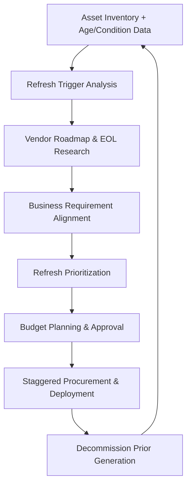
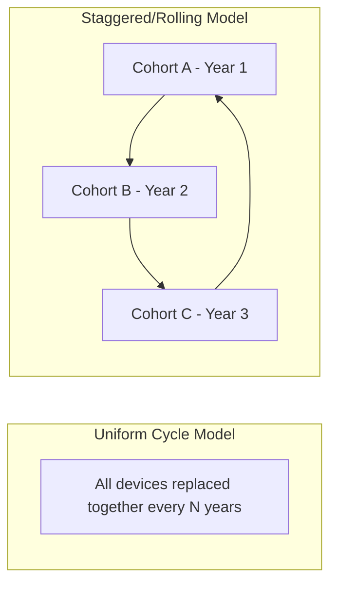
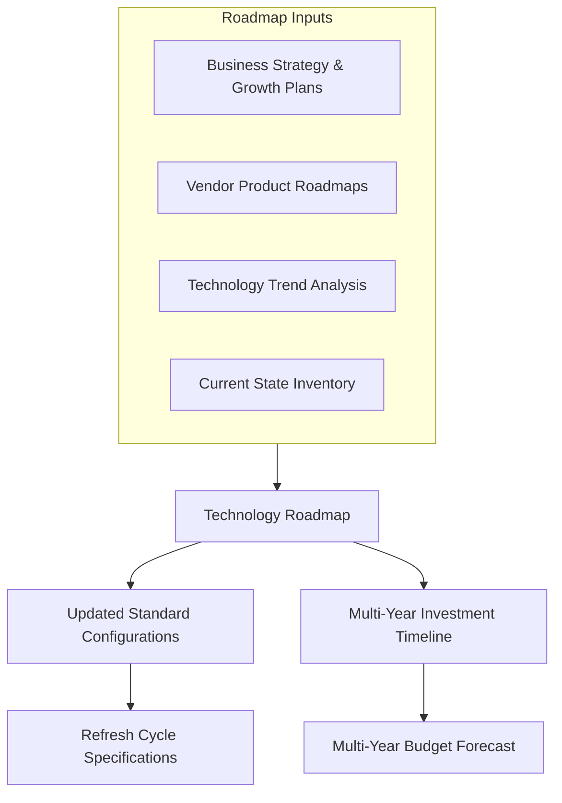
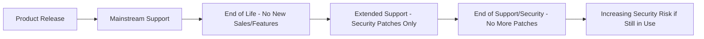

## IT Asset Refresh Cycles and Technology Roadmapping

### Overview

IT Asset Refresh Cycles and Technology Roadmapping is the discipline of planning the systematic replacement of IT assets before they become a liability — whether through performance degradation, rising maintenance cost, security exposure from end-of-support software, or misalignment with evolving business needs. Rather than replacing assets reactively when they fail, mature organizations plan refresh cycles proactively, informed by asset lifecycle data, vendor support timelines, and forward-looking technology roadmaps that align IT investment with business strategy.

### Why Proactive Refresh Planning Matters

**Key Points**

- Reactive replacement (waiting for failure) causes unplanned downtime, emergency procurement at worse pricing, and unpredictable budget spikes
- Aging hardware has a well-documented failure-rate curve — reliability tends to degrade non-linearly as devices approach and exceed their designed useful life, making late-cycle assets a growing operational risk
- End-of-support software/OS versions stop receiving security patches, creating compounding vulnerability exposure the longer a refresh is delayed past that date
- Refresh planning enables budget predictability — a known, staggered replacement schedule is far easier to forecast than ad hoc emergency purchases

### The Refresh Planning Framework

### Refresh Trigger Categories

| Trigger Type | Description | Example |
| --- | --- | --- |
| Age-based | Asset reaches a defined useful-life threshold | Laptops replaced at 4 years per policy |
| Warranty/support expiration | Vendor support or warranty coverage ends | Server maintenance contract lapses |
| End-of-life/end-of-support (EOL/EOS) | Vendor stops releasing security patches | OS version reaches EOS date |
| Performance-based | Asset no longer meets performance requirements for its workload | Laptop can't run current required software acceptably |
| Failure-rate threshold | Repair frequency/cost exceeds a defined threshold relative to replacement cost | Device has 3+ hardware repairs in 12 months |
| Business/strategic driver | Roadmap shift requires different capability | Migration to a new platform requires compatible hardware |

**Key Points**

- Multiple triggers often overlap for a given asset (e.g., a device nearing both age threshold and warranty expiration simultaneously) — refresh prioritization models typically combine trigger signals rather than acting on any single one in isolation
- EOL/EOS-driven refresh is generally treated as higher urgency than age-based refresh alone, since it carries active, compounding security risk rather than just declining performance

### Useful Life Determination

$$\text{Useful Life} = f(\text{Vendor Recommendations}, \text{Historical Failure Data}, \text{Workload Requirements}, \text{TCO Crossover Point})$$

**Key Points**

- Useful life policies (commonly 3-5 years for laptops/desktops, longer for servers/network infrastructure, and highly variable for specialized equipment) are typically set per asset category based on a combination of vendor guidance, internal historical failure data, and financial depreciation schedules
- The TCO crossover point — where cumulative maintenance/support cost begins to exceed the cost of replacement — is a common quantitative anchor for refresh timing, particularly for higher-cost assets like servers

**Example**

A server class has a $15,000 purchase price and an average $1,200/year in maintenance/support contract cost in years 1-3, rising to $3,500/year in years 4-5 as the vendor moves the hardware to extended/legacy support pricing.

- Cumulative 5-year cost: $15,000 + (3 × $1,200) + (2 × $3,500) = $15,000 + $3,600 + $7,000 = $25,600
- If a comparable replacement server costs $16,000 with similar year 1-3 maintenance costs, the crossover point where continuing to maintain the old server costs more than replacing it typically falls somewhere in year 4-5 — informing the refresh timing decision rather than defaulting to a purely calendar-based cycle

### Refresh Cycle Models

| Model | Description | Advantages | Trade-offs |
| --- | --- | --- | --- |
| Uniform/bulk refresh | Entire fleet replaced simultaneously on a fixed cycle | Simplicity, consistent fleet, single negotiation event | Large budget spike, deployment logistics strain, single point of vendor dependency |
| Staggered/rolling refresh | Fleet divided into cohorts, refreshed on a rotating schedule | Smooths budget impact, reduces deployment burden, easier to absorb technology changes incrementally | Fleet heterogeneity, more complex tracking of multiple concurrent generations |
| Just-in-time/triggered | Replacement driven purely by individual trigger events, not a fixed schedule | Avoids replacing assets still performing well | Less budget predictability, requires robust trigger monitoring |

**Key Points**

- Staggered/rolling models are the most commonly adopted approach for large endpoint fleets specifically because they convert a large periodic budget spike into a smaller, predictable annual/quarterly spend — easier for finance to plan around
- A hybrid approach — staggered baseline cycle with trigger-based exceptions (early replacement for failed/EOS devices, deferred replacement for genuinely low-usage devices) — is common in mature programs rather than pure adherence to either model alone

### Technology Roadmapping

Refresh cycles answer "when do we replace," while technology roadmapping answers "what do we replace it with" — aligning asset decisions to forward-looking business and technology strategy rather than simple like-for-like replacement.

**Key Points**

- A technology roadmap typically spans multiple years (commonly 3-5) and identifies planned platform transitions, standard configuration evolution, and major architectural shifts (e.g., planned migration from on-premises to cloud infrastructure, or a planned OS version transition) that should inform refresh specifications, not just refresh timing
- Vendor product roadmaps and EOL announcements are a primary external input — refresh planning that ignores publicly announced vendor EOL timelines risks being caught off guard by mandatory migrations
- Roadmapping should be a living document reviewed at least annually, since both business strategy and vendor roadmaps shift over the planning horizon

### End-of-Life/End-of-Support Tracking

**Key Points**

- EOL (End of Life — vendor stops selling/actively developing) and EOS (End of Support/Security — vendor stops providing patches) are distinct milestones, and EOS is the more security-critical date, since a product can be past EOL but still receiving security patches during an extended support phase
- Maintaining a centralized EOL/EOS tracking register — cross-referencing the asset inventory against published vendor lifecycle dates — allows proactive refresh planning well ahead of the deadline rather than discovering an urgent, forced migration at the EOS date itself
- Extended/custom support agreements (available from some vendors for a premium after standard EOS) can serve as a bridge for assets that can't be refreshed in time, but should be treated as a temporary bridge rather than a long-term strategy given typically escalating cost

### Prioritization Scoring for Refresh Queues

When budget doesn't allow simultaneous refresh of every eligible asset, a scoring model helps prioritize the queue.

$$\text{Refresh Priority Score} = w_1 \cdot \text{Age/EOL Urgency} + w_2 \cdot \text{Failure History} + w_3 \cdot \text{Business Criticality} + w_4 \cdot \text{User Impact}$$

**Key Points**

- Business-critical systems and high-risk EOS assets typically warrant priority over general fleet age-based replacement even within the same budget cycle
- User-reported performance complaints, correlated against objective device age/spec data, provide a useful practical signal to supplement purely data-driven scoring

### Budget Forecasting for Refresh Programs

**Key Points**

- Multi-year refresh forecasting, built from the asset inventory's age distribution and category-specific useful-life policies, allows finance to plan capital expenditure well in advance rather than treating refresh as an unplanned request each cycle
- Leasing versus purchasing models materially affect refresh cadence flexibility — leased hardware often has refresh built into the contract term, while purchased hardware requires separate capital planning for replacement
- Currency/pricing volatility and component supply constraints (observed periodically across the hardware industry) are external factors that can affect refresh budget accuracy and timing, and should be factored as planning risk rather than assumed away

### Sustainability and Decommission Considerations

**Key Points**

- Refresh planning connects directly to IT Asset Disposition (ITAD) practices — the outgoing generation of assets requires secure data wiping, and ideally responsible recycling/resale, which should be planned as part of the same refresh project rather than as an afterthought
- Extending useful life where reasonable (rather than defaulting to the shortest possible cycle) has both direct cost benefits and environmental/sustainability benefits increasingly factored into corporate ESG reporting

### Common Pitfalls

- **Purely calendar-based refresh with no trigger flexibility**: Rigidly replacing every device at exactly N years regardless of actual condition or EOS status either wastes budget on still-healthy assets or leaves genuinely at-risk assets in service too long
- **No EOL/EOS tracking register**: Discovering a critical EOS date only when it's imminent forces rushed, poorly-negotiated emergency procurement
- **Roadmapping done in isolation from business strategy**: A technology roadmap built purely on vendor announcements without business input risks specifying standard configurations misaligned with where the business is actually heading
- **Ignoring TCO crossover analysis**: Continuing to maintain aging assets well past the point where maintenance cost exceeds replacement cost, purely because the original purchase is treated as a "sunk cost we already paid for"
- **Bulk refresh budget shock**: Uniform-cycle models without staggering can create large, difficult-to-absorb budget spikes that make refresh programs vulnerable to being deferred or cut during budget-tightening periods

**Next Steps**

- Procurement and Vendor Management for IT Assets
- IT Asset Disposition (ITAD) and Secure Data Wiping
- Deployment, Imaging, and Configuration Standards
- Lease vs. Purchase Financial Modeling for IT Assets
- End-of-Life/End-of-Support Tracking Register Design
- Capital Expenditure Forecasting for Technology Programs
- Sustainability and ESG Reporting for IT Asset Lifecycle
- Total Cost of Ownership Modeling for IT Assets