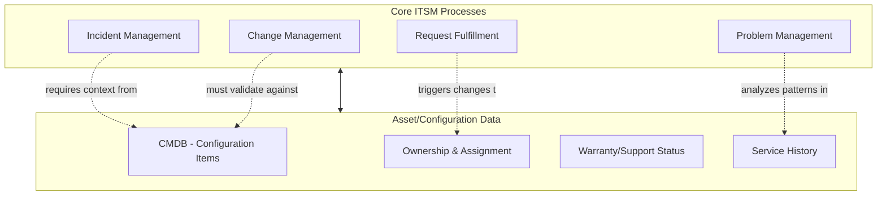
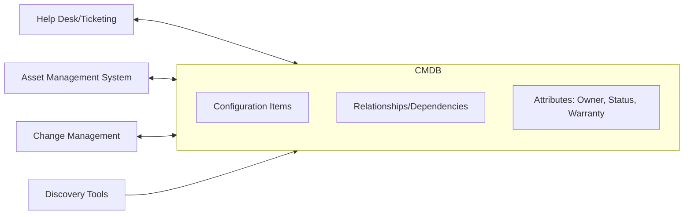
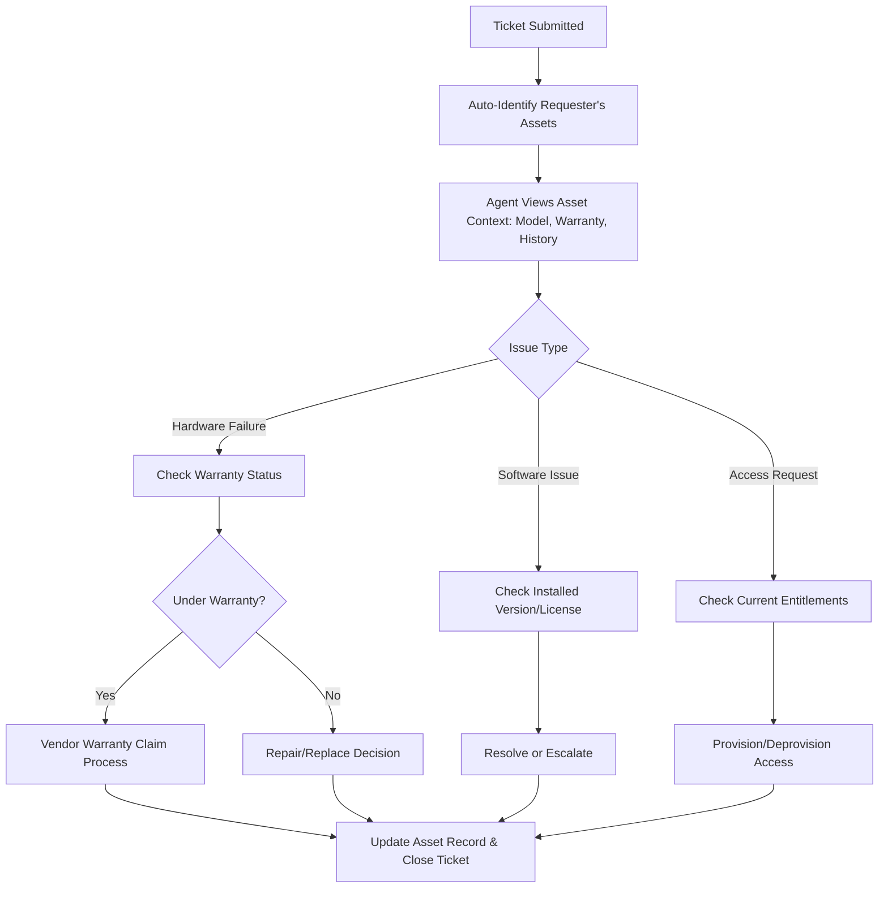
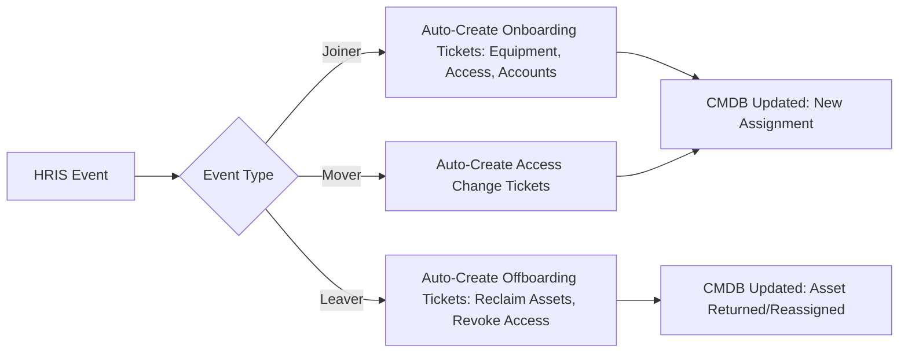

## IT Service Management Integration and the Help Desk

### Overview

IT Service Management (ITSM) Integration and the Help Desk addresses how asset management connects with the operational support function that handles day-to-day incidents, requests, and changes. Asset data and service management data are deeply interdependent: a help desk agent resolving an incident needs to know what hardware/software the user has, while asset management needs service desk interaction history to understand an asset's real-world reliability, usage, and condition. When these systems are integrated rather than siloed, both functions become significantly more effective; when they're disconnected, each operates with an incomplete picture.

### ITSM Core Processes and Their Asset Dependency

**Key Points**

- **Incident Management** (restoring service after an unplanned disruption) is faster and more accurate when the agent can immediately see the affected asset's configuration, warranty status, and recent change history rather than having to ask the user or search separately
- **Request Fulfillment** (standard, pre-approved requests like new equipment or software access) directly creates or modifies asset records — a hardware request fulfilled should automatically update the CMDB with the new assignment
- **Change Management** (controlled implementation of modifications to production systems) depends on accurate configuration item (CI) data to assess the blast radius and risk of a proposed change
- **Problem Management** (root-cause analysis of recurring incidents) benefits from asset-level historical data to identify patterns — e.g., a specific hardware model or software version generating disproportionate incident volume

### The CMDB as the Integration Point

The Configuration Management Database (CMDB) is the structural bridge between asset management and ITSM — it's simultaneously an asset inventory and a service-context database.

**Key Points**

- A Configuration Item (CI) is any component tracked in the CMDB — hardware, software instance, service, or logical grouping — with defined attributes and relationships to other CIs
- CI relationships (this application runs on this server, which is owned by this team, which supports this business service) are what enable impact analysis — understanding downstream effects of an incident or change
- CMDB data quality directly determines ITSM process quality: stale or incomplete CI data undermines incident triage, change risk assessment, and reporting regardless of how well-designed the ITSM workflows themselves are

### Ticket-to-Asset Linkage

**Key Points**

- Every incident and request ticket should link to the relevant CI(s) — the specific device, application, or service involved — rather than existing as free-text descriptions disconnected from the asset inventory
- This linkage enables asset-centric reporting: total tickets per asset, mean time between failures per hardware model, and support cost attribution per asset category
- Automated CI-lookup at ticket creation (auto-suggesting the requester's assigned assets based on their identity) reduces both agent effort and data entry error compared to manual asset selection

### Help Desk Workflow with Asset Context

**Example**

A user submits a ticket reporting their laptop won't power on. With asset-context integration, the agent's ticket view immediately shows:

- Device model, serial number, and purchase date (3 years, 2 months ago)
- Warranty status: expired 2 months prior
- Prior ticket history: one previous battery-related ticket 8 months ago

This context lets the agent immediately move to a repair-vs-replace decision (informed by the refresh-cycle policy and TCO crossover logic) rather than spending time gathering basic device information from the user — collapsing what might otherwise be a multi-step diagnostic conversation into an immediate, informed next action.

### Request Fulfillment and Asset Lifecycle Triggers

**Key Points**

- Standard service requests — new hire equipment, software license requests, access provisioning — are among the highest-volume ITSM ticket categories and directly drive asset lifecycle events (procurement triggers, license assignment, CMDB record creation)
- Well-integrated systems auto-generate the downstream asset action from the approved request (e.g., an approved "new laptop" request automatically creates a procurement/fulfillment task and pre-stages a CMDB record) rather than requiring separate manual asset-team follow-up
- This integration is what allows Request Fulfillment to feed directly into the Deployment, Imaging, and Configuration Standards process without a manual handoff gap between "ticket approved" and "device ordered"

### Joiner-Mover-Leaver (JML) Process Integration

The employee lifecycle is one of the highest-value integration points between ITSM/help desk and asset management, since it drives both service requests and asset assignment changes simultaneously.

**Key Points**

- HRIS-triggered automated ticket generation for joiners/movers/leavers (rather than relying on a manager or HR to remember to submit a manual request) closes a common and high-risk gap — particularly for leavers, where delayed offboarding leaves both hardware and software licenses unreclaimed
- This same integration pattern connects directly to the SaaS Management and license reclamation practices covered elsewhere — a leaver ticket should trigger both hardware return and SaaS license deprovisioning as parallel, linked actions

### Self-Service Portal and Asset Visibility

**Key Points**

- Modern ITSM platforms typically expose a self-service portal where employees can view their assigned assets, submit requests, and track ticket status without direct agent interaction for routine matters
- Self-service asset visibility (an employee confirming their own assigned equipment, license entitlements) reduces low-value "what do I have" inquiry tickets and improves the accuracy of self-reported issue tickets, since the user can reference their actual known configuration

### Reporting and Metrics at the Intersection

| Metric | Formula/Description | Value |
| --- | --- | --- |
| Mean Time to Resolution (MTTR) by asset type | Average ticket resolution time, segmented by hardware/software category | Identifies problematic asset categories needing refresh or replacement |
| Incident rate per asset | Tickets per asset per period | Surfaces specific units or models with disproportionate failure rates |
| First Contact Resolution (FCR) | % of tickets resolved without escalation, correlated with asset context availability | Measures whether asset integration is actually improving agent effectiveness |
| Cost per ticket by asset category | Support cost attributed to asset type | Feeds TCO analysis and refresh prioritization |

**Key Points**

- Incident-rate-per-asset-model data is a valuable, often underused input into procurement vendor evaluation — a hardware model generating disproportionate support tickets is a quantifiable signal for future purchasing decisions, closing the loop back to Procurement and Vendor Management
- These cross-functional metrics are only obtainable when ticket and asset data are genuinely linked at the system level, not just informally cross-referenced by agents

### Common Pitfalls

- **Siloed ticketing and asset systems with no integration**: Agents working from a ticketing system with no visibility into asset data must manually gather basic device/warranty information on every call, increasing resolution time and error rate
- **Free-text asset references instead of CI linkage**: Tickets that describe the affected asset in free text rather than linking to an actual CMDB record make asset-level reporting and trend analysis effectively impossible
- **Manual JML process reliance**: Depending on managers or HR to remember to submit offboarding tickets, rather than automated HRIS-triggered workflows, is a leading cause of delayed asset reclamation and lingering access for departed employees
- **CMDB treated as a one-time discovery project rather than continuously maintained**: A CMDB populated once and never kept current through ongoing ITSM ticket updates and discovery re-scans degrades in accuracy quickly, undermining every process that depends on it
- **No feedback loop from ticket data to procurement/refresh decisions**: Failing to analyze incident patterns by asset model/type means support-cost signal that should inform future purchasing and refresh prioritization goes unused

**Next Steps**

- Procurement and Vendor Management for IT Assets
- IT Asset Refresh Cycles and Technology Roadmapping
- CMDB Design, Data Quality, and Discovery Integration
- Joiner-Mover-Leaver (JML) Process Automation
- Self-Service Portal Design and Adoption
- Change Management and Configuration Item Risk Assessment
- Deployment, Imaging, and Configuration Standards
- Problem Management and Root-Cause Trend Analysis