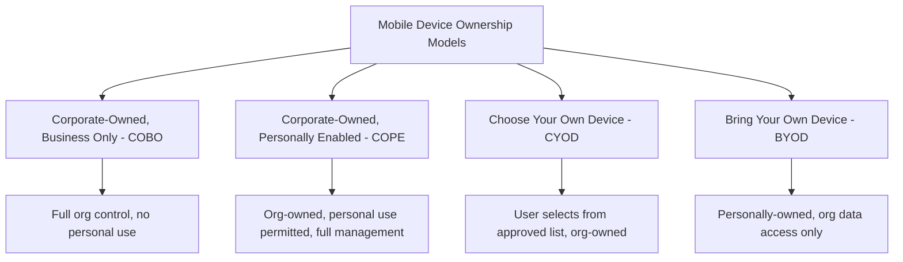
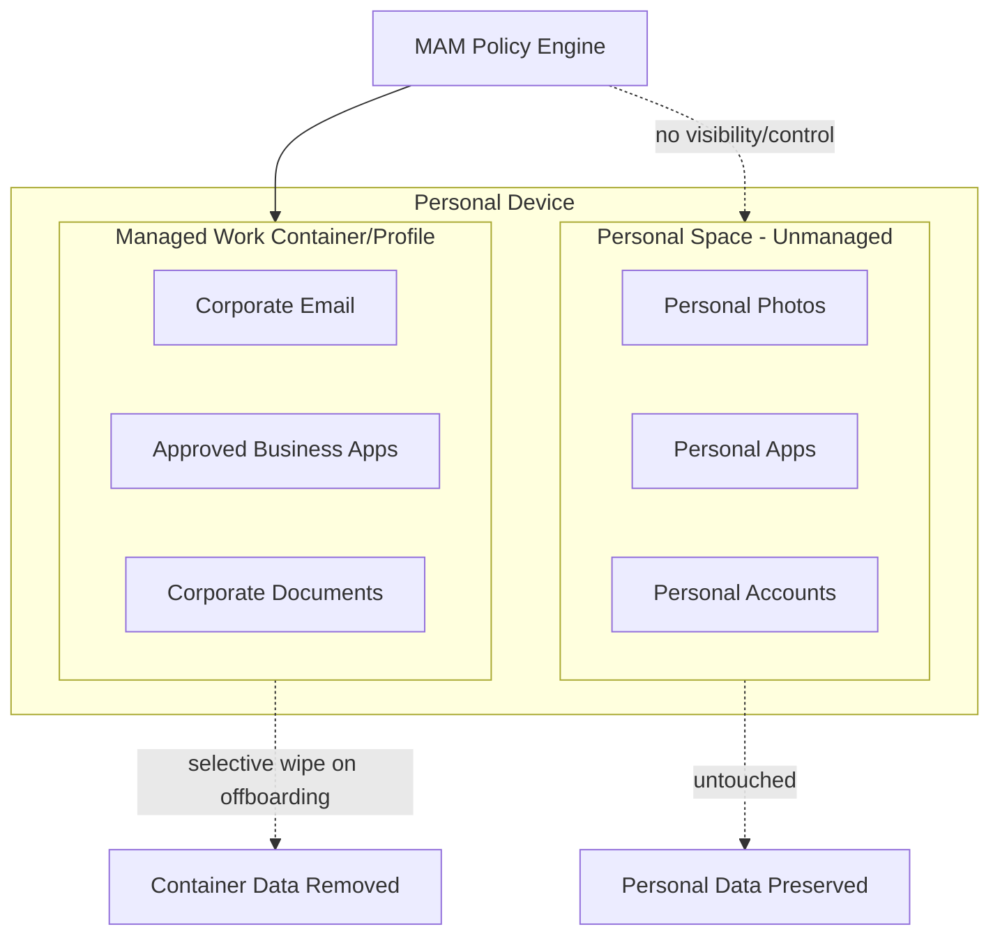
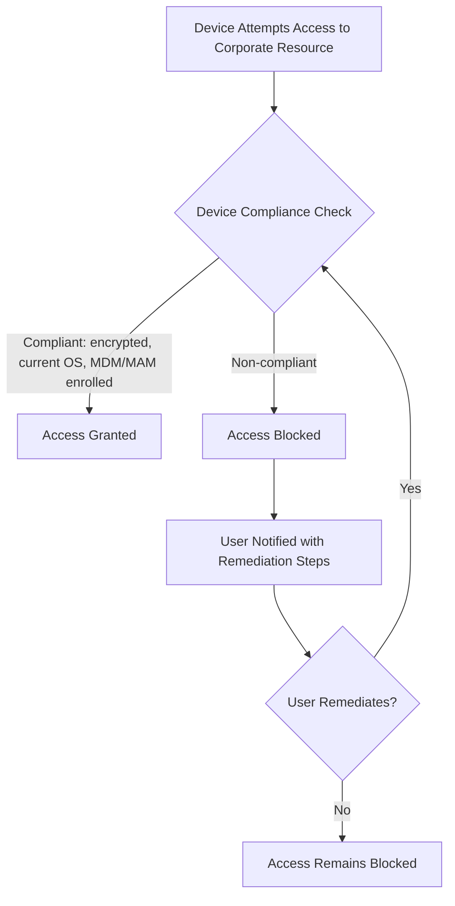
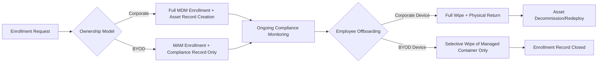

## Mobile Device Management and BYOD Asset Policy

### Overview

Mobile Device Management (MDM) and BYOD (Bring Your Own Device) Asset Policy addresses the governance, security, and inventory challenges specific to smartphones, tablets, and increasingly personally-owned devices that access organizational data and systems. Unlike traditional corporate-owned endpoints, mobile and BYOD assets introduce a fundamental tension: the organization needs enough control to protect its data and meet compliance obligations, while respecting that a personally-owned device (or even a corporate device with personal use) carries different privacy expectations than a fully corporate-managed laptop.

### Device Ownership Models

| Model | Ownership | Management Scope | Privacy Implications |
| --- | --- | --- | --- |
| COBO (Corporate-Owned, Business Only) | Organization | Full device management | No personal use expected; full visibility acceptable |
| COPE (Corporate-Owned, Personally Enabled) | Organization | Full device management, personal use allowed | Requires clear policy on what personal data/activity is visible to IT |
| CYOD (Choose Your Own Device) | Organization | Full device management | User has hardware choice within an approved catalog; same management depth as COBO |
| BYOD (Bring Your Own Device) | Employee | Partial/containerized management only | Significant privacy expectations; full-device management generally inappropriate |

**Key Points**

- The ownership model fundamentally determines the appropriate management depth — applying COBO-level full-device control (remote wipe of the entire device, full app inventory visibility) to a BYOD device is both a privacy overreach and, in many jurisdictions, a legal risk
- Organizations often operate multiple models simultaneously (e.g., COPE for most employees, BYOD as an opt-in alternative) rather than a single uniform policy

### MDM vs. UEM vs. MAM: Management Scope Distinctions

| Approach | Scope | Best Fit For |
| --- | --- | --- |
| MDM (Mobile Device Management) | Manages the entire device — OS settings, full wipe capability, device-level policy | Corporate-owned devices (COBO/COPE/CYOD) |
| MAM (Mobile Application Management) | Manages only specific organizational apps and their data, without touching the rest of the device | BYOD — enables org data control without full-device visibility |
| UEM (Unified Endpoint Management) | Single platform managing MDM, MAM, and traditional endpoint (laptop/desktop) management together | Organizations seeking one console across all device types and ownership models |

**Key Points**

- MAM's core value for BYOD is enabling "containerization" — organizational apps and data are managed and can be selectively wiped, while the rest of the personal device (photos, personal apps, personal accounts) remains entirely outside organizational visibility or control
- UEM has become the dominant platform category precisely because it lets IT apply the *appropriate* management depth (full MDM for corporate devices, MAM-only for BYOD) from a single administrative console rather than running separate disconnected tools

### BYOD Containerization Architecture

**Key Points**

- Platform-native implementations of this pattern include Android Enterprise's Work Profile (a genuinely separate managed profile on the device) and Apple's User Enrollment with Managed Apple Accounts (separating managed and personal data/iCloud accounts)
- Selective wipe — removing only the managed container's data and app access, leaving personal data untouched — is the standard offboarding mechanism for BYOD, in contrast to full-device wipe used for corporate-owned devices

### Core MDM/UEM Policy Capabilities

| Capability | Purpose |
| --- | --- |
| Passcode/biometric enforcement | Baseline device access security |
| Encryption enforcement | Ensures data at rest is protected |
| App allow/block listing | Controls which applications can access managed data |
| Conditional access | Blocks corporate resource access from non-compliant devices |
| Remote wipe (full or selective) | Data removal on loss, theft, or offboarding |
| OS version enforcement | Requires minimum OS version for security patch currency |
| Network/VPN configuration push | Automates secure connectivity setup |
| Jailbreak/root detection | Flags compromised devices as non-compliant |

### Conditional Access Integration

**Key Points**

- Conditional access policies — integrated with the identity provider (Azure AD/Entra ID, Okta) — enforce that only devices meeting defined compliance criteria can authenticate to corporate email, file storage, or applications, regardless of ownership model
- This shifts enforcement from "can we control the device" (harder to guarantee on BYOD) to "can we gate access based on device state" (achievable even with limited BYOD management depth), which is why conditional access is a particularly important control for BYOD environments specifically

### Mobile Asset Inventory Considerations

**Key Points**

- Corporate-owned mobile devices should be tracked in the same asset inventory/CMDB as other hardware — serial number, assignment, warranty, and lifecycle status — following the same principles as laptop/desktop asset management
- BYOD devices present a genuine inventory tension: the organization needs to track *that* a personal device is enrolled and compliant (for security/compliance reporting) without necessarily needing or wanting full hardware inventory detail about a device it doesn't own
- A pragmatic BYOD inventory record typically tracks enrollment status, compliance state, and managed-app access — not full hardware specifications — reflecting the more limited legitimate organizational interest in a personally-owned asset

### BYOD Policy Design Considerations

**Key Points**

- A written BYOD policy should explicitly define: what data/apps require MAM enrollment, what organizational visibility exists into the device (and explicitly what does not), what happens to organizational data upon offboarding, and any reimbursement/stipend arrangement for personal device use for business purposes
- Legal and regulatory considerations vary meaningfully by jurisdiction and industry — data privacy law, labor law around reimbursement for business use of personal property, and industry-specific regulations (e.g., financial services record-retention requirements applied to business communications on personal devices) all bear on policy design [Inference: given this variation, BYOD policy specifics should be developed with legal/compliance input rather than adopted as a generic template, though this is a reasonable operational inference rather than a documented universal requirement]
- Employee consent and clear communication about monitoring scope (what IT can and cannot see) is both a trust-building practice and, in many jurisdictions, a legal requirement for enrolling personal devices in any management capacity

### Lifecycle Events for Mobile/BYOD Assets

**Key Points**

- Offboarding workflow must branch by ownership model — treating a BYOD device the same as a corporate device at offboarding (attempting full wipe) is both technically inappropriate for the containerized management model and a significant policy/legal risk
- Lost or stolen device response similarly differs: corporate devices typically trigger full remote wipe, while BYOD devices trigger selective wipe of the managed container, since the organization has no legitimate claim over personal data on a lost personal device

### Common Pitfalls

- **Applying uniform management depth regardless of ownership model**: Full-device MDM policies pushed onto BYOD devices create privacy conflicts and can drive employees to circumvent enrollment entirely, undermining the security goal the policy was meant to achieve
- **No clear written BYOD policy before enrollment begins**: Ad hoc BYOD support without documented scope, data handling, and offboarding terms creates ambiguity that surfaces as disputes at the least convenient time — typically during offboarding or a security incident
- **Treating mobile as an afterthought to laptop/desktop asset management**: Excluding mobile devices from the same inventory, compliance, and lifecycle rigor applied to traditional endpoints leaves a substantial and growing gap in both asset visibility and security posture
- **No conditional access enforcement**: Relying purely on device enrollment without conditional access gating means non-compliant or unenrolled devices may still reach corporate resources through other paths
- **Full wipe attempted on BYOD during offboarding**: Beyond the technical mismatch with containerized management, this is a common source of employee relations issues and potential legal exposure if personal data is destroyed

**Next Steps**

- Deployment, Imaging, and Configuration Standards
- Conditional Access and Identity-Based Security Architecture
- IT Service Management Integration and the Help Desk
- Data Loss Prevention (DLP) for Mobile and Endpoint Data
- Joiner-Mover-Leaver (JML) Process Automation
- Unified Endpoint Management (UEM) Platform Selection
- Mobile Threat Defense (MTD) Integration
- Employee Privacy Policy and Legal Considerations in Device Monitoring