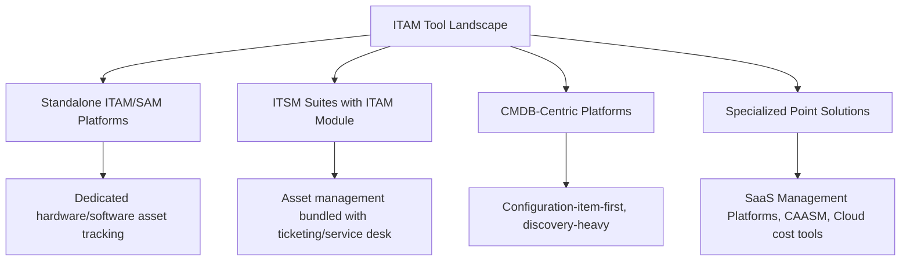
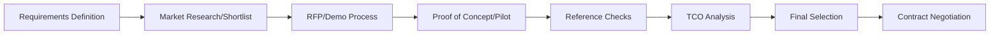
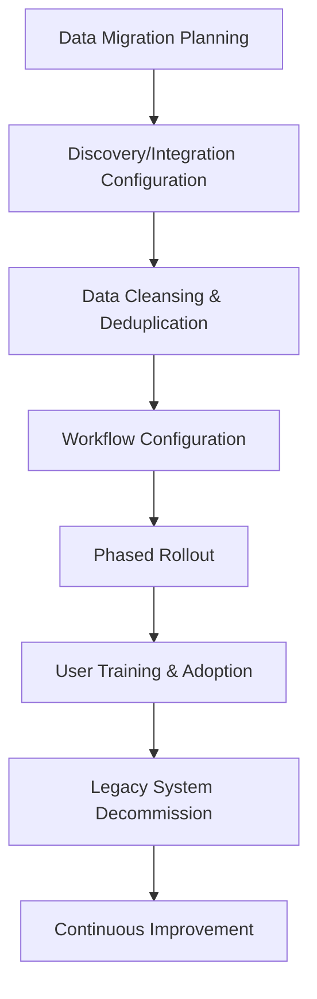
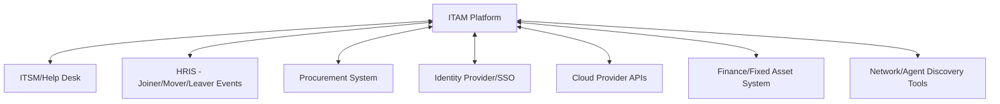

## Selecting and Implementing an ITAM Tool

### Overview

Selecting and Implementing an ITAM Tool is the process of evaluating, choosing, and deploying the software platform that will serve as the system of record for an organization's IT asset lifecycle — spanning hardware, software, cloud, and SaaS assets. This is a high-stakes decision: the ITAM tool becomes the operational backbone that every other asset process (procurement intake, deployment tracking, license compliance, refresh planning, help desk integration) depends on, and a poor selection or failed implementation can undermine asset management maturity for years.

### ITAM Tool Categories

| Category | Strengths | Trade-offs |
| --- | --- | --- |
| Standalone ITAM/SAM platforms | Deep functionality for hardware/software lifecycle, license compliance | Requires separate integration with ITSM/help desk |
| ITSM suite with ITAM module | Native integration with ticketing, CMDB, and service workflows | ITAM functionality may be less specialized/mature than dedicated tools |
| CMDB-centric platforms | Strong for complex IT environments requiring deep relationship/dependency mapping | Can be heavier to implement than needed for simpler asset tracking |
| Specialized point solutions (SaaS management, CAASM, cloud cost) | Best-of-breed depth in a narrow domain | Requires integration/consolidation strategy across multiple tools |

**Key Points**

- Many organizations end up running a hybrid landscape — a core ITSM/CMDB platform for hardware and general asset tracking, supplemented by specialized point solutions for SaaS management, cloud inventory, and security asset correlation (as covered in earlier chapter items) — rather than a single tool covering every asset domain equally well
- The "one platform to rule them all" approach is achievable for organizations with simpler environments, but larger or more complex estates commonly accept a multi-tool landscape and invest instead in strong integration between tools

### Requirements Definition Framework

Before evaluating vendors, requirements should be defined across functional domains to avoid a selection process driven primarily by vendor demos rather than actual organizational needs.

| Requirement Domain | Example Requirements |
| --- | --- |
| Asset scope | Hardware, software, SaaS, cloud, mobile — which domains must this tool cover? |
| Discovery capability | Agent-based, agentless/API, network scanning — what discovery methods are needed? |
| Integration requirements | ITSM/help desk, HRIS, procurement, identity provider, financial systems |
| License compliance | Vendor-specific license metric support (per-core, per-user, subscription) |
| Reporting/analytics | Built-in dashboards vs. requiring export to external BI tools |
| Workflow automation | Approval workflows, automated provisioning/deprovisioning triggers |
| Scalability | Asset volume, multi-site/multi-region support, growth projection |
| Deployment model | SaaS/cloud-hosted vs. on-premises vs. hybrid |

**Key Points**

- Requirements should be prioritized (must-have vs. nice-to-have) before vendor evaluation begins, since nearly every vendor demo will appear to meet loosely-defined requirements — rigor in requirements definition is what makes the subsequent comparison meaningful
- Involving stakeholders beyond IT (finance for cost/chargeback needs, security for vulnerability correlation needs, procurement for vendor/contract tracking needs) at the requirements stage prevents a tool selected purely on IT operational criteria from later failing to meet cross-functional needs

### Vendor Evaluation and Selection Process

**Key Points**

- A proof-of-concept or pilot phase against real (not vendor-curated demo) data from the organization's own environment is the single highest-value validation step — many tools perform well in a controlled demo but reveal integration gaps or data quality issues against actual messy production data
- Reference checks with organizations of similar size, industry, and IT complexity provide insight into implementation reality (timeline, support quality, hidden costs) that vendor sales conversations typically don't surface
- TCO analysis for the tool itself should include not just license/subscription cost but implementation services, ongoing administration effort, and integration development cost — following the same TCO discipline applied to hardware/vendor decisions elsewhere in procurement

### Implementation Planning

#### Implementation Phase Details

**Data Migration Planning**: Determining what existing asset data (from spreadsheets, legacy tools, or manual records) needs to migrate, and in what quality state.

**Discovery/Integration Configuration**: Connecting the tool to discovery sources (network scanning, cloud provider APIs, agent deployment) and downstream/upstream integrations (ITSM, HRIS, identity provider).

**Data Cleansing & Deduplication**: Addressing duplicate, stale, or inconsistent records before or during migration — migrating dirty data into a new system perpetuates existing data quality problems rather than resolving them.

**Workflow Configuration**: Building out approval workflows, automated triggers, and role-based access aligned to the organization's actual processes rather than accepting default out-of-box workflows uncritically.

**Phased Rollout**: Implementing in stages (e.g., by asset category, by business unit, or by geographic region) rather than a single "big bang" cutover, reducing risk and allowing lessons learned to inform later phases.

**User Training & Adoption**: Ensuring both the core asset management team and adjacent stakeholders (help desk agents, procurement staff, end users via self-service portals) understand the new tool's workflows.

**Legacy System Decommission**: Formally retiring prior tracking methods (spreadsheets, legacy tools) once the new system is validated as authoritative, preventing a parallel-tracking data integrity problem.

**Key Points**

- Phased rollout is generally lower-risk than big-bang cutover for ITAM implementations specifically because asset data quality issues tend to surface unevenly across asset categories — starting with a well-understood category (e.g., laptops) before tackling messier categories (e.g., legacy software licenses) allows the team to build implementation muscle before the hardest data challenges
- Data cleansing is consistently underestimated in implementation timelines; organizations moving from spreadsheet-based or fragmented tracking to a formal ITAM tool frequently discover the existing data is less complete and accurate than assumed, requiring dedicated cleansing effort before migration

### Data Migration Considerations

**Key Points**

- A clear source-of-truth designation is needed when multiple legacy systems contain overlapping or conflicting asset data (e.g., a spreadsheet and an old CMDB disagree on an asset's assigned owner) — migration mapping rules should define resolution logic rather than leaving conflicts to be resolved ad hoc during migration
- Historical data (past tickets, prior ownership history, depreciation records) has different migration value than current-state data — a pragmatic scoping decision on how much history to migrate versus archive separately keeps migration effort proportionate

### Integration Architecture

**Key Points**

- The value of an ITAM platform compounds significantly with each genuine integration — an ITAM tool operating as an isolated system of record, manually updated, delivers substantially less value than one automatically synchronized with procurement, HRIS, and discovery sources, as covered throughout the earlier items in this chapter
- API availability and integration maturity should be weighted heavily in vendor evaluation, since a tool with rich functionality but poor integration capability will struggle to stay current without significant ongoing manual data entry burden

### Change Management and Adoption

**Key Points**

- ITAM tool implementation is as much an organizational change management challenge as a technical one — asset data accuracy ultimately depends on people (procurement staff, IT technicians, help desk agents) consistently updating the system as part of their normal workflow, not just the tool existing
- Embedding asset updates into existing workflows (e.g., the deployment/imaging process automatically creates the CMDB record, as covered under Deployment and Configuration Standards) reduces dependence on manual discipline and is more durable than relying purely on training and policy compliance
- Executive sponsorship and clearly communicated ownership (who is accountable for data quality in which domain) materially affects long-term adoption success, since ITAM data quality tends to degrade without clear accountability even after a technically successful implementation

### Post-Implementation: Data Quality Governance

**Key Points**

- Ongoing data quality metrics (percentage of assets with complete required fields, percentage reconciled against discovery data within a defined window, duplicate record rate) should be tracked continuously post-implementation, not just validated once at go-live
- Regular reconciliation between the ITAM system of record and independent discovery sources (network scans, cloud provider APIs) catches drift between what the system believes exists and what's actually deployed — mirroring the same discovery-verification principle applied to API inventories, cloud assets, and container/ephemeral tracking covered earlier

### Common Pitfalls

- **Selecting based on demo quality rather than validated fit**: Vendor demos are curated to look impressive; skipping a proof-of-concept against real organizational data risks discovering integration or data-quality gaps only after contract signature
- **Underestimating data cleansing effort**: Treating migration as a simple technical export/import rather than budgeting real time for deduplication and conflict resolution is one of the most common causes of implementation timeline overrun
- **Big-bang cutover without phasing**: Attempting to migrate every asset category and stand up every integration simultaneously increases risk and makes root-causing problems harder than a staged rollout
- **No embedded workflow integration**: A technically successful implementation that isn't woven into procurement, deployment, and offboarding workflows degrades into a manually-maintained system that drifts from reality within months
- **Ignoring cross-functional requirements at the selection stage**: Selecting a tool purely against IT operational requirements, without finance, security, and procurement input, risks a tool that satisfies one stakeholder group while creating integration gaps for others discovered only after implementation

**Next Steps**

- IT Service Management Integration and the Help Desk
- CMDB Design, Data Quality, and Discovery Integration
- Procurement and Vendor Management for IT Assets
- Data Migration Strategy and Legacy System Decommissioning
- Change Management for Enterprise Tool Adoption
- Cloud Asset Inventory across IaaS, PaaS, and SaaS
- Security Asset Management and Vulnerability Correlation
- Software Asset Management and License Compliance