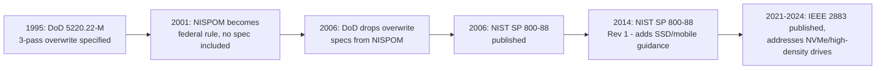
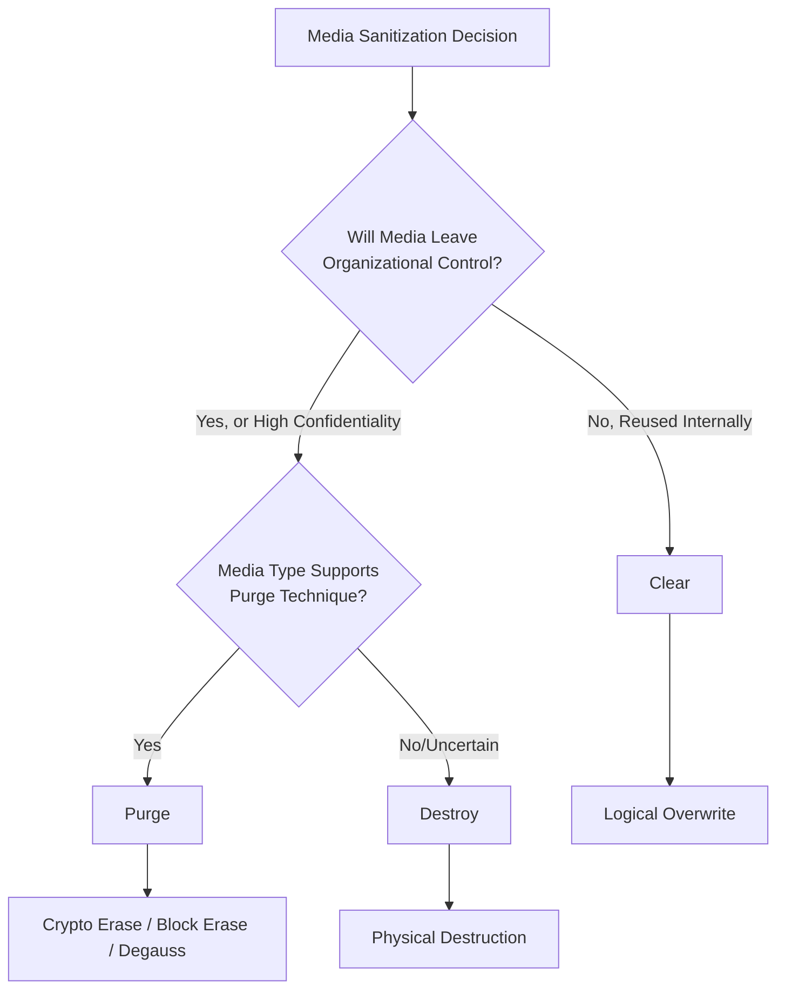

## Data Sanitization Standards under NIST 800-88 and DoD 5220.22-M

### Overview

Data Sanitization Standards govern how organizations render data unrecoverable on storage media at the end of an asset's operational life — whether the device is being redeployed internally, sold, donated, or destroyed. This is the final and most compliance-critical step of IT Asset Disposition (ITAD), since improperly sanitized media leaving organizational control is a direct and well-documented data breach vector. Two standards dominate this space historically and currently: NIST Special Publication 800-88 Revision 1, the current authoritative U.S. federal framework, and DoD 5220.22-M, a legacy Department of Defense overwrite specification still widely referenced in commercial tooling despite formally being superseded.

### Standards Relationship and Current Status

**Key Points**

- DoD 5220.22-M is a data sanitization standard historically defined in the National Industrial Security Program Operating Manual (NISPOM), specifying a process for securely overwriting data on magnetic storage media to prevent recovery of sensitive information. [killdisk](https://www.killdisk.com/manual/KB/em-US-DoD.html)
- DoD 5220.22-M is no longer the official DoD standard and has been superseded by NIST SP 800-88 Rev. 1, though it remains one of the most referenced and implemented data-erasure methods in commercial software. [killdisk](https://www.killdisk.com/manual/KB/em-US-DoD.html)
- The NISPOM is now codified as Part 117 of Title 32 of the Code of Federal Regulations, and the original DoD 5220.22-M document itself no longer contains the overwrite specification — the specific pass-based methodology persists today primarily because it's embedded in commercial erasure tooling and legacy contract language rather than as an actively maintained government standard. [federate](https://lemmy.federate.cc/comment/4028452)
- The NISPOM manual directs organizations to follow NIST SP 800-88 Rev 1 guidelines for media sanitization when making practical sanitization decisions based on data confidentiality level, especially for SSDs and hybrid drives. [bitraser](https://bitraser.com/article/DoD-5220-22-m-standard-for-drive-erasure.php)
- [Inference] Given this relationship, DoD 5220.22-M is best understood today as a legacy commercial convention still offered as a configurable option in erasure tools, rather than a currently authoritative government requirement — organizations should treat NIST 800-88 as the primary compliance reference and DoD 5220.22-M as a supplementary/historical method some contracts or tools may still specify.

The DoD 5220.22M Extended Complementary Erase (ECE) method launched with an extended 7-pass overwrite, while the base DoD 5220.22 specification called for a 3-pass overwrite for HDD sanitization under DoD Manual 5220.22, also known as the National Industrial Security Program Operating Manual. NIST SP 800-88 was published in August 2006 as "Guidelines for Media Sanitization" covering multiple data storage types, with Revision 1 in 2014 expanding guidance for SSDs and mobile devices. [blancco](https://blancco.com/wp-content/uploads/2025/05/25.023_eDocuments_DoD_Handout_v8.pdf)[blancco](https://blancco.com/wp-content/uploads/2025/05/25.023_eDocuments_DoD_Handout_v8.pdf)

### NIST 800-88 Rev. 1: The Clear/Purge/Destroy Framework

NIST SP 800-88 Revision 1 ("Guidelines for Media Sanitization," December 2014) is the authoritative federal reference for sanitizing electronic media, and is the standard NIST source cited in OCR Disposal and Media Re-use specifications under HIPAA's 45 CFR 164.310(d). The standard defines three sanitization categories rather than a single overwrite method. [d3rx](https://d3rx.com/regulations/nist-sp-800-88-r1)

#### Clear

Clearing applies logical techniques to sanitize data in all user-addressable storage locations and protects against simple noninvasive data recovery techniques, generally applied through standard Read and Write commands to a storage device — for example, overwriting disk blocks with new values or resetting the device to factory state where rewriting is not supported. [usgs](https://tst.usgs.gov/?p=66811)

**Key Points**

- The key limitation of Clear is that it only addresses user-addressable storage locations — it does not reach areas like the Host Protected Area (HPA), Device Configuration Overlay (DCO), or remapped sectors on HDDs, and may not reach overprovisioned or wear-leveled areas on SSDs. [inventivehq](https://inventivehq.com/knowledge-base/security-compliance/how-to-choose-media-sanitization-method)
- Clear protects against keyboard-level attacks but is appropriate primarily when media stays within organizational control for reuse, not when it will leave the organization. [d3rx](https://d3rx.com/regulations/nist-sp-800-88-r1)

#### Purge

Purging provides more comprehensive sanitization than clearing, protecting information against laboratory attacks that use advanced methods and tools to recover data. [jetico](https://jetico.com/node/635)

**Key Points**

- Purge applies physical or logical techniques that render data recovery infeasible using state-of-the-art laboratory techniques, and is appropriate when media will be reused at a different security level, transferred to another organization, or returned to a lessor. [inventivehq](https://inventivehq.com/knowledge-base/security-compliance/how-to-choose-media-sanitization-method)
- Examples of purge techniques include degaussing magnetic media with an NSA-evaluated degausser, executing the ATA Secure Erase Enhanced command, performing a cryptographic erase on self-encrypting drives, and using the NVMe Sanitize command with the Block Erase or Crypto Erase option. [inventivehq](https://inventivehq.com/knowledge-base/security-compliance/how-to-choose-media-sanitization-method)
- To use purge as a sanitization method, Host Protected Areas (HPAs) or Device Configuration Overlays (DCOs) must first be removed if present on the device, and purge is then applied through dedicated device sanitization commands. [jetico](https://jetico.com/node/635)

#### Destroy

Destroying renders target data recovery infeasible using state-of-the-art laboratory techniques and results in the media no longer being able to store or retrieve data. [usgs](https://tst.usgs.gov/?p=66811)

**Key Points**

- Destroy methods include physical destruction to a state where data cannot be recovered — shredding, disintegration, incineration, melting, and pulverization. [d3rx](https://d3rx.com/regulations/nist-sp-800-88-r1)
- Not all physical damage qualifies as effective destruction — bending, cutting, and improvised methods such as shooting a hole through a storage device may only damage the media while leaving portions undamaged and accessible using advanced laboratory techniques, so approved destruction techniques matter, not just visible physical damage. [erecycler](https://erecycler.com/nist/)

### Method Selection Framework

Users of the NIST guide should categorize the information to be disposed of, assess the nature of the medium it's recorded on, assess the risk to confidentiality, and determine future plans for the media, then decide on the appropriate sanitization method based on this combined assessment. [erecycler](https://erecycler.com/nist/)

| Method | Data Recovery Possible? | Typical Use Case |
| --- | --- | --- |
| Clear | Recoverable with specialized lab equipment | Reusing media within the same organization |
| Purge | Not feasible with known techniques | Releasing media outside organizational control |
| Destroy | Not feasible; media no longer functional | High-confidentiality data, media leaving control with no reuse value, classified information |

**Key Points**

- Method selection is driven by media type (HDD, SSD, flash, tape, optical, paper), confidentiality of the data (low/moderate/high), and whether the media will leave organizational control. [d3rx](https://d3rx.com/regulations/nist-sp-800-88-r1)
- For ePHI-bearing media leaving organizational control — disposal, donation, or end-of-lease return — Purge or Destroy is the defensible sanitization level under HIPAA-adjacent guidance. [d3rx](https://d3rx.com/regulations/nist-sp-800-88-r1)
- Destruction is required when media will leave organizational control and purge methods are unavailable or inadequate, and for classified or highly sensitive data, destruction is often the only acceptable option. [petronellatech](https://petronellatech.com/compliance/nist-800-88-media-sanitization/)

### DoD 5220.22-M Technical Specification

Despite its superseded status, understanding the DoD method remains relevant since it is still commonly offered as a tool configuration option and referenced in legacy contracts.

**Key Points**

- The basic DoD clearing method involves writing over each byte of the drive with a character (e.g., 0x00), its complement (e.g., 0xFF), and then a random character, for a total of three write passes across the whole drive. [oofhours](https://oofhours.com/2022/03/09/do-you-properly-wipe-your-disks-maybe-following-us-government-standards/)
- The DoD 5220.22-M standard performs verification at the end of each pass to ensure data is duly overwritten, and the inclusion of random characters in addition to zeroes and ones reduces the probability of data recovery. [bitraser](https://bitraser.com/article/DoD-5220-22-m-standard-for-drive-erasure.php)
- An extended variant (ECE — Extended Complementary Erase) specifies a 7-pass overwrite, with additional passes writing random patterns and their complements beyond the base 3-pass sequence. [blancco](https://blancco.com/wp-content/uploads/2025/05/25.023_eDocuments_DoD_Handout_v8.pdf)

**Key Points**

- A 3-pass wipe using the DoD standard can shorten the lifespan of SSDs compared to the one-pass wipe prescribed by NIST Clear, and for high-capacity drives or large inventories, the multi-pass method is more time-consuming than NIST Clear or Purge methods. [bitraser](https://bitraser.com/article/DoD-5220-22-m-standard-for-drive-erasure.php)
- The DoD 5220.22-M standard is most effective for magnetic media such as tape drives, floppy diskettes, and hard drives, but falls short for chip-based devices like SSDs and mobile devices, which can experience wear and reduced lifespan from intense overwrite processes. [nsysgroup](https://nsysgroup.com/blog/dod-5220-22-m-vs-nist-800-88-which-is-better-for-your-business/)

### SSD-Specific Considerations

**Key Points**

- Multi-pass overwrite methods designed for magnetic media (like DoD 5220.22-M) are poorly suited to flash-based storage due to wear-leveling — the drive's internal controller may write "overwritten" data to different physical cells than the original data occupied, leaving the original data's physical location technically untouched by a logical overwrite command
- SSDs require specific handling for wear leveling and over-provisioning beyond what simple logical overwrite addresses [petronellatech](https://petronellatech.com/compliance/nist-800-88-media-sanitization/)
- For SSDs, purge-tier methods such as executing the ATA Secure Erase Enhanced command, cryptographic erase on self-encrypting drives, or the NVMe Sanitize command's Block Erase or Crypto Erase options are the technically appropriate approach, since these operate at the device/firmware level rather than relying on logical overwrite through the file system [inventivehq](https://inventivehq.com/knowledge-base/security-compliance/how-to-choose-media-sanitization-method)

### Verification and Documentation

**Key Points**

- Forensic-grade verification of sanitization — ideally involving qualified, credentialed review — is a practice adopted by mature ITAD/sanitization service providers to substantiate that sanitization was actually effective, not merely attempted. [petronellatech](https://petronellatech.com/compliance/nist-800-88-media-sanitization/)
- Documented sanitization certificates from disposal vendors — including serial numbers, dates, and method used — are the auditable artifact required to demonstrate compliance during an audit. [d3rx](https://d3rx.com/regulations/nist-sp-800-88-r1)
- Chain-of-custody documentation from the point an asset is decommissioned through final sanitization/destruction closes the gap between "we sent the drive for disposal" and "we can prove the data was rendered unrecoverable," which is the specific evidentiary requirement most compliance frameworks and auditors expect

### Real-World Risk of Inadequate Sanitization

**Key Points**

- Failing to properly sanitize media before it leaves organizational control has led to some of the most damaging data breaches on record, including incidents where decommissioned drives containing millions of customer records were sold on secondary markets or discarded without sanitization. [inventivehq](https://inventivehq.com/knowledge-base/security-compliance/how-to-choose-media-sanitization-method)
- In one documented 2019 study, researchers purchased 85 used hard drives on eBay and secondary markets and found that 42% contained recoverable data, including medical records, financial information, and corporate email archives. [inventivehq](https://inventivehq.com/knowledge-base/security-compliance/how-to-choose-media-sanitization-method)

**Example**

An organization decommissions 200 laptops as part of a refresh cycle (see IT Asset Refresh Cycles). Devices are split by destination: 120 are being redeployed internally to a lower-security-tier use case, and 80 are being sold through a third-party ITAD vendor.

- The 120 internally redeployed devices, remaining within organizational control, are reasonable candidates for **Clear** — a full overwrite/factory reset — since the risk profile is lower
- The 80 devices leaving organizational control to an external buyer require **Purge** at minimum (crypto erase or ATA Secure Erase for SSD-equipped units), with documented certificates of sanitization retained for audit purposes, since these devices will no longer be under any organizational oversight once sold

### Connected Compliance Frameworks

**Key Points**

- Compliance frameworks including HIPAA, PCI DSS, and GDPR require documented media sanitization procedures for devices containing protected data, making NIST 800-88 adherence a common underlying technical requirement even when the regulation itself doesn't name the standard explicitly [inventivehq](https://inventivehq.com/tools/media-sanitization-advisor)
- NIST Special Publication 800-88 Revision 1 defines the authoritative framework for sanitization methods that these broader compliance frameworks reference [inventivehq](https://inventivehq.com/tools/media-sanitization-advisor)
- During incident response recovery, compromised media may need sanitization before reuse or disposal — SP 800-88 provides the sanitization methods, while SP 800-61 governs the broader incident response process, illustrating how sanitization standards connect beyond routine ITAD into security incident workflows [petronellatech](https://petronellatech.com/compliance/nist-800-88-media-sanitization/)

### Emerging Standards Landscape

**Key Points**

- IEEE 2883 was published to address erasure challenges with high-density drives like NVMe devices, with continued updates complemented by a revision to ISO/IEC 27040, indicating the standards landscape continues to evolve specifically to address storage technologies that predate or complicate the original NIST 800-88 guidance [blancco](https://blancco.com/wp-content/uploads/2025/05/25.023_eDocuments_DoD_Handout_v8.pdf)
- [Speculation] As storage media technology continues to diversify (e.g., emerging non-volatile memory types), sanitization standards will likely continue to require periodic revision to remain technically applicable — organizations should treat current standard versions as a floor to verify against current documentation rather than a permanently fixed technical reference

### Common Pitfalls

- **Treating DoD 5220.22-M as the current authoritative standard**: Since it's no longer the official DoD-mandated approach and has been superseded by NIST 800-88, relying on it as the primary compliance justification may not satisfy current auditor or regulatory expectations
- **Applying Clear when Purge or Destroy is required**: Using a simple overwrite for media leaving organizational control, rather than assessing confidentiality and destination correctly, is the specific gap that leads to the secondary-market data recovery incidents described above
- **Using magnetic-media multi-pass overwrite methods on SSDs**: Wear-leveling means logical overwrite commands may not reach the physical cells holding the original data, giving a false sense of sanitization completeness on flash-based media
- **No sanitization certificate/documentation retained**: Without an auditable record (method, date, serial number, verifying party), an organization cannot demonstrate compliance even if sanitization was actually performed correctly
- **Ignoring HPA/DCO and remapped sectors**: Sanitization processes that don't account for these hidden storage areas on HDDs can leave recoverable data fragments even after an apparently complete overwrite

**Next Steps**

- IT Asset Disposition (ITAD) Vendor Selection and Chain of Custody
- IT Asset Refresh Cycles and Technology Roadmapping
- HIPAA, PCI DSS, and GDPR Data Disposal Requirements
- Self-Encrypting Drives and Cryptographic Erase Architecture
- Incident Response Media Sanitization (NIST SP 800-61 Integration)
- IEEE 2883 and Emerging Sanitization Standards for NVMe/High-Density Media
- Asset Decommissioning Workflow and CMDB Record Closure
- E-Waste Recycling and Sustainability Reporting for IT Disposal