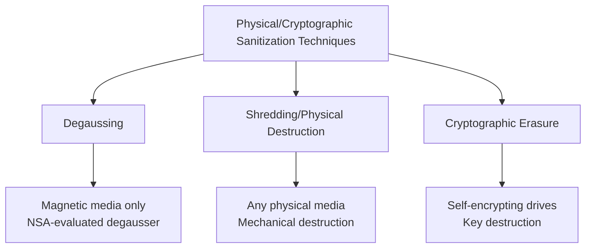
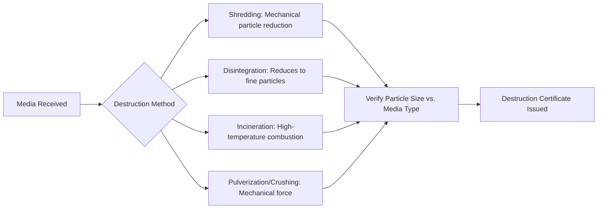
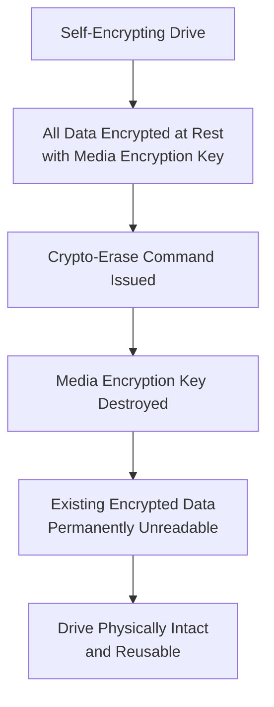
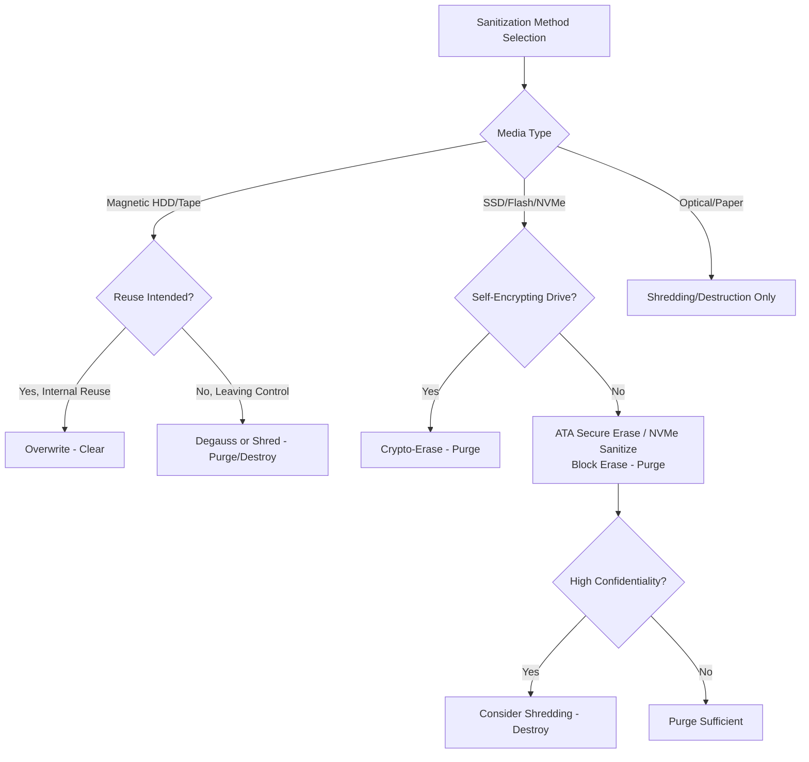

## Physical Destruction through Degaussing, Shredding, and Cryptographic Erasure

### Overview

Physical Destruction through Degaussing, Shredding, and Cryptographic Erasure covers the practical techniques used to execute the Purge and Destroy sanitization categories defined under NIST 800-88 (see Data Sanitization Standards). While the prior item established the governance framework for *when* each sanitization level is required, this item addresses the *how* — the specific physical and cryptographic mechanisms, their applicability by media type, equipment requirements, and operational trade-offs organizations must understand to execute sanitization correctly.

### The Three Primary Techniques

| Technique | Media Applicability | Sanitization Category | Reversibility |
| --- | --- | --- | --- |
| Degaussing | Magnetic media only (HDDs, tapes) | Purge | Renders media unusable and unreadable |
| Shredding/physical destruction | Any physical media type | Destroy | Irreversible, media non-functional |
| Cryptographic erasure | Self-encrypting drives (SEDs), encrypted volumes | Purge | Data unrecoverable, media remains functional |

### Degaussing

Degaussing exposes magnetic storage media to a powerful magnetic field that randomizes and destroys the magnetic domains encoding data, effectively erasing the drive's recorded information at the physical layer.

**Key Points**

- Degaussing is only effective against magnetic storage media — traditional hard disk drives (HDDs) and magnetic tape — since the technique fundamentally depends on disrupting magnetically-encoded data
- Degaussing has no effect on solid-state drives (SSDs), flash memory, or optical media, since these store data through electrical charge states or physical pitting rather than magnetic orientation — applying degaussing to these media types provides zero sanitization value despite appearing to be a rigorous destruction step
- NIST 800-88 guidance specifically calls for using an NSA-evaluated degausser to ensure the magnetic field strength is sufficient to sanitize the specific coercivity of the media being processed — using an underpowered or improperly matched degausser can leave data recoverable despite the process appearing complete
- Degaussing typically destroys the drive's usability for continued operation, since the process also erases the low-level formatting and servo data the drive controller needs to function, effectively converting a Purge-category action into a practically Destroy-equivalent outcome for the drive itself even though it wasn't physically shredded

**Example**

An organization retires 40 legacy magnetic tape backup cartridges containing several years of financial records. Because tape is purely magnetic media with no controller-level abstraction like an SSD's wear-leveling, degaussing with an NSA-evaluated degausser rated for the tape's coercivity level is a directly appropriate and efficient Purge-category method — far faster than attempting to overwrite each tape sequentially, and appropriate given the tapes have no reuse value once processed.

### Shredding and Physical Destruction

Physical destruction renders media in a state where data cannot be recovered by destroying the physical structure of the storage medium itself.

#### Destruction Methods by Category

| Method | Description | Common Media |
| --- | --- | --- |
| Shredding | Mechanical cutting into small particles | HDDs, SSDs, optical media, paper |
| Disintegration | Reduces media to fine, granulated particles | Classified/highly sensitive media, small-form-factor devices |
| Incineration | High-temperature combustion | Optical media, tape, paper, specialized cases |
| Pulverization/crushing | Mechanical force deforms/breaks the physical structure | HDDs, mobile devices |
| Melting | Thermal destruction of the physical medium | Optical media |

**Key Points**

- Not all physical damage constitutes effective destruction — approved techniques matter, not just visible damage. Bending, cutting, or improvised methods (such as attempting to damage a drive with a firearm) may only partially damage the media, leaving portions undamaged and potentially accessible using advanced laboratory recovery techniques, which is why NIST 800-88 specifies approved destruction techniques rather than treating any physical damage as sufficient
- Particle size matters for shredding effectiveness, particularly for solid-state media — because SSDs store data across many small flash memory chips rather than a single continuous magnetic platter, shredding must reduce particles small enough to ensure no single chip (or meaningful fragment of one) survives intact, which is a stricter requirement than shredding a traditional HDD platter
- Destruction is required when media will leave organizational control and Purge methods are unavailable or inadequate for the media type, and for classified or highly sensitive data, destruction is often the only acceptable sanitization option regardless of whether Purge would theoretically suffice

### Cryptographic Erasure

Cryptographic erasure (crypto-erase) sanitizes data by destroying the encryption key used to protect it, rendering the encrypted data on the media permanently unreadable without ever needing to overwrite or physically alter the storage medium itself.

**Key Points**

- Crypto-erase depends entirely on the drive having been encrypted at rest from the point of data being written — it sanitizes by destroying the key, not the data itself, so it is only viable on self-encrypting drives (SEDs) or volumes that were encrypted from the outset
- This technique is dramatically faster than full-drive overwrite methods, since destroying an encryption key is a near-instantaneous operation regardless of drive capacity, compared to overwrite methods that must process every addressable location and scale with drive size
- NIST 800-88 recognizes cryptographic erase as a valid Purge-category technique, alongside overwriting, block erase, and degaussing, when properly implemented on appropriate media
- Because the physical media remains undamaged and fully functional after crypto-erase, this technique uniquely supports both sanitization and continued asset reuse — a meaningful advantage for organizations pursuing IT Asset Disposition strategies that prioritize resale or redeployment value over destruction

**Key Points on Limitations**

- Crypto-erase security is entirely dependent on the strength and correct implementation of the underlying encryption and key management — data encrypted with weak algorithms, or where the key itself may have been compromised or backed up elsewhere, does not provide genuine sanitization even if the erase command succeeds
- If data existed on the drive *before* encryption was enabled, or if the drive was not a genuine self-encrypting drive but relied on software-layer encryption applied after data was already written unencrypted to some sectors, crypto-erase may not sanitize residual unencrypted data fragments — verifying that the drive is a true SED with encryption active from first write is a prerequisite for relying on this method

### Comparative Selection Framework

**Key Points**

- Media type is the primary decision driver: degaussing is exclusively applicable to magnetic media, cryptographic erase requires a pre-existing self-encrypting configuration, and physical destruction applies universally but forecloses any reuse value
- The decision between Purge-tier methods (degauss, crypto-erase, block erase) and Destroy-tier methods (shredding, incineration) should follow the same confidentiality-and-destination framework established in NIST 800-88 — Purge is generally sufficient when media will be reused at a different security level or transferred externally, while Destroy is reserved for classified data or when Purge methods are unavailable/inadequate for the specific media

### Verification Requirements

**Key Points**

- Forensic-grade verification — ideally performed or reviewed by a qualified examiner — substantiates that a sanitization technique was not just attempted but effective, which matters particularly for degaussing (where field strength must match media coercivity) and shredding (where particle size must be adequate for the media type)
- Documented destruction/sanitization certificates including serial numbers, dates, method used, and verifying party are the auditable artifact expected by compliance auditors, regardless of which of the three techniques was employed
- For destruction methods specifically, some organizations require witnessed destruction (an accountable party physically observing or video-verifying the shredding/incineration event) for highest-sensitivity data, providing an additional evidentiary layer beyond the vendor's own certificate

### Operational and Vendor Considerations

**Key Points**

- On-site versus off-site destruction is a meaningful risk decision: on-site shredding (using a mobile shredding service or on-premises equipment) eliminates the chain-of-custody risk of transporting unsanitized media to an external facility, at typically higher cost per unit than bulk off-site processing
- Environmental and sustainability considerations increasingly factor into method selection, since physical destruction forecloses resale/recycling value that Purge-tier methods (which can leave media functional) preserve — this connects directly to the asset refresh cycle's sustainability considerations, where extending reuse value has both cost and environmental benefits
- Vendor certification (e.g., adherence to NAID AAA or equivalent destruction industry certifications) provides third-party assurance of a destruction vendor's process rigor, which is a relevant vendor risk management consideration when outsourcing rather than performing destruction in-house

### Common Pitfalls

- **Degaussing SSDs or flash media**: Since these store data via electrical charge rather than magnetic orientation, degaussing provides no actual sanitization value on this media type despite the process appearing procedurally rigorous — this is one of the most consequential and easy-to-make sanitization errors
- **Assuming crypto-erase applies without verifying the drive is a genuine SED**: Relying on crypto-erase for a drive using bolt-on software encryption applied after some data was already written unencrypted can leave recoverable residual data
- **Treating any physical damage as adequate destruction**: Bending, cutting, or improvised destruction methods may leave recoverable fragments even when the device is visibly non-functional — approved shredding/disintegration/incineration/pulverization processes with verified particle size are required
- **Insufficient shred particle size for solid-state media**: Applying HDD-appropriate shredding parameters to SSDs, where individual flash chips can retain data even in relatively large fragments, may not meet the sanitization assurance level intended
- **No witnessed or verified destruction process for high-sensitivity data**: Relying solely on a vendor's certificate without any verification step removes an important assurance layer for the most sensitive data categories

**Next Steps**

- Data Sanitization Standards under NIST 800-88 and DoD 5220.22-M
- IT Asset Disposition (ITAD) Vendor Selection and Chain of Custody
- Self-Encrypting Drives and Cryptographic Erase Architecture
- IT Asset Refresh Cycles and Technology Roadmapping
- E-Waste Recycling and Sustainability Reporting for IT Disposal
- Vendor Risk Management and Third-Party Security Assessments
- Asset Decommissioning Workflow and CMDB Record Closure
- HIPAA, PCI DSS, and GDPR Data Disposal Requirements