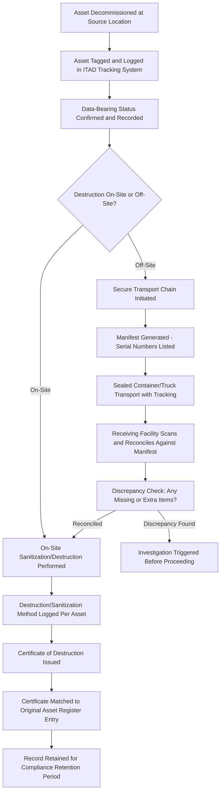

## Chain of Custody Documentation and Certificates of Destruction

### Overview

Chain of custody documentation and certificates of destruction (CoD) form the legal and operational evidence trail proving that IT assets containing sensitive data were tracked without interruption from decommissioning through final destruction or sanitization, and that data was rendered unrecoverable. This documentation is the primary artifact organizations rely on to demonstrate compliance with data protection regulations (e.g., GDPR, HIPAA, GLBA) and industry standards (NIST SP 800-88, ISO/IEC 27001) during audits, breach investigations, or regulatory inquiries.

### Why Chain of Custody Matters

Without an unbroken chain of custody, an organization cannot conclusively prove that a device containing regulated data (PII, PHI, financial records, intellectual property) did not fall into unauthorized hands between decommissioning and destruction. A gap in custody — even a short one, such as an asset sitting unlogged in a storage closet — undermines the evidentiary value of the eventual destruction certificate, because it introduces a window in which data exfiltration cannot be ruled out.

### Chain of Custody: Core Elements

A legally defensible chain of custody record captures, at minimum, for every asset:

1. **Unique asset identifier** — serial number, asset tag, or system-generated ID linking the physical device to its record in the ALM/ITAM system
2. **Point of origin** — the location, department, and custodian from which the asset was retired
3. **Every transfer of physical possession** — who released it, who received it, date/time, and method of transfer (hand-off, locked bin, sealed container/pallet)
4. **Transport documentation** — if a third-party ITAD (IT Asset Disposition) vendor is used, bill of lading, tracking numbers, and vehicle/driver identification for the transport leg
5. **Facility receipt confirmation** — timestamped confirmation that the destination facility (internal secure area or ITAD vendor site) received the asset, ideally with item-level scan reconciliation against the manifest
6. **Final disposition event** — the specific sanitization or destruction action performed, when, by whom, and by what method
7. **Signatures/attestation** — of each party taking custody, either wet-ink or a legally recognized digital signature

### Chain of Custody Workflow

### Certificates of Destruction: Required Content

A compliant Certificate of Destruction (also called a Certificate of Data Destruction or Certificate of Recycling, depending on the disposition method) should contain:

- Issuing organization's name, address, and contact information (the ITAD vendor or internal secure destruction team)
- Customer/client organization name
- Itemized list of assets destroyed, by serial number/asset tag (not merely an aggregate count or weight, for data-bearing devices)
- Date(s) of destruction
- Destruction method used (e.g., degaussing, physical shredding, cryptographic erasure, NIST 800-88 Clear/Purge/Destroy method applied)
- Location where destruction occurred
- Name and signature of the individual(s) who performed or witnessed the destruction
- A statement attesting that destruction was performed in accordance with a named standard (e.g., NIST SP 800-88 Rev. 1, or a specified DoD sanitization standard)
- Certificate serial/reference number for traceability back to the specific job/batch

**Aggregate vs. Serialized Certificates**: A critical distinction — an aggregate certificate (e.g., "500 hard drives destroyed on this date, total weight 2,400 lbs") provides much weaker audit evidence than a serialized certificate mapping each specific asset serial number to a confirmed destruction event. Regulated industries (healthcare, financial services, government) typically require serialized certificates for data-bearing media.

### Sanitization Methods and Corresponding Documentation

| Method | Description | Documentation Requirement |
| --- | --- | --- |
| Clear | Logical technique (e.g., overwriting) applied to render data inaccessible via standard recovery tools | Software tool name/version, pass count, verification result per device |
| Purge | Physical or logical technique (e.g., cryptographic erase, degaussing) rendering data infeasible to recover even with advanced laboratory techniques | Method used, equipment calibration/verification records, per-device confirmation |
| Destroy | Physical destruction (shredding, disintegration, incineration, pulverizing) rendering the media unusable and data recovery infeasible | Method, particle size specification (for shredding), photographic/video evidence commonly requested for high-sensitivity assets |

This Clear/Purge/Destroy taxonomy follows NIST SP 800-88 Rev. 1 terminology, which is the most widely referenced framework for matching sanitization method rigor to data sensitivity classification.

### Vendor Due Diligence Controls

When outsourcing destruction to a third-party ITAD vendor, chain-of-custody integrity depends on contractual and operational controls over the vendor:

- Vendor certification status (e.g., R2v3, e-Stewards, NAID AAA Certification for data destruction specifically)
- Contractual data processing/data protection addendum specifying liability for data breach occurring during vendor custody
- Right-to-audit clause allowing the client organization to inspect vendor destruction facilities and processes
- Insurance/bonding requirements covering data breach liability
- Vendor sub-contractor disclosure — chain of custody must extend to any downstream sub-processor the vendor uses, which is a common weak point if not contractually restricted or disclosed

[Inference] Requirements for specific certifications (R2v3, e-Stewards, NAID AAA) vary by jurisdiction and industry; organizations in regulated sectors typically specify required certifications in vendor contracts rather than relying on general market reputation.

### Reconciliation Against the Asset Register

The final control loop closes when the certificate of destruction is matched back to the ALM/ITAM system's asset register:

1. Each serial number on the certificate is reconciled against the "pending destruction" status assets in the register
2. Assets confirmed destroyed are updated to a terminal "Destroyed/Disposed" lifecycle status with the certificate reference number attached as supporting documentation
3. Any asset in "pending destruction" status that does not appear on a returned certificate within an expected timeframe should trigger an exception/escalation workflow
4. The completed record (chain of custody log + certificate) is retained per the organization's data retention policy, commonly aligned to the longest applicable regulatory retention requirement (which can range from 3 to 7+ years depending on jurisdiction and data type)

### Common Control Failures

- **Custody gaps during internal staging**: assets awaiting pickup sitting in unsecured, unlogged areas between decommissioning and vendor collection
- **Manifest-to-certificate mismatches**: discrepancies between what was shipped and what was certified as destroyed, left uninvestigated
- **Reliance on aggregate certificates** for individually regulated data-bearing devices, leaving no serial-level proof for any specific device
- **Missing sub-processor visibility**: primary ITAD vendor subcontracts destruction to an unvetted third party without client knowledge or contractual coverage
- **Certificate issued before destruction actually verified complete**, particularly in high-volume shredding operations where per-item confirmation is skipped in favor of batch-level sign-off

**Key Points**

- Serialized (not aggregate) certificates are required for defensible proof of destruction on regulated data-bearing assets.
- Chain of custody must be unbroken from decommissioning through final destruction; any unlogged interval undermines the evidentiary value of the eventual certificate.
- NIST SP 800-88's Clear/Purge/Destroy taxonomy is the standard reference framework for matching sanitization rigor to data sensitivity.
- Vendor due diligence (certification status, right-to-audit, sub-contractor disclosure) is a required control, not an optional add-on, when destruction is outsourced.

**Related Topics**

- NIST SP 800-88 Rev. 1 Media Sanitization Guidelines in Depth
- ITAD Vendor Selection and Certification Criteria (R2v3, e-Stewards, NAID AAA)
- Data Classification Frameworks and Mapping to Sanitization Method Selection
- Asset Register Lifecycle Status Management for Retired IT Equipment
- Regulatory Retention Requirements for Destruction Records by Industry
- Breach Investigation Use of Chain of Custody Evidence