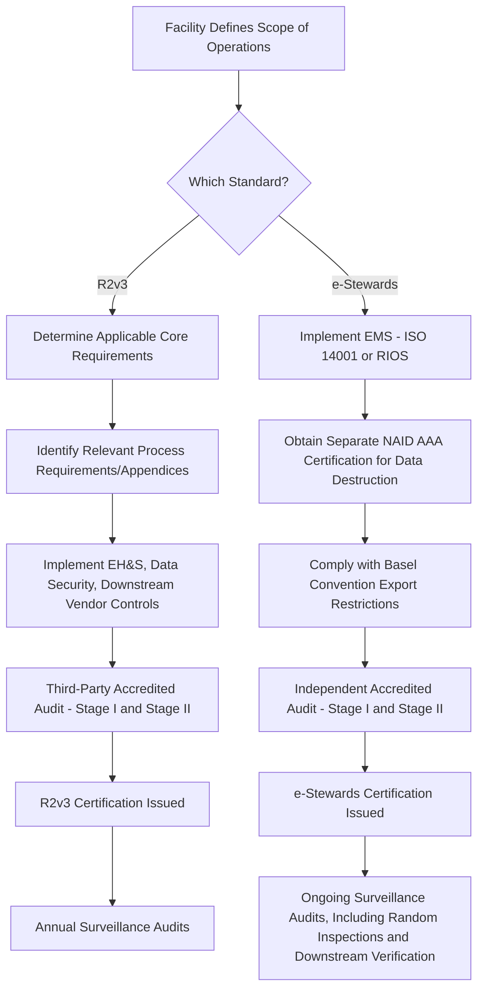

## R2v3 and e-Stewards Certification Standards

### Overview

R2v3 (Responsible Recycling, Version 3) and e-Stewards are the two dominant third-party certification standards governing the IT Asset Disposition (ITAD) and electronics recycling industry. Both certify that a facility processing end-of-life IT equipment adheres to defined practices for environmental protection, worker health and safety, and data security. For asset lifecycle management purposes, an organization's choice of ITAD vendor certification directly affects its own compliance posture, since liability for improper disposal or data breach can extend upstream to the asset owner even after physical custody has transferred to a vendor.

### R2v3: Structure and Governance

R2v3 is administered by SERI (Sustainable Electronics Recycling International), the standard-owning body. R2v3 certification is the latest benchmark for the IT asset disposition (ITAD) industry, representing a milestone for organizations involved in IT asset management. The R2 standard has evolved continuously since its original release in 2010, with the current R2v3 edition launched in 2020 to reflect changes in the electronics landscape, customer expectations, and regulatory environment. [cxtec](https://cxtec.com/blog/r2v3-certification-transforming-itad-for-a-sustainable-future)[cxtec](https://cxtec.com/blog/r2v3-certification-transforming-itad-for-a-sustainable-future)

**Core Requirements vs. Process Requirements**

R2v3 organizes requirements into a modular structure: Core Requirements apply to all R2-certified facilities, while more specialized Process Requirements apply only to facilities engaged in specific processes. This modular approach is intended to better adapt to the specialization and diversity of facility types and changing business models within the industry, giving customers more clarity about each facility's specific capabilities. [recyclingtoday](https://www.recyclingtoday.com/news/seri-revises-r2-electronics-recycling-standard)

The R2v3 standard contains 10 core requirements. The first four establish the foundation for the operations and structure of any R2 facility — covering areas such as the hierarchy of responsible management strategies, the EH&S (Environmental, Health & Safety) management system, and legal requirements. The remaining six govern the activities and physical conditions of the facility, including data security, focus materials, and transport. The very first core requirement is Scope — each facility must define exactly what processes, materials, and equipment it manages before other requirements can be meaningfully applied, since scope determines which subsequent requirements apply. [sustainableelectronics](https://sustainableelectronics.org/knowledge-base/podcast-12-scope-of-certification/)

**Data Security Emphasis**

R2v3 contains enhanced controls for testing, repairing, and reuse of electronics, with a greater emphasis on data protection than the previous version of the standard. R2 now contains stricter requirements in several key areas, including data protection, flow-down of material to downstream vendors, and environmental health and safety. [thecoresolution](https://thecoresolution.com/?p=1863)

**Downstream Vendor (DSV) Requirements**

Any downstream vendor that performs test and repair operations or brokers for an R2v3 supplier must be certified to a quality management system standard, such as RIOS or ISO 9001. Third-party data sanitization audits are required for non-R2v3 facilities that perform data sanitization, and such facilities must also conform to the standard's Core 7 (data security) requirement and its associated appendix covering data sanitization procedures. [nsf](https://www.nsf.org/in/en/knowledge-library/r2v3-certification-transition)

**Appendix-Based Specialization**

Beyond core standards, R2v3-certified facilities can meet specific standards in appendices aligned with their service specialization — for example, a company specializing in mobile phone testing and resale would certify to a different appendix than a metals recovery operation that shreds and sorts scrap. This differs from the prior R2:2013 iteration, under which all facilities seeking certification needed to meet every requirement regardless of their actual specialization. As of the data reviewed, no facility had achieved certification to all R2v3 appendices, and only about 20% had certified to both reuse and recycling services. [tumblehome](https://rr.tumblehome.com/node/2192)[tumblehome](https://rr.tumblehome.com/node/2192)

### e-Stewards: Structure and Governance

e-Stewards is administered by the Basel Action Network (BAN), a non-governmental organization. BAN is a non-governmental charitable organization dedicated to combating the export of toxic waste material, including e-waste, from developed countries to developing and underdeveloped nations. BAN launched the e-Stewards certification program in 2009 for electronics recyclers and refurbishers. [bitraser](https://www.bitraser.com/article/9-steps-for-achieving-e-stewards-certification.php)

**Core Standard Requirements**

The e-Stewards certification covers all areas of the electronics processing industry and requires: reuse and repair of electronic devices; implementation of an Environmental Management System (EMS) such as RIOS or ISO 14001; the facility being i-Sigma NAID (National Association for Information Destruction) AAA certified; safe management of materials of concern (hazardous materials); and adherence to international laws. The standard also requires refurbishers and recyclers to comply with the Basel Convention, the UN hazardous waste treaty. [bitraser](https://www.bitraser.com/article/9-steps-for-achieving-e-stewards-certification.php)

**Mandatory NAID AAA Integration**

A defining feature distinguishing e-Stewards from R2v3 is its mandatory linkage to NAID AAA certification specifically for data destruction. BAN announced that all companies certified to the e-Stewards standard would also be required to maintain certification with NAID, in response to enterprise customer concerns not only about environmental and human rights impacts of e-waste dumping but also about data compromise. Certified companies were given three years to come into compliance and are required to maintain NAID's AAA Certification for Electronic Media. This makes e-Stewards effectively a composite certification, folding a specialized data-destruction audit body into its own scope rather than treating data security as a self-assessed core requirement. [tumblehome](https://rr.tumblehome.com/node/1138)[tumblehome](https://rr.tumblehome.com/node/1138)

**Export Prohibition**

The e-Stewards Standard prohibits the export of hazardous e-waste to developing countries, avoids landfilling or incinerating toxic materials, and rejects the use of prison labor. e-Stewards is described as the only certification that strictly prohibits export of hazardous waste to developing countries, aligning fully with the Basel Convention and global e-waste legislation — a stricter export posture than R2v3, which permits export under defined conditions rather than prohibiting it outright. [e-stewards](https://e-stewards.org/the-importance-of-certified-electronics-recycling-why-e-stewards-leads-the-way/)[e-stewards](https://e-stewards.org/the-importance-of-certified-electronics-recycling-why-e-stewards-leads-the-way/)

**Standard Revisions**

A newer version of the e-Stewards Standard (Version 4.0) shortened the document from 99 to 60 pages and removed the formerly incorporated ISO 14001 Environmental Management System language, though certification to ISO 14001 is still required separately. The revision was described by BAN's founder as resulting in a standard that is easier to read and execute while becoming more rigorous in the areas that matter most: human health, export controls, and data security. The revised version also introduced a corporate standard applying to all facilities and operations of a company within a country, rather than only select certified facilities. [waste360](https://www.waste360.com/e-waste/ban-publishes-newest-version-of-e-stewards-standard)[waste360](https://www.waste360.com/e-waste/ban-publishes-newest-version-of-e-stewards-standard)

### Comparative Structure

| Dimension | R2v3 | e-Stewards |
| --- | --- | --- |
| Governing body | SERI (Sustainable Electronics Recycling International) | Basel Action Network (BAN) |
| Requirement structure | Core Requirements (10) + Process Requirements + specialization Appendices | Single integrated standard, now organized as a corporate-level standard |
| Data destruction certification | Data security is a core requirement (Core 7); third-party sanitization audit required only for non-R2v3-certified downstream facilities | Mandatory separate NAID AAA certification required in addition to the e-Stewards standard itself |
| Environmental Management System | Not separately mandated as an external ISO certification by the core standard itself | Requires a certified EMS, such as ISO 14001 or RIOS, held separately |
| Hazardous waste export | Permitted under defined controls and downstream verification | Prohibited to developing countries, aligned strictly with the Basel Convention |
| Facility scope flexibility | High — modular appendices allow partial specialization certification | Broader — applies regardless of a company's size and the type of e-waste processing conducted on-site |

### Certification Process Flow (Generalized)

### Relevance to Asset Lifecycle Management and Vendor Selection

For an organization managing IT asset disposition, the choice between requiring R2v3, e-Stewards, or both from ITAD vendors typically depends on:

- **Regulatory/procurement mandates**: the federal government requires all federal facilities to recycle e-waste with a certified e-Stewards or R2 recycler, making either certification a baseline requirement for public-sector-adjacent supply chains. [pjr](https://pjr.com/standards/e-Stewards)
- **Data sensitivity profile**: organizations handling highly regulated data (healthcare, financial services, government) may prefer e-Stewards specifically because of its embedded NAID AAA requirement, which provides an additional independent audit layer over data destruction specifically, rather than relying on the vendor's self-attested data security core requirement under R2v3 alone.
- **Export risk tolerance**: organizations with heightened concern about downstream hazardous material export (reputational, ESG, or contractual reasons) may weight e-Stewards' stricter export prohibition more heavily.
- **Vendor specialization fit**: R2v3's appendix-based structure allows more precise matching of certification scope to the specific service being contracted (e.g., mobile device reuse vs. bulk shredding), which can be advantageous when engaging multiple specialized vendors across an asset disposition program rather than a single generalist vendor.

[Inference] Many large enterprise ITAD programs require vendors to hold both R2v3 and e-Stewards certification concurrently, since the two standards are not mutually exclusive and together cover a broader combination of export controls, data security audit independence, and EMS requirements than either alone; this is a common contractual practice rather than a requirement of either standard itself.

**Key Points**

- R2v3's ten core requirements apply to all certified facilities; specialized appendices allow facilities to certify only for the specific processes they perform.
- e-Stewards mandates a separate NAID AAA data destruction certification as a condition of the standard itself, providing an additional independent audit layer specifically over data sanitization.
- e-Stewards imposes a stricter, categorical prohibition on hazardous e-waste export to developing countries, aligned with the Basel Convention, compared to R2v3's controlled-export model.
- Both standards require accredited third-party audits (Stage I and Stage II) and ongoing surveillance audits to maintain certification status.

**Related Topics**

- NAID AAA Certification Requirements for Data Destruction Facilities
- Basel Convention Compliance and Transboundary E-Waste Movement Controls
- Downstream Vendor (DSV) Due Diligence Under R2v3 Core 7
- ISO 14001 and RIOS Environmental Management System Requirements for Recyclers
- Comparing ITAD Vendor Certification Requirements Across Regulated Industries
- Federal Procurement Requirements for Certified E-Waste Recyclers