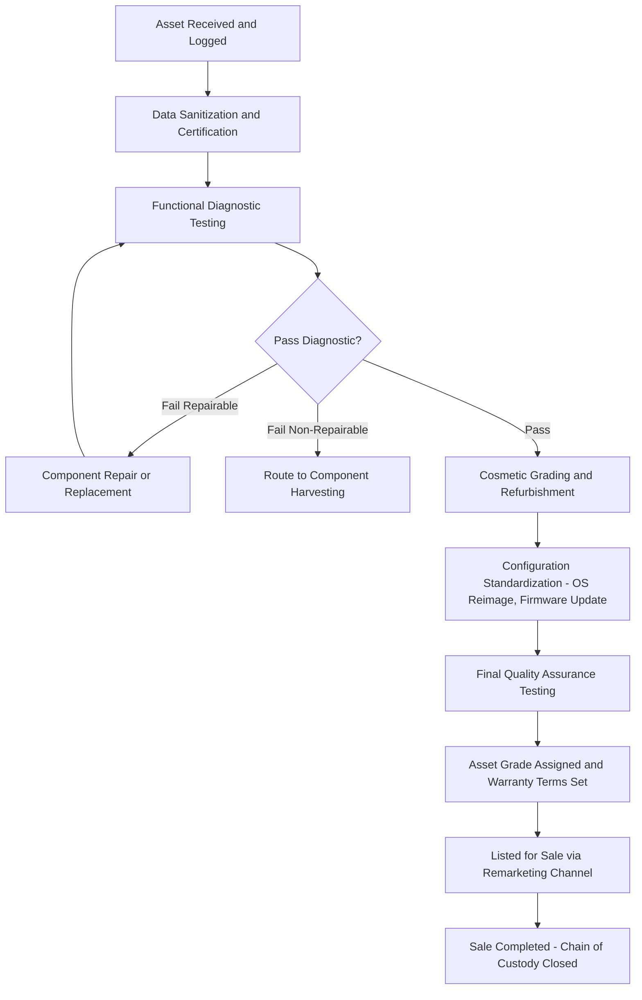

## Value Recovery through Resale, Remarketing, and Component Harvesting

### Overview

Value recovery is the set of disposition strategies within IT Asset Disposition (ITAD) aimed at recouping residual economic value from retired assets before or instead of destruction/recycling. Rather than treating end-of-life IT equipment purely as a liability to be securely destroyed, value recovery programs evaluate each asset (or asset class) against a disposition hierarchy that maximizes recovered value while maintaining data security and compliance obligations. This directly affects an organization's Total Cost of Ownership and Life Cycle Cost models, since recovered value offsets the net disposal cost captured in end-of-life cost projections.

### The Disposition Hierarchy

A standard ITAM/ITAD disposition decision tree evaluates assets in the following general order of preference, driven primarily by residual value potential balanced against data risk and market demand:

1. **Internal Redeployment** — reassigning the asset to another internal user, department, or lower-priority function
2. **Resale (Whole-Unit)** — selling the functioning asset as-is or lightly refurbished through wholesale or retail channels
3. **Remarketing** — refurbishing, testing, and certifying the asset for resale into secondary markets, often with warranty support
4. **Component Harvesting** — disassembling non-resalable units to recover functional sub-components (RAM, drives, GPUs, displays) for resale or internal reuse
5. **Materials Recycling** — recovering base materials (precious metals, plastics, rare earth elements) when no functional value remains
6. **Certified Destruction** — final disposition for assets with unrecoverable data risk, regulatory prohibition on reuse, or no residual value

### Resale (Whole-Unit Disposition)

Whole-unit resale applies to assets that remain functional and marketable with minimal intervention beyond data sanitization.

**Key Process Steps:**

- Asset intake and condition grading (commonly using a tiered grading scale, e.g., Grade A/B/C or similar cosmetic/functional condition rubrics)
- Data sanitization performed and certified (per NIST SP 800-88 Clear/Purge, as covered separately under sanitization method selection) before any resale transaction proceeds
- Functional testing (boot verification, component diagnostics, battery health for mobile/laptop assets)
- Market channel selection: wholesale lot sale to a broker, direct-to-consumer retail (via ITAD vendor's own storefront or marketplace), or B2B secondary market sale to other enterprises
- Chain of custody and sale documentation retained for audit purposes, even though the asset is not destroyed

**Value Drivers:**

- Asset age relative to product refresh cycles (steep depreciation curves are typical for consumer-facing categories like laptops and phones)
- Market demand for the specific model/configuration at time of disposition
- Cosmetic condition and completeness (original packaging, accessories, chargers)
- Volume — bulk lot sales typically yield lower per-unit price but faster liquidation than piecemeal retail sale

### Remarketing

Remarketing extends beyond simple resale by adding refurbishment, upgrade, and certification steps intended to restore or enhance market value and enable warranty-backed sale into higher-value channels.

**Typical Remarketing Workflow:**

**Remarketing Value-Add Activities:**

- Component upgrades (adding RAM or upgrading to SSD storage) to move an asset into a higher resale tier
- Standardized reimaging and firmware/BIOS updates to ensure baseline functionality and security posture for the buyer
- Bundling (e.g., laptop plus charger plus carrying case) to improve retail positioning
- Warranty issuance, which typically commands a price premium over as-is sale but requires the remarketer to absorb post-sale failure risk

**Channel Considerations:**

- **B2B/Wholesale**: faster liquidation, lower margin per unit, typically used for bulk enterprise decommissioning projects
- **B2C/Retail**: higher margin per unit, slower liquidation, requires marketing/listing infrastructure
- **Vertical-Specific Markets**: certain asset classes (specialized medical or industrial equipment, networking hardware) may have dedicated secondary markets with distinct buyer pools and valuation dynamics separate from general consumer electronics resale

### Component Harvesting

When a unit cannot be economically restored to a resalable whole-unit condition, or its model/generation has fallen below viable resale demand, component harvesting recovers value at the sub-assembly level.

**Common Harvestable Components:**

- Memory (RAM) modules — frequently retain strong resale value even when the host system does not, due to standardized form factors
- Storage drives (after certified data sanitization) — SSDs and HDDs with remaining functional life
- CPUs — value-dependent on socket compatibility with still-supported motherboard generations
- Discrete GPUs — particularly valuable in server/workstation contexts or where GPU demand (e.g., compute workloads) exceeds host system demand
- Displays and panels — harvested from laptops/monitors for repair markets
- Power supplies, batteries (with appropriate handling for lithium-ion units), chassis components, and networking modules

**Component Harvesting Decision Logic:**

The economic threshold for harvesting versus recycling a given unit is typically evaluated by comparing:

$$\text{Harvest Value} = \sum_{i=1}^{n} (V_i \times P_i) - C_{labor} - C_{testing}$$

Where $V_i$ is the estimated resale value of component $i$, $P_i$ is the probability the component passes functional testing (accounting for failure/damage risk), and $C_{labor}$/$C_{testing}$ are the disassembly and verification costs. If Harvest Value exceeds the unit's scrap/materials-recycling value net of the same labor cost, harvesting is the economically preferred path.

**Data Security Consideration in Harvesting:** Storage components harvested for resale must undergo the same sanitization and certification rigor as whole-unit resale — a harvested drive re-entering the market carries identical data exposure risk to a whole system, and chain-of-custody/certificate-of-sanitization documentation should follow the component, not just the original host asset.

### Financial and Reporting Integration

Value recovery proceeds interact with several ALM financial processes:

- **Disposal gain/loss calculation**: proceeds from resale, remarketing, or harvested-component sale are compared against the asset's remaining net book value to calculate the gain or loss on disposal, recorded per ASC 360 (US GAAP) or IAS 16 (IFRS) disposal accounting requirements.
- **Revenue recognition treatment**: depending on materiality and business model, resale proceeds may be recorded as other income, a reduction to disposal expense, or in some ITAD-as-a-service arrangements, as a revenue-share credit back to the originating business unit.
- **Residual value refinement**: consistent tracking of actual realized resale/harvest values against originally estimated salvage values (used in Life Cycle Cost models) allows organizations to refine future salvage value assumptions, improving the accuracy of subsequent LCC and depreciation estimates.

### Vendor and Program Structuring Considerations

- **ITAD vendor revenue-share agreements**: many enterprise ITAD contracts structure remarketing proceeds on a revenue-share basis, where the vendor retains a percentage of resale proceeds as compensation, with the remainder returned to the client — requiring reconciliation controls to verify reported sale prices against actual market transactions.
- **Buy-back/trade-in programs**: some OEMs and ITAD vendors offer structured trade-in credit programs that can be integrated into procurement cycles, effectively pre-negotiating residual value capture at the point of new asset acquisition.
- **Data security vs. speed-to-market tension**: remarketing programs that prioritize rapid liquidation must still not compromise sanitization/certification rigor; control frameworks should enforce sanitization completion as a hard gate before any listing or sale event, regardless of liquidation timeline pressure.

### Common Pitfalls

- Treating all retired assets uniformly (routing straight to destruction) without a value-recovery screening step, foregoing material resale value particularly on higher-end laptops, networking equipment, and enterprise storage
- Insufficient data sanitization verification specifically on harvested components (drives, in particular) before resale, creating disproportionate data exposure risk relative to the component's recovered value
- Failing to reconcile ITAD vendor-reported resale proceeds against actual market comparables, creating risk of under-reported revenue share in vendor partnership arrangements
- Not feeding actual realized recovery values back into LCC/salvage value assumptions, resulting in persistently inaccurate residual value estimates in investment analysis models

**Key Points**

- The disposition hierarchy (redeploy → resell → remarket → harvest → recycle → destroy) should be evaluated per-asset or per-asset-class before defaulting to destruction.
- Component harvesting economics depend on comparing aggregate harvestable component value, net of labor and testing costs, against materials-recycling value.
- Data sanitization rigor must apply equally to harvested components (especially storage) as to whole-unit resale, since component-level resale carries identical data exposure risk.
- Realized resale/recovery values should feed back into Life Cycle Cost salvage value assumptions to improve forecasting accuracy over time.

**Related Topics**

- Asset Grading Rubrics and Condition Assessment Standards for Remarketing
- Revenue Share and Buy-Back Contract Structuring with ITAD Vendors
- Disposal Gain/Loss Accounting Treatment Under ASC 360 and IAS 16
- Secondary Market Dynamics and Depreciation Curves for IT Hardware Categories
- Component-Level Chain of Custody and Sanitization Certification
- Feeding Realized Salvage Values into Life Cycle Cost Model Refinement