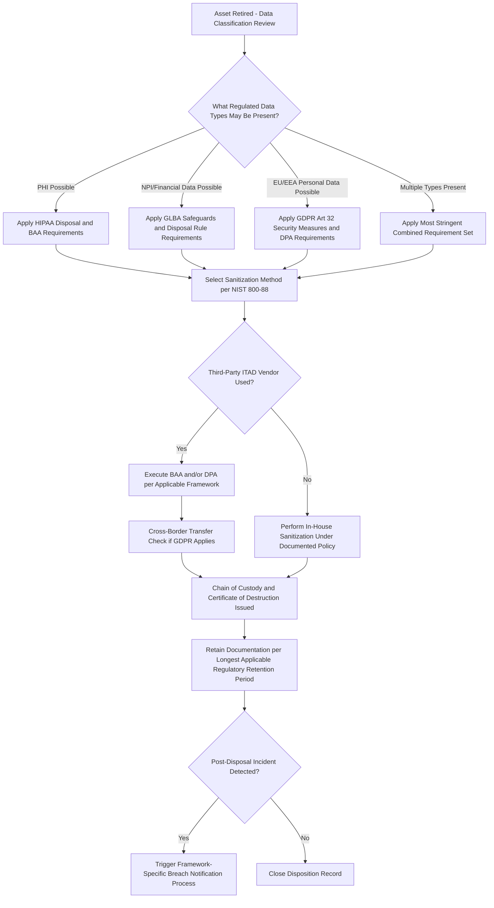

## Regulatory Compliance in Disposition under HIPAA, GLBA, and GDPR

### Overview

IT asset disposition sits at the intersection of three major regulatory regimes when disposed assets contain regulated data: HIPAA (US healthcare data), GLBA (US financial data), and GDPR (EU/EEA personal data, with extraterritorial reach). Each framework imposes distinct — though overlapping — obligations on how data-bearing assets must be sanitized, documented, and overseen through third-party vendors. An ALM/ITAD program serving a multinational or multi-sector organization must design disposition controls capable of satisfying the most stringent applicable requirement across all three regimes simultaneously, since a single retired asset may be subject to more than one framework at once (e.g., a US healthcare company processing EU patient data).

### HIPAA (Health Insurance Portability and Accountability Act)

**Scope and Trigger**

HIPAA's Security Rule applies to Protected Health Information (PHI) held by covered entities (healthcare providers, health plans, healthcare clearinghouses) and their business associates. Any IT asset that stored, processed, or transmitted PHI — including devices believed to have only temporary or cached PHI exposure — falls within HIPAA's disposal requirements.

**Key Requirements**

- The HIPAA Security Rule's Device and Media Controls standard requires covered entities to implement policies and procedures for the final disposition of PHI and the hardware/electronic media on which it is stored, addressing both disposal and media re-use.
- Data must be rendered unreadable, indecipherable, and unrecoverable prior to disposal or reuse — commonly implemented via NIST SP 800-88 Clear/Purge/Destroy methodologies matched to media type and PHI sensitivity.
- Business Associate Agreements (BAAs) are required with any third-party ITAD vendor handling assets containing PHI, contractually binding the vendor to HIPAA-equivalent safeguards and breach notification obligations.
- Documented evidence of destruction/sanitization (chain of custody plus certificate of destruction) must be retained to demonstrate compliance in the event of an OCR (Office for Civil Rights) audit or breach investigation.

**Breach Notification Interaction**

If a data-bearing asset containing unsecured PHI is lost, stolen, or improperly disposed of before sanitization, this can constitute a reportable breach under the HIPAA Breach Notification Rule, triggering notification obligations to affected individuals, HHS, and potentially media outlets (for breaches affecting 500+ individuals), regardless of whether the covered entity or its ITAD vendor was responsible for the failure.

### GLBA (Gramm-Leach-Bliley Act)

**Scope and Trigger**

GLBA applies to financial institutions (broadly defined — banks, credit unions, insurance companies, and other entities significantly engaged in financial activities) and governs the protection of nonpublic personal information (NPI) of consumers.

**Key Requirements**

- The GLBA Safeguards Rule (enforced by the FTC for non-bank financial institutions) requires covered entities to develop, implement, and maintain a comprehensive information security program, which explicitly includes procedures for the secure disposal of customer information no longer needed for business purposes.
- The Disposal Rule component (implementing FCRA Section 216) requires that consumer report information and records derived from it be disposed of through reasonable measures — commonly interpreted as requiring destruction, erasure, or other rendering of the information unreadable/undecipherable.
- Vendor oversight obligations require financial institutions to select service providers capable of maintaining appropriate safeguards, contractually require them to implement such safeguards, and periodically assess vendor compliance — extending disposal accountability to third-party ITAD vendors used for asset destruction.
- Risk assessment documentation: the Safeguards Rule's amended requirements (following the 2021 update) call for periodic risk assessments that should explicitly consider data disposal practices as part of the broader information security program evaluation.

### GDPR (General Data Protection Regulation)

**Scope and Trigger**

GDPR applies to the processing of personal data of individuals in the EU/EEA, regardless of where the processing organization is headquartered — giving it extraterritorial reach to any organization handling EU resident data, including via retired hardware that may have stored such data.

**Key Requirements**

- **Article 5(1)(f) — Integrity and Confidentiality Principle**: personal data must be processed in a manner that ensures appropriate security, including protection against unauthorized or unlawful processing and against accidental loss, destruction, or damage — a principle extending through the full data lifecycle, including disposal.
- **Article 17 — Right to Erasure**: while primarily framed around data subject requests, this reinforces the broader GDPR expectation that personal data no longer necessary for its original purpose must be permanently and verifiably deleted, including from retired physical media.
- **Article 32 — Security of Processing**: requires implementation of appropriate technical and organizational measures, explicitly referencing the ability to ensure ongoing confidentiality and the ability to restore availability/access in a timely manner — sanitization/destruction procedures for retired assets are commonly documented as part of this technical measures inventory.
- **Article 28 — Processor Obligations**: when a third-party ITAD vendor processes (including destroys) data on behalf of a data controller, a Data Processing Agreement (DPA) is required, specifying the processor's obligations, sub-processor authorization requirements, and audit rights — directly analogous to HIPAA's BAA requirement.
- **Cross-border transfer considerations**: if retired assets or extracted data are transported outside the EEA for destruction (e.g., to a non-EU ITAD facility), GDPR's cross-border data transfer restrictions (adequacy decisions, Standard Contractual Clauses) may apply, adding a jurisdictional compliance layer not present under HIPAA or GLBA.
- **Breach notification**: Article 33/34 require notification to the supervisory authority within 72 hours of becoming aware of a breach (and to affected individuals in high-risk cases) — improper disposal resulting in a data exposure event can trigger this obligation.

### Comparative Framework

| Dimension | HIPAA | GLBA | GDPR |
| --- | --- | --- | --- |
| Jurisdiction | United States | United States | EU/EEA (extraterritorial) |
| Regulated data | Protected Health Information (PHI) | Nonpublic Personal Information (NPI) | Personal data of EU/EEA residents (broad definition) |
| Enforcing body | HHS Office for Civil Rights (OCR) | FTC (non-bank) / federal banking regulators | National Data Protection Authorities (DPAs) |
| Vendor contract requirement | Business Associate Agreement (BAA) | Contractual safeguards clause + oversight | Data Processing Agreement (DPA), Art. 28 |
| Breach notification window | Without unreasonable delay, ≤60 days | Notification requirements vary by sector regulator | 72 hours to supervisory authority |
| Cross-border transfer restriction | Not a primary feature | Not a primary feature | Significant — governs where destruction/processing may occur |
| Disposal standard referenced | NIST SP 800-88 commonly used as implementation benchmark | "Reasonable measures" (Disposal Rule) — not standard-specific | "Appropriate technical measures" — not standard-specific |

### Unified Multi-Framework Disposition Control Design

Because these frameworks are not mutually exclusive, a disposition program handling potentially overlapping data types should be designed around the most stringent common requirement rather than framework-specific minimum compliance tracks:

### Vendor Due Diligence Across Frameworks

- **BAA/DPA Coverage Verification**: confirm the ITAD vendor contract includes the specific agreement type required by each applicable framework (BAA for HIPAA, DPA for GDPR, and appropriate safeguards language for GLBA), rather than relying on a single generic vendor services agreement.
- **Sub-processor/Sub-contractor Disclosure**: all three frameworks extend liability concern to downstream sub-processors; GDPR explicitly requires controller authorization (general or specific) before a processor engages a sub-processor under Article 28(2).
- **Audit Rights**: right-to-audit clauses should be structured to satisfy the oversight expectations of all applicable frameworks concurrently, avoiding the need for separate audit mechanisms per regulation.
- **Certification Alignment**: vendor certifications such as NAID AAA (data destruction specifically) provide supporting evidence relevant to demonstrating "appropriate technical measures" (GDPR), "reasonable measures" (GLBA), and HIPAA Security Rule compliance simultaneously, since the underlying sanitization rigor addresses the common technical requirement beneath each framework's differing legal language.

### Common Compliance Gaps

- Applying only the disposal standard of the organization's "home" jurisdiction (e.g., a US company applying only HIPAA/GLBA-style controls to devices that also stored EU customer data, missing GDPR-specific DPA and cross-border transfer obligations)
- Treating BAAs and DPAs as boilerplate rather than verifying they specifically address disposition/destruction activities and sub-processor visibility
- Retaining destruction records only for the shortest applicable statutory period rather than the longest, creating a documentation gap if a later regulator under a different framework requests older records
- Failing to reassess vendor GLBA/HIPAA/GDPR compliance periodically — initial due diligence at vendor onboarding without recurring reassessment as the vendor's own subcontractor relationships or certifications change

[Inference] Specific interpretive guidance on what constitutes "reasonable measures" under GLBA's Disposal Rule or "appropriate technical measures" under GDPR Article 32 is not prescriptive in the statutory text itself; organizations commonly anchor these open-textured standards to a recognized technical benchmark such as NIST SP 800-88 to create defensible, auditable compliance evidence, though this mapping is an implementation practice rather than an explicit regulatory mandate.

**Key Points**

- A single retired asset can simultaneously trigger HIPAA, GLBA, and GDPR obligations; disposition controls should be designed around the most stringent combined requirement rather than framework-by-framework minimums.
- HIPAA requires BAAs, GLBA requires contractual safeguards and vendor oversight, and GDPR requires DPAs under Article 28 — each is a distinct contractual instrument that must specifically address disposal/destruction activities.
- GDPR uniquely introduces cross-border data transfer restrictions relevant to where destruction physically occurs, a consideration absent from HIPAA and GLBA.
- NIST SP 800-88 is commonly used as a practical technical benchmark to satisfy the open-textured "reasonable"/"appropriate measures" language across all three frameworks, though it is not explicitly mandated by any of them.

**Next Steps**

- NIST SP 800-88 Rev. 1 Media Sanitization Guidelines in Depth
- Business Associate Agreement (BAA) Structuring for ITAD Vendors
- GDPR Article 28 Processor and Sub-Processor Obligations
- Cross-Border Data Transfer Mechanisms (Adequacy Decisions, Standard Contractual Clauses)
- Breach Notification Timelines and Triggers Across Regulatory Frameworks
- Building a Unified Multi-Jurisdiction Data Disposal Policy