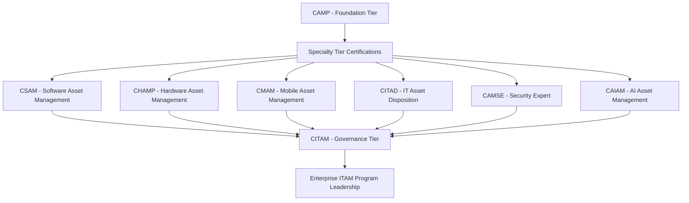

## The IAITAM Certification Suite Overview

### Overview

IAITAM (International Association of Information Technology Asset Managers) offers a suite of vendor-neutral professional certifications covering the full breadth of IT Asset Management (ITAM) practice areas — spanning foundational program design, hardware and software lifecycle management, mobility, disposition, security, and emerging technology governance. The suite is structured across three tiers: Foundation, Specialty, and Governance, allowing practitioners to build competency from broad program fundamentals toward either deep specialization or enterprise-level program leadership.

### Certification Suite at a Glance

| Certification | Full Name | Tier | Focus Area |
| --- | --- | --- | --- |
| CAMP | Certified Asset Management Professional | Foundation | Foundational ITAM program design and cross-functional integration |
| CSAM | Certified Software Asset Manager | Specialty | Software licensing, compliance, and audit risk reduction |
| CHAMP | Certified Hardware Asset Management Professional | Specialty | Hardware lifecycle governance and cost control |
| CMAM | Certified Mobile Asset Management | Specialty | Mobility and BYOD governance and controls |
| CITAD | Certified IT Asset Disposition | Specialty | Disposition vendor management, data security, chain of custody |
| CAMSE | Certified Asset Management Security Expert | Specialty | Security, risk, and compliance integration with asset protection |
| CAIAM | Certified Artificial Intelligence Asset Manager | Specialty | AI governance and emerging technology oversight |
| CITAM | Certified IT Asset Manager | Governance | Enterprise ITAM program leadership and strategic management |

This eight-certification structure represents an expansion of IAITAM's historical seven-certification suite, with CAIAM (Certified Artificial Intelligence Asset Manager) added as a specialty credential addressing AI governance and emerging technology oversight — reflecting the field's ongoing extension into managing AI-related assets and risk as a distinct ITAM discipline.

### CAMP — Certified Asset Management Professional (Foundation)

CAMP is designed to provide a thorough introduction to ITAM best practices and processes, along with strategies for implementing various organizational frameworks, including ITAM and IT Service Management (ITSM) integration. The course covers each of the IAITAM Best Practice Library's 12 Key Process Areas (KPAs), the roles and responsibilities affecting an ITAM Program, core functional areas, KPA indicators, and strategic positioning of ITAM within the broader organization to maximize return on investment across the IT portfolio.

**Exam format:** Multiple choice, 100 questions per paper, 85 marks required to pass (85%), 3-hour duration, open book.

CAMP serves as the foundational entry point for the suite — most practitioners pursuing a specialty or governance-tier certification are expected to have foundational familiarity with the concepts CAMP establishes, even where it is not a strict formal prerequisite for every other course.

### CSAM — Certified Software Asset Manager (Specialty)

CSAM is a core education program ensuring practitioners can manage software assets and understand the ever-changing variables that make up the software licensing and compliance landscape. The course addresses software lifecycle management, licensing structures, audit risk reduction, and cost/spend visibility — directly relevant to organizations managing complex, multi-vendor software entitlement portfolios and periodic vendor compliance audits.

### CHAMP — Certified Hardware Asset Management Professional (Specialty)

CHAMP tracks the lifecycle of IT hardware assets end-to-end — acquisition, deployment, maintenance, refresh, and retirement — and discusses business techniques for managing those assets effectively and economically, with particular attention to policies that enhance lifecycle management. CHAMP is aimed at new IT Asset Managers and other IT professionals involved in asset management, resource budgeting, finance, software licensing, contract management, and strategic planning — indicating the role's cross-functional scope beyond pure hardware tracking.

### CMAM — Certified Mobile Asset Management (Specialty)

CMAM focuses on the management of mobile devices, whether organizationally owned or employee-owned (BYOD), and provides crucial strategies and information relevant to distributed and remote work environments. This certification addresses the distinct lifecycle, security, and governance challenges mobile and BYOD assets present relative to traditional fixed hardware.

### CITAD — Certified IT Asset Disposition (Specialty)

CITAD manages the IT asset disposal process within an organization, with direct relevance to disposition vendor management, data security, and chain-of-custody practices — the credential most directly aligned with the IT Asset Disposition and Data Security domain covered elsewhere in this material (certificate of destruction documentation, sanitization method selection, ITAD vendor due diligence).

### CAMSE — Certified Asset Management Security Expert (Specialty)

CAMSE ensures practitioners are capable of serving as the liaison and communication partner between ITAM and corporate security functions, providing the most effective management and security processes for corporate IT assets. This credential helps students incorporate security strategies that fit both IT and ITAM disciplines, enhancing organizational security posture against intrusions and attacks as they relate to the asset lifecycle.

### CAIAM — Certified Artificial Intelligence Asset Manager (Specialty)

CAIAM addresses AI governance and emerging technology oversight as a distinct asset management discipline — reflecting the field's recognition that AI models, training data assets, and associated infrastructure introduce governance requirements (lifecycle tracking, risk oversight, compliance) that extend beyond traditional hardware/software ITAM frameworks. [Inference] As the newest addition to the suite, CAIAM's curriculum content and exam structure are less extensively documented in third-party sources than the longer-established certifications; organizations evaluating this credential should consult IAITAM's current course materials directly for the most precise scope and requirements.

### CITAM — Certified IT Asset Manager (Governance)

CITAM is the suite's top-tier governance credential, providing a multi-day course giving attendees a comprehensive overview of ITAM programs in their entirety. Graduates gain the knowledge to start or improve an organization's ITAM Program, and are equipped to design and implement strategies for setting objectives and priorities for the ITAM program at an enterprise level. CITAM is positioned for practitioners seeking to lead strategic programs aligned with business objectives, improving outcomes across cost, risk, and governance dimensions — distinguishing it from the specialty-tier credentials that focus on a single functional domain.

### Certification Suite Structure

### Recertification and Continuing Education

IAITAM operates a formal recertification process as a continuing education initiative, reinforcing the value and prestige of IAITAM certification. Recertification is obligatory for maintaining a favorable standing with IAITAM and is designed to allow ITAM practitioners to keep their certifications valid while simplifying ongoing accessibility to updated program content — reflecting the field's fast pace of evolution across licensing models, hardware lifecycle practices, security threats, and now AI governance considerations.

### Alignment with External Frameworks

Select IAITAM certifications have been mapped to the SFIA (Skills Framework for the Information Age) competency framework by third-party assessment bodies. For example, CAMP has been associated with Generic Attribute Knowledge up to SFIA level 3 and Asset Management up to level 3, while CHAMP has been associated with Generic Attribute Knowledge up to level 4 and Asset Management up to level 4 — providing organizations a reference point for mapping IAITAM credentials against broader IT competency and career development frameworks already in use.

### Choosing a Certification Path

- **New to ITAM broadly**: CAMP provides the necessary foundational overview before specializing.
- **Software licensing/compliance focus**: CSAM directly addresses audit risk and spend visibility concerns central to software asset management roles.
- **Hardware lifecycle/procurement focus**: CHAMP addresses the acquisition-through-retirement hardware lifecycle most directly relevant to ALM practitioners.
- **Disposition and data security focus**: CITAD is the most directly aligned credential for practitioners specializing in the ITAD and data security domain.
- **Security-ITAM integration focus**: CAMSE suits practitioners bridging ITAM and corporate security functions.
- **Program leadership/strategic focus**: CITAM is designed for practitioners responsible for building or leading an enterprise-wide ITAM program rather than a single functional area.

**Key Points**

- The IAITAM suite spans three tiers — Foundation (CAMP), Specialty (CSAM, CHAMP, CMAM, CITAD, CAMSE, CAIAM), and Governance (CITAM) — allowing progression from general fundamentals to either deep specialization or enterprise program leadership.
- CITAD is the certification most directly aligned with IT Asset Disposition and data security practice specifically.
- CAIAM represents the suite's extension into AI governance and emerging technology oversight as a distinct ITAM discipline.
- Recertification is mandatory to maintain standing, reflecting the field's fast-changing licensing, security, and technology landscape.

**Related Topics**

- IAITAM's 12 Key Process Areas (KPAs) Best Practice Library
- Mapping ITAM Certifications to SFIA Competency Framework Levels
- Building an ITAM Program Roadmap Using CITAM Governance Principles
- Software License Compliance and Audit Risk Reduction Practices (CSAM Domain)
- BYOD and Mobile Asset Governance Frameworks (CMAM Domain)
- AI Asset Governance as an Emerging ITAM Discipline