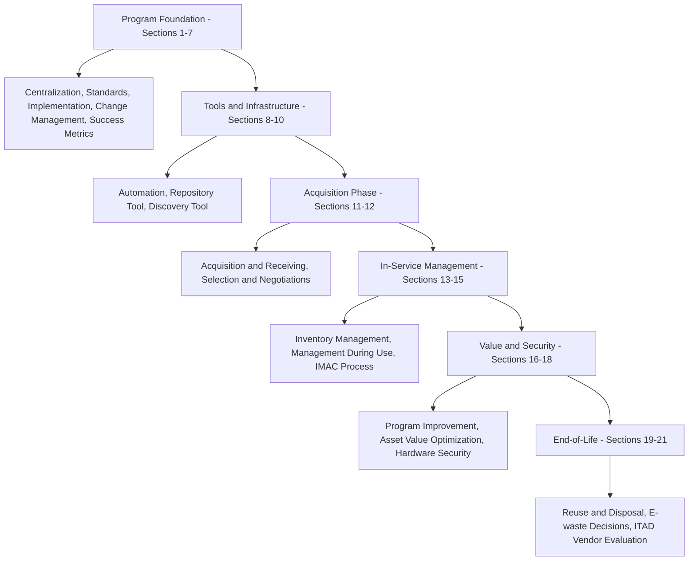

## Certified Hardware Asset Management Professional (CHAMP)

### Overview

CHAMP (Certified Hardware Asset Management Professional) is an IAITAM specialty-tier certification focused on the complete lifecycle management of IT hardware assets. Formulated to address the challenges faced by professionals overseeing hardware assets, the course goes beyond the conventional "cradle-to-grave" analogy, exploring business practices that optimize efficient and cost-effective hardware management. The certification is positioned at a beginner level within the IAITAM suite and is aimed at new IT Asset Managers and other IT professionals involved in asset management, resource budgeting, finance, software licensing, contract management, and strategic planning.

### Exam Structure

- **Format**: Multiple choice
- **Number of questions**: 100
- **Passing score**: 85% (85 out of 100 marks required)
- **Duration**: 3 hours
- **Mode**: Open book

**Prerequisites**: There are no formal prerequisites for the CHAMP course; however, IAITAM recommends candidates have prior knowledge of contracts and hardware lifecycle management before attempting certification.

**Recertification note**: [Inference] Third-party training provider listings indicate that after a defined period (commonly cited as 6 months in some course provider materials), candidates who have not completed recertification requirements may need to repurchase and retake the course and exam to regain the certification; organizations should verify current recertification timelines directly with IAITAM, as this detail can be provider-specific or subject to change.

### Curriculum Structure

The CHAMP course follows the hardware asset lifecycle through a structured sequence of sections:

| Section | Topic Area |
| --- | --- |
| 1 | Basics of Hardware Asset Management |
| 2 | The Power of ITAM Centralization |
| 3 | Best Practices for Asset Standards |
| 4 | Implementing a Program |
| 5 | Project Planning |
| 6 | Change Management |
| 7 | Measuring Success |
| 8 | Tools & Automation |
| 9 | Repository Tool |
| 10 | Discovery Tool |
| 11 | Acquisition & Receiving |
| 12 | Selection & Negotiations |
| 13 | Managing the Inventory |
| 14 | Management During Use |
| 15 | IMAC Process (Install/Move/Add/Change) |
| 16 | Improving the Program |
| 17 | Improving the Value of Assets |
| 18 | Hardware Security |
| 19 | Reuse & Disposal Processes |
| 20 | E-waste Decisions |
| 21 | Evaluating ITAD Vendors |

This structure mirrors the full ALM hardware lifecycle: program foundation and centralization → tooling and inventory infrastructure → acquisition and procurement → in-service management (IMAC) → value optimization and security → end-of-life disposition and ITAD vendor evaluation.

### Core Learning Outcomes

The course reviews the primary responsibilities in managing an organization's hardware assets, and analyzes the in-depth knowledge, operational knowledge, and competence required across the hardware management domain. Key competency outcomes include the ability to:

- Significantly reduce organizational compliance risk and penalties associated with hardware-related audits
- Support meaningful cost savings and improved management of IT hardware assets across the lifecycle
- Reduce risks inherent to the growth of Bring Your Own Device (BYOD) programs
- Identify and design policies that enhance lifecycle management effectiveness

### Policy Governance Emphasis

A recurring theme throughout the CHAMP curriculum is that policies are only effective under specific governance conditions:

1. **Cross-functional development** — policies should be developed by a cross-section of impacted departments (IT, finance, procurement, legal, security) rather than unilaterally by the ITAM function alone
2. **Regular review cycles** — policies must be reviewed frequently to remain current against changing technology, vendor landscape, and organizational needs
3. **Consistent communication** — policy content must be actively and consistently communicated to stakeholders, not merely documented
4. **Enforcement** — policies require consistent enforcement mechanisms to translate documented intent into actual organizational behavior

This governance framework reflects a broader ITAM principle: hardware asset management effectiveness depends as much on organizational and procedural discipline as on the underlying tracking systems or tools deployed.

### Lifecycle Coverage Map

### Relevance to Asset Lifecycle Management Practice

CHAMP's curriculum directly parallels the core ALM lifecycle stages covered across this material:

- **Acquisition & Receiving / Selection & Negotiations** connects to procurement and vendor negotiation practices upstream of asset capitalization
- **Managing the Inventory / Management During Use / IMAC Process** connects to ongoing asset tracking, transfers, and configuration management during the operational phase
- **Hardware Security** connects to the broader IT asset security posture considerations relevant during active use
- **Reuse & Disposal Processes / E-waste Decisions / Evaluating ITAD Vendors** connects directly to the value recovery (resale, remarketing, component harvesting) and ITAD vendor certification/compliance topics covered under the disposition and data security domain

### Target Audience and Positioning

CHAMP is positioned as a specialty-tier, beginner-level certification suited for:

- Practitioners newly entering an IT Asset Manager role with hardware-specific responsibilities
- IT professionals involved in resource budgeting, finance, or contract management who need hardware lifecycle competency
- Organizations building internal hardware asset management capability and seeking a standardized practitioner competency baseline

Unlike CITAM (the governance-tier, enterprise-program-leadership credential), CHAMP focuses specifically on hardware as a functional domain rather than the design and leadership of an ITAM program in its entirety.

**Key Points**

- CHAMP's 21-section curriculum spans the full hardware lifecycle from program foundation through acquisition, in-service management, and end-of-life disposition/ITAD vendor evaluation.
- The exam requires an 85% passing score across 100 multiple-choice questions in a 3-hour open-book format, with no formal prerequisites (though contract and hardware lifecycle knowledge is recommended).
- A core pedagogical theme is that hardware policy effectiveness depends on cross-functional development, regular review, consistent communication, and enforcement — not solely on tooling or tracking systems.
- CHAMP's final curriculum sections (Reuse & Disposal, E-waste Decisions, Evaluating ITAD Vendors) map directly to the value recovery and disposition compliance practices covered elsewhere in ALM practice.

**Related Topics**

- IMAC (Install/Move/Add/Change) Process Design and Governance
- Hardware Discovery Tool Selection and Deployment
- BYOD Risk Management and Governance Policy Design
- Evaluating and Selecting ITAD Vendors Against Certification Standards
- Cross-Functional Policy Governance Models for IT Asset Management
- Comparing CHAMP to CITAD for Disposition-Focused Career Paths