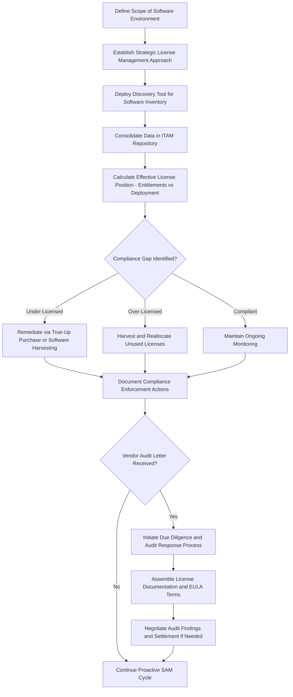

## Certified Software Asset Manager (CSAM)

### Overview

CSAM (Certified Software Asset Manager) is an IAITAM specialty-tier certification establishing a fundamental understanding of software asset management (SAM) while addressing the fluid dynamics within the field. Software Asset Management encompasses the business methodologies supporting software utilization within an organization, often prompting a reevaluation of how and why software traverses the organizational landscape. The course addresses issues spanning software piracy and compliance, legislative changes, and internal organizational complexities, requiring practitioners to evaluate both external and internal factors reshaping IT asset management practices. A proficient Software Asset Manager must align organizational objectives with the strategic potential of SAM to effectively accomplish those objectives.

CSAM is designed as a core foundation builder for any ITAM program, reflecting the growing organizational recognition that dedicated software management focus is essential given the pace of change in licensing models, legislative requirements, and vendor audit activity.

### Exam Structure

- **Format**: Multiple choice
- **Number of questions**: 100
- **Passing score**: 85%
- **Duration**: 3 hours
- **Prerequisites**: No formal prerequisites; the course is designed for individuals with little to moderate prior experience in software asset management
- **Certification pathway**: Certification is achievable via an online test, commonly available within a defined window (frequently cited as within 14 days) after completing the course, depending on delivery provider

### Curriculum Structure

| Section | Topic Area |
| --- | --- |
| 1 | The Scope of Software |
| 2 | Strategic License Management |
| 3 | Software Harvesting |
| 4 | License Documentation |
| 5 | The Right to Audit |
| 6 | Proactive vs. Reactive SAM |
| 7 | Developing Goals |
| 8 | Savings Opportunities |
| 9 | ITAM Compliance |
| 10 | Audit Letter |
| 11 | Examples of License Data Documentation |
| 12 | Compliance Enforcement |
| 13 | Understanding the EULA |
| 14 | Due Diligence for Compliance |
| 15 | The Art of Negotiation |
| 16 | Terms & Conditions Advice |
| 17 | ITAM Automation |
| 18 | Selecting a Discovery Tool |
| 19 | ITAM Repository |
| 20 | Hardware & Organizational Impacts |

The curriculum progresses from foundational scope-setting and strategic license management, through the compliance and audit-response domain (Sections 5, 9–14), into negotiation and contractual literacy (Sections 13–16), and concludes with the tooling infrastructure (discovery tools, repository) needed to operationalize SAM practice.

### Core Competency Domains

**Strategic License Management and Software Harvesting**

Strategic license management addresses how license entitlements are tracked, right-sized, and reallocated across the organization. Software harvesting — the practice of recovering unused or underused software licenses from decommissioned or underutilized systems for redeployment elsewhere — is treated as a distinct, deliberate cost-avoidance discipline within SAM, directly analogous to hardware component harvesting but applied to license entitlements rather than physical parts.

**Compliance and Audit Response**

A substantial portion of the curriculum addresses vendor audit exposure and response:

- **The Right to Audit** covers the contractual basis under which software vendors retain the right to audit a customer's license compliance, typically embedded in the End User License Agreement (EULA) or master licensing agreement.
- **Audit Letter** and **Due Diligence for Compliance** address the practical response workflow when an organization receives a formal vendor audit notice — how to organize internal response, what documentation must be assembled, and how to manage the audit engagement to minimize both compliance exposure and negotiated settlement costs.
- **Compliance Enforcement** addresses the internal governance mechanisms (policy, monitoring, technical controls) an organization uses to maintain license compliance proactively, reducing audit risk before an external audit event occurs.

**Understanding the EULA**

A core CSAM principle is that a license grants a right to use software under defined terms — the organization does not own the software itself, only the usage right as bounded by the EULA. This distinction underpins nearly all downstream compliance risk: license terms (per-device, per-user, concurrent-use, named-user, virtualization rights, downgrade rights) must be understood precisely, since misapplication of an incorrect license metric is a common source of both under-licensing (compliance exposure) and over-licensing (unnecessary spend).

**Negotiation and Contractual Literacy**

The Art of Negotiation and Terms & Conditions Advice sections address the commercial skill set required to negotiate favorable licensing terms, renewal pricing, and audit settlement outcomes — treating contract negotiation as a core SAM competency rather than a function reserved solely for procurement or legal teams.

**Tooling Infrastructure**

- **ITAM Automation** and **Selecting a Discovery Tool** address the technical tooling needed to automatically inventory installed software across the environment — a foundational capability for reconciling actual deployment against owned entitlements (the core of any effective license position calculation).
- **ITAM Repository** addresses the centralized data store where license entitlement records, deployment data, and contractual documentation are consolidated to support ongoing compliance monitoring and audit readiness.
- **Hardware & Organizational Impacts** addresses how hardware refresh cycles, virtualization, and organizational changes (mergers, divestitures, reorganizations) affect software license position and require corresponding SAM program adjustments.

### SAM Program Workflow

### Proactive vs. Reactive SAM

A central conceptual framework in CSAM distinguishes proactive from reactive Software Asset Management:

- **Reactive SAM** responds to compliance issues only when triggered externally — typically a vendor audit letter — resulting in compressed timelines, weaker negotiating position, and higher risk of penalty or unfavorable settlement terms.
- **Proactive SAM** maintains continuous license position monitoring, harvesting, and compliance enforcement independent of external audit triggers, positioning the organization to respond to any audit from a position of documented readiness rather than scrambling reactively.

The course emphasizes developing clear goals and quantifiable success metrics (tied to the "Developing Goals" and "Savings Opportunities" curriculum sections) as the mechanism for sustaining proactive SAM practice over time, rather than treating SAM maturity as a one-time implementation project.

### Relevance to Asset Lifecycle Management Practice

CSAM's compliance and audit-response curriculum connects directly to broader ALM financial and risk disciplines:

- License compliance exposure functions analogously to an unrecorded liability — an under-licensed position discovered during a vendor audit can result in retroactive true-up costs functioning similarly to a financial restatement risk
- Software harvesting parallels hardware component harvesting and value recovery practices, applying the same "recover value from decommissioned or underutilized assets" principle to intangible license entitlements
- ITAM Repository and Discovery Tool selection connect to the broader system-of-record architecture question relevant across hardware and software asset domains alike

**Key Points**

- CSAM's curriculum is built around the tension between reactive audit response and proactive continuous compliance monitoring, with the latter treated as the maturity goal for any SAM program.
- A defining conceptual anchor of the course is that license ownership is a right to use under EULA-defined terms, not ownership of the software itself — misunderstanding this distinction is a common root cause of compliance exposure.
- Software harvesting (recovering unused license entitlements for redeployment) is treated as a distinct, proactive cost-avoidance discipline analogous to hardware component harvesting.
- The exam requires an 85% passing score across 100 questions in 3 hours, with no formal prerequisites, making it accessible to practitioners new to the software licensing domain.

**Related Topics**

- Effective License Position (ELP) Calculation Methodology
- Vendor Audit Response Playbook Design and Documentation Requirements
- EULA Terms Interpretation Across Licensing Models (Per-Device, Per-User, Concurrent)
- Software Discovery Tool Selection Criteria and Deployment Architecture
- Software Harvesting and License Reallocation Programs
- Comparing CSAM to CHAMP for Full-Stack ITAM Competency Building