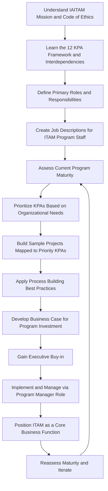

## Certified IT Asset Manager (CITAM)

### Overview

CITAM (Certified IT Asset Manager) is IAITAM's governance-tier certification, positioned as the flagship credential for practitioners seeking comprehensive mastery of ITAM and leadership of strategic programs aligned with business objectives. In harmony with the IAITAM Best Practices Library (IBPL), the CITAM course is structured to provide a comprehensive understanding of the entirety of an ITAM Program, giving participants a foundational strategy for initiating or enhancing their organization's ITAM efforts. Upon completion, graduates earn the Certified IT Asset Manager designation, accredited by IAITAM, recognizing their expertise in ITAM and commitment to operational excellence.

The CITAM course was originally developed by professional IT Asset Managers to codify a number of existing IAITAM professional development programs, and it has evolved over time to accommodate ongoing changes in the ITAM profession.

### Exam Structure

- **Format**: Multiple choice
- **Number of questions**: 100
- **Passing score**: 85%
- **Duration**: 3 hours
- **Course length**: Typically delivered over 3 days (longer than the single-day format common to specialty-tier courses like CHAMP and CSAM), reflecting the broader comprehensive scope of the governance-tier material
- **Prerequisites**: Before attending, candidates should have prior CSAM/CHAMP certification and/or a well-founded working knowledge of IT Asset Management, along with an understanding of the student's own organization's business model

This prerequisite structure formally positions CITAM above the specialty-tier certifications in the IAITAM suite — candidates are expected to arrive with either specialty-level credentialed knowledge or equivalent practical experience, distinguishing CITAM from CAMP (which has no such expectation) and from the specialty courses (CSAM, CHAMP), which are designed for practitioners with little to moderate prior domain experience.

### Curriculum Structure

| Module | Topic Area |
| --- | --- |
| 1 | IAITAM and the Mission |
| 2 | ITAM Code of Ethics |
| 3 | Defining Primary Roles in an ITAM Program |
| 4 | IAITAM's 12 Key Process Areas (KPAs) |
| 5 | Relationships, Dependencies, and Benefits |
| 6 | KPA Interdependencies |
| 7 | Roles and Responsibilities |
| 8 | Creating Dynamic Job Descriptions for ITAM Programs |
| 9 | The Role of a Program Manager |
| 10 | Project Management Relationship Triangle |
| 11 | Sample Projects by KPA |
| 12 | Prioritization and the ITAM Program |
| 13 | Lifecycle Management |
| 14 | Process Building Best Practices |
| 15 | Gaining Executive Buy-in |
| 16 | Business Case Template |
| 17 | Maturity Assessment |
| 18 | ITAM as a Core Business Function |

### Core Structural Concept: The 12 Key Process Areas (KPAs)

The centerpiece of the CITAM curriculum is IAITAM's 12 KPA framework, which structures ITAM as a set of interdependent process domains rather than a single monolithic function. The course specifically addresses:

- **KPA Interdependencies**: how the 12 process areas relate to and depend on one another, since a change or gap in one KPA (e.g., procurement) has downstream effects on others (e.g., inventory management, compliance)
- **Relationships, Dependencies, and Benefits**: how understanding these interdependencies translates into measurable program benefits, rather than treating each KPA as an isolated checklist item
- **Sample Projects by KPA**: applied, project-based examples showing how KPA concepts translate into real-world initiatives an ITAM Manager might lead

### Program Leadership and Organizational Design Focus

Unlike the specialty-tier certifications (CHAMP, CSAM), which focus on a single functional domain, CITAM's curriculum is explicitly oriented toward the organizational and leadership dimensions of running an ITAM program:

- **Defining Primary Roles in an ITAM Program** and **Creating Dynamic Job Descriptions** address how to structure and staff an ITAM function appropriately
- **The Role of a Program Manager** and **Project Management Relationship Triangle** (the classic scope/time/cost tradeoff model) address program and project management competencies specific to ITAM initiative delivery
- **Gaining Executive Buy-in** and **Business Case Template** address the change-management and internal advocacy skills required to secure organizational support and funding for ITAM initiatives — a distinctly leadership-oriented competency not present in the specialty-tier curricula
- **Maturity Assessment** addresses frameworks for evaluating an organization's current ITAM program maturity level, providing a baseline from which improvement roadmaps can be built
- **ITAM as a Core Business Function** frames the course's overarching thesis: that ITAM should be positioned and resourced as a core, strategic business function rather than a peripheral IT administrative task

### Program Development Workflow

### Ethics and Foundational Principles

CITAM uniquely among the IAITAM suite formally incorporates the **ITAM Code of Ethics** as an explicit curriculum module, reflecting the credential's positioning as the profession's senior leadership certification — CITAM holders are expected to model and enforce ethical standards across the ITAM function they lead, not merely execute technical process tasks.

### Positioning Relative to the Broader IAITAM Suite

CITAM's relationship to the specialty-tier certifications can be understood as horizontal integration followed by vertical elevation: where CHAMP, CSAM, CMAM, CITAD, and CAMSE each build deep competency in a single functional domain (hardware, software, mobility, disposition, security), CITAM integrates awareness of all 12 KPAs across the entire ITAM discipline and adds the program leadership, business case development, and organizational change management skills needed to run — not just execute within — an ITAM function.

This positioning is reflected in course pricing and duration: CITAM's listed course fee is notably higher than the specialty-tier certifications, and its multi-day format contrasts with the single-day accelerated delivery common to CHAMP and CSAM, reflecting the broader scope of material and expectation of prior specialty-level or equivalent practical grounding.

### Relevance to Asset Lifecycle Management Practice

CITAM's KPA-based program structure and maturity assessment framework provide the organizational scaffolding within which the more granular ALM disciplines covered elsewhere in this material operate — life cycle costing, disposition compliance, audit readiness controls, and GAAP/IFRS reconciliation are all, in effect, specific process outputs that a mature ITAM program (as CITAM teaches practitioners to design and lead) must produce and govern.

**Key Points**

- CITAM is IAITAM's governance-tier certification, expecting prior specialty-level certification (CSAM/CHAMP) or equivalent working knowledge as a practical prerequisite, unlike the specialty and foundation tiers.
- The course is structured around IAITAM's 12 Key Process Areas (KPAs) and their interdependencies, treating ITAM as an integrated system of process domains rather than isolated functional silos.
- Distinctive curriculum elements — Gaining Executive Buy-in, Business Case Template, Maturity Assessment, and the ITAM Code of Ethics — reflect CITAM's program leadership and organizational change focus, differentiating it from the technical/functional depth of specialty-tier courses.
- The exam format (100 questions, 85% pass, 3 hours) matches other IAITAM certifications structurally, but the underlying course content and expected prior competency are materially more advanced.

**Related Topics**

- IAITAM's 12 Key Process Areas (KPAs) Framework in Depth
- ITAM Program Maturity Assessment Models and Roadmapping
- Building a Business Case for ITAM Program Investment
- Organizational Design and Job Description Frameworks for ITAM Teams
- ITAM Code of Ethics and Professional Standards
- Positioning ITAM as a Core Strategic Business Function