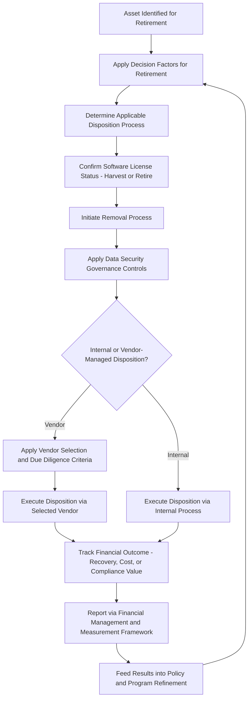

## Certified IT Asset Disposition (CITAD)

### Overview

CITAD (Certified IT Asset Disposition) is an IAITAM specialty-tier certification designed to equip individuals with the skills to effectively oversee the process of IT asset disposal within an organization. The course dissects best practices in IT Asset Disposition, ranging from policy management to data security and chain of custody transitions. Attendees whose job roles involve ITAD gain insights into averting the risks of data loss and public exposure. CITAD is the credential most directly aligned with the IT Asset Disposition and Data Security domain of ALM practice, integrating the disposal, sanitization, chain of custody, and vendor management topics covered throughout this material into a single dedicated professional competency framework.

A central thesis of the CITAD course is a reframing of disposition's organizational role: by adopting IAITAM's best practice approach, ITAD processes can shift from being perceived as corporate overhead to becoming profit centers and avenues for risk mitigation. This reframing reflects the value recovery principle — that disposition, if properly managed, generates savings and even positive cash flow through equipment reuse, software redeployment, and asset resale, rather than functioning purely as a cost sink.

### Exam Structure

- **Format**: Multiple choice
- **Number of questions**: 100
- **Passing score**: 85%
- **Duration**: 3 hours
- **Prerequisites**: No formal prerequisites; although some knowledge of an organization's lifecycle management is encouraged, the course is designed for individuals with limited to no prior experience in asset management, making it accessible as an entry point specifically for ITAD-focused roles

### Curriculum Structure

| Topic Area |
| --- |
| Disposition Overview |
| Disposition and ITAM |
| Organizational Goals for Disposition |
| ITAM Goals for Disposition |
| Governance of Electronic Disposal |
| Composition of E-Scrap |
| Waste Management Laws |
| Foundation for Disposal Management |
| Policy Topics Relevant to Disposition |
| Asset Standards Benefit Disposal |
| The Role of Automation |
| Data Security Governance |
| Working with Vendors |
| Selecting Vendors |
| Due Diligence |
| The Removal Process |
| Software During Disposition |
| Decision Factors for Retirement |
| The Disposition Processes |
| Financial Management & Measurement |

### Core Competency Domains

**Governance and Regulatory Foundation**

- **Governance of Electronic Disposal** and **Waste Management Laws** address the legal and regulatory landscape governing e-waste, including how the practitioner's operating jurisdiction and the jurisdictions in which the organization does business affect applicable requirements — directly relevant to multi-jurisdiction compliance considerations (analogous to the HIPAA/GLBA/GDPR overlap covered under regulatory compliance in disposition).
- **Composition of E-Scrap** addresses the material composition of retired electronics, relevant to understanding both hazardous material handling obligations and materials-recycling value recovery potential.
- Laws affecting IT disposal are treated as inherently dynamic — practitioners must track how legislative change, new vendor relationships, and mergers/acquisitions affect the compliance posture of the disposition program on an ongoing basis, rather than treating regulatory compliance as a one-time program design exercise.

**Data Security Governance**

Data Security Governance addresses the policies and controls needed to prevent data loss and public exposure during the disposal process — directly paralleling the chain of custody, certificate of destruction, and sanitization method selection practices covered under IT Asset Disposition and Data Security.

**Vendor Management**

- **Working with Vendors**, **Selecting Vendors**, and **Due Diligence** address the full vendor lifecycle: how to evaluate prospective ITAD vendors (including assessment against certification standards such as R2v3 and e-Stewards), structure vendor relationships, and conduct ongoing due diligence to verify continued compliance.
- This vendor management competency is treated as foundational to risk mitigation — since organizations typically retain liability exposure even after physical custody transfers to a third-party ITAD vendor, vendor selection and due diligence quality directly determines the organization's residual disposition risk.

**Policy, Standards, and Program Foundation**

- **Foundation for Disposal Management** and **Policy Topics Relevant to Disposition** address how to construct disposition policy that is enforceable and organizationally embedded, echoing the cross-functional policy governance principles emphasized in CHAMP.
- **Asset Standards Benefit Disposal** addresses how upstream asset standardization (consistent hardware configurations, standardized tagging) reduces friction and cost at the disposition stage — reinforcing that disposition efficiency is influenced by decisions made much earlier in the asset lifecycle.
- **The Role of Automation** addresses how ITAM tooling and automation support the disposition workflow, including tracking assets through the removal, sanitization, and final disposition stages.

**Operational Disposition Process**

- **The Removal Process** covers the physical and administrative steps of removing an asset from active service and initiating the disposition workflow.
- **Software During Disposition** addresses handling of software license entitlements at disposition time — including license harvesting/reclamation opportunities (connecting to the CSAM curriculum's software harvesting concept) and ensuring license compliance obligations are properly closed out when hardware hosting licensed software is retired.
- **Decision Factors for Retirement** addresses the criteria used to determine when an asset should move to disposition, connecting to repair-or-replace decision logic and asset lifecycle status management.
- **The Disposition Processes** addresses the range of disposition pathways available (redeployment, resale, remarketing, component harvesting, recycling, destruction) and the decision framework for selecting among them per asset or asset class.

**Financial Management**

**Financial Management & Measurement** addresses how disposition programs should track and report financial performance — recovered value, cost avoidance, and disposition program ROI — reinforcing the course's central thesis that disposition can and should be measured as a value-generating function rather than treated purely as a cost center with no performance metrics.

### CITAD Disposition Process Flow

### Risk Framing Central to the Course

CITAD emphasizes that at any step during the ITAD process, errors can occur, exposing organizations to fines, penalties, and public reputational damage — directly paralleling the audit findings (ghost assets, custody gaps, unsupported disposal documentation) and regulatory exposure discussed under audit readiness and multi-framework compliance topics. The course positions risk mitigation and value recovery as two sides of the same disposition management discipline, rather than competing priorities — proper governance simultaneously protects against loss exposure and enables the cost recovery opportunities available through reuse, resale, and software redeployment.

### Target Audience and Positioning

CITAD is tailored for individuals with limited to no prior experience in asset management, serving as essential education for those entrusted with ITAD programs and other IT practitioners whose responsibilities touch the disposition function specifically. This accessibility, combined with its narrow functional focus (disposition specifically, rather than the full ITAM lifecycle), positions CITAD as the natural specialty credential for practitioners building a career specifically in the ITAD/data security space, complementing CHAMP (broader hardware lifecycle) and CSAM (software lifecycle) rather than substituting for either.

**Key Points**

- CITAD's twenty-topic curriculum spans governance, data security, vendor management, operational process, and financial measurement — providing the professional-certification counterpart to the technical ITAD/data security topics covered elsewhere in this material.
- A defining course thesis is that disposition can be reframed from cost center to profit center and risk-mitigation function through proper vendor management, policy governance, and value recovery practice.
- Vendor selection and due diligence are treated as central risk-mitigation levers, since organizational liability for improper disposal typically persists even after physical custody transfers to a third-party vendor.
- The exam requires an 85% passing score across 100 questions in 3 hours, with no formal prerequisites, making it directly accessible to practitioners newly assigned ITAD responsibilities.

**Related Topics**

- Vendor Selection and Due Diligence Frameworks for ITAD Programs
- Software License Reclamation During Hardware Disposition
- Measuring Disposition Program Financial Performance and ROI
- Waste Management Law Variation Across Operating Jurisdictions
- Asset Standardization's Impact on Disposition Cost and Efficiency
- Comparing CITAD to R2v3/e-Stewards Vendor Certification Standards