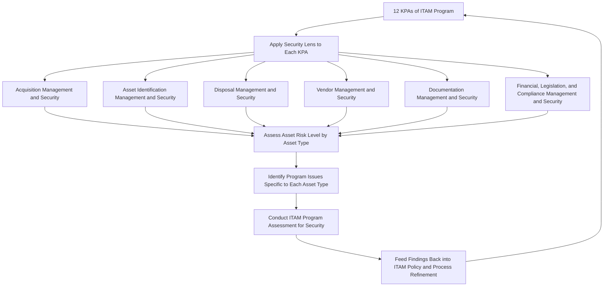

## Certified Asset Management Security Expert (CAMSE)

### Overview

CAMSE (Certified Asset Management Security Expert) is an IAITAM specialty-tier certification ensuring practitioners are capable of being the liaison and communication partner between ITAM and corporate security. The primary objective of the CAMSE course is to optimize the role of IT Asset Management professionals in bolstering the organization's information and physical security, achieved by bridging the divide between ITAM and IT security processes. The course integrates security strategies across ITAM policies, processes, and procedures, thereby leveraging ITAM to augment the security program and enhance applicable governance.

Unlike specialty certifications organized around a single asset class (hardware, software, mobility, disposition), CAMSE is organized around a single cross-cutting lens — security — applied systematically across every one of IAITAM's Key Process Areas (KPAs). This makes CAMSE structurally distinctive within the suite: rather than teaching a new functional domain, it re-examines the existing ITAM process areas through a security governance perspective.

### Exam Structure

- **Format**: Multiple choice
- **Number of questions**: 100
- **Passing score**: 85%
- **Duration**: 3 hours
- **Prerequisites**: No formal prerequisites for the course

### Curriculum Structure

| Module | Topic Area |
| --- | --- |
| 6 | The 12 KPAs and Security |
| 7 | Program Management and Security |
| 8 | Communication and Education Management and Security |
| 9 | Policy Management and Security |
| 10 | Acquisition Management and Security |
| 11 | Asset Identification Management and Security |
| 12 | Disposal Management and Security |
| 13 | Project Management and Security |
| 14 | Documentation Management and Security |
| 15 | Financial Management and Security |
| 16 | Legislation Management and Security |
| 17 | Compliance Management and Security |
| 18 | Vendor Management and Security |
| 19 | Assessing Asset Risk Level |
| 20 | Program Issues by Asset Type |
| 21 | ITAM Program Assessment for Security |

[Inference] Publicly available module listings for CAMSE begin at Module 6, suggesting the full course structure includes preliminary foundational modules (likely covering ITAM basics and security fundamentals) that were not consistently captured across the training-provider sources reviewed; the module numbering itself indicates the course builds on foundational content before proceeding into the KPA-by-KPA security integration sequence shown above.

### Core Structural Concept: Security Integrated Across the 12 KPAs

The defining pedagogical approach of CAMSE is to take IAITAM's 12 Key Process Areas — the same KPA framework taught at a program-leadership level in CITAM — and examine each one specifically through a security lens:

- **Acquisition Management and Security**: security considerations at the point of asset procurement (vendor security posture, supply chain risk, secure configuration baselines established at intake)
- **Asset Identification Management and Security**: how asset tagging, tracking, and inventory accuracy function as security controls (an unidentified or untracked asset is inherently a security blind spot)
- **Disposal Management and Security**: security requirements during end-of-life disposition — directly overlapping with the chain of custody, sanitization, and certificate of destruction practices covered under IT Asset Disposition and Data Security
- **Documentation Management and Security**: how record-keeping practices support security auditability and incident investigation
- **Vendor Management and Security**: security due diligence specifically as applied to third-party vendor relationships, paralleling ITAD vendor due diligence but generalized across all vendor types touching the asset lifecycle
- **Financial Management and Security**, **Legislation Management and Security**, **Compliance Management and Security**: how budgetary, legal, and regulatory considerations intersect with security risk management within the ITAM function

This "security applied to every KPA" structure reflects CAMSE's core thesis: security is not a separate KPA bolted onto ITAM, but a dimension that must be actively considered within every existing process area for an ITAM program to genuinely support organizational security posture.

### Risk Assessment and Asset-Type-Specific Considerations

- **Assessing Asset Risk Level** addresses frameworks for evaluating the relative security risk different assets pose, enabling risk-based prioritization of security controls rather than uniform treatment of all assets regardless of sensitivity or exposure.
- **Program Issues by Asset Type** addresses how security considerations differ across asset categories (e.g., mobile devices present different risk profiles than fixed infrastructure, cloud-hosted assets differ from on-premises hardware), requiring the security-integrated ITAM program to be calibrated per asset class rather than applying a single uniform security policy.
- **ITAM Program Assessment for Security** provides a capstone framework for evaluating how well an existing ITAM program currently performs against security objectives, functioning as a maturity/gap assessment tool analogous to CITAM's broader program maturity assessment but scoped specifically to security outcomes.

### CAMSE Security Integration Model

### Communication and Education Emphasis

Communication and Education Management and Security addresses a competency distinctive to CAMSE's "liaison" positioning: the CAMSE-certified practitioner is expected to actively educate both the ITAM function and the security function about each other's requirements and constraints, functioning as a translator between two organizational disciplines that often operate with different priorities, vocabularies, and reporting lines. This liaison function is reinforced by the course's stated goal of fundamentals of communication and education for information security, treating cross-functional communication as a core deliverable of the role, not merely a soft skill.

### Relevance to Asset Lifecycle Management Practice

CAMSE's Disposal Management and Security module directly reinforces the chain of custody, certificate of destruction, and multi-framework regulatory compliance (HIPAA/GLBA/GDPR) topics covered under IT Asset Disposition and Data Security — framing disposition security not as a disposition-specific specialty (as CITAD does) but as one instance of a broader security-integration discipline applied consistently across the entire asset lifecycle. Similarly, its Vendor Management and Security module generalizes the ITAD vendor due diligence practices (R2v3/e-Stewards certification verification, BAA/DPA contracting) into a security framework applicable to any vendor relationship touching organizational assets, not disposition vendors alone.

### Positioning Relative to the Broader IAITAM Suite

CAMSE occupies a distinctive niche: it is neither a functional-domain specialty (like CHAMP, CSAM, CMAM, CITAD) nor a program-leadership governance credential (like CITAM), but a cross-cutting integration credential that overlays a security perspective onto the entire KPA framework. Practitioners pursuing a security-adjacent ITAM career path — particularly those functioning as a bridge between IT Asset Management and a formal information security or GRC (Governance, Risk, and Compliance) function — are the natural audience for this credential, complementing rather than replacing domain-specific specialty certifications.

**Key Points**

- CAMSE is structurally distinctive: rather than teaching a new asset domain, it re-examines all 12 ITAM KPAs through a security lens, positioning the ITAM function as an active contributor to organizational security posture.
- The course's liaison framing positions the CAMSE-certified practitioner as a communication bridge between ITAM and corporate security functions, with cross-functional education treated as a core competency.
- Disposal Management and Security and Vendor Management and Security modules directly generalize disposition-specific security and vendor due diligence practices into a security framework applicable across the full asset lifecycle.
- The exam requires an 85% passing score across 100 questions in 3 hours, with no formal prerequisites.

**Related Topics**

- Applying Risk-Based Security Controls Across IAITAM's 12 KPAs
- Bridging ITAM and Corporate Security Governance Structures
- Asset-Type-Specific Security Risk Assessment Frameworks
- Vendor Security Due Diligence Beyond Disposition-Specific Contexts
- ITAM Program Security Maturity Assessment Methodologies
- Comparing CAMSE to CITAD for Security-Focused ITAD Career Paths