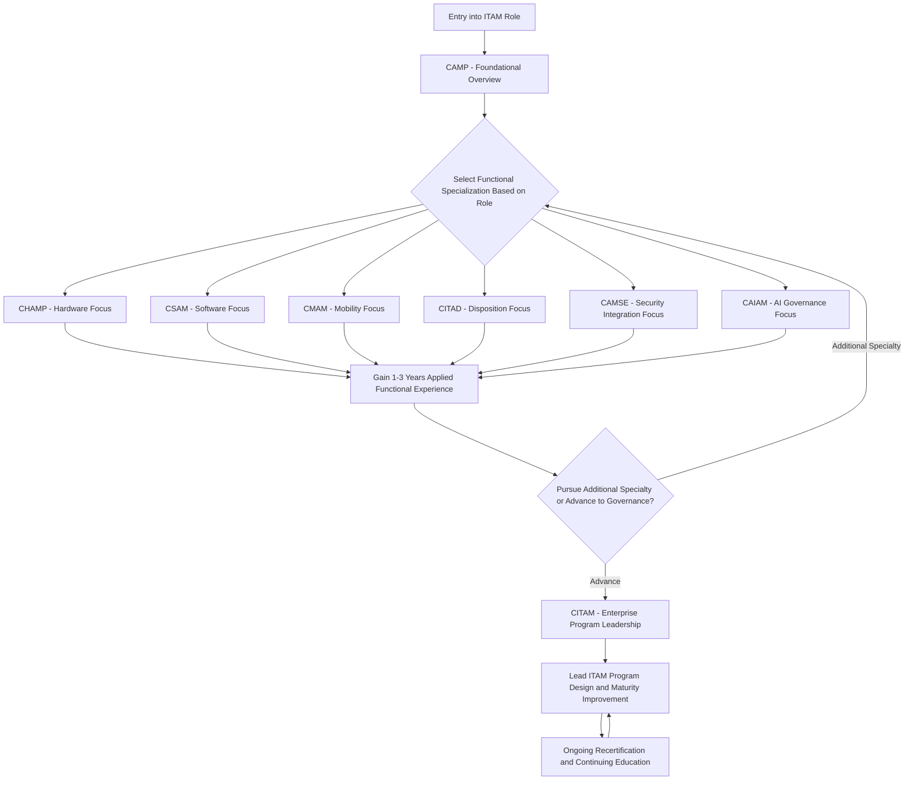

## Building an ITAM Career Path and Continuing Education Plan

### Overview

A structured ITAM career path leverages the IAITAM certification suite's tiered design — Foundation, Specialty, and Governance — to progress a practitioner from general awareness through deep functional expertise toward enterprise program leadership. Because IT Asset Management sits at the intersection of finance, procurement, IT operations, security, and compliance, an effective career and continuing education plan must account not only for certification sequencing but also for the practical experience, cross-functional exposure, and recertification discipline needed to sustain credibility over a multi-year career.

### Career Stage Framework

**Stage 1: Foundational Awareness**

Practitioners new to ITAM — whether entering directly, transferring from IT operations, procurement, or finance — typically begin with CAMP (Certified Asset Management Professional), which provides an extensive overview of ITAM best practices and processes across all 12 Key Process Areas without requiring prior specialization. This stage establishes shared vocabulary and conceptual grounding before a practitioner commits to a functional specialization.

**Stage 2: Functional Specialization**

Once foundational concepts are established, practitioners typically select one or more specialty credentials aligned to their role's functional focus:

- **CHAMP** (hardware lifecycle) — for practitioners responsible for physical asset acquisition, deployment, and retirement
- **CSAM** (software licensing and compliance) — for practitioners managing entitlement tracking, audit response, and vendor licensing negotiations
- **CMAM** (mobility) — for practitioners overseeing mobile device and BYOD governance
- **CITAD** (disposition) — for practitioners specializing in end-of-life asset management, data security, and value recovery
- **CAMSE** (security integration) — for practitioners bridging ITAM and corporate security functions
- **CAIAM** (AI asset governance) — for practitioners extending into AI model and infrastructure governance as an emerging discipline

Many practitioners pursue more than one specialty credential over time, particularly where role responsibilities span multiple asset domains (e.g., a practitioner responsible for both hardware and software lifecycle in a smaller organization).

**Stage 3: Governance and Program Leadership**

CITAM (Certified IT Asset Manager) represents the natural capstone credential, expecting prior CSAM/CHAMP certification or equivalent working knowledge as an informal prerequisite. This stage marks the transition from executing within a functional domain to designing, resourcing, and leading an ITAM program in its entirety — encompassing KPA interdependency management, business case development, executive buy-in, and program maturity assessment.

### Career Path Progression Model

### Experience-Certification Alignment

Certifications alone do not substitute for applied experience; a well-designed career plan pairs each certification stage with corresponding on-the-job exposure:

| Career Stage | Certification | Complementary Experience to Seek |
| --- | --- | --- |
| Entry | CAMP | Exposure to at least one full asset lifecycle cycle (acquisition through disposition) in any domain |
| Specialization | CHAMP/CSAM/CMAM/CITAD | Direct ownership of a functional workstream — e.g., leading a hardware refresh cycle, managing a software audit response, or executing a disposition project |
| Cross-functional depth | CAMSE (optional) | Participation in security incident response or risk assessment involving IT assets |
| Leadership | CITAM | Building or substantially revising an organizational ITAM policy, process, or program component; presenting a business case to leadership |

[Inference] The specific duration of "applied experience" appropriate before advancing to the next certification stage is not standardized by IAITAM in prescriptive terms; the ranges suggested here reflect common professional development pacing observed in adjacent IT and asset management career frameworks rather than a formal IAITAM requirement.

### Continuing Education and Recertification Discipline

IAITAM operates a formal recertification process to maintain the validity and prestige of its certifications, framed as an ongoing continuing education initiative rather than a one-time achievement. A sustainable career plan should treat recertification not as an administrative afterthought but as a structured opportunity to refresh knowledge against an evolving field — particularly relevant given how quickly software licensing models, data privacy regulation, and disposition compliance requirements change.

**Building a Continuing Education Cadence:**

1. **Track certification expiration/recertification windows** for every credential held, building recertification into annual professional development planning rather than addressing it reactively near expiration
2. **Monitor regulatory and standards change** relevant to held specialties — e.g., a CITAD holder should track updates to R2v3/e-Stewards certification standards and evolving data privacy regulation (GDPR, state-level US privacy laws); a CSAM holder should track major software vendor licensing model changes
3. **Participate in IAITAM's broader professional community** (conferences, working groups, published best practice library updates) to stay current on IAITAM Best Practice Library (IBPL) revisions between formal recertification cycles
4. **Layer in adjacent, complementary certifications** where career trajectory intersects other disciplines — for example, a practitioner moving toward a security-integrated role might pair CAMSE with a foundational security certification from another body, or a practitioner moving toward financial reporting responsibilities might pursue complementary accounting/finance credentials relevant to GAAP/IFRS asset treatment

### Building a Personal Development Plan

A structured personal continuing education plan typically includes:

- **Current-state assessment**: which KPAs and asset domains does the practitioner currently have deep experience in, versus which remain gaps?
- **Target-state definition**: what is the practitioner's 2–3 year career objective — deeper specialization, broader generalist program leadership, or a lateral move into an adjacent discipline (security, procurement, finance)?
- **Certification sequencing** aligned to the target state, following the Foundation → Specialty → Governance progression, or targeting a specific specialty combination relevant to a generalist or hybrid role
- **Experience milestones** paired to each certification stage, ensuring credentials are reinforced by demonstrable applied work rather than accumulated as credentials alone
- **Recertification calendar** integrated into the overall plan so that credential maintenance does not lapse unnoticed

### Career Path Examples by Specialization Focus

**Disposition and Data Security Track**: CAMP → CITAD → (optionally CAMSE for security depth) → CITAM, suited to practitioners building toward ITAD program leadership or vendor management specialization, directly relevant to the value recovery, chain of custody, and multi-framework regulatory compliance practices covered elsewhere in this material.

**Software Compliance and Licensing Track**: CAMP → CSAM → (optionally an additional specialty for cross-domain breadth) → CITAM, suited to practitioners building toward software audit defense and licensing negotiation leadership roles.

**Full-Stack Generalist Track**: CAMP → CHAMP → CSAM → CITAM, suited to practitioners aiming for broad ITAM program management responsibility across both major asset domains before pursuing governance-tier leadership.

**Security-Integrated Track**: CAMP → (CHAMP or CSAM as functional grounding) → CAMSE → CITAM, suited to practitioners whose organizational context places ITAM under or adjacent to a security/GRC function.

### Common Pitfalls in Career and Continuing Education Planning

- Pursuing governance-tier certification (CITAM) without sufficient functional grounding, resulting in credential attainment that outpaces practical program leadership readiness
- Treating certification as a terminal achievement rather than pairing it with applied experience milestones, weakening the practical credibility the credential is meant to signal
- Allowing recertification to lapse due to lack of proactive calendar tracking, particularly for practitioners holding multiple credentials with differing renewal cycles
- Failing to layer in adjacent non-IAITAM knowledge (regulatory change, financial reporting standards, security frameworks) that materially affects day-to-day ITAM practice but falls outside the certification curriculum itself
- Selecting a specialty certification based solely on current job title rather than career trajectory, resulting in a credential portfolio that does not support the practitioner's actual 2–3 year objective

**Key Points**

- The IAITAM suite's Foundation → Specialty → Governance structure provides a natural career progression scaffold, but certifications should be paired with corresponding applied experience milestones at each stage.
- CITAM's informal prerequisite of prior CSAM/CHAMP certification or equivalent experience makes early specialty-tier investment a practical requirement for eventual governance-tier advancement.
- Recertification should be planned proactively as part of an annual professional development cycle, not addressed reactively near expiration.
- Career path sequencing should be driven by the practitioner's target role (disposition specialist, licensing/compliance leader, full-stack generalist, security-integrated ITAM professional) rather than by certification availability alone.

**Related Topics**

- Designing a Personal Recertification Tracking System Across Multiple Credentials
- Complementary Non-IAITAM Certifications for Security- or Finance-Adjacent ITAM Roles
- Building Applied Experience Milestones Alongside Certification Progression
- IAITAM Best Practice Library (IBPL) Update Monitoring Practices
- Career Trajectory Planning from Specialty Practitioner to Program Leader
- Cross-Training Strategies for Hybrid Hardware/Software ITAM Roles