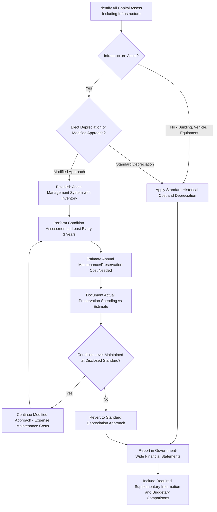

## GASB 34 and Governmental Capital Asset Reporting

### Overview

GASB 34 is a financial accounting standard issued by the Governmental Accounting Standards Board (GASB) in the United States in June 1999. It provides a comprehensive framework for financial reporting with the objective of making annual reports easier to understand and more useful to the people who rely upon the financial condition contained in them. The GASB Chairman characterized the statement as the most significant change to occur in the history of government financial reporting. The most significant aspect of Statement 34 was that, for the first time, general infrastructure assets — such as roads, bridges, and dams — were to be reported together with related depreciation or preservation costs, fundamentally changing how state and local governments account for long-lived public assets.

Prior to GASB 34, state and local government agencies commonly used cash-basis accounting methods for infrastructure: the capital or dollar cost of an infrastructure investment appeared in the annual financial report only during the year the construction cost was incurred, with the value of the existing physical asset not appearing on financial reports afterward. GASB 34 shifted governments toward an accrual-based accounting system where expenses and revenues are recorded on basic financial statements in the same fiscal year they occur, extending capital asset reporting well beyond the point of initial construction.

### Definitions and Scope

Capital assets are defined by GASB 34 as land and improvements, easements, buildings and improvements, vehicles, machinery, equipment, works of art and historical treasures, infrastructure, and all other tangible or intangible assets that are used in operations and that have initial useful lives extending beyond a single reporting period.

Infrastructure assets are long-lived capital assets that normally are stationary in nature and can normally be preserved for a significantly greater number of years than most capital assets. Examples of infrastructure assets include roads, bridges, tunnels, drainage systems, water and sewer systems, dams, and lighting systems. This category is distinct from other capital assets (buildings, vehicles, equipment) primarily because of its stationary nature and substantially longer preservable life, which is precisely why GASB 34 created a specialized alternative reporting approach for it (the Modified Approach, discussed below).

### Reporting Requirements

Under the reporting model created by GASB 34, governments are required to include general infrastructure assets as part of their annual financial statements — a departure from the prior model, under which most governments did not report general infrastructure assets at all. That information, traditionally limited to enterprise fund infrastructure, was expanded to encompass all capital assets, including infrastructure assets, and calls for reporting of depreciation expenses in activity statements.

GASB 34 lays out required financial statements including required supplementary information, such as budgetary comparison schedules, as well as financial data for enterprise and internal service funds. It also requires organizations to report the value of infrastructure assets and, under the Modified Approach specifically, deferred maintenance costs.

### Two Valuation Approaches

For the valuation of infrastructure assets, GASB 34 authorized two distinct, acceptable methods:

**1. Standard (Traditional) Depreciation Approach**

Infrastructure assets are capitalized at historical cost (or estimated historical cost for retroactively reported assets) and depreciated over their estimated useful lives, consistent with the depreciation treatment applied to other capital assets such as buildings and equipment.

**2. Modified Approach**

The Modified Approach relies upon asset management analysis and systems as an acceptable alternative to depreciation. Under this approach, a government does not report depreciation expense on eligible infrastructure assets; instead, the costs of maintenance and preservation are expensed as incurred, provided the government meets specific conditions:

- The government maintains an asset management system that includes an up-to-date inventory of eligible infrastructure assets
- The government performs condition assessments of the eligible infrastructure assets at least once every three years, using a documented condition measurement scale
- The government estimates each year the annual amount needed to maintain and preserve the eligible infrastructure assets at the condition level established and disclosed by the government
- The government documents that the eligible infrastructure assets are being preserved approximately at (or above) the condition level established and disclosed

This creates a direct dependency between a government's asset management practices and its financial reporting eligibility: essentially, GASB 34's Modified Approach called for an asset management system as a precondition of using the alternative reporting method. Finance/accounting staff must coordinate closely with asset management staff to satisfy and document these conditions on an ongoing basis. If the condition-level targets established under the Modified Approach are not met and documented, the government must revert to the standard Depreciation Approach — creating an ongoing compliance incentive to maintain, not merely establish, a functioning asset management and condition assessment program.

### Approach Comparison

| Dimension | Standard Depreciation Approach | Modified Approach |
| --- | --- | --- |
| Depreciation expense reported | Yes | No — maintenance/preservation costs expensed instead |
| Asset management system required | Not required | Required, with documented inventory |
| Condition assessment frequency | Not applicable | At least once every 3 years |
| Annual disclosure | Depreciation schedule | Estimated annual maintenance/preservation cost needed vs. actually spent |
| Risk of reversion | N/A | Must revert to Depreciation Approach if condition targets are not met and documented |
| Coordination burden | Lower — primarily an accounting function | Higher — requires ongoing finance/asset-management staff coordination |

### Retroactive Capitalization and Phased Implementation

GASB 34 implementation included transitional provisions recognizing the practical difficulty of establishing historical cost records for infrastructure assets acquired long before the standard's issuance:

- Units of government with annual revenues under a defined threshold (commonly cited at $10 million) have the option of adopting retroactive capitalization of major general infrastructure dating back to 1980, rather than being required to do so
- All government entities are required to capitalize newly acquired or constructed infrastructure beginning with their GASB 34 implementation date, regardless of retroactive capitalization elections for pre-existing assets
- Major networks and major subsystems of infrastructure assets acquired, donated, constructed, or substantially rehabilitated since fiscal years ending after June 30, 1980 were required to be inventoried and capitalized by a defined anniversary of the government's mandated GASB 34 adoption date
- Implementation was phased by government size, with larger entities (based on annual revenue in a defined base year) required to adopt the standard earliest, and smaller entities phased in over subsequent years

[Inference] The specific phase-in years and revenue thresholds cited in historical implementation guidance (e.g., the $10 million threshold, phased adoption across the early-2000s) reflect the original GASB 34 transition schedule established around its 1999 issuance; governments and practitioners should confirm current applicability directly against GASB's published standards, since these transitional provisions applied to initial adoption rather than representing an ongoing, currently active election window.

### GASB 34 Compliance and Asset Reporting Workflow

### Rationale and Public Accountability Impact

GASB 34's infrastructure reporting requirements serve several public accountability objectives:

- **Fiscal accountability**: reporting infrastructure asset values and condition helps demonstrate asset management decisions to the public and provides a more thorough understanding of government stewardship of public resources
- **Full cost of services**: including infrastructure depreciation or preservation costs captures the full cost of providing government services, rather than understating costs by omitting the consumption of long-lived infrastructure assets
- **Long-term progress assessment**: financial statement users (bond rating agencies, oversight bodies, taxpayers) gain the ability to assess long-term sustainability and the adequacy of capital asset investment over time, rather than relying solely on point-in-time construction cost disclosures
- **Credit-worthiness and compliance**: compliance with GAAP (of which GASB standards are the governmental component) supports a "clean" audit opinion, which in turn affects a government entity's credit-worthiness and cost of borrowing

### Adoption Status

GASB Statement No. 34's standards, while issued by GASB as the authoritative governmental accounting standard-setter, are formally voluntary in the sense that GASB itself has no independent enforcement authority; however, some states and municipalities integrate GASB standards into state or local law, and compliance is generally a practical necessity for governments seeking to maintain investment-grade credit ratings, satisfy state audit requirements, or meet the expectations of municipal bond markets and rating agencies that reference GAAP-compliant reporting as a baseline expectation.

### Relevance to Asset Lifecycle Management Practice

GASB 34's Modified Approach represents one of the clearest regulatory linkages between financial reporting and operational asset lifecycle management practice: unlike private-sector GAAP/IFRS frameworks (which generally separate financial depreciation from physical condition assessment), GASB 34 makes a government's financial reporting method contingent on maintaining an active, documented asset management and condition assessment program. This creates a direct organizational incentive for infrastructure-owning governments to invest in and sustain robust ALM practices — inventory systems, condition assessment protocols, and preservation cost forecasting — not merely as operational best practice, but as a precondition for a specific, cost-saving financial reporting election.

**Key Points**

- GASB 34's core innovation was requiring general infrastructure assets to be reported on government financial statements for the first time, alongside related depreciation or preservation costs.
- The Modified Approach offers an alternative to depreciation, but requires a documented asset management system, regular condition assessments (at least every 3 years), and demonstrated maintenance of a disclosed condition level — creating a direct dependency between financial reporting eligibility and operational asset management discipline.
- Failure to maintain the Modified Approach's condition-level documentation requires reversion to the standard Depreciation Approach.
- GASB 34 compliance, while not independently enforced by GASB, functions as a practical necessity for governments due to its integration into state/local law in many jurisdictions and its relevance to credit-worthiness and municipal bond market expectations.

**Related Topics**

- Infrastructure Condition Assessment Methodologies and Rating Scales
- Asset Management System Requirements Supporting the GASB 34 Modified Approach
- Retroactive Capitalization Methodologies for Pre-1980s Infrastructure
- GASB Standards Evolution and Subsequent Amendments Affecting Capital Asset Reporting
- Linking Preservation Cost Forecasting to Capital Improvement Planning
- Comparing GASB Governmental Reporting to Private-Sector GAAP/IFRS Asset Treatment