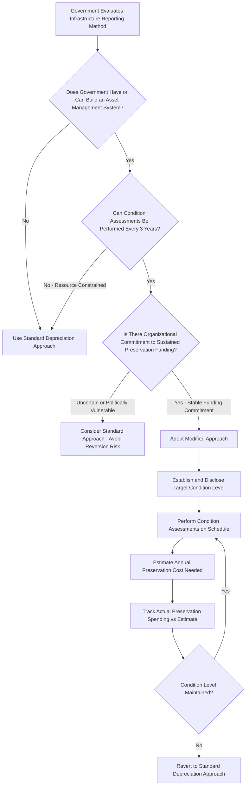

## The Modified Approach versus Standard Depreciation for Infrastructure

### Overview

GASB 34 authorizes two distinct, acceptable methods for reporting eligible infrastructure assets in governmental financial statements: the Standard (Depreciation) Approach and the Modified Approach. While both methods satisfy GAAP compliance for governmental capital asset reporting, they differ fundamentally in their underlying philosophy — one treats infrastructure as a depreciating financial asset consumed over a useful life, while the other treats infrastructure as a managed public service network whose value is preserved through ongoing maintenance investment rather than systematically written down. Selecting between them is a consequential decision affecting financial statement presentation, required operational infrastructure, and long-term budgetary discipline.

### Standard Depreciation Approach: Mechanics

Under the Standard Approach, infrastructure assets are capitalized at historical cost (or estimated historical cost for retroactively reported assets acquired before formal capitalization began) and systematically depreciated over their estimated useful lives, using the same general depreciation principles applied to buildings, vehicles, and equipment.

**Key characteristics:**

- Depreciation expense is recognized annually in the government-wide Statement of Activities, reducing both the carrying value of the infrastructure asset and reported net position
- Useful life estimates must be established per asset class (e.g., asphalt roads vs. concrete bridges vs. underground pipe networks), typically drawing on industry engineering standards or historical replacement experience
- No ongoing condition assessment obligation is imposed by the accounting standard itself (though sound asset management practice would still recommend it operationally)
- Maintenance and preservation spending is generally treated as a period expense separate from the depreciation calculation, unless it qualifies as a capitalizable improvement that extends useful life or increases capacity

### Modified Approach: Mechanics and Preconditions

Under the Modified Approach, a government does not report depreciation expense on eligible infrastructure assets. Instead, the costs of maintenance and preservation are expensed as they are incurred. This approach substitutes an operational management discipline for depreciation as the mechanism by which infrastructure asset consumption is reflected in the financial statements.

**Required preconditions**, all of which must be satisfied and documented to qualify for and maintain Modified Approach reporting:

1. **Asset management system with up-to-date inventory** — the government must maintain a system capable of tracking the eligible infrastructure network and its components
2. **Condition assessments at least once every three years** — performed using a documented, consistent condition measurement scale (e.g., a Pavement Condition Index for roads, a defined structural rating scale for bridges)
3. **Annual estimate of required maintenance/preservation spending** — the government must estimate, each year, the amount needed to maintain and preserve the infrastructure at the condition level it has established and publicly disclosed
4. **Documentation that assets are preserved at or above the disclosed condition level** — ongoing evidence must demonstrate the government is actually meeting its own stated preservation standard, not merely estimating a target

If any of these conditions lapses — most critically, if the government fails to preserve assets at the disclosed condition level — the government must revert to the Standard Depreciation Approach.

### Side-by-Side Comparison

| Dimension | Standard Depreciation Approach | Modified Approach |
| --- | --- | --- |
| Income statement impact | Annual depreciation expense recognized | No depreciation; maintenance/preservation costs expensed as incurred |
| Balance sheet impact | Carrying value declines systematically over useful life | Carrying value remains at historical cost (not written down) |
| Asset management system | Not required by the accounting standard | Mandatory precondition |
| Condition assessment | Not required by the accounting standard | Mandatory, at least every 3 years, on a documented scale |
| Disclosure burden | Depreciation schedules by asset class | Condition assessment results, established condition target, estimated vs. actual preservation spending |
| Reversibility | N/A (default method) | Must revert to depreciation if condition-level documentation fails |
| Reflects physical condition | Indirectly, via age-based useful life assumption | Directly, via actual condition assessment data |
| Administrative burden | Lower — primarily an accounting/finance function | Higher — requires sustained finance/asset-management coordination |
| Incentive alignment | Neutral — depreciation proceeds regardless of actual maintenance spending | Strong — inadequate maintenance directly risks losing the reporting method |

### Decision Framework

### Financial Statement Implications

**Under Standard Depreciation:**

- Reported net position (equivalent to net assets/equity in governmental accounting) is systematically reduced each year by depreciation expense, regardless of how much the government actually spends maintaining its infrastructure
- A government that underspends on maintenance still recognizes the same depreciation expense as one that maintains its infrastructure well, since depreciation is a function of the original cost and estimated useful life schedule, not actual physical condition
- This can create a disconnect between reported financial results and the true physical state of the infrastructure network

**Under Modified Approach:**

- Reported expenses more directly track actual cash outlay for maintenance and preservation, which can produce more budget-relevant financial statements for infrastructure-heavy governments (e.g., state DOTs, county road commissions)
- Because the carrying value is not written down, the balance sheet does not reflect physical deterioration directly — this information instead resides in the required supplementary condition assessment disclosures rather than the core financial statements
- A government that defers maintenance to balance a budget in a difficult fiscal year faces a documented compliance risk under the Modified Approach (failing the "preserved at disclosed condition level" test) that has no equivalent consequence under Standard Depreciation — the accounting method itself creates an accountability mechanism largely absent from straight depreciation

### Practical Considerations in Method Selection

**Favoring the Modified Approach:**

- Organizations with a mature, established asset management program (inventory systems, GIS-based asset tracking, condition assessment protocols already in place) can adopt the Modified Approach with comparatively low incremental administrative burden, since the required infrastructure already exists
- State Departments of Transportation and large infrastructure-heavy agencies commonly favor the Modified Approach because asset management systems (pavement management systems, bridge management systems) were often already operationally necessary for capital planning purposes, independent of the accounting election
- The Modified Approach's disclosure requirements can serve a public accountability and transparency function, providing the public and oversight bodies more decision-useful information about actual infrastructure condition than a depreciation schedule alone would convey

**Favoring the Standard Depreciation Approach:**

- Smaller governments or those without existing asset management capability face a materially higher implementation burden to qualify for and sustain the Modified Approach — building a condition assessment program and inventory system from scratch solely to support a reporting election may not be cost-justified
- Governments facing unstable or politically vulnerable long-term maintenance funding face reversion risk: if a future budget cycle defers infrastructure maintenance below the disclosed condition target, the government must revert to Standard Depreciation, potentially creating disruptive mid-stream financial statement presentation changes
- The Standard Approach requires less ongoing coordination between finance/accounting staff and engineering/asset management staff, which may be more achievable in smaller or less resourced government organizations

[Inference] Actual method selection patterns (which approach predominates among which size/type of government entity) are not something GASB itself tracks or publishes in a definitive comparative dataset accessible for this response; the tendencies described above reflect general practitioner observations about the relationship between existing asset management maturity and Modified Approach adoption feasibility, rather than a documented statistical finding.

### Link to Asset Management Practice

GASB 34's design explicitly calls for coordination between financial decision-makers and asset owners: the Modified Approach effectively requires finance/accounting staff to coordinate with asset management staff on an ongoing basis, since the accounting election's validity depends on operational data (condition assessments, preservation spending) that originates outside the finance function entirely. This is a structurally unusual feature relative to most GAAP/IFRS capital asset accounting, where depreciation calculations are typically a self-contained accounting exercise not contingent on externally verified operational performance data.

**Key Points**

- The Standard Depreciation Approach systematically reduces carrying value based on age and estimated useful life, independent of actual maintenance spending or physical condition.
- The Modified Approach substitutes documented condition-based asset management for depreciation, but imposes mandatory preconditions (asset management system, triennial condition assessments, documented preservation-level maintenance) that must be sustained indefinitely to retain the method.
- Failure to maintain infrastructure at the disclosed condition level under the Modified Approach forces reversion to Standard Depreciation — creating an accountability mechanism tying accounting method continuity to actual maintenance performance.
- Method selection should weigh existing asset management maturity, sustained funding stability, and the administrative capacity to support ongoing condition assessment against the benefits of more condition-representative financial disclosure.

**Related Topics**

- Condition Assessment Scale Design for Roads, Bridges, and Utility Networks
- Building an Asset Management System to Support Modified Approach Qualification
- Budgetary Risk of Modified Approach Reversion During Fiscal Downturns
- Pavement and Bridge Management System Architecture for DOTs
- Linking GASB 34 Disclosures to Capital Improvement Program Planning
- Comparing GASB Infrastructure Reporting to Private-Sector Impairment Models