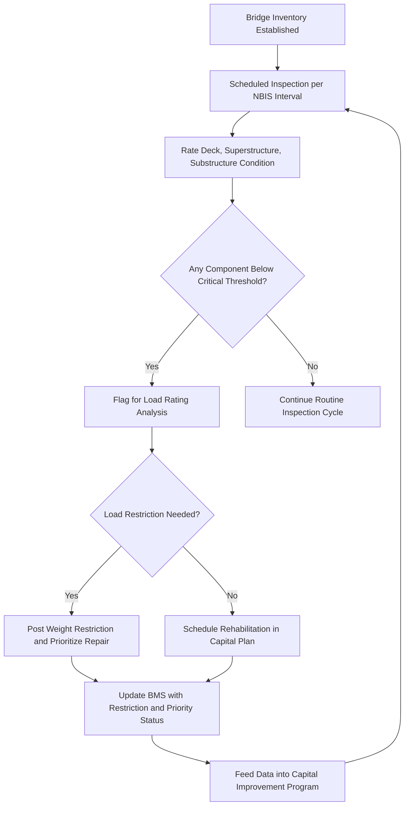
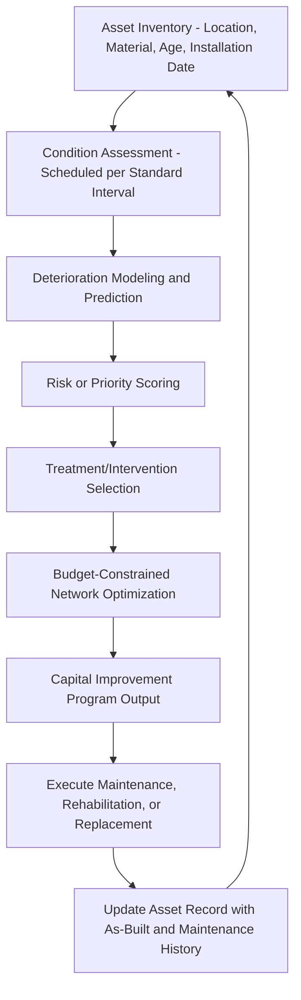

## Pavement, Bridge, and Utility Network Asset Management Systems

### Overview

Pavement Management Systems (PMS), Bridge Management Systems (BMS), and utility network asset management systems are specialized software and process frameworks used by public sector agencies to inventory, assess, predict deterioration, and prioritize maintenance and rehabilitation investment across large-scale linear and networked infrastructure assets. These systems serve a dual purpose in governmental asset lifecycle management: they support operational capital planning and maintenance prioritization, and — critically under GASB 34 — they provide the documented condition assessment and asset inventory data required to qualify for and sustain the Modified Approach to infrastructure financial reporting.

### Pavement Management Systems (PMS)

**Core Function**

A PMS systematically tracks the condition, geometry, traffic loading, and maintenance history of a roadway network, using this data to model pavement deterioration and optimize the timing and type of maintenance treatment across the network within budget constraints.

**Condition Assessment Methodology**

Pavement condition is typically quantified using a **Pavement Condition Index (PCI)**, a standardized numeric scale (commonly 0–100) derived from visual distress surveys measuring cracking, rutting, potholing, raveling, and other surface defects. Some agencies supplement visual PCI surveys with automated data collection (laser/imaging-equipped survey vehicles measuring roughness via the International Roughness Index, or IRI, and rut depth).

**Deterioration Modeling**

PMS software applies deterioration curves — typically nonlinear, reflecting the well-documented pavement behavior in which condition declines slowly for much of a pavement's early life before accelerating sharply once structural distress begins (the classic "pavement deteriorates slowly, then rapidly" curve underlying the maxim that timely preventive maintenance is dramatically cheaper than deferred reconstruction).

$$PCI_{t} = PCI_{0} - f(t, \text{traffic loading}, \text{climate}, \text{treatment history})$$

**Treatment Selection and Optimization**

A mature PMS supports a treatment hierarchy matched to condition ranges:

| PCI Range (Illustrative) | Condition Category | Typical Treatment |
| --- | --- | --- |
| 85–100 | Excellent | Routine maintenance (crack sealing) |
| 70–84 | Good | Preventive maintenance (surface treatments, thin overlays) |
| 50–69 | Fair | Rehabilitation (mill and overlay) |
| 25–49 | Poor | Major rehabilitation |
| 0–24 | Failed | Reconstruction |

[Inference] The specific numeric PCI ranges and treatment thresholds shown above are illustrative of common practice conventions; individual agencies define their own condition category thresholds and associated treatment triggers based on local pavement types, climate, traffic loading, and budget constraints, so these figures should not be treated as a universal standard.

**Network-Level Optimization**

Beyond project-level treatment selection, PMS software performs network-level budget optimization — given a constrained maintenance budget, the system recommends which road segments to treat and with what treatment to maximize overall network condition (or minimize total lifecycle cost) across the full network, rather than optimizing each segment in isolation.

### Bridge Management Systems (BMS)

**Core Function**

A BMS tracks the inventory, inspection history, and structural condition of a bridge network, supporting both regulatory inspection compliance and long-term capital planning for bridge repair, rehabilitation, and replacement.

**Inspection Requirements**

Bridge inspection in the US operates under a federally mandated framework requiring routine inspections at defined intervals (commonly biennial, i.e., every 24 months, though certain bridge types or conditions can trigger more frequent inspection cycles) per National Bridge Inspection Standards (NBIS). Inspectors assess and rate individual structural components — deck, superstructure, substructure, and culverts where applicable — using a standardized condition rating scale.

**Condition Rating Scale**

Bridge component condition is commonly rated on a numeric scale (in the US, commonly the National Bridge Inventory's 0–9 scale, where 9 represents excellent condition and 0 represents a failed/closed condition), applied separately to deck, superstructure, and substructure components, since these components can deteriorate at different rates and require independent tracking.

**Structural and Load Considerations**

BMS platforms integrate structural condition data with load rating analysis to determine whether posted weight restrictions are needed and to prioritize structurally deficient or functionally obsolete bridges for rehabilitation or replacement. Bridges falling below defined condition thresholds on any major component are commonly flagged for prioritized capital investment, given the more severe safety and liability implications of bridge failure relative to pavement deterioration.

**Bridge Management Workflow**

### Utility Network Asset Management Systems

**Scope**

Utility network asset management covers underground and networked infrastructure including water distribution, wastewater collection, and stormwater drainage systems — asset classes explicitly named among GASB 34's infrastructure examples. Unlike pavement and bridges, utility network assets are frequently buried and not directly visually inspectable without specialized methods, creating distinct condition assessment challenges.

**Condition Assessment Approaches**

- **Water distribution pipes**: condition assessment methods vary by pipe material and criticality, ranging from indirect indicators (break/leak history, age, material type, soil corrosivity) to direct inspection methods (acoustic leak detection, electromagnetic and ultrasonic wall-thickness testing for larger transmission mains)
- **Wastewater/sewer collection systems**: commonly assessed via Closed-Circuit Television (CCTV) inspection, in which a camera is run through the pipe interior to visually document cracks, root intrusion, joint separation, and structural defects, typically coded against a standardized defect classification system
- **Stormwater systems**: assessed through a combination of CCTV inspection (for piped segments), visual inspection of open channels and detention structures, and hydraulic capacity modeling to identify undersized or degraded conveyance capacity

**Asset Management System Architecture for Utility Networks**

A comprehensive utility asset management system typically integrates:

1. **GIS-based asset inventory** — spatial mapping of pipe segments, valves, manholes, pump stations, and other network components, since utility networks are inherently spatial/topological systems where asset location and connectivity are core attributes
2. **Work order and maintenance history tracking** — linking repair, replacement, and maintenance events to specific asset records to build a deterioration and failure history dataset over time
3. **Risk-based prioritization models** — commonly combining **Probability of Failure (PoF)** — derived from age, material, condition assessment data, and break/leak history — with **Consequence of Failure (CoF)** — reflecting factors such as pipe size, criticality to service continuity, proximity to sensitive receptors, and repair cost/disruption — to calculate an overall risk score used to prioritize capital replacement investment
4. **Capital improvement planning integration** — translating risk-prioritized asset lists into a multi-year capital improvement program (CIP) budget

$$\text{Risk Score} = PoF \times CoF$$

This risk-based framework allows utilities to prioritize a finite capital budget toward the pipe segments where failure would be both most likely and most consequential, rather than replacing assets purely on an age-based or "worst-first" condition basis, which can be inefficient when age alone is a poor predictor of remaining service life for a given material and soil environment.

### Cross-Cutting System Architecture Principles

All three asset management system types (PMS, BMS, utility) share a common underlying architecture pattern relevant to GASB 34 Modified Approach compliance and broader ALM practice:

### Regulatory and Reporting Integration

- **GASB 34 Modified Approach dependency**: as covered under the Modified Approach comparison, PMS, BMS, and utility asset management systems provide the documented inventory and condition assessment data required to qualify for and sustain Modified Approach infrastructure reporting, making system maturity a direct precondition for that accounting election.
- **Federal funding compliance**: transportation asset management systems (PMS/BMS) also support compliance with federal transportation funding requirements (e.g., performance-based planning and reporting obligations tied to federal-aid highway funding), which independently mandate certain asset management and performance reporting practices regardless of the GASB 34 accounting election chosen.
- **Public transparency**: condition assessment data from these systems is frequently published in public-facing infrastructure condition reports, supporting the broader public accountability objectives GASB 34 was designed to serve.

### Common Implementation Challenges

- **Data quality and completeness**: legacy infrastructure networks, particularly utility systems installed many decades ago, often have incomplete or inaccurate as-built records, requiring significant data reconciliation effort before an asset management system can produce reliable condition/risk outputs
- **Condition assessment cost vs. network size**: comprehensive condition assessment (CCTV inspection of an entire sewer network, for example) can be prohibitively expensive to perform network-wide on a short cycle, requiring risk-based sampling strategies that prioritize inspection of higher-risk segments over lower-risk ones
- **Deterioration model calibration**: deterioration curves calibrated on national or vendor-default datasets may not accurately reflect local soil conditions, climate, construction practices, or material quality, requiring local calibration using the agency's own historical condition and failure data over time
- **Cross-department coordination**: as with GASB 34's Modified Approach generally, sustained system value depends on ongoing coordination between engineering/operations staff (who generate and interpret condition data) and finance/planning staff (who translate outputs into budget and accounting decisions)

**Key Points**

- Pavement, bridge, and utility network asset management systems share a common architecture — inventory, condition assessment, deterioration modeling, risk/priority scoring, and budget-constrained optimization — despite differing inspection methods appropriate to each asset type.
- Bridge inspection operates under a federally mandated inspection interval and standardized condition rating scale, reflecting the more severe safety consequences of bridge failure relative to other infrastructure types.
- Utility network risk prioritization commonly combines Probability of Failure and Consequence of Failure into a composite risk score, enabling more efficient capital allocation than simple age-based replacement.
- These systems are not merely operational tools — they directly determine a government's eligibility to use and sustain the GASB 34 Modified Approach for infrastructure financial reporting.

**Related Topics**

- Pavement Condition Index (PCI) Survey Methodology and Deterioration Curve Calibration
- National Bridge Inspection Standards (NBIS) Compliance Requirements
- CCTV Sewer Inspection Defect Coding Standards (e.g., PACP)
- Probability of Failure / Consequence of Failure Risk Modeling for Utility Networks
- GIS Integration Architecture for Linear Infrastructure Asset Management
- Linking Condition Assessment Data to GASB 34 Modified Approach Disclosures