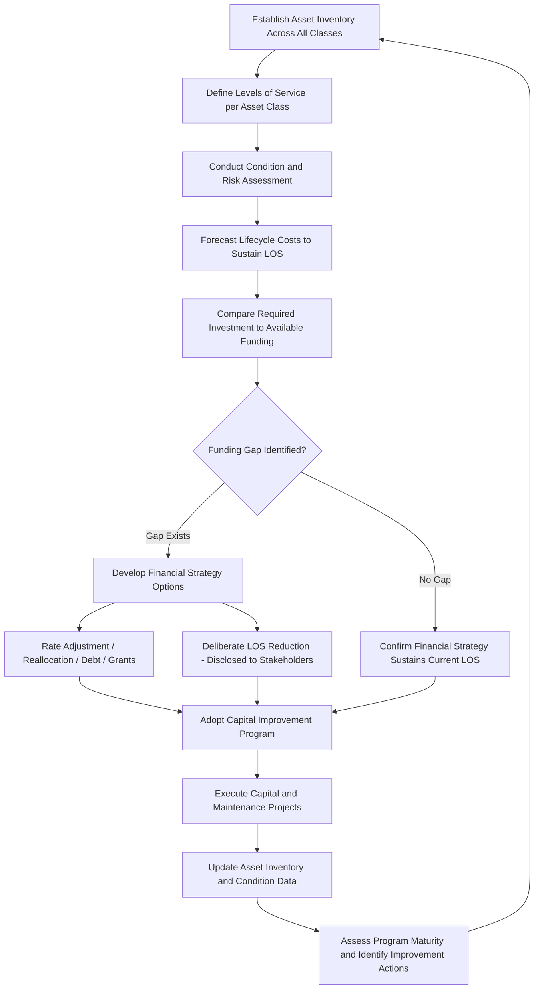

## Asset Management Planning for Local Government Units

### Overview

Asset Management Planning (AMP) for local government units is the structured, organization-wide process by which municipalities, counties, and special districts inventory, assess, plan for, and finance the maintenance and renewal of their public infrastructure and capital assets over a multi-year (typically 10–20+ year) planning horizon. Unlike a single-asset-class system (a PMS for roads or a BMS for bridges), an Asset Management Plan is the integrative framework that consolidates condition, risk, and funding data across all asset classes a local government owns — roads, bridges, water/wastewater/stormwater systems, buildings, fleet, and parks/recreation infrastructure — into a coherent, defensible, long-term investment strategy.

### Core Objectives

- Provide a defensible, data-driven basis for capital budgeting decisions, replacing reactive "worst-first" or politically-driven prioritization with risk- and condition-based investment ranking
- Demonstrate fiscal stewardship and support GASB 34 compliance, particularly where a Modified Approach election depends on documented condition assessment and preservation spending discipline
- Identify and quantify the infrastructure funding gap — the difference between what is actually being spent on maintenance/renewal and what would be required to sustain assets at a target service level
- Support long-term financial sustainability planning, including rate-setting for utility enterprise funds and capital improvement program (CIP) development for tax-funded asset classes
- Improve transparency and public accountability regarding the condition and management of publicly owned infrastructure

### Core Components of an Asset Management Plan

**1. Asset Inventory**

A complete, current inventory of all assets within scope — including location, installation date, material/construction type, size/capacity, replacement cost, and expected useful life. For local governments with legacy infrastructure, establishing an accurate baseline inventory is frequently the single most resource-intensive initial step, particularly for underground utility assets lacking reliable as-built records.

**2. Levels of Service (LOS)**

Levels of Service define the standard of performance the government commits to providing for each asset class — for example, a maximum acceptable pothole repair response time, a target average Pavement Condition Index across the network, or a maximum acceptable number of water main breaks per 100 miles of pipe annually. LOS definitions serve as the benchmark against which asset performance and required investment are measured, and are typically established through a combination of technical/engineering judgment, regulatory requirements, and community/council input on acceptable trade-offs between cost and service quality.

**3. Condition and Risk Assessment**

Building on the asset-class-specific systems (PMS, BMS, utility risk models) covered separately, the AMP consolidates condition and risk data across asset classes into a common framework, often using normalized risk scoring so that competing investment needs across very different asset types (a bridge repair vs. a park facility renovation vs. a water main replacement) can be compared and prioritized on a consistent basis.

**4. Lifecycle Cost Analysis and Financial Forecasting**

The AMP forecasts the lifecycle costs required to maintain each asset class at its defined Level of Service, incorporating the operating, maintenance, and renewal/replacement cost categories consistent with Life Cycle Cost modeling principles, projected over the planning horizon.

**5. Financial Strategy and Funding Gap Analysis**

The AMP compares projected required investment against currently available and reasonably projected future funding (tax revenue, utility rates, grants, debt capacity) to quantify any funding gap, and develops a financial strategy to close or manage that gap — which may include rate adjustments, capital funding reallocation, debt issuance, grant pursuit, or, where a gap cannot be closed, a deliberate and disclosed decision to accept a lower future Level of Service.

**6. Improvement Plan**

A practical roadmap for improving the asset management program itself over time — addressing data quality gaps, condition assessment coverage, system/software maturity, and staff capacity — recognizing that asset management planning is an iterative, maturing discipline rather than a one-time deliverable.

### Asset Management Planning Cycle

### Governance and Organizational Structure

Effective AMP implementation in local government typically requires:

- **Cross-departmental ownership**: since assets span public works, utilities, parks, facilities, and finance, an AMP cannot succeed as a single-department initiative; governance structures commonly include a cross-functional steering committee or asset management working group with representation from each affected department
- **Executive and elected-official sponsorship**: because AMP outcomes directly inform politically sensitive decisions (rate increases, capital prioritization trade-offs, service level reductions), sustained sponsorship from senior administration and elected governing bodies (city council, county board) is necessary to translate technical recommendations into funded action
- **Dedicated asset management staff or function**: larger local governments increasingly establish a dedicated asset management coordinator or team responsible for maintaining the plan, coordinating data collection across departments, and reporting progress; smaller governments often distribute this responsibility across existing public works and finance staff, or engage external consulting support

### Financial Strategy Considerations

**Utility Enterprise Funds (Water/Wastewater/Stormwater)**

Because these are typically self-funded through user rates rather than general tax revenue, AMP financial strategy for utility assets often centers on rate-setting analysis — determining whether current rate structures generate sufficient revenue to fund both operations and the long-term capital renewal program identified by the asset management plan. Underfunded utility asset management is a common finding where rates have not kept pace with the true long-term replacement cost of aging underground infrastructure, a gap that accumulates silently for years before manifesting as accelerating break/failure rates.

**Tax-Funded Assets (Roads, Bridges, Buildings, Parks)**

These assets typically compete for general fund and capital budget allocation against other government service priorities, making the funding gap analysis a key input to annual and multi-year capital budgeting processes and, where applicable, ballot measures for dedicated infrastructure funding (e.g., local option sales tax measures or general obligation bond issuances).

**Debt Financing Considerations**

Asset management plans commonly incorporate an assessment of available debt capacity and the appropriate role of long-term borrowing (municipal bonds) in funding major capital renewal, weighing the benefit of spreading large capital costs over the useful life of the asset (matching cost recognition to the beneficiaries who use the asset over time) against debt service costs and legal/practical debt capacity limits.

### Relationship to GASB 34 and Financial Reporting

Asset Management Planning and GASB 34 compliance are mutually reinforcing but distinct: GASB 34 establishes minimum financial reporting requirements (and offers the Modified Approach as an alternative to depreciation, contingent on documented asset management practice), while a comprehensive AMP is a broader management and financial planning discipline that a government would benefit from regardless of which GASB 34 reporting method it elects. In practice, however, governments pursuing GASB 34 Modified Approach reporting typically must build substantially the same inventory, condition assessment, and preservation-spending-tracking capability that a mature AMP would also require — making AMP development and Modified Approach qualification naturally complementary initiatives rather than competing priorities for scarce local government resources.

### Common Implementation Challenges for Local Governments

- **Resource constraints**: smaller municipalities and special districts often lack dedicated staff, software budget, or technical expertise to build and sustain a mature asset management program, requiring phased implementation prioritizing the highest-risk or highest-value asset classes first
- **Data silos across departments**: asset data is frequently held in disconnected departmental systems (a GIS system in public works, a separate financial system in finance, a spreadsheet-based inventory in parks), requiring deliberate data integration effort to produce a unified asset picture
- **Political sensitivity of funding gap disclosure**: publicly quantifying an infrastructure funding gap can create political pressure, and elected officials may be reluctant to formally adopt a plan that implies future rate increases or service level reductions, even where the underlying technical analysis is sound
- **Sustaining momentum after initial plan adoption**: an AMP that is developed once (often with grant funding or consultant support) but not institutionalized into ongoing budget and operational processes risks becoming a one-time compliance exercise rather than a living management tool
- **Balancing short-term political priorities against long-term asset sustainability**: elected officials facing near-term budget pressures may be incentivized to defer asset renewal spending in favor of more visible near-term service priorities, a tension the AMP framework is specifically designed to make visible and harder to ignore through transparent long-term forecasting

### Maturity Progression

Asset management planning maturity in local government is commonly understood as progressing through stages:

1. **Reactive**: maintenance and replacement driven by failure events, with minimal inventory or condition data
2. **Planned**: basic inventory exists; maintenance is scheduled but not systematically prioritized by risk or condition
3. **Systematic**: condition assessment and risk-based prioritization are established for major asset classes, feeding into capital budgeting
4. **Integrated**: asset management data and financial planning are fully integrated across departments, with a documented long-term financial strategy addressing identified funding gaps
5. **Optimized**: continuous improvement processes refine deterioration models, LOS targets, and financial strategy based on ongoing performance data, with asset management embedded as a core institutional function rather than a periodic planning exercise

[Inference] This five-stage maturity framing reflects common asset management maturity model structures used across public-sector asset management literature and consulting practice; specific stage names, count, and criteria vary somewhat by the particular framework or jurisdiction referenced, so this should be treated as an illustrative synthesis rather than a single universally standardized model.

**Key Points**

- A local government Asset Management Plan integrates inventory, Levels of Service, condition/risk assessment, lifecycle cost forecasting, and financial strategy across all asset classes into a single coherent long-term planning framework.
- Levels of Service definitions are the critical bridge between technical condition data and political/community decision-making about acceptable cost-service trade-offs.
- Utility enterprise funds and tax-funded asset classes face distinct financial strategy considerations — rate-setting analysis for the former, general fund/capital budget competition and potential ballot measures for the latter.
- AMP development and GASB 34 Modified Approach qualification are naturally complementary, since both require substantially similar inventory and condition assessment infrastructure.

**Related Topics**

- Levels of Service Framework Design and Community Engagement Processes
- Infrastructure Funding Gap Analysis and Capital Improvement Program Development
- Utility Rate-Setting Methodology to Fund Long-Term Asset Renewal
- Asset Management Maturity Assessment Models for Local Government
- Municipal Debt Financing Strategy for Major Capital Asset Renewal
- Cross-Departmental Data Integration Architecture for Municipal Asset Inventories