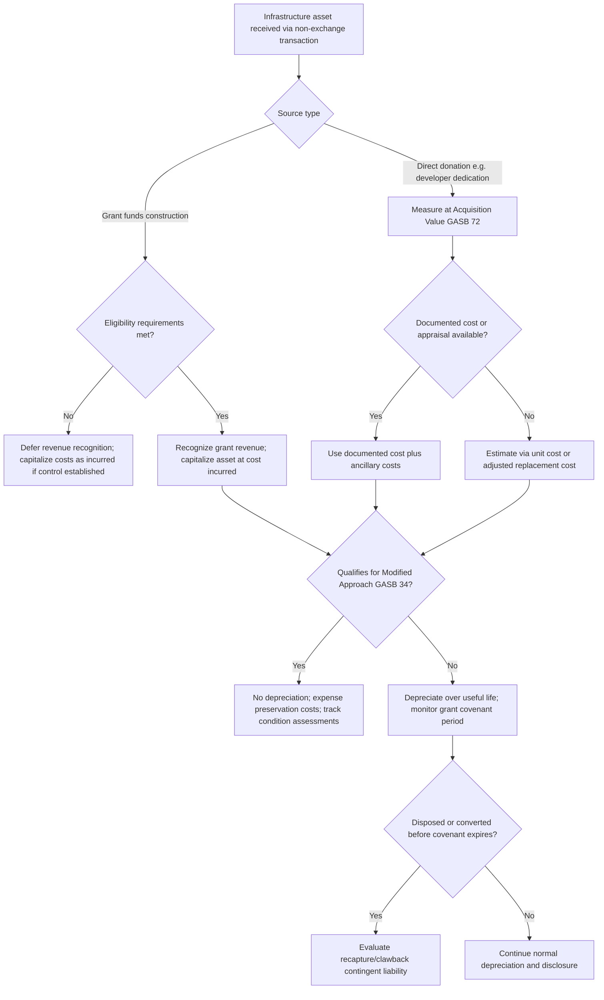

## Grant-Funded and Donated Infrastructure Asset Accounting

### Overview

Grant-funded and donated infrastructure asset accounting addresses the recognition, valuation, and lifecycle tracking of capital assets acquired through government grants, developer contributions, or outright donation rather than direct cash purchase. This is a pervasive issue for public sector entities — municipalities, utilities, school districts, and special districts — where roads, water/sewer lines, parks, and buildings frequently transfer to the government's books via non-exchange transactions. Correct accounting treatment is governed primarily by GASB standards in U.S. state and local government contexts, and by IPSAS/IFRS for international jurisdictions.

The central accounting challenges are: (1) determining when and how to recognize a non-purchased asset, (2) establishing an appropriate valuation basis in the absence of a purchase price, (3) tracking donor/grantor restrictions or conditions, and (4) properly depreciating and eventually disposing of the asset over its useful life.

### Key Points

- **Non-exchange transaction**: A transaction in which a government receives value without directly giving equal value in return — this is the umbrella category covering both grants and donations.
- **Capital contributions**: The general term for infrastructure or other capital assets transferred to a government at no cost (e.g., a developer building a subdivision road and dedicating it to the city).
- **Acquisition value**: Under GASB Statement No. 72, the price that would be paid to acquire an asset with equivalent service potential in an orderly market transaction at the acquisition date — this is the required measurement basis for donated capital assets, replacing the older "fair value" terminology for this context.
- **Conditional vs. unconditional grants**: A grant with a condition (a specific performance requirement or a right of return/recovery for the grantor) is not recognized as revenue until the condition is substantially met, per GASB Statement No. 33.
- **Eligibility requirements**: Criteria a government must meet before a grant is recognized, distinct from time requirements (which only affect the timing of recognition, not whether it will occur).

### Recognition Framework

**Grant-Funded Assets**

Grants funding infrastructure construction (e.g., federal highway grants, Community Development Block Grants, state infrastructure bank loans/grants) are accounted for under the non-exchange transaction rules in **GASB Statement No. 33**, *Accounting for Nonexchange Transactions*. Most infrastructure grants are classified as **government-mandated non-exchange transactions** or **voluntary non-exchange transactions**.

Recognition of the related revenue requires satisfaction of applicable eligibility requirements, which fall into four categories:

1. Required characteristics of recipients (e.g., only municipalities of a certain population qualify)
2. Time requirements (funds must be used within/after a specified period)
3. Reimbursement requirements (the government must first incur allowable costs)
4. Contingencies (the grantor's own funding is contingent on an action, e.g., an appropriation)

The underlying capital asset itself is recognized and capitalized under the normal capital asset policies (see GASB 34/87) as construction costs are incurred — this is independent of, though closely paired with, the grant revenue recognition timeline. A common point of confusion is that **asset capitalization** (a balance sheet event tied to cost incurrence and control) is not the same recognition trigger as **grant revenue recognition** (which is tied to eligibility requirements being met); the two can occur on different timelines within the same reporting period.

**Donated Assets**

Under **GASB Statement No. 72**, *Fair Value Measurement and Application* (which amended GASB 33's donated asset guidance), donated capital assets, including infrastructure, are recorded at **acquisition value** at the date of donation, plus any ancillary costs necessary to place the asset into its intended location and condition for use (e.g., site preparation, professional fees, transportation).

Common donated infrastructure scenarios:

- **Developer-dedicated infrastructure**: Roads, sidewalks, streetlights, water mains, and storm drainage systems built by a private developer as a condition of subdivision approval, then dedicated/conveyed to the municipality.
- **Utility line extensions**: Water or sewer lines constructed by a developer or a customer and conveyed to a utility (common in both governmental and enterprise fund contexts; see AICPA/FASB guidance for investor-owned or non-governmental utilities, where ASC 606 and historical contributions-in-aid-of-construction, or CIAC, rules apply).
- **Land and easement donations**: Right-of-way, park land, or conservation easements donated for public use.

### Valuation Methodology

Because no purchase price exists, valuation requires constructing an acquisition value estimate. Accepted approaches, in descending order of preference when reliable data exists:

1. **Actual cost documentation from the donor/developer**: If the developer's own construction records (contractor invoices, engineering costs) are available and reliable, these can approximate acquisition value, since the developer effectively "purchased" the asset via construction.
2. **Independent appraisal**: A qualified appraiser or engineer estimates replacement cost new, then adjusts for the asset's condition/age at the time of donation if it is not new.
3. **Engineering cost estimates / unit-cost pricing**: Standard unit costs (cost per linear foot of pipe, cost per lane-mile of road) applied to the as-built quantities, often sourced from the jurisdiction's own recent capital project bid data or state DOT unit cost schedules.
4. **Insurance replacement cost basis**: Used as a fallback and adjusted to approximate acquisition value rather than pure replacement cost, since acquisition value under GASB 72 is meant to reflect market-based value at the acquisition date, not necessarily gross replacement cost.

For infrastructure that qualifies under the **modified approach** (GASB 34, applicable to eligible infrastructure networks or subsystems maintained via an asset management system with a condition-level target), acquisition value at donation still matters for initial recognition even though ongoing depreciation is not recorded — see the depreciation subsection below.

$$AV_{asset} = C_{documented} + A_{ancillary}$$

Where $AV_{asset}$ is acquisition value, $C_{documented}$ is documented/appraised construction cost, and $A_{ancillary}$ represents ancillary costs to ready the asset for use.

When documented cost is unavailable and only replacement cost new ($RCN$) is known for a used/aged donated asset, a common estimation technique is:

$$AV_{asset} = RCN \times \left(1 - \frac{Age}{UsefulLife}\right)$$

This straight-line condition adjustment is a simplification; more rigorous appraisal practice may use condition-based percentages rather than a strict age/life ratio. [Inference: the specific adjustment methodology is a matter of professional appraisal judgment and jurisdictional policy, not a single GASB-mandated formula.]

### Grant Compliance and Restriction Tracking

Grant-funded infrastructure often carries continuing compliance obligations that persist after asset recognition:

- **Maintenance-of-effort and useful-life covenants**: Federal grants (e.g., FTA, FHWA, EPA State Revolving Fund) frequently require the asset remain in the funded use for its full useful life; early disposal or conversion can trigger **recapture** of federal funds proportional to remaining life.
- **Clawback/recapture provisions**: A liability should be evaluated if disposal or non-compliance becomes probable — this is a contingent liability assessment under GASB Statement No. 62 (which carries forward relevant pre-GASB guidance) and general loss contingency principles.
- **Sub-recipient monitoring**: If the grant passes through a state agency to a local government, the local government must track compliance with both the state pass-through agency's requirements and the original federal award terms (2 CFR 200, the Uniform Guidance, governs federal awards).
- **Restricted net position/fund balance classification**: Grant proceeds not yet expended, or capital assets acquired with restricted grant funds, affect the **restricted net position** classification on the government-wide statement of net position, since the restriction stems from external grantor stipulations rather than the government's own designation.

A practical asset register for grant-funded infrastructure should track, at minimum: grantor name and award/CFDA (now Assistance Listing) number, award date, eligibility requirements met and date satisfied, useful-life covenant period and expiration date, and recapture risk status.

### Depreciation and the Modified Approach

Once capitalized, grant-funded and donated infrastructure is subject to the same depreciation policy as purchased infrastructure of the same class, with one major exception:

**Standard depreciation approach**: The asset is depreciated over its estimated useful life using the government's standard method (typically straight-line), beginning in the period placed in service — donation date or substantial completion date, not the date grant funds were received.

**Modified approach (GASB 34)**: For qualifying infrastructure networks (roads, bridges, drainage systems) managed under an asset management system meeting specific criteria — the government maintains a current asset inventory, performs condition assessments at least every three years using a measurable scale, and annually estimates the cost to maintain the network at a Board-established minimum condition level — depreciation is not recorded. Instead, all preservation and maintenance costs are expensed as incurred. Donated or grant-funded segments of a network under the modified approach still enter the inventory at acquisition value but do not depreciate.

$$Depreciation_{annual} = \frac{AV_{asset} - SalvageValue}{UsefulLife_{years}}$$

### Practical Example

A city receives a federally funded $2.4 million road-widening project (80% FHWA grant, 20% local match) and, in the same fiscal year, a developer dedicates a newly constructed 0.5-mile collector road (documented construction cost: $650,000) as a condition of subdivision plat approval.

**Grant-funded road**:

- Capitalize construction costs of $2.4 million as incurred (governmental activities, general capital assets, or business-type activities if utility-related).
- Recognize grant revenue as eligible costs are incurred and reimbursement requirements are met (a reimbursement-type grant recognizes revenue concurrent with qualifying expenditure, not upon grant award).
- Record a note disclosure of the 20-year FHWA useful-life/maintenance covenant and monitor for recapture risk if the road is ever decommissioned before the covenant period ends.

**Developer-dedicated road**:

- Record at acquisition value of $650,000 (developer's documented cost, assuming it reflects market-based construction pricing at dedication date and no related-party cost distortion).
- Recognize a corresponding **capital contribution revenue** (not grant revenue, since no grantor eligibility requirements apply — this is a direct non-exchange contribution) in the government-wide statement of activities.
- Begin depreciation (or include in the modified-approach network if applicable) from the dedication/acceptance date, not the developer's construction start date.

### Journal Entry Illustration (Government-Wide, Full Accrual)

**Developer-dedicated road, at acceptance:**

| Account | Debit | Credit |
| --- | --- | --- |
| Infrastructure — Roads (Capital Asset) | $650,000 |  |
| Capital Contributions Revenue |  | $650,000 |

**Grant-funded road, reimbursement-type grant, upon incurring qualifying costs:**

| Account | Debit | Credit |
| --- | --- | --- |
| Construction in Progress / Infrastructure | $2,400,000 |  |
| Cash / Accounts Payable |  | $2,400,000 |
| Grants Receivable (FHWA) | $1,920,000 |  |
| Intergovernmental Revenue — Federal Grant |  | $1,920,000 |

### Diagram: Recognition Decision Flow (svg_diagram)

### Disclosure Requirements

Financial statement disclosures typically required (per GASB 33, 34, 72, and related standards) include:

- Description of the nature and amount of significant capital contributions received during the period, disaggregated between grant-funded and donated sources when material.
- Accounting policy note describing the valuation methodology (acquisition value) and any use of the modified approach for infrastructure.
- Federal award compliance disclosures in the **Schedule of Expenditures of Federal Awards (SEFA)** if the government is subject to a Single Audit under 2 CFR 200 Subpart F.
- Condition assessment results and the estimated-versus-actual maintenance/preservation spending, if using the modified approach, presented as required supplementary information (RSI).
- Contingent liabilities related to potential grant recapture, if disposal or non-compliance is reasonably possible or probable.

### Common Pitfalls

- **Confusing grant revenue recognition timing with asset capitalization timing** — these follow different triggers and often diverge within a fiscal year.
- **Using replacement cost new instead of acquisition value** for donated infrastructure — GASB 72 requires an acquisition-value (market/exchange-based) measure, not gross replacement cost, though replacement cost can be a starting point when adjusted appropriately.
- **Omitting ancillary costs** (legal, survey, inspection fees related to accepting a dedicated asset) from the capitalized basis.
- **Failing to track useful-life covenants** on federally funded infrastructure, creating unrecognized recapture exposure years after project completion.
- **Applying the modified approach network-wide without segment-level tracking**, which can obscure whether newly donated segments meet the same condition-assessment cadence as the rest of the network. [Inference: this is a practical implementation risk rather than an explicit rule violation, since GASB 34 does not mandate segment-level sub-tracking, but poor tracking commonly causes condition assessment gaps in practice.]

### Related Topics

- GASB Statement No. 34 — Basic Financial Statements and Management's Discussion and Analysis
- GASB Statement No. 33 — Accounting for Nonexchange Transactions
- GASB Statement No. 72 — Fair Value Measurement and Application
- Modified Approach for Infrastructure Reporting and Condition Assessment Systems
- Capital Asset Impairment and Insurance Recovery (GASB 42)
- Single Audit Compliance and the Uniform Guidance (2 CFR 200)
- Contributions-in-Aid-of-Construction (CIAC) in Regulated Utility Accounting
- Right-of-Way and Easement Valuation for Public Infrastructure
- Component Depreciation and Useful Life Estimation for Infrastructure Networks
- Public-Private Partnership (P3) Asset Recognition and Service Concession Arrangements (GASB 94)