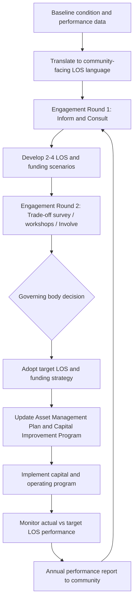

## Community Engagement and Levels of Service in Public Asset Decisions

### Overview

Levels of Service (LOS) are the defined parameters — quality, capacity, reliability, responsiveness, and cost — that a public asset or asset network is intended to deliver to its users and stakeholders. Community engagement is the structured process by which a government elicits, incorporates, and reconciles public preferences with technical and financial constraints when setting or revising those LOS targets. Together, these two disciplines form the bridge between technical asset management (condition assessment, lifecycle costing, capital planning) and the political/fiscal legitimacy required to fund and sustain that plan. This topic sits at the intersection of asset management frameworks (ISO 55000 series, IIMM, GASB 34's modified approach) and public participation practice (IAP2 Spectrum, deliberative democracy methods).

Without a defined LOS framework, asset management decisions default to reactive, complaint-driven prioritization. Without community engagement, technically optimal LOS targets frequently fail politically — either rejected at budget adoption or eroded through deferred maintenance when the public does not understand or accept the associated cost.

### Key Points

- **Level of Service (LOS)**: A defined standard against which the performance of an asset or service is measured, typically expressed across multiple dimensions (quality, quantity/capacity, reliability, responsiveness, safety, cost, environmental acceptability, legislative/regulatory compliance).
- **Community/customer LOS vs. technical LOS**: Community LOS is expressed in terms meaningful to residents (e.g., "no water main breaks disrupting my street more than once every 5 years"); technical LOS translates this into measurable engineering parameters (e.g., "pipe failure rate ≤ 2 breaks/100km/year").
- **IAP2 Spectrum of Public Participation**: A widely used framework (International Association for Public Participation) categorizing engagement intensity as Inform → Consult → Involve → Collaborate → Empower, each with an increasing promise of influence over the final decision.
- **Willingness to pay (WTP)**: The economic concept underlying most LOS-setting exercises — the trade-off residents are willing to accept between service quality and cost (rates, taxes, fees).
- **Asset Management Plan (AMP)**: The formal document, typically structured per ISO 55001 or a jurisdiction's own template, that documents current LOS, target LOS, the funding gap between them, and the engagement basis for chosen targets.

### The Levels of Service Framework

**Dimensions of LOS**

Most public asset management frameworks (notably the International Infrastructure Management Manual, IIMM, and its derivatives used across Australia, New Zealand, the UK, and increasingly the U.S.) decompose LOS into a consistent set of dimensions:

1. **Quality** — condition, appearance, comfort (e.g., pavement smoothness, water clarity/taste)
2. **Quantity/Capacity** — sufficiency to meet demand without degradation (e.g., peak-hour road capacity, water pressure under high demand)
3. **Reliability** — frequency and duration of service interruptions
4. **Responsiveness** — time to respond to and resolve faults or requests
5. **Safety** — freedom from hazard in normal use
6. **Environmental acceptability** — compliance with environmental regulation and community environmental expectations
7. **Cost** — the rate, tax, or fee burden associated with delivering the above
8. **Legislative/regulatory compliance** — mandatory minimum standards (e.g., ADA accessibility, safe drinking water standards, EPA effluent limits)

**Hierarchy of LOS**

$$LOS_{community} \rightarrow LOS_{technical} \rightarrow LOS_{operational}$$

- **Community levels of service**: High-level, outcome-oriented statements a resident would recognize and care about.
- **Technical levels of service**: Measurable performance/process standards engineers and asset managers use to design, maintain, and renew assets to achieve the community LOS.
- **Operational levels of service**: Day-to-day operating targets and maintenance schedules that deliver the technical LOS.

A common practical failure is defining LOS only at the technical tier and never translating it into community-facing language — this makes engagement exercises abstract and reduces genuine public input to a formality.

### Setting LOS Targets: Technical and Financial Constraints

LOS targets cannot be set from community preference alone; they must be reconciled against:

- **Current asset condition and performance data** — derived from condition assessments, failure histories, and customer complaint/service-request data.
- **Regulatory minimums** — LOS cannot fall below mandated thresholds regardless of community preference (e.g., a community cannot "vote" to reduce drinking water quality below a Safe Drinking Water Act maximum contaminant level).
- **Lifecycle cost implications** — each LOS tier has an associated capital and operating cost curve; raising LOS (e.g., faster pothole repair response time) generally increases operating cost, while raising asset condition targets generally increases capital renewal cost.
- **Risk tolerance** — LOS decisions are effectively risk management decisions; a lower LOS accepts higher probability/consequence of service failure in exchange for lower cost.

$$Cost_{total}(LOS) = Cost_{capital}(LOS) + Cost_{operating}(LOS) + Cost_{risk}(LOS)$$

Where $Cost_{risk}(LOS)$ represents the expected cost of service failures (consequence × probability) at a given LOS tier — this term typically decreases as LOS increases, creating a classic optimization trade-off against rising direct costs.

### Community Engagement Methodologies

**IAP2 Spectrum applied to LOS decisions**

| Level | Promise to Public | Typical LOS Application |
| --- | --- | --- |
| Inform | "We will keep you informed" | Publishing pavement condition index maps, annual water quality reports |
| Consult | "We will listen and acknowledge your input" | Public comment periods on proposed rate increases tied to LOS improvements |
| Involve | "We will work with you to ensure concerns are reflected" | Stakeholder workshops on trade-offs between road resurfacing frequency and rate increases |
| Collaborate | "We will incorporate your advice into decisions to the maximum extent possible" | Citizen advisory committees co-developing capital improvement plan priorities |
| Empower | "We will implement what you decide" | Participatory budgeting for a defined discretionary capital allocation |

**Common engagement instruments**:

- **Statistically valid customer satisfaction surveys** — used to establish baseline WTP and satisfaction with current LOS; requires proper sampling methodology to avoid self-selection bias common in open online surveys.
- **Willingness-to-pay / trade-off surveys** — present respondents with explicit cost-versus-service trade-offs (e.g., "Option A: current rates, current road condition; Option B: 8% rate increase, improved road condition within 5 years") rather than open-ended preference questions, which tend to overstate desired service without acknowledging cost.
- **Public workshops and open houses** — facilitated sessions, often using visual asset condition data (GIS maps, photos) to ground discussion in concrete terms rather than abstractions.
- **Citizen advisory boards/committees** — standing or ad hoc bodies that review technical asset management plans and provide structured recommendations before council/board adoption.
- **Participatory budgeting** — residents directly vote on allocation of a defined discretionary capital pool, typically used for smaller-scale neighborhood infrastructure rather than core network LOS.
- **Deliberative polling** — a smaller, demographically representative panel receives balanced technical briefings before forming and expressing preferences, used when trade-off questions are too technically complex for a typical survey format.

### Integrating Engagement Outcomes into Asset Management Plans

The formal linkage between engagement results and technical documents typically follows this sequence:

1. **Baseline assessment** — inventory current asset condition and current (as-delivered) LOS.
2. **Engagement round 1 (Inform/Consult)** — communicate current condition and cost of maintaining status quo LOS; gather initial preference data.
3. **Options development** — asset management staff translate preference themes into 2–4 concrete LOS/funding scenarios with associated cost and risk profiles.
4. **Engagement round 2 (Consult/Involve)** — present scenarios for structured feedback (trade-off surveys, workshops).
5. **Governing body decision** — elected council/board formally adopts target LOS and associated funding strategy (rate structure, bond issuance, CIP prioritization), typically documented in the Asset Management Plan and reflected in the capital improvement program.
6. **Performance reporting and re-engagement** — periodic (often annual) reporting back to the community on actual-versus-target LOS performance, closing the feedback loop and building trust for future engagement cycles.

### Practical Example

A mid-size water utility's pipe network has a current break rate of 18 breaks/100 miles/year, above the regional benchmark of 12. Two LOS scenarios are developed:

- **Scenario A (Maintain)**: Continue current replacement rate (0.5%/year of network length); break rate stays near 18; no rate increase.
- **Scenario B (Improve)**: Increase replacement rate to 1.2%/year; break rate falls to approximately 10 within 10 years; requires a 6% annual rate increase for 5 years.

A trade-off survey sent to a statistically valid sample of ratepayers presents both scenarios with explicit dollar impacts (e.g., "$4.50/month increase" rather than "6% increase," since dollar framing generally produces more decision-relevant responses than percentage framing). Results showing 58% support for Scenario B, concentrated in the 35–64 age bracket with lower support among fixed-income seniors, prompt the utility to propose Scenario B paired with a low-income rate assistance program — directly translating engagement data into both the technical target and the equity-mitigation policy that makes the LOS decision politically viable.

### Diagram: LOS–Engagement Feedback Loop (svg_diagram)

### Equity Considerations

LOS and engagement decisions carry distributional consequences that pure aggregate WTP analysis can obscure:

- **Differential impact by income**: Rate increases for improved LOS are typically regressive absent mitigation (tiered rates, assistance programs), disproportionately burdening lower-income households.
- **Historic underinvestment correction**: Some communities, often lower-income or historically marginalized neighborhoods, may have received systematically lower LOS historically (e.g., delayed road resurfacing, older water infrastructure); engagement processes should be designed to surface this rather than simply averaging preferences across a jurisdiction, which can mask localized deficiencies.
- **Engagement access barriers**: Standard engagement channels (evening public meetings, English-only surveys, online-only participation) can systematically underrepresent certain populations (shift workers, non-English speakers, those without reliable internet access), biasing the preference data used to justify LOS decisions. [Inference: the degree of bias depends heavily on the specific engagement design and local demographics, and should be assessed empirically rather than assumed uniform across jurisdictions.]

### Common Pitfalls

- **Presenting open-ended preference questions without cost trade-offs**, which produces unrealistically high desired LOS with no acknowledgment of the funding implications.
- **Treating a single public meeting as sufficient engagement** for a multi-year, high-cost LOS decision — meeting attendance alone is not a statistically valid sample of community preference.
- **Setting technical LOS in isolation from community LOS**, producing plans that are internally consistent but fail to build public/political support at adoption.
- **Failing to close the feedback loop** — not reporting back actual performance against adopted LOS erodes trust and reduces engagement participation in future cycles.
- **Ignoring regulatory floors during trade-off design** — offering a "reduce service" option that would violate a legal minimum standard misleads participants about the actual decision space.

### Related Topics

- ISO 55000/55001/55002 — Asset Management System Standards
- International Infrastructure Management Manual (IIMM) Framework
- Capital Improvement Plan (CIP) Development and Prioritization
- Rate Design and Cost-of-Service Studies for Utility Enterprise Funds
- Risk-Based Asset Management and Criticality Assessment
- GASB 34 Modified Approach and Condition Assessment Reporting
- Environmental Justice and Equity Analysis in Infrastructure Investment
- Participatory Budgeting Models and Implementation
- Performance Measurement and Public Sector Dashboards (KPI Reporting)