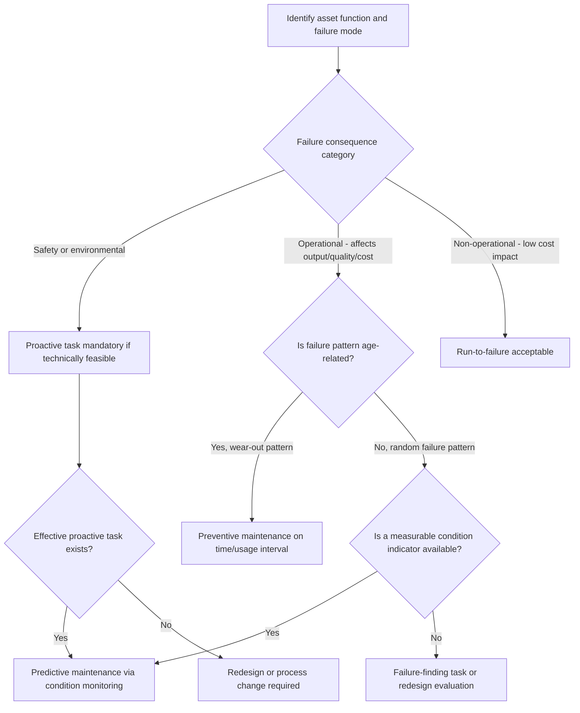

## Manufacturing and Industrial Equipment Asset Management

### Overview

Manufacturing and industrial equipment asset management is the discipline of maximizing the availability, reliability, safety, and total lifecycle value of physical production assets — machining centers, process equipment, conveyors, robotics, utilities infrastructure (compressed air, steam, electrical distribution), and the facilities that house them. Unlike public infrastructure asset management, where service delivery to citizens is the primary output, industrial asset management is driven by **Overall Equipment Effectiveness (OEE)**, production throughput, quality yield, and direct cost-of-downtime economics. The discipline draws on reliability engineering (RCM, FMEA), maintenance strategy frameworks (preventive, predictive, prescriptive), and increasingly on Industrial IoT (IIoT) and digital twin technologies for condition monitoring and lifecycle optimization.

The field sits at the convergence of three traditionally separate functions: **maintenance engineering** (keeping equipment running), **capital planning/finance** (funding acquisition, refurbishment, and replacement), and **operations** (scheduling equipment use to meet production demand) — effective asset management requires integrating decisions across all three rather than optimizing any one in isolation.

### Key Points

- **Overall Equipment Effectiveness (OEE)**: The standard composite metric = Availability × Performance × Quality, expressing the percentage of planned production time that is truly productive.
- **Reliability-Centered Maintenance (RCM)**: A structured analysis methodology (originally developed in aviation, formalized by Nowlan and Heap, standardized in SAE JA1011/JA1012) that determines the optimal maintenance strategy for each asset function based on failure modes and consequences, rather than applying uniform maintenance across all equipment.
- **Failure Mode and Effects Analysis (FMEA)**: A systematic technique for identifying potential failure modes, their causes, and effects, ranking them by a Risk Priority Number (RPN) to prioritize mitigation.
- **Mean Time Between Failures (MTBF) / Mean Time To Repair (MTTR)**: Core reliability and maintainability metrics used to characterize equipment failure behavior and repair responsiveness.
- **Bathtub curve**: The classic failure-rate-over-time model showing infant mortality (decreasing failure rate), useful life (constant/random failure rate), and wear-out (increasing failure rate) phases — foundational to maintenance strategy selection.
- **Computerized Maintenance Management System (CMMS)** / **Enterprise Asset Management (EAM)**: The software systems of record for work order management, asset history, spare parts inventory, and maintenance scheduling; EAM typically implies broader lifecycle and financial integration than a standalone CMMS.

### Maintenance Strategy Spectrum

Industrial asset management strategies exist on a maturity spectrum, generally progressing from reactive toward prescriptive as an organization's data and process capability increases:

1. **Reactive (run-to-failure / corrective maintenance)** — equipment is repaired only after failure. Appropriate for low-criticality, low-consequence assets where failure cost is lower than the cost of a proactive program (e.g., a non-critical redundant pump).
2. **Preventive maintenance (PM)** — maintenance performed on a fixed time or usage interval (calendar-based or meter-based, e.g., every 500 operating hours) regardless of actual equipment condition. Reduces unplanned failures but risks both over-maintenance (replacing components with remaining useful life) and under-maintenance (failures occurring before the scheduled interval).
3. **Predictive maintenance (PdM)** — maintenance triggered by monitored condition indicators (vibration analysis, oil analysis, thermography, ultrasonic testing, motor current signature analysis) rather than a fixed schedule, aiming to intervene just before failure.
4. **Prescriptive maintenance** — an extension of predictive maintenance using machine learning/AI models on sensor data to not only predict failure but recommend the specific optimal maintenance action and timing, often integrated with production scheduling to minimize combined downtime and production-loss cost.
5. **Reliability-Centered Maintenance (RCM)** — not a maintenance type itself but a **decision framework** that determines, for each asset function and failure mode, which of the above strategies (or a redesign/no-maintenance decision) is most cost-effective given failure consequence severity (safety, environmental, operational, economic).

$$OEE = Availability \times Performance \times Quality$$

$$Availability = \frac{OperatingTime}{PlannedProductionTime}, \quad Performance = \frac{ActualOutput}{TheoreticalMaxOutput}, \quad Quality = \frac{GoodUnits}{TotalUnitsProduced}$$

### RCM Decision Logic

The RCM process, per SAE JA1011, follows seven structured questions for each significant asset function:

1. What are the functions and associated performance standards of the asset in its operating context?
2. In what ways can it fail to fulfill its functions (functional failures)?
3. What causes each functional failure (failure modes)?
4. What happens when each failure occurs (failure effects)?
5. In what way does each failure matter (failure consequences — safety/environmental, operational, non-operational)?
6. What should be done to predict or prevent each failure (proactive task selection)?
7. What should be done if a suitable proactive task cannot be found (default actions: failure-finding, redesign, or run-to-failure)?

This produces an FMEA-derived task list where maintenance intensity is proportional to failure consequence rather than uniformly applied — a core efficiency gain over blanket preventive maintenance programs.

$$RPN = Severity \times Occurrence \times Detection$$

Each factor typically scored 1–10; higher RPN indicates higher priority for mitigation. [Inference: RPN thresholds for action are organization-specific and not standardized by a single authoritative source, though many industries reference internal or industry-association guidelines.]

### Diagram: Maintenance Strategy Selection Logic (svg_diagram)

### Condition Monitoring Technologies

Predictive and prescriptive maintenance rely on sensing technologies matched to specific failure modes:

- **Vibration analysis**: Detects bearing wear, misalignment, imbalance, and looseness in rotating equipment; typically the primary PdM technology for motors, pumps, fans, and gearboxes.
- **Oil analysis (tribology)**: Detects lubricant degradation, contamination, and wear metal presence, indicating internal component wear before failure.
- **Infrared thermography**: Detects abnormal heat signatures in electrical connections, bearings, and insulation systems.
- **Ultrasonic testing**: Detects high-frequency sound associated with air/gas leaks, electrical arcing/corona, and early-stage bearing defects.
- **Motor current signature analysis (MCSA)**: Detects electrical and mechanical faults in motors by analyzing current waveform anomalies.
- **Non-destructive testing (NDT)**: Radiographic, ultrasonic thickness, and dye-penetrant testing for structural integrity of pressure vessels, piping, and welds — often mandated by regulatory inspection regimes (e.g., ASME Boiler and Pressure Vessel Code, API 510/570/653 for petrochemical assets).

### Industrial IoT and Digital Twin Integration

Modern industrial asset management increasingly layers IIoT sensor networks and digital twins onto the RCM/PdM foundation:

- **Edge sensors and gateways** stream vibration, temperature, pressure, and current data to historian systems (e.g., OSIsoft PI System, or open standards like OPC UA) for real-time and historical analysis.
- **Digital twins** — virtual models synchronized with real-time operational data — enable simulation of remaining useful life (RUL), stress testing of maintenance schedules against production plans, and "what-if" analysis for capital replacement timing.
- **Machine learning models** trained on historical failure and sensor data underpin prescriptive maintenance, predicting not just *that* a failure will occur but *when* and *which specific action* minimizes total cost (balancing maintenance cost, spare-part lead time, and production-loss cost).
- **Integration architecture** typically follows the ISA-95 hierarchy: Level 0 (sensors/actuators) → Level 1 (control systems, PLCs) → Level 2 (SCADA/HMI) → Level 3 (MES, historian, CMMS/EAM) → Level 4 (ERP, enterprise asset financials). Asset management data flows bidirectionally across this stack — condition data flows up for decision-making, and work orders/maintenance schedules flow down to execution systems.

Behavior of specific vendor platforms and IIoT protocol implementations may vary by version and deployment configuration; organizations should validate integration architecture against current vendor documentation before implementation. [Unverified: specific product capabilities referenced generically here should be confirmed against current releases, as this is a fast-evolving vendor landscape.]

### Lifecycle Cost and Replacement Analysis

Industrial equipment replacement decisions integrate reliability degradation with total cost of ownership:

$$TCO = C_{acquisition} + \sum_{t=1}^{n} \frac{C_{operating,t} + C_{maintenance,t} + C_{downtime,t}}{(1+r)^t} - \frac{C_{salvage}}{(1+r)^n}$$

As equipment ages past the useful-life phase of the bathtub curve, $C_{maintenance,t}$ and $C_{downtime,t}$ typically rise, eventually crossing the point where replacement TCO is lower than continued repair — this crossover is the economic basis for capital replacement timing, distinct from purely condition-based or age-based replacement triggers.

Key inputs to this analysis:

- **Spare parts obsolescence risk**: Aging equipment (especially with electronic/PLC control components) faces increasing risk of unavailable replacement parts, which can convert a routine repair into a full system replacement with long lead times.
- **Production flexibility value**: Newer equipment often carries option value beyond direct cost savings (faster changeover, higher precision, integration with newer automation) that pure repair-cost comparison omits.
- **Regulatory/safety driver**: Emissions standards, safety codes, or industry standard revisions can force replacement independent of the equipment's own condition.

### Practical Example

A stamping press with an MTBF that has declined from 800 hours (year 3) to 210 hours (year 9) is evaluated for replacement. RCM analysis of the dominant failure mode (die-clamping hydraulic system) identifies a random failure pattern with a strong vibration/pressure-drop leading indicator, making it a PdM candidate rather than requiring full replacement. A vibration and hydraulic-pressure sensor retrofit ($18,000) combined with a shift to condition-triggered seal replacement reduces unplanned downtime by an estimated 60%, deferring the $340,000 press replacement decision by an estimated 4–5 years. [Inference: the specific downtime reduction percentage and deferral period are illustrative estimates dependent on the actual failure data and sensor efficacy in a real deployment, not universal constants.] This illustrates the core industrial asset management trade-off: PdM investment versus capital replacement, evaluated through the TCO/RCM framework rather than defaulting to either extreme.

### CMMS/EAM Implementation Considerations

- **Asset hierarchy structuring**: Assets should be modeled in a functional hierarchy (plant → production line → equipment → component) aligned with ISO 14224 or similar taxonomy standards to enable meaningful failure-mode rollup and benchmarking.
- **Work order data discipline**: PdM and RCM analysis is only as good as the underlying failure-code and downtime-reason data captured at the work-order level; inconsistent technician data entry is a common root cause of poor reliability analytics.
- **Spare parts inventory integration**: Linking criticality analysis (from FMEA) to spare parts stocking policy prevents both excess inventory carrying cost and stockouts on critical spares with long lead times.
- **KPI reporting**: Standard dashboards track OEE, MTBF/MTTR trends, PM compliance rate, backlog (in maintenance labor-hours), and maintenance cost as a percentage of asset replacement value (a common industry benchmarking ratio).

### Common Pitfalls

- **Applying uniform preventive maintenance across all assets** regardless of criticality, wasting maintenance resources on low-consequence equipment while under-servicing critical assets.
- **Treating PdM sensor deployment as a technology purchase rather than a process change** — sensors without a defined response protocol (who acts on an alert, and how quickly) generate data without improving reliability outcomes.
- **Poor CMMS/EAM data hygiene** — inconsistent asset numbering, missing failure codes, and free-text work order descriptions undermine the reliability analytics the entire PdM/RCM program depends on.
- **Ignoring the interaction between maintenance scheduling and production scheduling** — optimal maintenance timing must account for production windows, since even a "predictively correct" maintenance action taken during a critical production run destroys more value than a slightly earlier or later intervention.
- **Comparing replacement TCO using only acquisition and maintenance cost**, omitting downtime cost and option value, which systematically biases decisions toward deferring replacement beyond the true economic optimum.

### Related Topics

- Reliability-Centered Maintenance (RCM) Analysis Methodology
- Failure Mode, Effects, and Criticality Analysis (FMECA)
- Total Productive Maintenance (TPM) and OEE Improvement Programs
- Industrial IoT Architecture and OPC UA / ISA-95 Integration
- Digital Twin Applications in Asset Lifecycle Management
- Spare Parts Inventory Optimization and Criticality-Based Stocking
- Asset Criticality Analysis and Risk Matrix Development
- Remaining Useful Life (RUL) Estimation via Machine Learning
- Regulatory Inspection Regimes (API 510/570/653, ASME BPVC) for Process Equipment