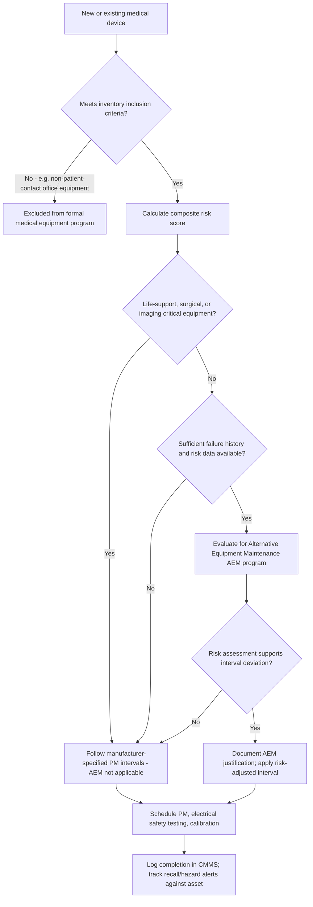

## Healthcare and Biomedical Equipment Asset Management

### Overview

Healthcare and biomedical equipment asset management is the discipline of managing the full lifecycle of clinical and biomedical devices — from infusion pumps and patient monitors to imaging systems (MRI, CT, ultrasound) and surgical equipment — within a regulatory environment that prioritizes patient safety above pure cost or uptime optimization. Unlike general industrial asset management, this domain is governed by a dense overlay of regulatory bodies (FDA, The Joint Commission, CMS), mandatory inspection cycles, and clinical risk classification frameworks that determine maintenance rigor independent of purely economic failure-consequence analysis. The function is typically performed by **Clinical Engineering** or **Healthcare Technology Management (HTM)** departments, which combine biomedical engineering expertise with traditional asset/maintenance management practice.

The central tension in this field is balancing **patient safety and regulatory compliance** (which mandate certain inspection/testing regimes regardless of demonstrated reliability) against **capital efficiency** (hospitals operate on thin margins, and medical equipment is capital-intensive with rapid technological obsolescence, particularly in imaging and diagnostics).

### Key Points

- **Healthcare Technology Management (HTM)**: The professional discipline (successor terminology to "clinical/biomedical engineering department") responsible for the acquisition, maintenance, and lifecycle management of medical devices within a healthcare facility.
- **Medical Equipment Management Plan (MEMP)**: A Joint Commission-required written plan describing how a healthcare organization manages the safety and reliability of its medical equipment inventory, including inclusion criteria, maintenance strategies, and incident reporting procedures.
- **Equipment Control Number (ECN) / Asset criticality classification**: The risk-based categorization system (commonly informed by AAMI/ECRI frameworks) that determines inspection frequency and maintenance rigor based on equipment function, physical risk, and maintenance requirements — not simply purchase cost.
- **Alternative Equipment Maintenance (AEM) program**: A Joint Commission/CMS-recognized program allowing healthcare facilities to deviate from manufacturer-recommended maintenance intervals for non-life-support, non-imaging equipment, provided the deviation is supported by a documented risk assessment and does not conflict with regulatory or manufacturer safety requirements.
- **Recall and Hazard Alert management**: The process of tracking FDA recalls, MedWatch reports, and manufacturer hazard/safety alerts against the facility's asset inventory to identify and remediate affected devices.
- **Right to Repair (medical device context)**: An ongoing regulatory and legislative debate over whether hospitals and independent service organizations (ISOs) can access service manuals, parts, and diagnostic software without exclusive OEM authorization — directly affecting HTM departments' maintenance strategy options.

### Regulatory and Accreditation Framework

**The Joint Commission (TJC) Environment of Care (EC) standards**

TJC's EC.02.04.01–03 standards require accredited hospitals to maintain a written Medical Equipment Management Plan covering:

- A complete, current inventory of medical equipment, with documented inclusion criteria (which equipment is formally tracked in the program).
- Risk-based criteria for determining maintenance frequency and level (not simply "follow every manufacturer manual verbatim" — TJC explicitly permits evidence-based, risk-informed deviation via the AEM program).
- Documented incident investigation procedures for equipment-related adverse events, including reporting obligations under the **Safe Medical Devices Act** to the FDA and/or manufacturer when a device may have caused or contributed to a death or serious injury.
- Periodic performance testing, including electrical safety testing and preventive maintenance, at intervals justified by the risk classification.

**CMS Conditions of Participation (CoP)**

The Centers for Medicare & Medicaid Services requires hospitals participating in Medicare/Medicaid to maintain equipment in safe operating condition; CMS surveys reference TJC standards (or equivalent state/other accrediting body standards) as the operational benchmark for compliance.

**FDA oversight**

The FDA regulates medical devices themselves (pre-market approval/clearance, post-market surveillance, recalls) rather than directly regulating hospital maintenance practice, but HTM departments must:

- Monitor **FDA MedWatch** and manufacturer-issued **hazard alerts/recalls** against their asset inventory.
- Comply with FDA's device classification framework (Class I, II, III, reflecting increasing risk) when assessing equipment for risk-based maintenance planning.
- Navigate the FDA's 2016 guidance and subsequent rulemaking activity on **servicing versus remanufacturing** distinctions, which affects whether third-party or in-house servicing of certain complex devices (e.g., some imaging systems) falls under additional regulatory scrutiny. [Unverified: the specific current regulatory status of servicing/remanufacturing rulemaking should be verified against current FDA guidance, as this has been an active and evolving policy area.]

### Risk-Based Equipment Classification

Most HTM inventory management systems apply a composite risk score to determine PM frequency and inspection rigor, commonly incorporating:

$$EquipmentRiskScore = f(FunctionScore, PhysicalRiskScore, MaintenanceRequirementScore)$$

- **Equipment function score**: Reflects clinical criticality — e.g., life-support and surgical equipment scoring highest, general diagnostic equipment mid-range, and administrative/non-patient-contact equipment lowest.
- **Physical risk score**: Reflects the potential severity of harm if the device fails (e.g., electrical hazard, mechanical hazard, radiation exposure).
- **Maintenance requirement score**: Reflects the complexity and manufacturer-specified maintenance need, often informed by failure history.

This composite score, an approach popularized by frameworks associated with ECRI Institute and AAMI (Association for the Advancement of Medical Instrumentation), determines whether equipment is scheduled for maintenance at manufacturer-recommended intervals, a risk-adjusted AEM interval, or included in the formal inventory at all. High-risk categories (ventilators, anesthesia machines, defibrillators, infusion pumps, dialysis equipment) are almost universally excluded from AEM deviation and follow manufacturer-specified intervals strictly.

### Diagram: Equipment Inclusion and Maintenance Strategy Decision Flow (svg_diagram)

### Lifecycle Management: Acquisition Through Disposal

**Acquisition and technology assessment**

- **Capital equipment planning committees**, typically multidisciplinary (clinical engineering, finance, clinical department representatives, IT/cybersecurity), evaluate new equipment requests against clinical need, total cost of ownership, and interoperability with existing systems (e.g., EHR integration via HL7/FHIR, DICOM compliance for imaging).
- **Pre-purchase evaluation** includes assessment of service cost history (for replacement decisions), cybersecurity posture (network-connected devices increasingly evaluated against frameworks like the Manufacturer Disclosure Statement for Medical Device Security, MDS2), and physical/electrical infrastructure requirements.

**Incoming inspection and commissioning**

New equipment undergoes incoming inspection (electrical safety testing, functional verification against manufacturer specifications) before clinical use, with results logged as the baseline record in the CMMS/EAM asset history.

**Ongoing maintenance and surveillance**

- Scheduled PM and electrical safety testing per the risk classification described above.
- **Calibration verification** for equipment with quantitative output (infusion pumps, patient monitors, diagnostic imaging) against traceable reference standards.
- **User error and incident investigation** — a distinguishing feature of HTM versus general industrial maintenance is the requirement to distinguish device malfunction from user error in adverse event investigations, often involving root-cause analysis methodologies shared with patient safety/quality departments.

**End-of-life and disposal**

- **Data sanitization**: Devices storing protected health information (PHI) — increasingly common as imaging and monitoring equipment gains onboard storage and network connectivity — require HIPAA-compliant data destruction or sanitization before disposal or resale, following NIST SP 800-88 media sanitization guidelines as a common reference standard.
- **Regulated disposal**: Equipment containing radioactive sources (some older nuclear medicine or radiotherapy equipment) or biohazard contamination requires specialized disposal pathways distinct from standard e-waste handling.
- **Cybersecurity decommissioning**: Network-connected devices must be properly removed from network access control lists and asset inventories to prevent orphaned network endpoints becoming security vulnerabilities.

### Cybersecurity as an Asset Management Dimension

The proliferation of networked medical devices (infusion pump drug libraries updated over the network, imaging systems with DICOM network transfer, remote diagnostic/service connections) has made **medical device cybersecurity** an integral component of HTM asset management rather than a separate IT concern:

- **FDA premarket and postmarket cybersecurity guidance** requires manufacturers to address cybersecurity risk in device design and support; HTM departments must track manufacturer security patch availability against their deployed inventory.
- **Network segmentation** of medical devices onto isolated VLANs is a common mitigation for legacy devices that cannot receive security updates but remain clinically necessary.
- **Asset inventory as a security control**: An accurate, complete HTM asset inventory (including software/firmware versions) is a prerequisite for effective vulnerability management — a device that is not in the inventory cannot be patched, monitored, or included in incident response planning.

### Practical Example

A hospital's HTM department manages an infusion pump fleet of 850 units across a health system. Following a manufacturer hazard alert identifying a software defect causing incorrect dosage delivery under specific low-battery conditions, the HTM CMMS is queried by model and software version to identify 340 affected units. A risk-based remediation plan is developed: units in ICU and oncology (highest-acuity use) are prioritized for immediate firmware update or quarantine within 48 hours, while lower-acuity units in general medical-surgical units follow a 2-week remediation timeline, each unit's remediation status logged against its unique asset record for the mandatory closure documentation required by TJC and, if the defect meets the reporting threshold, the FDA MedWatch/manufacturer notification process. This illustrates the core HTM capability requirement: the asset inventory must support rapid, accurate cross-referencing by model/software version/location/clinical criticality — a capability that pure financial asset registers typically lack.

### CMMS/EAM Considerations Specific to Healthcare

- **Unique device identification (UDI)** integration: FDA's UDI system provides a standardized device identifier increasingly integrated into HTM asset records to improve recall matching accuracy and supply chain traceability.
- **Interoperability with clinical systems**: Leading HTM platforms integrate with real-time location systems (RTLS) for equipment tracking (particularly high-value, mobile equipment like infusion pumps and portable ultrasound), and with the EHR for utilization data.
- **Regulatory audit readiness**: The CMMS must produce audit-ready documentation on demand for TJC/CMS surveys, including complete PM completion history, AEM justification documentation, and incident investigation records.

### Common Pitfalls

- **Applying uniform maintenance intervals across all equipment risk tiers**, wasting HTM labor on low-risk equipment while potentially under-resourcing high-risk device surveillance.
- **Incomplete asset inventory**, particularly for personally-owned or department-purchased equipment that bypasses central procurement and clinical engineering intake — this creates blind spots in both maintenance compliance and cybersecurity posture.
- **Treating AEM program deviations as a blanket cost-cutting measure** rather than a rigorously documented, evidence-based risk assessment — TJC surveyors specifically scrutinize AEM justification quality, and manufacturer-recommended intervals remain the default absent adequate supporting data.
- **Underestimating data sanitization requirements** at disposal/trade-in, given the growing amount of onboard storage and PHI in modern clinical equipment.
- **Siloing cybersecurity from traditional HTM asset management**, missing the synergy between accurate physical asset inventory and effective vulnerability/patch management.

### Related Topics

- Joint Commission Environment of Care (EC) Standards and Survey Preparation
- Alternative Equipment Maintenance (AEM) Program Development
- Medical Device Cybersecurity and FDA Premarket/Postmarket Guidance
- Unique Device Identification (UDI) System and Recall Management
- Clinical Engineering Incident Investigation and Root Cause Analysis
- Right to Repair Legislation in Medical Device Servicing
- Imaging Equipment Lifecycle Management (MRI/CT Capital Planning and Service Contracts)
- HIPAA-Compliant Data Sanitization for Networked Medical Devices (NIST SP 800-88)
- Real-Time Location Systems (RTLS) for Mobile Medical Equipment Tracking