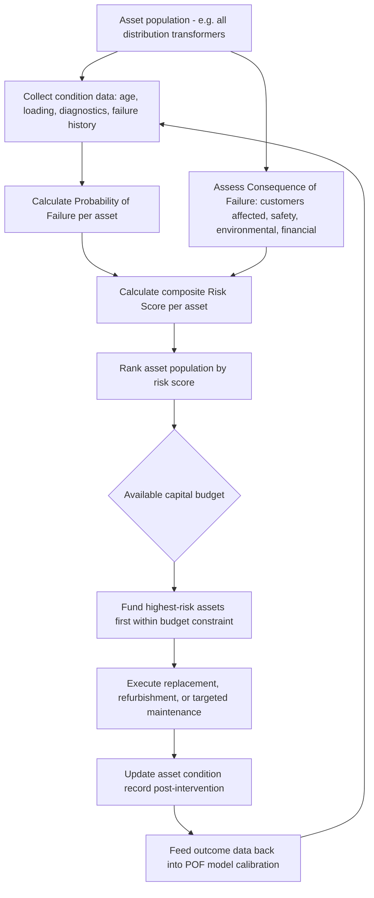

## Utilities and Energy Sector Asset Management

### Overview

Utilities and energy sector asset management encompasses the lifecycle management of large, capital-intensive, geographically distributed infrastructure networks — electric transmission and distribution systems, natural gas pipelines, water/wastewater networks, and generation assets (thermal, nuclear, and renewable). This domain is distinguished from general industrial asset management by three structural features: **network interdependency** (failure of a single component can cascade across an entire grid or system), **long asset lifespans** (transformers and pipelines often exceed 40–60 years in service, spanning multiple generations of technology and regulatory regimes), and **rate-regulated economics**, where capital and operating expenditures are typically recovered through regulator-approved customer rates rather than pure market competition. Asset management decisions in this sector must simultaneously satisfy reliability standards, regulatory prudency reviews, safety codes, and increasingly, decarbonization and grid modernization mandates.

The discipline draws heavily on probabilistic risk-based asset management (aligned with ISO 55000), NERC/FERC reliability standards for the electric sector, and PHMSA/DOT pipeline safety regulation for gas utilities, layered onto reliability engineering fundamentals shared with industrial asset management (RCM, condition-based maintenance).

### Key Points

- **Asset Health Index (AHI)**: A composite score, often on a 1–5 or 1–10 scale, combining condition assessment data (visual inspection, diagnostic testing, age, loading history, failure history) into a single risk-informed metric used to prioritize replacement and maintenance investment across a large asset population.
- **Probability of Failure (POF) × Consequence of Failure (COF) = Risk**: The foundational risk-based prioritization framework used across electric, gas, and water utility asset management to rank capital investment need beyond simple age-based replacement.
- **NERC Reliability Standards**: Mandatory reliability standards for the North American bulk power system, enforced by NERC under FERC oversight, covering (among many areas) transmission vegetation management (FAC-003), protection system maintenance (PRC-005), and physical/cyber security (CIP standards).
- **PHMSA Pipeline Integrity Management (IMP)**: Federal regulations (49 CFR Parts 192 and 195) requiring gas and hazardous liquid pipeline operators to implement risk-based integrity management programs, including in-line inspection ("smart pigging"), direct assessment, and pressure testing for pipeline segments in High Consequence Areas (HCAs).
- **Rate case / prudency review**: The regulatory proceeding process (before a state Public Utility Commission or FERC) through which a utility justifies capital and operating expenditures for recovery through customer rates — asset management decisions must be defensible in this forum, often years after the decision was made.
- **Distributed Energy Resources (DER) integration**: The growing challenge of managing grid assets designed for one-directional power flow (substation to customer) as rooftop solar, battery storage, and EV charging introduce bidirectional flow and new load/generation variability.

### Risk-Based Asset Management Framework

The dominant methodology across electric, gas, and water utility asset management is risk-based prioritization, formalized in frameworks aligned with **ISO 55000/55001** and utility-specific guidance (e.g., IEEE, AWWA, and gas industry association standards):

$$Risk_{asset} = POF_{asset} \times COF_{asset}$$

- **Probability of Failure (POF)** is derived from condition data: age, historical failure rate for the asset class/vintage, loading/duty cycle, environmental exposure, diagnostic test results (e.g., dissolved gas analysis for transformers, corrosion assessment for pipelines), and maintenance history.
- **Consequence of Failure (COF)** incorporates safety risk (proximity to population, potential for injury), reliability/service impact (number of customers affected, criticality of served load such as hospitals), financial consequence (repair cost, potential regulatory penalties), and environmental consequence (spill/release potential, particularly for gas and liquid pipelines).

This risk score drives a **prioritized replacement/refurbishment program** that allocates constrained capital budgets to the highest-risk assets first, rather than replacing purely by age — an important distinction since a young but poorly-manufactured or overloaded asset can carry higher risk than an older, well-maintained one.

### Diagram: Risk-Based Capital Prioritization Process (svg_diagram)

### Sector-Specific Regulatory and Technical Frameworks

**Electric Transmission and Distribution**

- **NERC/FERC reliability standards**: Mandatory standards enforceable with financial penalties, covering vegetation management along transmission rights-of-way (critical given vegetation contact is a leading cause of major outages, including well-documented historical blackout events), protection and control system maintenance testing intervals, and Critical Infrastructure Protection (CIP) cybersecurity standards for bulk electric system assets.
- **Transformer fleet management**: Large power transformers represent some of the highest-consequence, longest-lead-time assets in the grid (replacement lead times can extend beyond a year for large units), making condition monitoring (dissolved gas analysis, oil quality testing, thermal imaging) and strategic spares programs a distinct sub-discipline.
- **Distribution asset management**: Poles, conductors, and distribution transformers are managed at much higher population scale (often hundreds of thousands to millions of units per utility), typically requiring statistical/sampling-based condition assessment rather than individual inspection of every unit, combined with GIS-based asset registers.
- **Vegetation management**: A distinct, high-budget-share asset management program in its own right for T&D utilities, balancing wildfire risk mitigation (increasingly prominent given utility equipment's role as an ignition source in several major wildfire events), reliability, and cost.

**Natural Gas and Hazardous Liquid Pipelines**

- **PHMSA Integrity Management Program (49 CFR 192 Subpart O for gas transmission, 49 CFR 195 for hazardous liquids)**: Requires operators to identify High Consequence Areas (HCAs — areas with higher population density or environmentally sensitive areas), assess pipeline integrity within HCAs on a defined reassessment interval (commonly 7 years, condition-dependent), and select an appropriate integrity assessment method.
- **In-line inspection (ILI / "smart pigging")**: Instrumented devices traveling through the pipeline to detect metal loss (corrosion), cracking, dents, and other anomalies — the predominant integrity assessment method for pipelines that can accommodate the tool (piggable pipelines).
- **Direct Assessment**: An alternative integrity assessment methodology for pipelines not suited to in-line inspection, involving above-ground indirect inspection followed by targeted excavation and direct examination.
- **Cast iron and bare steel main replacement programs**: A major ongoing capital program category for gas distribution utilities, driven by both safety risk (leak-prone legacy materials) and, increasingly, methane emission reduction goals tied to climate policy.

**Water and Wastewater** *(cross-reference to public infrastructure asset management, with utility-specific additions)*

- **Asset Management Plans under state/federal drinking water and clean water programs**, often tied to eligibility for State Revolving Fund financing.
- **Water loss auditing (AWWA M36 methodology)**: A standardized framework for quantifying real losses (physical leakage) versus apparent losses (metering inaccuracy, unauthorized consumption) in distribution networks, directly informing main replacement and leak detection program prioritization.

### Generation Asset Management

- **Thermal generation (fossil, nuclear)**: Long-lived, highly regulated assets (nuclear subject to NRC oversight in the U.S., with distinct license renewal and aging management program requirements under 10 CFR 54) requiring rigorous component-level condition monitoring given the extreme consequence of major failure.
- **Renewable generation (wind, solar)**: Newer asset classes with shorter operational history, meaning failure/degradation data is less mature; asset management practice here leans more heavily on manufacturer warranty data, remote monitoring (SCADA-based performance analytics), and emerging degradation models (e.g., solar panel degradation rates, wind turbine gearbox/blade fatigue analysis) than on decades of utility-specific failure history.
- **Battery Energy Storage Systems (BESS)**: An emerging asset class with distinct lifecycle management challenges — capacity degradation curves, thermal management system reliability, and fire safety considerations (following several high-profile BESS fire incidents that have shaped subsequent NFPA 855 code requirements and utility internal standards). [Unverified: given the pace of BESS technology and code evolution, specific current code requirements should be verified against the latest NFPA 855 edition and jurisdictional adoption status.]

### Grid Modernization and DER Integration Challenges

The transition toward distributed, bidirectional grid architecture introduces asset management complexity beyond traditional one-directional T&D planning:

- **Hosting capacity analysis**: Utilities must assess how much distributed generation (rooftop solar, in particular) a given distribution circuit/transformer can accommodate without violating voltage, protection coordination, or thermal loading limits — this becomes an input to both interconnection approval and asset upgrade planning.
- **Advanced Distribution Management Systems (ADMS)** and **Advanced Metering Infrastructure (AMI)**: Increasingly integrated with asset management systems to provide real-time loading and outage data at a granularity previously unavailable, improving both POF modeling accuracy and outage response.
- **EV charging load growth**: Concentrated residential/commercial EV charging can create localized transformer overloading not anticipated in original distribution transformer sizing, requiring asset management programs to incorporate forward-looking load growth scenarios rather than purely historical loading data.

### Practical Example

A regional electric utility manages a fleet of 4,200 distribution transformers. Historical replacement policy was purely age-based (replace at 40 years). A risk-based AHI program is implemented instead, incorporating: manufacturer/vintage failure rate data, oil dissolved-gas-analysis results (where available), loading history relative to nameplate rating, and count of customers served (including any critical facilities, e.g., hospitals, on the circuit). The revised prioritization identifies that approximately 12% of transformers under 25 years old — which would not have been flagged under the age-based policy — carry elevated risk due to sustained overloading in a rapidly growing suburban service area, while a portion of transformers over 40 years old show low risk due to light loading and clean diagnostic history. Reallocating the capital replacement budget according to the risk score, rather than age alone, is projected to reduce expected customer-minutes of interruption more effectively per dollar spent — the core value proposition of risk-based over age-based asset management, and a case the utility must ultimately defend in its next general rate case prudency review.

### Common Pitfalls

- **Relying on age-based replacement alone**, missing high-risk younger assets (often due to loading, manufacturing defect batches, or environmental exposure) while over-investing in low-risk older assets.
- **Underinvesting in condition data collection infrastructure** (diagnostic testing, GIS-linked asset records), which undermines the accuracy of POF modeling regardless of the sophistication of the risk framework applied on top of it.
- **Treating regulatory compliance (NERC, PHMSA) as a ceiling rather than a floor** — meeting minimum mandatory standards does not guarantee optimal risk-based asset management, since these standards typically define minimum required practices, not utility-specific optimal investment levels.
- **Failing to update load growth assumptions** for DER and electrification trends, leading to asset sizing/replacement decisions based on stale historical loading patterns.
- **Insufficient documentation of risk-based prioritization methodology** for rate case purposes — a technically sound asset management decision can still be disallowed for rate recovery if the utility cannot adequately demonstrate the prudency of the underlying methodology to regulators.

### Related Topics

- ISO 55000/55001 Asset Management Systems Applied to Utility Networks
- NERC Reliability Standards and FERC Regulatory Framework
- PHMSA Pipeline Integrity Management Program (49 CFR 192/195)
- Asset Health Index (AHI) Modeling and Condition Assessment Data Integration
- Vegetation Management and Wildfire Risk Mitigation Programs
- Distributed Energy Resource (DER) Integration and Hosting Capacity Analysis
- Battery Energy Storage System (BESS) Lifecycle and Safety Management
- Rate Case Prudency Review and Capital Investment Justification
- Water Loss Auditing (AWWA M36) and Non-Revenue Water Reduction