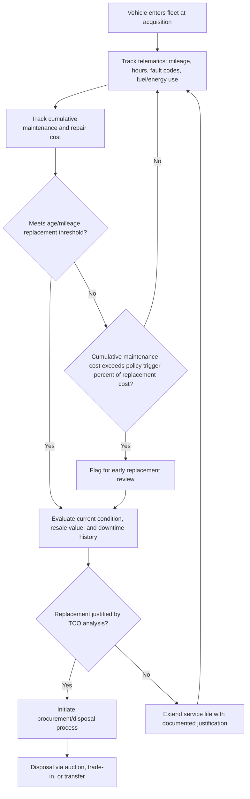

## Transportation and Fleet Asset Management

### Overview

Transportation and fleet asset management covers the lifecycle management of mobile assets — light and heavy-duty vehicles, transit buses and rail rolling stock, aviation and marine assets, and their supporting infrastructure (depots, fueling/charging facilities, maintenance shops) — used by government fleets, transit agencies, logistics/trucking operations, and private corporate fleets. This domain differs structurally from fixed infrastructure asset management in several respects: assets are **mobile and geographically dispersed** at any given time, **utilization is highly variable** (mileage/hours driven differ dramatically across the fleet even for identical vehicle models), and **replacement decisions are driven by a total cost of ownership curve that shifts meaningfully with usage intensity**, rather than a relatively fixed condition-based degradation curve typical of stationary infrastructure.

Fleet asset management combines vehicle maintenance engineering, telematics-driven data analytics, procurement/replacement cycle optimization, and — increasingly — electrification transition planning, which introduces entirely new asset classes (EV batteries, charging infrastructure) with different degradation and lifecycle economics than internal combustion vehicles.

### Key Points

- **Optimal Replacement Point / Economic Life**: The point in a vehicle's service life where the marginal cost of continued ownership (rising maintenance and repair cost, declining reliability, declining resale value, higher fuel/operating cost from aging systems) exceeds the annualized cost of replacement — the central quantitative decision in fleet asset management.
- **Preventive Maintenance (PM) compliance rate**: The percentage of scheduled fleet maintenance completed on time, a leading indicator strongly correlated with unplanned downtime and total lifecycle cost.
- **Telematics**: GPS and onboard-diagnostic (OBD)-based systems providing real-time vehicle location, utilization (mileage, idle time, harsh braking/acceleration), fault codes, and fuel/energy consumption data — the primary data source for modern fleet asset management analytics.
- **Total Cost of Ownership (TCO)**: The comprehensive lifecycle cost metric — acquisition, financing, fuel/energy, maintenance and repair, insurance, and resale/salvage value — used for both replacement timing and vehicle specification/vendor selection decisions.
- **State of Health (SOH)**: For electric vehicle batteries, the metric expressing remaining battery capacity/performance relative to original specification, analogous to condition assessment in other asset classes but following a distinct degradation curve driven by charge cycles, depth of discharge, and thermal exposure.
- **Federal Transit Administration (FTA) Transit Asset Management (TAM) Rule**: The U.S. regulatory framework (49 CFR Part 625) requiring transit agencies receiving federal funding to develop and maintain a Transit Asset Management Plan, including performance targets for rolling stock, equipment, facilities, and infrastructure condition.

### Replacement Cycle Optimization

The core quantitative model in fleet asset management balances declining reliability/rising maintenance cost against the annualized cost of replacement:

$$TCO_{annualized}(age) = \frac{C_{acquisition} - C_{resale}(age)}{age} + C_{maintenance,cumulative}(age)/age + C_{fuel,annual} + C_{downtime,annual}(age)$$

As a vehicle ages: resale value declines (reducing the denominator benefit of holding longer), cumulative maintenance cost rises (often non-linearly once major systems — transmission, engine/drivetrain — begin failing), and downtime cost increases as unplanned repairs become more frequent. The **economic replacement point** is where the annualized total cost curve reaches its minimum — replacing earlier forfeits remaining useful economic life; replacing later accepts rising cost per mile/hour of service.

$$Age_{optimal} = \arg\min_{age} \; TCO_{annualized}(age)$$

In practice, most public fleet and transit replacement policies use **replacement guidelines expressed as age and/or mileage/hours thresholds** (e.g., "replace sedans at 100,000 miles or 8 years, whichever comes first"), calibrated periodically against actual TCO curve data rather than recalculated continuously per vehicle — though telematics-enabled fleets increasingly move toward vehicle-specific, data-driven replacement recommendations rather than uniform fleet-wide thresholds.

### Diagram: Fleet Replacement Decision Process (svg_diagram)

### Maintenance Strategy in Fleet Context

- **Preventive maintenance scheduling**: Typically mileage- or hours-based (oil changes, filter replacement, brake inspection intervals) per OEM specification, tracked and triggered automatically through fleet management software integrated with telematics odometer/hour-meter data.
- **Predictive maintenance via telematics**: Onboard diagnostic fault codes (OBD-II for light/medium duty, J1939 protocol for heavy-duty commercial vehicles) enable early detection of emerging issues (e.g., declining battery voltage, emissions system faults) before they cause roadside breakdowns.
- **Depot/shop capacity planning**: Fleet maintenance facility sizing and staffing must account for fleet size, average PM interval, and the shift in labor mix as electrification introduces different skill requirements (high-voltage system certification) compared to traditional internal combustion technician training.
- **Warranty and campaign tracking**: Recall and manufacturer service campaign management — analogous to healthcare's hazard alert tracking — requires matching fleet inventory against manufacturer recall notices by VIN and ensuring timely remediation, particularly critical for safety-related recalls on passenger and transit vehicles.

### Transit-Specific Asset Management

**FTA Transit Asset Management (TAM) Rule (49 CFR Part 625)**

Transit agencies receiving FTA funding must develop a TAM Plan covering four asset categories with mandated performance measures:

1. **Rolling stock** (buses, rail vehicles) — measured by the percentage of vehicles within a fleet that have met or exceeded their Useful Life Benchmark (ULB).
2. **Equipment** (non-revenue support vehicles and equipment) — similarly measured against useful life benchmarks.
3. **Facilities** — measured using a condition rating scale (commonly derived from the TERM/TERM-Lite condition assessment methodology).
4. **Infrastructure** (rail fixed guideway, track, systems) — condition-based performance measures specific to rail transit agencies.

Agencies must set annual performance targets for each category and report actual performance through the National Transit Database (NTD), creating a formal accountability and funding-linkage mechanism distinct from most non-transit fleet contexts. [Inference: this description reflects the TAM Rule's general structure; specific current performance measure definitions and reporting thresholds should be verified against current FTA guidance, as rule details are subject to periodic FTA rulemaking updates.]

**Useful Life Benchmark (ULB)**

The FTA-published or agency-derived expected service life (in years or miles) for a given rolling stock category, used both for TAM performance reporting and as a baseline input to replacement planning — though actual replacement timing typically also incorporates the TCO-based economic analysis described above rather than relying on ULB alone.

### Electrification and Alternative Fuel Transition

Fleet electrification introduces asset management considerations absent from traditional internal combustion fleet management:

- **Battery State of Health (SOH) degradation**: Unlike mechanical wear patterns, EV battery degradation follows a cycle-life and calendar-aging model influenced by charge/discharge cycling depth, fast-charging frequency, and thermal exposure — requiring new condition monitoring approaches (battery management system data integration) distinct from traditional vehicle diagnostics.
- **Charging infrastructure as a new asset class**: Depot charging stations (Level 2 and DC fast charging) become fleet-critical infrastructure assets in their own right, with their own maintenance, uptime, and lifecycle replacement considerations — a charging station outage can idle vehicles just as effectively as a vehicle mechanical failure.
- **Route and duty-cycle suitability analysis**: Electrification transition planning requires matching vehicle range and charging capability against actual route/duty-cycle data (from existing telematics history) to sequence which fleet segments convert first — routes with predictable, moderate daily mileage and midday/overnight charging opportunity are typically prioritized ahead of long-haul or unpredictable-duty routes.
- **Total cost of ownership shift**: EV fleet TCO models typically show higher acquisition cost offset by lower fuel/energy and maintenance cost (fewer moving parts, no oil changes), shifting the economic replacement curve shape relative to internal combustion vehicles — early-life cost advantage can be larger, but battery degradation and eventual replacement cost introduce a different long-tail cost consideration.

### Practical Example

A municipal fleet of 180 light-duty pickup trucks used by public works crews is analyzed for replacement policy revision. Historical practice replaced all trucks at a fixed 10-year/100,000-mile threshold. Telematics and maintenance cost data reveal two distinct utilization clusters: a high-utilization group (parks and roads crews, averaging 18,000 miles/year with heavy payload/towing use) reaching the maintenance-cost inflection point around 7 years, and a low-utilization group (inspection/administrative use, averaging 6,000 miles/year) remaining cost-effective well beyond 10 years, often to 13–14 years, with mileage still under 85,000. Segmenting the replacement policy by utilization cluster rather than applying a uniform fleet-wide threshold is projected to reduce both premature replacement of low-utilization vehicles and unplanned downtime in the high-utilization group — illustrating how telematics-enabled, usage-segmented policy typically outperforms uniform age/mileage thresholds once sufficient fleet data history exists. [Inference: the specific utilization cluster thresholds and cost inflection points are illustrative; actual optimal thresholds depend on the specific fleet's cost data and should be derived from that fleet's own TCO analysis.]

### Fleet Management Information Systems

- **Integration architecture**: Modern fleet asset management typically integrates telematics platforms (vehicle location/diagnostics), fuel card/energy management systems, maintenance management (often a fleet-specific CMMS module or dedicated fleet management software), and financial/procurement systems for a unified TCO view per vehicle and per fleet segment.
- **VIN-level asset records**: Each vehicle is tracked as an individual asset record incorporating acquisition data, full maintenance history, telematics utilization history, and disposal/resale data — enabling both individual replacement decisions and fleet-wide TCO benchmarking by make/model/vintage.
- **Benchmarking data sources**: Industry bodies and fleet management associations (e.g., NAFA Fleet Management Association in North America) publish benchmarking surveys used to compare an organization's fleet cost-per-mile and replacement cycle practice against peer organizations. [Unverified: specific current benchmark figures change annually and should be sourced from the most recent published survey data rather than assumed static.]

### Common Pitfalls

- **Uniform fleet-wide replacement thresholds** applied without utilization segmentation, leading to both premature replacement of lightly-used vehicles and extended unsafe/high-cost operation of heavily-used vehicles within the same nominal vehicle class.
- **Underweighting downtime cost in TCO analysis** — a vehicle with lower direct repair costs but frequent, unpredictable downtime can have a higher true operational cost than a slightly more expensive-to-maintain but more reliable alternative.
- **Delaying electrification route-suitability analysis** until vehicle acquisition, rather than using existing telematics duty-cycle data proactively to sequence the transition and correctly size charging infrastructure investment.
- **Inconsistent recall/campaign tracking**, particularly across a fleet with mixed makes/models, creating safety and liability exposure from unremediated open recalls.
- **Treating transit TAM Rule compliance as a reporting-only exercise** rather than integrating it with the agency's actual capital planning process, missing the intended linkage between condition/performance data and funding prioritization.

### Related Topics

- Total Cost of Ownership (TCO) Modeling for Vehicle Fleets
- FTA Transit Asset Management (TAM) Rule and TERM-Lite Condition Assessment
- Telematics Architecture and OBD-II/J1939 Diagnostic Integration
- Electric Vehicle Battery State of Health (SOH) and Degradation Modeling
- Fleet Electrification Transition Planning and Charging Infrastructure Asset Management
- Vehicle Recall and Manufacturer Campaign Management by VIN
- Depot and Maintenance Facility Capacity Planning
- Rail Rolling Stock and Fixed Guideway Infrastructure Asset Management
- Fuel Card and Energy Management System Integration