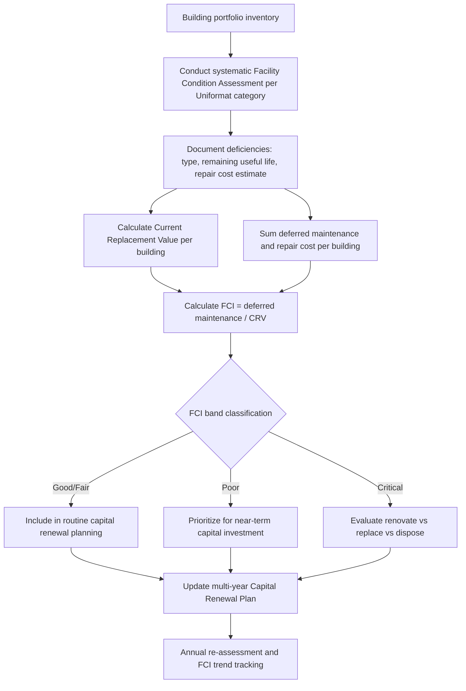

## Real Estate and Facilities Asset Management

### Overview

Real estate and facilities asset management is the discipline of managing the lifecycle of buildings, building systems, and the land/portfolio structures that contain them — spanning corporate real estate portfolios, commercial and institutional facilities, and building-integrated systems (HVAC, electrical, life safety, building envelope). It sits at the intersection of two traditionally distinct functions: **facilities management (FM)**, which focuses on operating and maintaining buildings for occupant health, safety, and productivity, and **real estate asset/portfolio management**, which focuses on the financial performance, valuation, and strategic disposition of the real property itself. Modern practice increasingly integrates these through **Integrated Workplace Management Systems (IWMS)** and **Computer-Aided Facility Management (CAFM)** platforms that connect space, asset, maintenance, and financial data.

Unlike single-purpose industrial or utility assets, a building is itself a system-of-systems — structural, envelope, mechanical, electrical, plumbing, fire/life safety, and technology infrastructure — each with distinct lifecycles, and the building as a whole interacts with portfolio-level strategic decisions (lease vs. own, consolidate vs. expand, renovate vs. dispose) that have no direct analogue in most other asset classes covered in this course.

### Key Points

- **Facility Condition Assessment (FCA)** / **Facility Condition Index (FCI)**: A standardized methodology and resulting ratio expressing the cost of currently needed repairs and deferred maintenance relative to the current replacement value of the facility — the foundational metric for capital renewal prioritization across a building portfolio.
- **Building Automation System (BAS) / Building Management System (BMS)**: The centralized control and monitoring system for HVAC, lighting, and other building systems, increasingly integrated with asset management platforms for condition-based maintenance triggers.
- **Capital Renewal Reserve / Reserve Study**: A financial planning mechanism (common in both institutional facilities and multi-unit residential/HOA contexts) that forecasts future capital replacement needs and establishes funding to meet them without relying on unplanned special assessments or deferred maintenance.
- **Integrated Workplace Management System (IWMS)**: Enterprise software combining space management, real estate/lease administration, capital project management, facilities maintenance (CAFM/CMMS functionality), and sustainability/ESG data into a unified platform.
- **Uniformat / Omniclass**: Standardized building element classification systems (Uniformat II, ASTM E1557) used to structure cost estimating, condition assessment, and capital planning data by building system/component rather than by trade or vendor.
- **Deferred Maintenance (DM) backlog**: The accumulated, unaddressed maintenance and repair needs across a portfolio — a critical risk metric since backlog growth compounds (deferred repairs often become more expensive and higher-risk over time) and is a common source of institutional/public-sector budget and audit scrutiny.

### Facility Condition Assessment and the FCI Framework

**Facility Condition Index (FCI)** is the standard metric for benchmarking building condition and prioritizing capital investment across a portfolio:

$$FCI = \frac{Cost_{deferred\,maintenance\,and\,repair}}{Current\,Replacement\,Value\,(CRV)}$$

Common FCI interpretation bands (industry convention, not a universal regulatory standard):

- **FCI 0.00–0.05**: Good condition — routine maintenance sufficient.
- **FCI 0.05–0.10**: Fair condition — renewal needs emerging, planning warranted.
- **FCI 0.10–0.30**: Poor condition — significant renewal investment needed.
- **FCI > 0.30**: Critical condition — often approaching the threshold where replacement is more economical than continued renewal.

[Inference: these specific band thresholds are widely used industry conventions (appearing across multiple FM/higher-education facilities benchmarking sources) but are not codified in a single universal regulatory standard, and organizations may adopt their own thresholds calibrated to portfolio characteristics.]

A **Facility Condition Assessment (FCA)** — the underlying data collection exercise producing the FCI — typically involves systematic inspection of each building's major systems (structure, envelope, mechanical, electrical, plumbing, life safety, interior finishes, site) against Uniformat-structured categories, documenting deficiency type, estimated remaining useful life, and repair/replacement cost estimate for each identified deficiency.

### Diagram: Facility Condition Assessment to Capital Plan Workflow (svg_diagram)

### Building Systems Lifecycle Management

Each major building system carries distinct expected useful life ranges and degradation characteristics, typically tracked at the component level per Uniformat classification:

| System Category | Typical Useful Life Range | Key Condition Indicators |
| --- | --- | --- |
| Roofing | 15–30 years (material-dependent) | Membrane condition, ponding water, flashing integrity, leak history |
| HVAC major equipment (chillers, boilers, RTUs) | 15–25 years | Efficiency degradation, refrigerant/component obsolescence, run-hour history |
| Building envelope (façade, windows) | 30–50+ years | Water infiltration, thermal performance, structural sealant condition |
| Electrical distribution/switchgear | 25–40 years | Arc-flash study currency, component obsolescence, capacity vs. current load |
| Elevators/vertical transport | 20–30 years (major modernization cycle) | Code compliance (ADA, safety code updates), reliability/callback rate |
| Fire/life safety systems | 15–25 years (component-dependent) | Code compliance currency, inspection/testing history |
| Interior finishes | 7–15 years | Wear, occupant complaints, aesthetic/functional obsolescence |

Behavior and actual service life vary substantially by climate, maintenance quality, and specific product/manufacturer — the ranges above represent general planning benchmarks rather than deterministic predictions for any individual asset.

### Capital Renewal Planning and Reserve Funding

**Reserve studies**, common in institutional, government, and multi-unit residential (HOA/condominium) contexts, project future capital replacement needs over a defined horizon (typically 20–30 years) and establish a funding mechanism (reserve fund contributions) to meet them:

$$ReserveContribution_{annual} = \frac{\sum_{i} \frac{RemainingCost_i}{RemainingUsefulLife_i}}{n_{components}} \; \text{(component-based method, simplified)}$$

Two common reserve funding methodologies:

- **Component/cash-flow method**: Projects the actual year-by-year expenditure timeline for each building component and models reserve fund balance against that specific cash flow schedule — more precise but requires detailed component-level data.
- **Straight-line/pooled method**: Aggregates all components into a single pooled reserve target based on overall percent-funded objectives — simpler to administer but less precise at the individual-component timing level.

Underfunded reserves are a persistent risk across the sector; a portfolio with a chronically underfunded reserve typically manifests as a rising FCI over time, since deferred maintenance accumulates faster than funding allows remediation — this is a common institutional/public-sector governance failure mode distinct from purely technical asset management shortcomings.

### Portfolio Strategy: Lease vs. Own and Space Optimization

Real estate asset management at the portfolio level extends beyond individual building condition into strategic decisions:

- **Lease vs. own analysis**: Comparing the total cost and flexibility trade-offs of leasing space versus owning, incorporating financing cost, balance sheet treatment (particularly relevant since ASC 842/IFRS 16 lease accounting changes brought most operating leases onto the balance sheet), and strategic flexibility to adjust footprint as organizational needs change.
- **Space utilization analytics**: Increasingly driven by occupancy sensor data and badge-swipe/access data, used to right-size portfolios — particularly salient following widespread shifts toward hybrid/remote work models that have materially changed corporate space utilization patterns in many organizations.
- **Highest and best use analysis**: For underutilized or surplus real property (common in public sector and institutional portfolios), evaluating redevelopment, disposal, or repurposing options against current and projected use value.
- **Portfolio consolidation and disposition planning**: Identifying underperforming or redundant facilities for consolidation, sale, or lease termination as part of broader real estate strategy, informed by FCI data (a high-FCI, low-strategic-value building is a strong disposition candidate) alongside market and utilization data.

### Sustainability and ESG Integration

Facilities asset management increasingly incorporates environmental performance as a first-class asset management dimension:

- **Energy benchmarking**: Tools such as ENERGY STAR Portfolio Manager provide standardized building energy performance benchmarking, increasingly required by municipal building performance ordinances in a growing number of jurisdictions.
- **Building performance standards (BPS)**: A growing category of local/state regulation mandating specific energy use intensity or emissions reduction targets for existing buildings by defined compliance dates, with penalties for non-compliance — creating a regulatory-driven capital planning input analogous to code-driven replacement triggers in other asset classes. [Unverified: specific building performance standard requirements are highly jurisdiction-dependent and rapidly evolving; current applicable requirements should be verified against the specific jurisdiction's current ordinance.]
- **Deep energy retrofit planning**: Major system replacement decisions (HVAC, envelope) increasingly evaluate decarbonization pathways (electrification, heat pump conversion) alongside traditional like-for-like replacement, since major system end-of-life is often the most cost-effective window to pursue significant efficiency/emissions improvements.

### Practical Example

A university with a 6.2 million square foot campus portfolio conducts a comprehensive FCA across 140 buildings. Results show a portfolio-wide FCI of 0.14 (poor condition band), with wide variance: a cluster of 1960s-era academic buildings shows FCI above 0.35 (critical), driven primarily by original mechanical systems and single-pane window envelope deficiencies, while buildings constructed or comprehensively renovated within the last 15 years show FCI below 0.03. Rather than allocating the capital renewal budget proportionally across all buildings, the university prioritizes the critical-FCI cluster for a comprehensive systems renewal (mechanical replacement paired with envelope improvement, capturing decarbonization co-benefits from the mechanical replacement), while lower-FCI buildings receive only routine component-level renewal — illustrating how FCI-driven prioritization directs limited capital toward the buildings where deferred deficiency accumulation poses the greatest escalating risk, rather than spreading investment thinly across the entire portfolio.

### IWMS/CAFM System Considerations

- **Data structure alignment**: Effective FCA and capital planning depend on consistent building/component classification (Uniformat or equivalent) across the portfolio, enabling cross-building and cross-system benchmarking.
- **Integration with space and lease management**: Modern IWMS platforms link facility condition data with space utilization and lease administration data, enabling combined analysis (e.g., is it more cost-effective to renovate a high-FCI owned building or relocate the function to leased space).
- **Work order and PM integration**: The CAFM/CMMS component handles day-to-day maintenance work orders and preventive maintenance scheduling, feeding maintenance history back into the condition assessment and FCI recalculation cycle.

### Common Pitfalls

- **Treating FCA as a one-time exercise** rather than an ongoing, periodically refreshed process — condition data degrades in relevance quickly, and capital plans built on stale assessment data misallocate investment.
- **Allocating capital renewal budget proportionally/uniformly across a portfolio** rather than risk/FCI-prioritized, which allows critical-condition buildings to continue deteriorating while lower-need buildings receive unnecessary investment.
- **Underfunding capital reserves** based on optimistic or outdated component life assumptions, leading to reserve depletion precisely when major system replacements come due.
- **Siloing real estate strategy from facilities condition data** — portfolio disposition and consolidation decisions made without FCI/condition input risk retaining high-liability buildings or disposing of well-maintained, strategically valuable ones.
- **Ignoring code compliance currency as a distinct driver from physical condition** — a building system can be in good physical condition yet still require replacement due to code changes (e.g., accessibility, fire/life safety, or emerging building performance standard compliance).

### Related Topics

- Facility Condition Assessment (FCA) Methodology and Uniformat Classification
- Capital Reserve Studies and Component vs. Pooled Funding Methods
- Integrated Workplace Management Systems (IWMS) Architecture
- Lease vs. Own Analysis and ASC 842/IFRS 16 Lease Accounting Impact
- Building Performance Standards and Municipal Energy Benchmarking Ordinances
- Space Utilization Analytics and Hybrid Workplace Portfolio Strategy
- Deep Energy Retrofit Planning and Building Electrification
- Deferred Maintenance Backlog Management in Public/Institutional Portfolios
- Highest and Best Use Analysis for Surplus Real Property